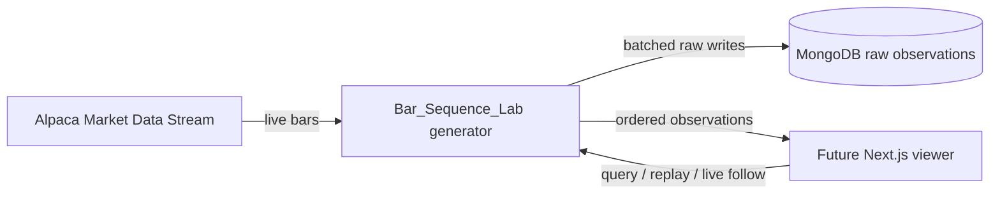
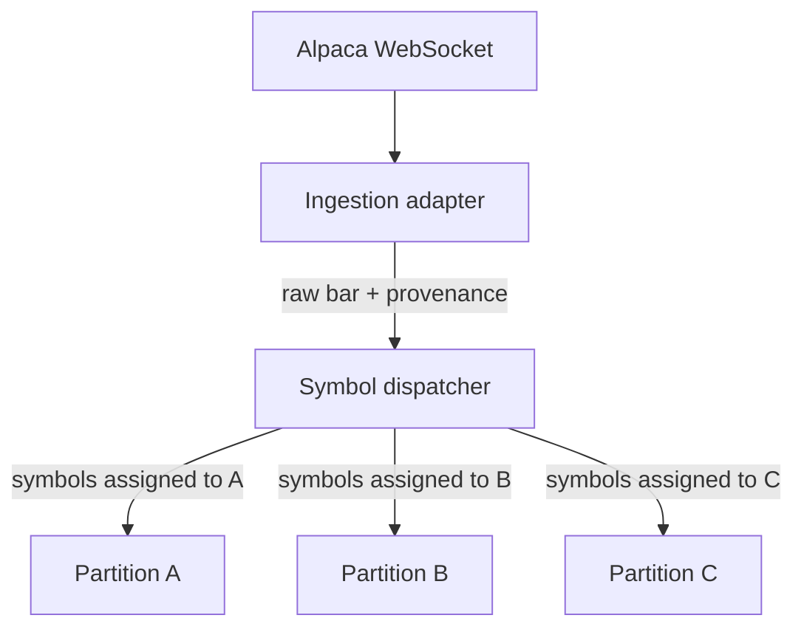
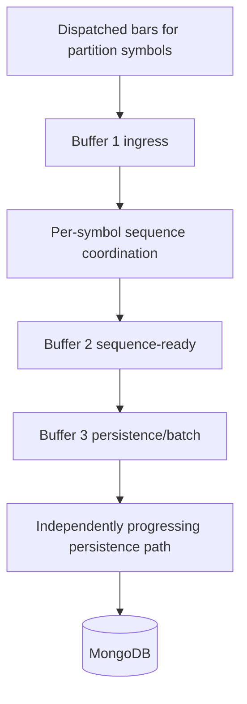
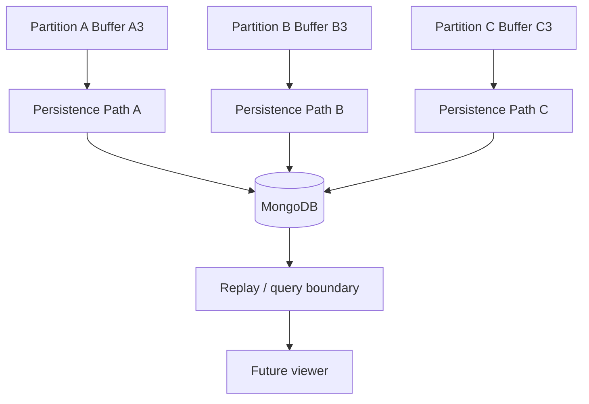
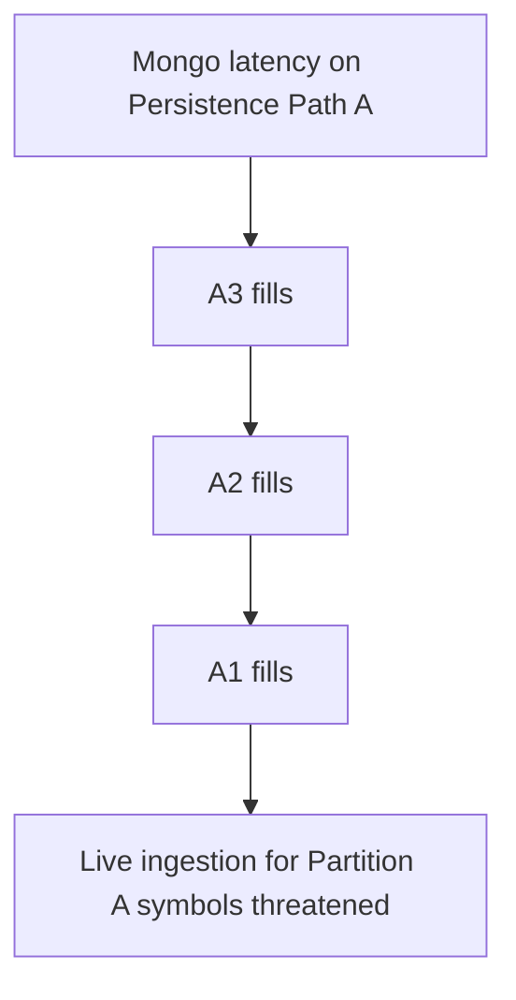

# Bar Sequence Lab Generator — Combined Design and Implementation Plan

**Title:** Bar Sequence Lab Generator — Combined Design and Implementation Plan
**Date:** 2026-09-10
**Version:** V0.1
**Status:** APPROVED
**Implementation:** AUTHORIZED (Bar_Sequence_Lab/generator only)
**Component:** Bar_Sequence_Lab / generator
**Language:** Go
**Purpose:** Experimental raw bar sequence acquisition, persistence, replay, and runtime observability

Human approval completed 2026-09-10. Implementation of Bar_Sequence_Lab/generator is AUTHORIZED under this V0.1 combined Design and Implementation Plan. This authorization does not extend to the viewer, mathematical analysis, DSE, Fin_FeedSat_1, or HACCAM.

This document is a combined System / Architectural Design and Implementation Plan for the experimental lab generator only. It does not implement the viewer. It is not part of the approved DSE architecture. Authorization does not imply that implementation has already occurred.

---

## 1. Executive Summary

`Bar_Sequence_Lab/generator` is an **experimental lab component**. It exists to acquire live Alpaca 1-minute bars quickly, preserve ordered per-symbol sequences, persist raw observations, and expose enough service/runtime information that a later Next.js viewer can replay and visualize those sequences.

It is **not** DSE_TransSat_1. It must not implement Ehlers mathematics, wave construction, phase analysis, Hop-On/Hop-Off, Strategy Maker, portfolio logic, DSE protobufs, or DSE process IDs.

The generator **should copy/adapt proven Alpaca ingestion mechanics** from `Fin_FeedSat_1` (WebSocket connect, auth, subscribe, bar parse, reconnect, source timestamps, source identifiers, and terminal reporting quality). After that one-time copy/adaptation, the lab generator **owns its implementation independently**. There must be **no runtime dependency** on `Fin_FeedSat_1`. `Fin_FeedSat_1` must not be modified.

MongoDB is the initial persistent store. Persistence is **decoupled** from live collection by a three-stage bounded buffer per logical partition so a slow database cannot immediately stall Alpaca ingestion. Each partition has an **independently progressing persistence path** (A3 → Persistence Path A, B3 → Persistence Path B, C3 → Persistence Path C) so persistence latency on one partition does not unnecessarily serialize the others. Paths may share one Mongo deployment, client/pool, database, and raw-observation collection.

Per-symbol sequence fidelity is the highest priority. The generator-owned `generator_sequence_no` is **accepted-arrival order** per symbol per run. It is not produced by sorting `source_event_time`. Parallelize across symbols and stages; never silently reorder consecutive **accepted** observations of the same symbol; never invent a cross-symbol total order; never silently drop a bar; never silently repair source chronology.

This document is **APPROVED**. Implementation of **Bar_Sequence_Lab/generator** is **AUTHORIZED** under this plan only.

---

## 2. Scope

### 2.1 In scope

- Standalone Go generator service under [Bar_Sequence_Lab/generator](Bar_Sequence_Lab/generator/)
- Live Alpaca bar acquisition (copy/adapt Fin ingestion-side mechanics only)
- Configuration-driven symbol list and partition assignment (initial proving up to ~30 symbols, not an architectural cap)
- Three logical partitions (A/B/C), each with three conceptual bounded buffers and an independently progressing persistence path
- Per-symbol sequence authority: run/session identity, accepted-arrival `generator_sequence_no`, preserved source chronology, provenance
- MongoDB persistence of **raw** observations with batched/async writes
- Strong terminal/runtime observability modeled on Fin server quality
- Health/metrics sufficient for later viewer and operator diagnosis
- Replay/query **boundary design** for a future Next.js viewer (not implemented here)
- Provenance record of Fin files used as reference

### 2.2 Out of scope

- Viewer implementation (`Bar_Sequence_Lab/viewer`)
- Any modification of `Fin_FeedSat_1` or `Fin_FeedSat_1_viewer`
- Runtime import of Fin packages
- Ehlers / Hilbert / dominant-cycle / I/Q
- Wave construction, phase-zone angles
- Hop-On / Hop-Off / Strategy Maker / portfolio occupancy
- DSE Process IDs, DSE protobuf, DSE worker/viewer
- Broker execution, paper trading, HACCAM
- Gap fill / historical REST reconstruction (Fin `AlpacaREST` is **not** copied in this lab unless separately designed later)
- CSV replay source (Fin CSV path is not required for this lab)
- Price Engine, Volume Engine, adaptive model, stage-transition science
- Silent lossy queues
- Hard-coded architectural maximum of 30 symbols or 4 waves
- Frozen gRPC/REST/WebSocket/SSE unless later evidence justifies a choice
- Maths, Ehlers, wave, phase, Hop-On/Hop-Off, DSE, Fin_FeedSat_1, Fin_FeedSat_1_viewer, or HACCAM work under this authorization

---

## 3. Existing Source / Re-use Investigation

Inspection was bounded to Alpaca live-ingestion mechanics and terminal/runtime observability. Fin scientific engines were not audited.

### 3.1 Source commit

Repository HEAD at inspection time:

`70d2e6afdc2981bcd049976d46e7e54b28565f9d`

(`docs: approve DSE_TransSat_1 Process Model V0.2`)

When Phase 2 copies/adapts Fin sources, the implementation provenance record shall use the SHA actually copied from, which may differ if `main` has moved.

### 3.2 Files inspected (ingestion and observability only)

| File | Why inspected | Copy / adapt / do not copy |
| --- | --- | --- |
| [Fin_FeedSat_1/internal/marketfeed/alpaca_ws.go](Fin_FeedSat_1/internal/marketfeed/alpaca_ws.go) | Dial, auth, subscribe `bars` + `updatedBars`, read loop, heartbeat/pong, reconnect backoff, health state | **Adapt** as lab-owned Alpaca stream |
| [Fin_FeedSat_1/internal/marketfeed/decode.go](Fin_FeedSat_1/internal/marketfeed/decode.go) | Alpaca JSON array decode, control vs bar (`T=b`/`u`), OHLCV + timestamp parse, source timestamp preservation | **Adapt** bar/control decode; do not pull Fin quality/model semantics unless needed to preserve raw type `b`/`u` |
| [Fin_FeedSat_1/internal/marketfeed/source.go](Fin_FeedSat_1/internal/marketfeed/source.go) | `Credentials`, `LiveBarSource` shape, `SourceID` (`ALPACA_IEX` / `ALPACA_TEST`) | **Adapt** credentials + source identifier; lab owns its interfaces |
| [Fin_FeedSat_1/internal/marketfeed/alpaca_rest.go](Fin_FeedSat_1/internal/marketfeed/alpaca_rest.go) | Historical REST bars / gap fill | **Do not copy** for this lab (no gap fill unless separately designed) |
| [Fin_FeedSat_1/internal/marketfeed/csv_source.go](Fin_FeedSat_1/internal/marketfeed/csv_source.go) | CSV replay | **Do not copy** |
| [Fin_FeedSat_1/internal/config/config.go](Fin_FeedSat_1/internal/config/config.go) | Env loading, IEX/test URLs, reconnect/heartbeat constants, Basic-plan 30-symbol cap, credential env names | **Adapt** Alpaca URL/credential/reconnect *categories*; do not copy satellite/model/pricing identity |
| [Fin_FeedSat_1/cmd/fin-feedsat-server/main.go](Fin_FeedSat_1/cmd/fin-feedsat-server/main.go) | Startup identity log, source/feed/symbols banner, signal shutdown, graceful stop | **Adapt** terminal/runtime style only |
| [Fin_FeedSat_1/internal/ingestion/pipeline.go](Fin_FeedSat_1/internal/ingestion/pipeline.go) | Incoming channel, live `Run`, accept path, some drop logging | Observability **reference** only. Do **not** copy quality gate, infer-ready, gap fill, subscriber fanout, or drop-on-slow-subscriber |
| [Fin_FeedSat_1/internal/domain/bar.go](Fin_FeedSat_1/internal/domain/bar.go) | Raw bar field set: symbol, interval, OHLCV, source timestamp, receipt time, source id | **Adapt field concepts** into lab observation records; do not import Fin `domain` |
| [Fin_FeedSat_1/.env.example](Fin_FeedSat_1/.env.example) | `ALPACA_API_KEY`, `ALPACA_API_SECRET`, feed/symbols env pattern | **Adapt** credential/env categories; lab uses its own env names |
| [Fin_FeedSat_1/docs/guides/Start_Up_guide_V_1.md](Fin_FeedSat_1/docs/guides/Start_Up_guide_V_1.md) | Operator-facing live start, credentials not printed, up to 30 symbols as plan constraint | Behavioral reference for startup reporting |

`Fin_FeedSat_1_viewer` was not found in this Tramuthus repository. That is a repository-location fact only. It is **not** a generator architectural gap, dependency, or open engineering decision. The generator does not depend on that viewer. Inspection of it is deferred until `Bar_Sequence_Lab/viewer` work (Section 19).

### 3.3 Useful structures / patterns to adapt

From `alpaca_ws.go`:

- `gorilla/websocket` dial to `wss://stream.data.alpaca.markets/v2/iex` or `/v2/test`
- Auth JSON `action=auth` with key/secret; greeting may already be `authenticated`
- Subscribe JSON `action=subscribe`, `bars` and `updatedBars` for the configured symbol list
- Session loop with exponential reconnect backoff (`ReconnectBase` 100ms, cap 30s in Fin — treat as **initial lab defaults**, configuration-driven, **LAB-GEN-OE-01 / OE-11**)
- Heartbeat ping/pong and read deadline
- Health: connecting / healthy / recovering / failed, last error, subscribed symbols
- Blocking send into an outbound channel (Fin does not drop inside the WS read loop)

From `decode.go`:

- Messages arrive as JSON arrays
- Bar types `T=b` (bar) and `T=u` (updated/forming bar)
- Preserve original timestamp text (`t`) as source timestamp; parse to interval start
- Require symbol, timestamp, OHLC; parse volume

From `main.go` terminal quality:

- Fatal on config load failure
- One startup banner with service identity, source, feed, symbols, bind
- Explicit shutdown signal and graceful vs forced stop
- Secrets never logged

### 3.4 What must not be copied

- `internal/pricing/**`, `internal/volume/**`, `internal/adaptive/**`, `internal/modelhost/**`
- `internal/stagetransition/**`, `internal/semantics/**`
- gRPC Fin services / proto / `gen/`
- Gap-fill REST (`alpaca_rest.go`) and pipeline recovery
- Pipeline `drop bar for slow subscriber` behavior ([pipeline.go](Fin_FeedSat_1/internal/ingestion/pipeline.go) logs drops). The lab **must not** implement a silent lossy queue.
- Fin satellite identity (`FeedSat`, `PRODUCER`, domain plane)
- Model/pricing env and deadlines
- Fin `domain.Bar` type as a runtime dependency

### 3.5 Provenance requirements (mandatory at copy time)

At Phase 1–2 copy/adapt time, the generator repository shall contain a provenance note (in this document’s change log and/or a generator-owned provenance file created in Phase 1) stating:

- Fin files used as reference/source (table in 3.2)
- Source commit SHA
- What was copied unchanged
- What was adapted and why
- Confirmation of **no** Fin module require / replace

After copy, the generator is independently owned code.

### 3.6 Adaptation reasons already known

| Fin behavior | Lab adaptation | Why |
| --- | --- | --- |
| `MaxSymbolsBasicPlan = 30` | Config-driven symbol list; 30 is an **Alpaca Basic-plan operational constraint**, not architecture | Task forbids hard-coding 30 as architectural maximum |
| Pipeline may drop bars for slow subscribers | Never silently drop; critical buffer state must be explicit | Highest priority is sequence fidelity |
| `readLoop` `continue` on JSON array decode failure | Count and log malformed frames; do not hide | Explicit errors required |
| `skip alpaca bar` log then continue | Retain skip-of-unusable-parse as **rejected observation with diagnostic**, not a silent drop of a valid bar | Distinguishes unusable input from loss of a valid bar |
| Gap fill on reconnect | Do not fabricate or REST-fill missing bars | No gap fill unless separately designed |
| Fin `domain` quality / infer / model path | Omit | Not raw sequence acquisition |

---

## 4. Generator Functional Architecture

One Go process. Logical partitions and buffers are **functional**, not a prescription of nine goroutines.

### 4.1 Context



### 4.2 Ingestion to partitions



### 4.3 Three-buffer pipeline (one partition)



Partitions B and C have the same three-stage shape (B1/B2/B3, C1/C2/C3), each with its **own** persistence path.

### 4.4 Independent persistence paths and future viewer boundary

Architectural requirement: each logical partition shall have an independently progressing persistence path so persistence latency or pressure associated with one partition does not unnecessarily serialize persistence progress for the other partitions.

This does **not** prescribe three goroutines, three Mongo clients, three connections, three collections, three OS threads, a channel topology, or a queue library.

The three paths **may share** one MongoDB deployment, one Mongo client/connection pool, one database, and one raw-observation collection if independent persistence progress is preserved.



Live follow must not require the viewer to be present. Viewer failure must not stop collection.

---

## 5. Partitioning Model

### 5.1 Rules

- Symbol-to-partition assignment is **configuration-driven**.
- Initial proving concept: three partitions, approximately 10 symbols each, total around 30 if the Alpaca plan allows.
- Architecture is **0..N symbols** and **N partitions as configured**. Do not freeze 3 partitions as a scientific law; 3 is the **initial lab proving topology**.
- Do not assume four symbols because a later viewer may show four waves.
- Do not invent a cross-symbol total order.
- A symbol belongs to exactly one partition in a given run (unless a future config explicitly says otherwise; not in V0.1).

### 5.2 Initial proving assignment (example, not frozen)

Assignment algorithm is **LAB-GEN-OE-02**. A configuration-explicit map is preferred over implicit hash until chosen.

Example shape only:

| Partition | Role | Example symbol count |
| --- | --- | --- |
| A | Logical shard 1 | ~10 |
| B | Logical shard 2 | ~10 |
| C | Logical shard 3 | ~10 |

Operators may run 1 symbol, 10 symbols, or 30 symbols without changing architecture.

### 5.3 Dispatcher responsibility

The dispatcher:

- maps `symbol -> partition`
- does not reorder within a symbol (accepted-arrival order is later assigned by sequence coordination, not by sorting source time)
- does not wait for other symbols
- rejects or quarantines symbols not in the configured universe (explicit diagnostic)

---

## 6. Three-Buffer Pipeline Design

Per partition, three **conceptual** bounded buffering stages:

| Stage | Partition A | Partition B | Partition C | Responsibility |
| --- | --- | --- | --- | --- |
| 1 Ingress | A1 | B1 | C1 | Absorb live dispatch bursts; protect Alpaca/ingestion from downstream latency |
| 2 Sequence-ready | A2 | B2 | C2 | Hold observations after sequence/provenance coordination for that partition’s symbols |
| 3 Persistence/batch | A3 | B3 | C3 | Decouple Mongo batch writing from sequence processing; feed that partition's independently progressing persistence path |

Do **not** automatically implement these as nine goroutines or a specific queue library. Exact Go concurrency mechanism remains **LAB-GEN-OE-12**. Independent A/B/C persistence **progress** is **not** open.

### 6.1 Buffer 1 — ingress

- Accepts dispatched raw observations for the partition’s symbols.
- Preserves arrival order **per symbol**; may interleave different symbols.
- Must be bounded and observable (depth, capacity, %, high-water, oldest age).

### 6.2 Buffer 2 — sequence-ready

- Fed only after per-symbol sequence coordination has assigned or confirmed:
  - collection run/session identity
  - `generator_sequence_no` = accepted-arrival order for that symbol in that run
  - provenance fields including source_event_time and received_time
- Still not a cross-symbol total order.
- Bounded and observable.

### 6.3 Buffer 3 — persistence/batch

- Accumulates sequence-ready observations for flush by **count OR elapsed time**, whichever is first.
- Each partition's Buffer 3 feeds **that partition's** persistence path (A3→Path A, B3→Path B, C3→Path C).
- Persistence pressure on Path A fills A3 then A2 then A1; it must not unnecessarily block Path B or Path C from making progress.
- Bounded and observable.

### 6.4 Backpressure progression

Backpressure is **per partition**. Example for Partition A:



Partition B and C follow the same pattern on their own paths. Shared Mongo hardware may still affect all paths; the architecture forbids **unnecessary serialization** of persistence progress across partitions.

Critical rule: **never silently drop a bar**.

When a bounded buffer reaches a configured high-water or critical depth:

- emit explicit terminal diagnostics and metrics
- retain observations already accepted
- do not overwrite raw data
- do not pop-and-discard to “keep up”

If the process cannot accept a **valid** observation without loss, that is a **critical failure / backpressure event**, not a silent skip. Unusable/malformed input is a different class (rejected with diagnostic) and is not counted as a successful drop of a valid bar.

Target `dropped_valid_count = 0`.

---

## 7. Per-Symbol Ordering and Sequence Authority

The generator is the **sequence authority** for the lab.

### 7.1 Three identities (must not be collapsed)

| Identity | Meaning |
| --- | --- |
| Persistent symbol/entity identity | The instrument key, typically Alpaca `S` / symbol |
| Collection run/session identity | One generator process lifetime (or explicitly configured run). New process ⇒ new run unless continuity is **proven** |
| Observation number / `generator_sequence_no` | Monotonically increasing **accepted-arrival order** per symbol per run. Not derived by sorting source timestamps. |

### 7.2 Four times / orders (must not be collapsed)

| Field | Meaning |
| --- | --- |
| `generator_sequence_no` | Order in which **valid** observations were **accepted** by the generator for that symbol in that run |
| `source_event_time` | Source-provided event/interval timestamp |
| `received_time` | When the generator received/accepted the observation |
| `persisted_time` | When persistence completed |

Example: accepted AAPL `184` has `source_event_time=T1`. Next accepted AAPL is `185` even if its `source_event_time=T0` and `T0 < T1`. Observation 185 remains 185.

The generator **must not**:

- retrospectively reorder the accepted sequence because a source timestamp is earlier
- turn source timestamp into the generator sequence authority
- silently repair chronology
- fabricate missing observations
- renumber prior accepted observations

Preserve both facts: accepted-arrival order **and** source-provided event/interval time. Future maths must be able to inspect both.

### 7.3 Ordering rules

- Each symbol owns its own accepted-arrival sequence.
- Consecutive **accepted** observations for the same symbol must not be processed in a way that can silently reorder them.
- Different symbols may advance independently and asynchronously.
- Do not invent a cross-symbol total order for storage, metrics, or replay.

### 7.4 Restart / discontinuity

- Do not silently bridge discontinuities across generator restarts.
- If continuity cannot be proven (same run id, last persisted sequence, matching symbol universe/source), start a **new run/session** and record it explicitly.
- Do not fabricate missing bars.
- Do not gap-fill.

### 7.5 Source-time regression (raw generator behavior is constrained)

If an **accepted** observation's `source_event_time` is earlier than the previous accepted observation's `source_event_time` for that symbol:

- preserve the observation
- preserve its `generator_sequence_no`
- record the condition explicitly as diagnostic/provenance evidence
- increment the relevant diagnostic/metric
- do not silently reorder it

The persisted flag name (`out_of_order`, `source_time_regression`, `ordering_status`, or other) is **not frozen** (schema/interface detail under **LAB-GEN-OE-04**).

**LAB-GEN-OE-09** remains open only for **later analytical handling** of a source-time-regression observation. The **raw accepted arrival sequence must be preserved**.

### 7.6 Duplicate handling

Detection is in scope. **LAB-GEN-OE-08** remains open for later disposition (persist-and-flag vs reject vs idempotent overwrite).

Constraint: duplicate detection **must not destroy evidence of what arrived**. Do not silently drop a second arrival merely to keep a tidy unique source-time key if that would erase the fact of the arrival. If a uniqueness rule is later chosen, the discarded-or-merged case must still be diagnosable. Do not use duplicate detection as a silent chronology repair.

### 7.7 Forming vs final bars

Alpaca `T=u` (updated/forming) vs `T=b` (bar) exists in Fin decode. Whether the lab persists forming updates, finals only, or both is **LAB-GEN-OE-10**. Until decided, the design requires **preserving the original observation type/provenance** rather than collapsing types.

---

## 8. MongoDB Persistence Design

Goal: persist raw observations without making Mongo the live-ingestion bottleneck.

### 8.1 Collection strategy (PROPOSED, not frozen)

Prefer **one document per raw observation** (or bounded segments), not giant ever-growing per-symbol arrays.

**PROPOSED** names (**LAB-GEN-OE-04**):

| Name | Purpose |
| --- | --- |
| `lab_collection_runs` | Run/session metadata |
| `lab_raw_observations` | One raw bar observation per document |
| `lab_maths_results` | Future; **not written by this generator** |

Do not overwrite raw observations later with mathematical interpretations.

### 8.2 Raw observation schema concept (PROPOSED)

Logical fields (not a Go struct, not BSON-frozen):

| Field concept | Required |
| --- | --- |
| entity/symbol | yes |
| collection_run_id / session identity | yes |
| generator_sequence_no | yes — accepted-arrival order per symbol per run |
| source_event_time / interval start | yes — source-provided; not the sequence authority |
| source_timestamp text as received | yes |
| received_time | yes — receive/accept time |
| persisted_time | yes |
| interval | yes (initial 1Min) |
| open, high, low, close, volume | yes |
| trade/event count if present | preserve if present |
| source id (`ALPACA_IEX` / `ALPACA_TEST` or configured) | yes |
| Alpaca message type (`b`/`u`) if available | yes if present |
| partition id | yes |
| original payload hash or equivalent identity | recommended |
| continuity flags (new run, gap suspected — flag only, no fill) | if detected |
| source-time regression / ordering diagnostic | if detected; field name not frozen |

Preserve the original observation. Do not mutate OHLC later.

### 8.3 Conceptual indexes (PROPOSED)

- `(collection_run_id, symbol, generator_sequence_no)` unique for accepted-arrival order
- `(collection_run_id, symbol, source_event_time)` — query aid; **not** unique if that would erase duplicate or regression arrivals
- `(collection_run_id)`
- `(symbol, persisted_time)` for operator queries

Exact index list is **LAB-GEN-OE-04**.

### 8.4 Batch / flush

Support both:

- flush when batch **count** threshold reached
- flush when **elapsed time** threshold reached
- whichever first

Numeric defaults are **initial configurable lab defaults only**, not architecture (**LAB-GEN-OE-05**). Example placeholders for later config, not frozen: count `50`, time `200ms`.

Writes are asynchronous relative to Buffer 1. **Persistence Path A** consumes A3, **Path B** consumes B3, **Path C** consumes C3. Paths may share a client/pool and collection. Do not implement a single serialized writer that makes B and C wait on A's batch unless that sharing still allows independent progress (it generally does not).

### 8.5 Failure / retry

- Failed batch: increment failed-batch metric, log error (no secrets), retry per configured policy (**LAB-GEN-OE-11**).
- Observations remain in Buffer 3 (or a retry holding area that is still bounded and observable) until success or critical full.
- Do not delete unpersisted valid observations to relieve pressure.
- Mongo unavailable: same backpressure chain; ingestion eventually threatened; condition explicit.

### 8.6 Separation from future maths

Raw collection is authoritative for what actually arrived and the order in which the generator accepted it. Future `maths` documents may reference `collection_run_id`, symbol, `generator_sequence_no`, and `source_event_time` separately. The generator does not write maths.

---

## 9. Replay / Query Boundary for Future Viewer

Do not implement the viewer. Do not freeze transport.

The generator must **eventually** expose enough for Next.js to:

- list collection runs/sessions
- list symbols in a run
- retrieve an ordered range for a symbol in a run
- seek backward/forward (range queries around a sequence number or source time)
- follow live accepted observations
- select a run then a symbol; possibly multiple symbols independently (no implied lock-step)

### 9.1 Logical operations (protocol OPEN — LAB-GEN-OE-06, LAB-GEN-OE-07)

| Operation | Result |
| --- | --- |
| ListRuns | run id, start/end time, symbol universe, status |
| GetRun | run metadata |
| ListSymbols | symbols in run + latest sequence |
| GetRange | ordered observations `[from, to]` by `generator_sequence_no` (accepted-arrival) and, separately, by `source_event_time` when requested |
| FollowLive | subsequent accepted observations after a cursor |
| Health | generator/mongo/buffer summary without secrets |

Default replay order is **accepted-arrival** (`generator_sequence_no`). Source-time order is an alternate view, not a rewrite of the stored sequence.

Cursor identity should be `(run_id, symbol, generator_sequence_no)` for Play/Pause/Fwd/Rew over the accepted sequence. A source-time cursor may exist later without becoming the sequence authority.

### 9.2 Transport

gRPC vs REST vs WebSocket vs SSE is **OPEN**. Fin uses gRPC streams; a Next.js viewer may prefer HTTP/SSE. This lab does not copy Fin proto. No proto is required by this document.

Live follow must be non-causal: slow viewer must not fill Buffer 1. If a live-follow consumer is slow, isolate that consumer; collection continues.

---

## 10. Runtime / Terminal Observability Design

Benchmark: readability and completeness of [fin-feedsat-server/main.go](Fin_FeedSat_1/cmd/fin-feedsat-server/main.go) — identity banner, source/feed/symbols, explicit shutdown — plus continuous operational counters Fin does not fully print today.

Example wording below is **illustrative**, not frozen architecture.

### 10.1 STARTUP

Print once after config load, before connecting:

- service name (`Bar_Sequence_Lab generator` or configured)
- version/build if available
- environment (lab/local; not a secret)
- Alpaca mode/feed (iex/test) and stream host **without** credentials
- Mongo target summary: host/db **without** user/password
- configured symbol count
- partition count
- symbol assignment per partition
- configured buffer capacities (A1..C3)
- configured persistence batch count and time thresholds
- replay/query bind address if enabled
- `dropped_valid target=0`

Do not print API keys, secrets, or full Mongo URIs containing credentials.

### 10.2 CONNECTIVITY

- Alpaca dial / authenticated / subscribed (symbol count)
- Alpaca reconnect, backoff, degraded, failed
- Mongo connected / degraded / retrying / unavailable

### 10.3 RUNTIME COLLECTION

Periodic or event-based, rate-limited so the terminal remains readable:

- bars received
- bars accepted
- bars rejected (malformed/unusable)
- bars persisted
- per-symbol latest sequence
- per-partition throughput (received/sec, persisted/sec)

### 10.4 BUFFER HEALTH

For A1, A2, A3, B1, B2, B3, C1, C2, C3:

- current depth
- capacity
- percentage
- high-water mark
- oldest buffered observation age where meaningful

High-water and critical thresholds produce **WARN** / **ERROR** lines. Never silent.

### 10.5 PERSISTENCE

Per persistence path A/B/C (and totals):

- last batch size
- write latency
- successful batches
- failed batches
- retries
- total pending observations (that path's Buffer 3 plus in-flight)

### 10.6 ERRORS

- malformed/unusable observations
- reconnect events
- Mongo write failures
- sequence continuity concerns (new run, suspected gap, duplicate, source-time regression)
- buffer critical / high-water events

### 10.7 SHUTDOWN

- signal received
- stop accepting new live observations
- flush A3, B3, and C3 independently with timeout
- report unflushed count per path if any (must be explicit)
- Mongo disconnect
- Alpaca close
- graceful vs forced stop

### 10.8 Example terminal shape (not frozen wording)

```text
STARTUP service=bar-sequence-lab-generator env=local feed=iex symbols=30 partitions=3 mongo=localhost/bar_sequence_lab
STARTUP partition=A symbols=10 buffers=A1:4096 A2:4096 A3:2048 batch=count/time
ALPACA connected feed=iex subscribed=30
MONGO connected db=bar_sequence_lab
COLLECT recv=120 accept=120 persist=120 reject=0 drop_valid=0
BUFFER A1=12/4096 (0%) hw=40 age=120ms A2=4/4096 A3=18/2048
PERSIST batches_ok=8 batches_fail=0 latency_ms=14 pending=18
WARN BUFFER A3 high-water 75% pending=1536
ERROR ALPACA disconnected; reconnect backoff=800ms
SHUTDOWN signal=interrupt flush pending=18 flushed=18 drop_valid=0
```

---

## 11. Health / Metrics Model

Logical metrics (export mechanism OPEN; terminal is mandatory):

| Metric | Scope |
| --- | --- |
| received_per_sec | per partition and total |
| accepted_per_sec | per partition and total |
| persisted_per_sec | per partition and total |
| buffer_depth | per A1..C3 |
| buffer_capacity | per A1..C3 |
| buffer_percent | per A1..C3 |
| buffer_high_water | per A1..C3 |
| oldest_item_age | per buffer where meaningful |
| mongo_op_latency | per persistence path A/B/C |
| batch_latency | per persistence path A/B/C |
| batch_success_count | per persistence path A/B/C |
| batch_fail_count | per persistence path A/B/C |
| retry_count | per persistence path / alpaca |
| alpaca_reconnect_count | ingestion |
| per_symbol_latest_sequence | each symbol (accepted-arrival) |
| per_symbol_latest_source_time | each symbol (not the sequence authority) |
| rejected_malformed_count | ingestion |
| duplicate_count | sequence |
| source_time_regression_count | sequence (accepted sequence preserved) |
| dropped_valid_count | **target always 0** |
| pending_unpersisted | per path A3/B3/C3 + in-flight |

Health summary for later query boundary: Alpaca state, Mongo state, any buffer ≥ high-water, drop_valid, current run id.

---

## 12. Configuration Model

Categories only. No secrets in files or logs.

| Category | Contents |
| --- | --- |
| Alpaca | key/secret via env; feed `iex`/`test`; stream URL override; source id |
| Symbols | list; must be non-empty |
| Partitions | count (initial 3); explicit symbol-to-partition map or algorithm (**OE-02**) |
| Buffers | capacity per stage per partition; high-water %; critical % |
| Mongo | URI from env; database; collection names (PROPOSED); TLS as later needed |
| Batching | count threshold; time threshold |
| Retry | alpaca backoff base/cap; mongo retry max/backoff (**OE-11**) |
| Logging | diagnostic level; metric print interval |
| Query/replay | bind address; enable/disable |
| Run | environment name; service name; optional forced new-run flag |
| Interval | initial `1Min` |

**PROPOSED** env name prefix `BAR_SEQ_LAB_*` plus reuse of `ALPACA_API_KEY` / `ALPACA_API_SECRET` for operator familiarity. Prefix is **PHYSICAL NAME NOT YET FROZEN**.

Do not commit credentials. Do not log credentials.

Numeric buffer/batch values are configuration, not architecture. Do not freeze them in code constants without config override.

---

## 13. Failure Model

| Failure | Expected behavior | Loss |
| --- | --- | --- |
| Alpaca disconnect | Health degraded; reconnect with backoff; no fabricated bars; no REST gap fill | No new observations until live resumes; last accepted state retained |
| Duplicate bar | Detect; diagnostic; do not destroy evidence of what arrived; disposition per OE-08 | Must not silently erase a second arrival |
| Malformed bar | Reject with error metric/log; do not persist as valid | Not a valid-bar drop |
| Source-time regression | Accept if valid; keep `generator_sequence_no`; flag/metric; do not reorder or renumber | No silent chronology repair; no fabricate |
| One symbol failure | Other symbols continue; partition continues | Isolated |
| Mongo slow on Path A | A3 then A2 then A1 fill; Paths B and C continue persistence progress | No silent drop; no unnecessary cross-partition serialize |
| Mongo unavailable | Retry; degraded; per-path backpressure | Unpersisted remain pending and explicit |
| One partition pressure | Other partitions' persistence paths continue | No cross-partition drop |
| All buffers near capacity | CRITICAL terminal + metrics; do not silent-drop | If process cannot accept, fail visibly |
| Graceful shutdown | Stop ingest; flush batches; report residual pending | Residual pending must be explicit (target 0) |
| Restart | New run/session unless continuity proven | Do not bridge sequences silently |

Non-loss objective: every **accepted valid** observation is either persisted or still pending and visible. `dropped_valid_count` remains 0.

---

## 14. Concurrency / Performance Strategy

**Why one Go process first:** lab proving, one operator terminal, one health surface, simplest restart/run identity.

**Why three logical partitions:** spread ~30-symbol proving load and isolate per-shard buffer pressure without claiming a distributed system.

**Why three buffering stages per partition:** separate (1) live ingest protection, (2) sequence authority, (3) Mongo latency.

**Why async/batched Mongo:** avoid one-bar blocking writes on the ingest path.

**Why independently progressing persistence paths A/B/C:** persistence latency or pressure on one partition must not unnecessarily serialize persistence progress for the others. Shared Mongo deployment/client/pool/database/collection is allowed if that independence is preserved.

**Why parallelism across symbols:** symbols arrive independently; lock-step is incorrect.

**Why order preservation within symbol:** `generator_sequence_no` is accepted-arrival order; silent reorder or source-time sort destroys what actually arrived.

**Not prescribed yet (LAB-GEN-OE-12):** exact goroutine count, mutex vs channel, queue library, whether independence is implemented as three writer loops or equivalent. Do **not** leave independent A/B/C persistence progress open. Do not assume nine goroutines because there are nine named buffers. Do not assume three Mongo clients or three collections.

---

## 15. Proposed Go Physical Organization

Propose only. Physical names below are **PHYSICAL NAME NOT YET FROZEN**. Do not assume one package per conceptual function is mandatory. This documentation-correction task does not create these directories.

```text
Bar_Sequence_Lab/generator/          PHYSICAL NAME NOT YET FROZEN
  docs/                              exists
    BAR_SEQUENCE_LAB_GENERATOR_DESIGN_IMPLEMENTATION_PLAN_V0_1_091026.md
  cmd/generator/                     PHYSICAL NAME NOT YET FROZEN
  internal/config/                   PHYSICAL NAME NOT YET FROZEN
  internal/alpaca/                   PHYSICAL NAME NOT YET FROZEN
  internal/dispatch/                 PHYSICAL NAME NOT YET FROZEN
  internal/sequence/                 PHYSICAL NAME NOT YET FROZEN
  internal/buffer/                   PHYSICAL NAME NOT YET FROZEN
  internal/persistence/              PHYSICAL NAME NOT YET FROZEN
  internal/query/                    PHYSICAL NAME NOT YET FROZEN
  internal/health/                   PHYSICAL NAME NOT YET FROZEN
  internal/diagnostics/              PHYSICAL NAME NOT YET FROZEN
  go.mod                             not created; no Fin replace directive
```

Module path is **PHYSICAL NAME NOT YET FROZEN**. It must not require `fin_feedsat_1`.

---

## 16. Implementation Plan

Human approval completed 2026-09-10. **Bar_Sequence_Lab/generator** implementation is **AUTHORIZED** under this V0.1 plan. This correction task does **not** start implementation.

Authorized work starts with:

- **Phase 1** — provenance, standalone Go module, no Fin runtime dependency
- **Phase 2** — copy/adapt proven Alpaca ingestion

then proceeds through Phases 3–10 below. Viewer, maths, DSE, Fin, and HACCAM remain unauthorized.

### Phase 1 — Provenance + minimal standalone Go module

- **Objective:** Empty runnable module with provenance note and config skeleton; no Alpaca yet.
- **Expected artifacts:** `go.mod`, `cmd/.../main.go` hello/startup log, provenance comment/file, `.env.example` without secrets.
- **Acceptance:** `go run` prints service name; no Fin imports.
- **Diagnostics:** STARTUP line.
- **Dependencies:** none.
- **Must not add:** Alpaca, Mongo, buffers, viewer, DSE.

### Phase 2 — Copy/adapt proven Alpaca ingestion

- **Objective:** Independent Alpaca WS connect/auth/subscribe/parse/reconnect.
- **Expected artifacts:** lab-owned stream + decode adapted from Fin files in Section 3.2; provenance updated with SHA and diff summary.
- **Acceptance:** receive bars for 1+ symbols on test or iex; terminal CONNECTIVITY; credentials not logged.
- **Diagnostics:** subscribed, bars received, reconnect.
- **Dependencies:** Phase 1.
- **Must not add:** gap fill, Mongo, DSE, Fin module dependency.

### Phase 3 — Symbol configuration + partitions

- **Objective:** Config-driven universe and A/B/C assignment.
- **Expected artifacts:** config load; dispatcher; startup print of assignment.
- **Acceptance:** 1, 10, and 30-symbol configs parse; assignment explicit.
- **Diagnostics:** STARTUP partition maps.
- **Dependencies:** Phase 2.
- **Must not add:** frozen 30-max architecture; four-wave assumption.

### Phase 4 — Per-symbol sequence state

- **Objective:** Run/session id; per-symbol `generator_sequence_no` as accepted-arrival order; restart = new run unless proven.
- **Expected artifacts:** sequence state store (in-memory sufficient).
- **Acceptance:** independent symbol advance; no cross-symbol order; restart new run id; source-time regression accepted without reorder/renumber.
- **Diagnostics:** per-symbol latest sequence; source-time regression warnings; continuity warnings.
- **Dependencies:** Phase 3.
- **Must not add:** fabricated bars, gap fill, source-time sort as sequence authority.

### Phase 5 — Three-buffer pipeline

- **Objective:** Bounded A1..C3 conceptual pipeline with observable depth; no silent drop.
- **Expected artifacts:** buffer metrics; backpressure WARN/ERROR.
- **Acceptance:** fill test without silent loss; per-symbol order preserved through stages.
- **Diagnostics:** BUFFER HEALTH lines.
- **Dependencies:** Phase 4.
- **Must not add:** nine-goroutine mandate; lossy overflow.

### Phase 6 — Mongo persistence + batching

- **Objective:** Batched writes; count-or-time flush; raw documents; retry; independently progressing persistence paths A/B/C.
- **Expected artifacts:** persistence paths consuming A3/B3/C3; PROPOSED collections (shared collection allowed).
- **Acceptance:** persisted count matches accepted minus pending; Mongo slow on Path A fills A3 first without unnecessarily stalling B/C persist progress.
- **Diagnostics:** PERSIST latency/success/fail/pending **per path**.
- **Dependencies:** Phase 5.
- **Must not add:** maths collections as required path; giant array documents; a single serialized writer that collapses A/B/C progress.

### Phase 7 — Runtime/terminal diagnostics

- **Objective:** Full Section 10/11 terminal quality.
- **Expected artifacts:** periodic reporter; shutdown flush summary.
- **Acceptance:** operator can diagnose connect, buffers, persist, errors without a viewer.
- **Diagnostics:** all categories in Section 10.
- **Dependencies:** Phases 2–6.
- **Must not add:** secret leakage.

### Phase 8 — Replay/query boundary

- **Objective:** Minimal run/symbol/range/live-follow surface for future viewer.
- **Expected artifacts:** interface per OE-06/OE-07 once chosen or a temporary internal API marked unfrozen.
- **Acceptance:** ordered range by `generator_sequence_no` equals persisted accepted-arrival order; live follow isolated from ingest.
- **Diagnostics:** query counts; slow-consumer isolation.
- **Dependencies:** Phase 6.
- **Must not add:** Next.js app; frozen proto unless separately chosen; Fin_FeedSat_1_viewer work.

### Phase 9 — Stress and loss testing

- **Objective:** Prove no silent drops; ordering; backpressure.
- **Expected artifacts:** tests listed in Section 17.
- **Acceptance:** `dropped_valid_count=0` under Mongo slowdown; per-symbol accepted-arrival order holds; Path A pressure does not unnecessarily stop Path B/C persist.
- **Diagnostics:** buffer critical events fired and recovered.
- **Dependencies:** Phases 5–7.
- **Must not add:** science.

### Phase 10 — Viewer integration readiness

- **Objective:** Document bind address, run/symbol/range/live contract for `Bar_Sequence_Lab/viewer`.
- **Expected artifacts:** interface notes only unless implementation already authorized through Phase 8.
- **Acceptance:** viewer team can integrate without changing generator science.
- **Diagnostics:** n/a.
- **Dependencies:** Phase 8.
- **Must not add:** viewer implementation; generator does not depend on locating `Fin_FeedSat_1_viewer`.

---

## 17. Validation Plan

Define now; implement tests in later generator phases, not in this documentation-correction task.

| ID | Validates |
| --- | --- |
| TEST-LAB-GEN-01 | One symbol live acquire, accept, persist |
| TEST-LAB-GEN-02 | 10 symbols independent arrival |
| TEST-LAB-GEN-03 | 30 symbols configuration and collection (plan permitting) |
| TEST-LAB-GEN-04 | Independent symbol arrival does not lock-step others |
| TEST-LAB-GEN-05 | Mongo slowdown on Path A fills A3 then A2 then A1; Paths B/C continue persist progress; no silent drop |
| TEST-LAB-GEN-06 | Mongo outage and recovery; pending then persist; no fabricate |
| TEST-LAB-GEN-07 | Alpaca reconnect; no gap fill; new bars after resume |
| TEST-LAB-GEN-08 | Restart creates new run id unless continuity proven |
| TEST-LAB-GEN-09 | Buffer saturation is explicit; `dropped_valid_count=0` |
| TEST-LAB-GEN-10 | Per-symbol accepted-arrival order preserved through buffers and Mongo; source-time sort is not applied |
| TEST-LAB-GEN-11 | Batch flush on count and on time |
| TEST-LAB-GEN-12 | Replay by `generator_sequence_no` preserves stored accepted-arrival order |
| TEST-LAB-GEN-13 | Malformed observation rejected and counted |
| TEST-LAB-GEN-14 | Duplicate detected without destroying arrival evidence; source-time regression accepted, flagged, not reordered |
| TEST-LAB-GEN-15 | Graceful shutdown flush residual explicit |
| TEST-LAB-GEN-16 | Terminal startup does not leak secrets |
| TEST-LAB-GEN-17 | Independent persistence progress: A vs B vs C under asymmetric Mongo delay |

---

## 18. Open Engineering Decisions

Do not resolve by preference unless existing evidence clearly supports a choice.

| ID | Item | Why open |
| --- | --- | --- |
| LAB-GEN-OE-01 | Exact Alpaca source/feed mode inherited from Fin (`iex` vs `test`, stream URLs) | Fin defaults exist (`iex`, IEX/test URLs) but lab env/plan may differ |
| LAB-GEN-OE-02 | Exact partition assignment algorithm | Explicit map vs hash vs round-robin not frozen |
| LAB-GEN-OE-03 | Default buffer capacities | Must be config-driven; numbers not architecture |
| LAB-GEN-OE-04 | Mongo collection naming/schema/indexes | PROPOSED only |
| LAB-GEN-OE-05 | Batch count and time thresholds | Config-driven lab defaults not frozen |
| LAB-GEN-OE-06 | Query/replay protocol (gRPC/REST/other) | Viewer not implemented; Fin gRPC is not automatically the lab API |
| LAB-GEN-OE-07 | Live viewer transport (SSE vs WebSocket vs other) | Viewer concern; generator must isolate slow consumers |
| LAB-GEN-OE-08 | Duplicate handling policy | Detect without destroying arrival evidence; persist-and-flag vs reject vs idempotent overwrite not frozen |
| LAB-GEN-OE-09 | Later analytical handling of source-time regression | Raw accepted-arrival sequence is constrained and must be preserved; later maths treatment remains open |
| LAB-GEN-OE-10 | Persist forming `u` bars, final `b` bars, or both | Fin subscribes to both; lab sequence meaning not frozen |
| LAB-GEN-OE-11 | Reconnect/retry numeric policy | Fin backoff constants are evidence, not lab law |
| LAB-GEN-OE-12 | Exact Go concurrency mechanism (goroutines/channels/queues) | Independent A/B/C persistence **progress** is required and closed; mechanism of that progress remains open |
| LAB-GEN-OE-13 | Restart continuity proof rules | New run is default; exact proof of continuity not frozen |
| LAB-GEN-OE-14 | Metrics export beyond terminal (Prometheus, etc.) | Terminal is mandatory; export optional later |
| LAB-GEN-OE-15 | Module/package/env physical names | PHYSICAL NAME NOT YET FROZEN |

Fin evidence that may inform but does **not** close OE-01: `DefaultFeed = iex`, `IEXStreamURL`, `TestStreamURL`, env `ALPACA_API_KEY` / `ALPACA_API_SECRET`.

---

## 19. Viewer Integration Notes

Do not implement [Bar_Sequence_Lab/viewer](Bar_Sequence_Lab/viewer/) under this generator authorization.

The generator must provide (later, Phase 8/10):

- run/session selection
- symbol selection (one or many, independent sequences)
- ordered range retrieval by accepted-arrival `generator_sequence_no`
- optional source-time view that does not rewrite stored sequence
- live follow of accepted observations
- health/buffer summary
- stable cursors for Play / Pause / Forward / Rewind / scrubbing

`Fin_FeedSat_1_viewer` was not found in this Tramuthus repository. That is a location fact only. The generator does not depend on it. Failure to locate it does not block generator design or implementation. No generator DG/OE is opened for that absence.

When work begins on `Bar_Sequence_Lab/viewer`, that existing Fin viewer may be inspected as a reference for Node modules, Next.js runtime files, stream-consumption patterns, UX/UI layout, deployment/runtime conventions, and reusable visualization/player libraries. No viewer package/library selection is required for generator implementation. Do not modify `Fin_FeedSat_1_viewer`.

The lab viewer is non-causal relative to collection.

---

## 20. Explicit Non-Responsibilities

The generator does **not** own or perform:

- Ehlers / Hilbert / dominant-cycle mathematics
- wave math
- phase / I / Q
- Hop-On / Hop-Off
- Strategy Maker
- portfolio occupancy or broker position
- DSE process implementation or DSE protobuf
- broker execution
- HACCAM
- Fin_FeedSat_1 science (Price, Volume, adaptive model)
- Fin_FeedSat_1 source mutation
- gap fill / fabricated missing bars
- silent lossy queues
- viewer UX implementation

---

## 21. Implementation Authorization Gate

This document is **APPROVED** (V0.1).

Human approval completed 2026-09-10. Implementation of **Bar_Sequence_Lab/generator** is **AUTHORIZED** under this V0.1 combined Design and Implementation Plan. This authorization does not extend to the viewer, mathematical analysis, DSE, Fin_FeedSat_1, or HACCAM.

Authorization applies **only** to `Bar_Sequence_Lab/generator` and **only** to implementation according to this plan.

It does **not** authorize:

- `Bar_Sequence_Lab/viewer` implementation
- maths implementation
- Ehlers implementation
- wave construction
- phase analysis
- Hop-On/Hop-Off
- DSE changes
- DSE implementation based on this lab document
- Fin_FeedSat_1 changes
- Fin_FeedSat_1_viewer changes
- HACCAM changes

Implementation has not already occurred. Subsequent work starts at Phase 1 (provenance + standalone Go module, no Fin runtime dependency), then Phase 2 (copy/adapt proven Alpaca ingestion).

Do not modify `Fin_FeedSat_1`.
Do not modify `Fin_FeedSat_1_viewer`.
Do not implement `Bar_Sequence_Lab/viewer` under this authorization.

---

## 22. Change Log

| Date | Version | Change |
| --- | --- | --- |
| 2026-09-10 | V0.1 | Initial combined design and implementation plan. |
| 2026-09-10 | V0.1 | Independent persistence progress for A/B/C; `generator_sequence_no` is per-symbol accepted-arrival order; source-time regression preserved and diagnosed without reorder; Fin viewer absence is a location fact, not a generator gap; human approval; generator implementation AUTHORIZED (viewer/maths/DSE/Fin/HACCAM not authorized). |
