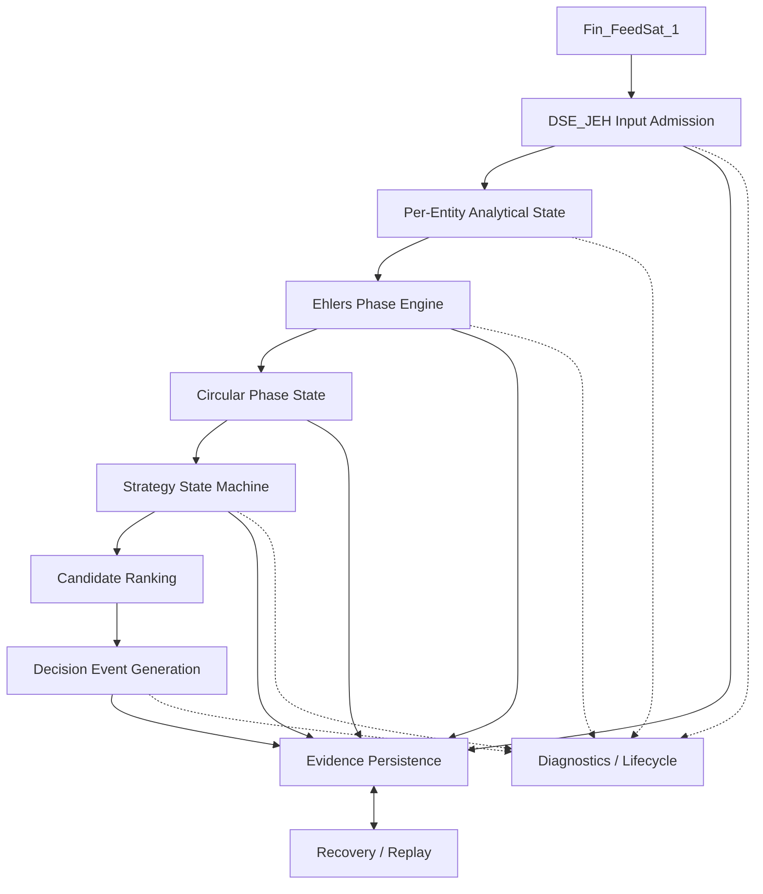
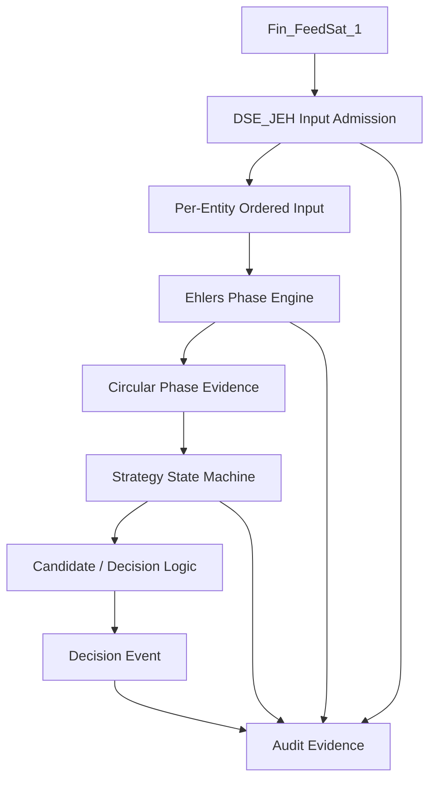
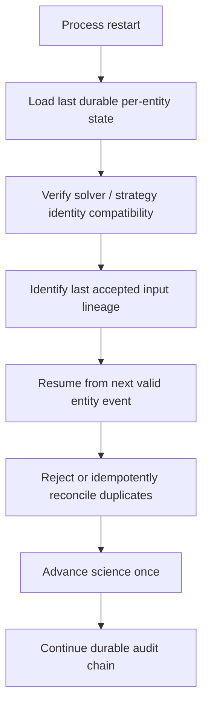

# DSE_JEH Foundation Design

**Date:** 2026-09-11  
**Version:** V0.1  
**Status:** APPROVED  
**Implementation:** NOT YET AUTHORIZED  
**Operational language:** Go only (future implementation)  
**Initial target input:** `RAW_BAR_SEQUENCE` using Median Price

---

## Governance Change Log

**Date:** 2026-09-11

- Human approval of DSE_JEH Foundation Design V0.1.
- Foundation architecture approved.
- Full operational runtime implementation remains separately gated.
- First proving implementation will use persisted phase-angle CSV evidence.
- CSV is a proving fixture, not a permanent DSE_JEH operational input contract.
- Bar Sequence Lab phase solver migration is explicitly deferred.
- Fin_FeedSat_1 direct integration is explicitly deferred.
- Open scientific questions remain governed by Section 21.

---

## 1. Executive Summary

DSE_JEH is the proposed operational destination for a John Ehlers-Hilbert based decision strategy engine. It will eventually consume published information directly from Fin_FeedSat_1, maintain independent analytical and strategy state per entity, produce auditable decision events, and support restart recovery and deterministic replay through the same Go logic used in operation.

The Bar Sequence Lab supplies a proven foundation for ordered per-symbol bar evidence, Median Price input, Ehlers Dominant Cycle Phase generation, warm-up validity, normalized circular phase, lineage, persistence, and visual inspection. Those results establish analytical and evidence-handling behavior within the Lab. They do **not** establish that any Hop-On / Hop-Off interpretation is profitable, that phase zones confirm market troughs or peaks, or that a ranking and allocation policy has an advantage.

This design keeps three authorities distinct:

1. The Ehlers engine produces analytical phase evidence.
2. A strategy state machine interprets that evidence under candidate rules.
3. Decision logic emits proposed decision evidence under separately governed policy.

The initial operational target is one asynchronous `RAW_BAR_SEQUENCE` trajectory per entity, using the Lab-proven Median Price definition. `PRICE_ENGINE` and `VOLUME_ENGINE` are later independent input modes, not ingredients to be fused into the initial price-phase calculation. HACCAM, Azure, broker execution, portfolio execution, protobuf changes, and runtime implementation are outside this design.

The candidate four-zone Hop-On / Hold / Hop-Off / Disregard model is recorded for review, not approved as science or trading policy. Signed circular phase difference, phase velocity, zone-boundary behavior, ranking, decision timing, and checkpoint granularity remain open. No implementation is authorized by this document.

---

## 2. Purpose

This document defines the first focused operational foundation for DSE_JEH. Its purpose is to:

- translate proven Bar Sequence Lab evidence into a proposed operational boundary;
- separate analytical phase generation from downstream strategy interpretation;
- establish per-entity, event-driven processing without cross-symbol synchronization assumptions;
- define evidence categories required for audit, recovery, and deterministic replay;
- identify what may be preserved, what must be adapted, and what must not be ported from the Lab;
- expose scientific and engineering questions that require human resolution before implementation.

This is a design and governance artifact only. It does not authorize source code, schemas, interfaces, deployment, or execution behavior.

---

## 3. Scope

### 3.1 In scope

- Conceptual DSE_JEH operational boundary
- Initial `RAW_BAR_SEQUENCE` / Median Price path
- Per-entity input admission and ordered analytical state
- Ehlers phase-engine responsibility
- Normalized circular phase evidence
- Candidate strategy zones and state transitions
- Candidate ranking as a downstream, unresolved strategy concern
- Decision-event concepts
- Storage-neutral evidence and repository boundaries
- Local MongoDB persistence during development
- Duplicate protection, restart recovery, audit continuity, and deterministic replay
- Future direct Fin_FeedSat_1 integration at a conceptual level
- Later independent `PRICE_ENGINE` and `VOLUME_ENGINE` input modes

### 3.2 Authority limits

This document does not promote the Bar Sequence Lab solver into production. The Lab scientific definition remains approved only for the Lab experiment and explicitly states that DSE promotion is not authorized. DSE_JEH adoption requires subsequent human approval, implementation planning, independent validation, and controlled migration.

The supplied Go and Python strategy prototypes are investigation artifacts. They may inform review questions, but neither is authoritative implementation. No prototype code is copied by this design.

---

## 4. Source Evidence / Proven Lab Foundation

The Bar Sequence Lab has demonstrated the following relevant capabilities and semantics:

| Proven Lab evidence | Foundation relevance |
| --- | --- |
| Real ordered bar-sequence collection | Establishes an auditable input trajectory for operational design |
| Per-symbol `generator_sequence_no` | Establishes entity-local analytical order |
| Median Price: `(High + Low) / 2` | Freezes the initial price-only input transform |
| Solver `EHLERS_DOMINANT_CYCLE_PHASE` | Identifies the analytical method under review for migration |
| Solver version `V0.1` | Establishes versioned analytical identity |
| Normalization `0 <= phase_angle_degrees < 360` | Establishes authoritative stored/display representation |
| `phase_observable` and `validity_state` | Separates warm-up from usable analytical output |
| 63-bar lookback | Bars 1–63 initialize; the 64th selected bar is first eligible for observable output |
| Derived MongoDB persistence | Demonstrates auditable analytical evidence separate from raw input |
| Raw evidence preservation | Supports lineage, reconstruction, and replay |
| `collection_run_id`, `partition_id`, `symbol`, `generator_sequence_no` | Establishes Lab lineage concepts |
| Phase-angle viewer | Demonstrates inspection of persisted evidence without changing science |
| Real 30-symbol experiment | Demonstrates multi-entity evidence under unequal history lengths |

Important experiment evidence:

| Field | Value |
| --- | --- |
| `collection_run_id` | `20260911T161623Z-1` |
| `series_size` | `120` |
| Raw observations | 3,120 |
| Observable phase records | 1,272 |
| Initializing phase records | 1,848 |
| Symbols reaching observable phase | 28 |
| Symbols remaining initializing | DIA and VXX |

The experiment demonstrates validity handling under real, unequal per-symbol histories. It does not prove the candidate strategy zones, transition meaning, ranking quality, profitability, or allocation advantage.

---

## 5. DSE_JEH Operational Boundary

DSE_JEH is conceptually responsible for:

- admitting published upstream events under an explicit input contract;
- preserving accepted input evidence and lineage;
- maintaining ordered state independently for each entity;
- advancing the versioned Ehlers phase engine only on valid accepted input;
- representing authoritative phase as normalized circular evidence;
- interpreting observable phase through a separately governed strategy state machine;
- ranking candidates only when an approved ranking definition exists;
- generating auditable decision events without executing broker actions;
- persisting evidence and recovery checkpoints through storage-neutral interfaces;
- restoring state and replaying accepted evidence deterministically;
- exposing lifecycle and diagnostic evidence without changing analytical outcomes.

Conceptual decomposition:



Diagnostics are observational and must not become a hidden scientific or strategy input. Persistence supports durability but must not be called directly from scientific calculation logic.

---

## 6. Analytical Pipeline



For the first implementation target, the trajectory is:

```text
accepted RAW_BAR_SEQUENCE event
        -> entity-local ordering and duplicate check
        -> Median Price = (High + Low) / 2
        -> versioned Ehlers phase advancement
        -> phase validity + normalized circular phase evidence
        -> candidate strategy interpretation, only when observable
        -> candidate/decision evaluation under approved policy
        -> durable evidence and checkpoint
```

No cross-entity barrier is required. One entity may be observable while another remains initializing. An input for one entity cannot advance another entity's analytical state.

---

## 7. Ehlers Analytical Responsibility

The Ehlers analytical responsibility is narrower than the strategy responsibility.

### 7.1 Input trajectory

The first target accepts one `RAW_BAR_SEQUENCE` trajectory per entity. Its scientific input is Median Price:

$$
P[n] = \frac{High[n] + Low[n]}{2}
$$

Volume does not alter price smoothing, I, Q, period, phase, or validity. Missing bars are not fabricated, interpolated, repeated, or renumbered.

### 7.2 Phase calculation

The proposed migration candidate is the proven Go logic for `EHLERS_DOMINANT_CYCLE_PHASE`, solver version `V0.1`, subject to explicit DSE promotion review. Scientific calculations must remain independent of MongoDB, transport, strategy zones, candidate ranking, and decision policy.

### 7.3 Validity and warm-up

The analytical output must carry explicit validity. Lab behavior uses a 63-bar lookback:

- bars 1–63: `phase_observable=false`, `validity_state=INITIALIZING`, phase unavailable/null;
- 64th selected observation onward: eligible for `OBSERVABLE` output when the solver produces a valid numeric phase.

Unavailable phase must never be represented as zero. Strategy processing must not reinterpret initializing evidence as an observable angle.

### 7.4 Normalization

Authoritative stored and displayed phase remains:

$$
0 \leq phase\_angle\_degrees < 360
$$

An unwrapped phase trajectory must not replace this primary value. Any future derived angular measure requires separate identity, definition, and evidence.

### 7.5 Strategy interpretation

Hop-On, Hold, Hop-Off, Disregard, ranking, and decision events are downstream strategy concepts. They must not be embedded in or emitted as scientific facts by the phase engine.

```text
Ehlers analytical evidence
        -> phase_angle_degrees
        -> strategy interpretation
        -> strategy state/event
```

No smoothing may be added merely to make real phase evidence resemble a simulator or desired strategy trajectory.

---

## 8. Circular Phase Model

Phase is circular rather than an ordinary unbounded scalar.

- `0 degrees` and `360 degrees` identify the same angular boundary.
- The authoritative representation is normalized to `[0, 360)`.
- A transition across the boundary may appear discontinuous on a linear chart while remaining locally continuous on the circle.
- Zone transitions must account for boundary adjacency: a movement near `359 degrees -> 1 degree` crosses the normalized boundary, not the entire cycle.
- Numeric comparison and subtraction rules suitable for linear values cannot be assumed valid for phase.

### 8.1 Signed angular difference remains open

A naive definition such as:

```text
(current_angle - previous_angle) mod 360
```

always returns a non-negative rotation. For example, `10 degrees -> 350 degrees` may represent a small signed change of `-20 degrees`, while naive modulo gives `+340 degrees`.

Therefore the signed circular-difference rule and any derived angular velocity are **OPEN FOR SCIENTIFIC DEFINITION**. No phase-velocity value may influence ranking or decisions until direction convention, wrap behavior, units, sampling basis, validity prerequisites, and edge cases are approved and tested.

---

## 9. Candidate Hop-On / Hop-Off Strategy Model

The supplied strategy material proposes the following downstream interpretation:

| Normalized phase zone | Candidate strategy interpretation | Governance status |
| --- | --- | --- |
| `270 <= phase < 360` | Hop-On / accumulation candidate region | Candidate rule; requires validation |
| `0 <= phase < 90` | Momentum Hold candidate region | Candidate rule; requires validation |
| `90 <= phase < 180` | Hop-Off / distribution candidate region | Candidate rule; requires validation |
| `180 <= phase < 270` | Downtrend / Disregard candidate region | Candidate rule; requires validation |

These boundaries classify normalized analytical evidence. They do not prove trend direction, trough or peak confirmation, profitable entry or exit timing, or allocation quality. Entering a zone is not automatically a buy, sell, or portfolio action.

The proposed strategy state machine may observe zone entry, exit, and persistence, but its transition rules, noise treatment, eligibility rules, and decision consequences require separate approval. Boundary ownership is expressed with half-open intervals to avoid overlap, but the behavioral validity of those boundaries remains open.

---

## 10. Per-Entity State

DSE_JEH requires isolated conceptual state for each entity. This section does not freeze Go structs, packages, serialization, or checkpoint layout.

Conceptual state includes:

- entity identity, initially symbol;
- selected input type;
- last accepted source identity and lineage;
- last accepted per-entity ordering position;
- analytical history or sufficient solver state;
- current and previous normalized phase;
- current and previous phase validity;
- current and previous candidate strategy zone;
- solver name and version;
- input-series definition identity;
- strategy-definition version when one is approved;
- lineage needed to link input, analytical, strategy, and decision evidence;
- durable checkpoint identity and audit continuity position.

Ownership principles:

- Input admission owns acceptance and duplicate disposition.
- The phase engine owns scientific state advancement and phase evidence.
- The strategy state machine owns zone/strategy state derived from observable phase.
- Decision logic owns decision-event formation under approved rules.
- Repositories persist records but do not own scientific meaning.

State for one entity must not be inferred from another entity's sequence number or processing progress.

---

## 11. Event Semantics

DSE_JEH is event-driven. An accepted entity input may produce zero or more downstream evidence records, depending on validity and actual state change.

A minimal candidate event vocabulary for later review is:

| Proposed event concept | Meaning | Status |
| --- | --- | --- |
| `PHASE_BECAME_OBSERVABLE` | Entity transitions from non-observable to observable phase | Proposed |
| `ZONE_ENTERED` | Observable normalized phase enters a candidate zone | Proposed |
| `ZONE_EXITED` | Observable normalized phase leaves a candidate zone | Proposed |
| `HOP_ON_CANDIDATE` | Approved future rules identify a Hop-On candidate | Proposed strategy event |
| `HOP_OFF_CANDIDATE` | Approved future rules identify a Hop-Off candidate | Proposed strategy event |
| `DECISION_EVENT` | Approved decision policy emits a durable determination | Proposed envelope concept |

This taxonomy must not be expanded merely for framework completeness. Future event definitions must specify triggering evidence, entity identity, prior/current state, source lineage, analytical and strategy versions, deterministic identity, and whether the event represents state transition or observation.

A zone event is evidence of a strategy-state transition, not confirmation of market structure. A candidate event is not broker execution.

---

## 12. Asynchronous Entity Processing

`generator_sequence_no` is per entity. It establishes order only within that entity's accepted trajectory.

Consequently:

- equal sequence numbers across symbols do not imply a common market frame;
- DSE_JEH must not wait for all symbols to reach sequence `N` before processing sequence `N`;
- entity events may arrive, become observable, and transition zones independently;
- ranking across candidates requires an explicit future timing/window contract rather than accidental equality of sequence numbers;
- reconnect and recovery are evaluated against each entity's durable source position;
- global ingestion order must not replace entity-local analytical order without an approved contract.

Any future synchronization model must define its time authority, completeness rule, lateness policy, and audit semantics explicitly. None is defined here.

---

## 13. Candidate Ranking

Candidate ranking is a downstream strategy step after valid phase evidence and strategy-state interpretation. It is not part of the Ehlers solver.

Potential ranking inputs mentioned in investigation material, including phase velocity, persistence, transition recency, or candidate comparisons, remain hypotheses. The design does not approve a score, weight, tie-breaker, candidate window, or capital-rotation policy.

Phase velocity is specifically blocked pending an approved signed circular-difference definition. Before ranking can use angular change, review must establish:

- signed direction convention;
- shortest-arc versus directed-rotation semantics;
- treatment of exact 180-degree differences;
- denominator and units for velocity under asynchronous inputs;
- behavior across initialization, gaps, duplicates, and restart;
- numerical tolerances and deterministic tests;
- whether velocity is scientific evidence or strategy-derived evidence.

Ranking must preserve the inputs, formula/version, candidate set, evaluation timing, and tie resolution required to reconstruct a result.

---

## 14. Evidence / Audit Model

Evidence categories remain separate. They must not be collapsed into one mutable record.

| Evidence category | Purpose | Minimum conceptual identity/content |
| --- | --- | --- |
| Accepted input evidence | Proves what DSE_JEH admitted or rejected | Entity, source identity, entity-local position, payload/provenance, acceptance/duplicate disposition |
| Derived Ehlers phase evidence | Proves analytical output | Input lineage, normalized phase or null, observable flag, validity, solver/input identity |
| Strategy-state evidence | Proves downstream interpretation and transition | Phase-evidence identity, prior/current candidate zone/state, strategy-definition version |
| Decision evidence | Proves what policy determined and why | Strategy evidence, candidate/ranking context, decision type, policy version, causal lineage |
| Runtime/recovery state | Enables restart without duplicate scientific advancement | Entity checkpoint, last durable input position, recoverable analytical/strategy state, version compatibility |

Evidence should be append-oriented or otherwise preserve immutable historical meaning. A recovery checkpoint may be replaced operationally, but it must link to durable evidence so audit continuity is reconstructable.

No exactly-once claim is made. The required design objective is deterministic identity, duplicate detection, idempotent persistence where appropriate, and prevention of duplicate scientific advancement.

---

## 15. MongoDB Local Persistence

MongoDB is the required local development persistence implementation. It supports audit, reconstruction, recovery, and replay while DSE_JEH is developed locally.

MongoDB is not part of the scientific architecture. The phase engine and strategy logic must depend on domain-level inputs and outputs, not MongoDB collections, BSON types, queries, or sessions.

Conceptual persistence boundaries should support:

- accepted-input evidence repository;
- analytical-evidence repository;
- strategy-state evidence repository;
- decision-evidence repository;
- per-entity checkpoint repository;
- replay evidence reader;
- transactional or ordered durability behavior as later defined.

Physical collections, indexes, retention, write grouping, and transaction use are not frozen here. The boundary must allow a later persistence replacement without changing scientific calculations or strategy semantics. Azure design is explicitly outside this task.

---

## 16. Recovery / HA Semantics

Current HA scope means restart-safe local operation, not distributed high availability.

Minimum required semantics:

1. Persist accepted input evidence.
2. Persist derived analytical output evidence.
3. Recover per-entity analytical state.
4. Recover the last accepted source position and lineage per entity.
5. Detect and disposition duplicates before scientific advancement.
6. Replay accepted evidence deterministically.
7. Preserve audit continuity across process lifetimes.
8. Enforce solver-version and strategy-version identity during restore.

Conceptual recovery flow:



Recovery must define behavior when evidence and checkpoint writes are partially complete. That atomicity boundary remains open. Rebuilding state from accepted evidence is the correctness fallback when a checkpoint is absent, incompatible, or untrusted.

This design does not introduce Kubernetes, Azure, active-active operation, consensus, leader election, distributed failover, or exactly-once guarantees.

---

## 17. Replay Validation

DSE_JEH validation uses deterministic replay through the same future Go runtime logic used operationally. It does not introduce a conventional Python backtester or a separate scientific implementation.

```text
persisted accepted input evidence
        -> same Go Ehlers engine
        -> same strategy state machine
        -> same decision-event generation
        -> compare reconstructed outputs
```

Replay serves:

- analytical reproducibility;
- strategy transition validation;
- decision reconstruction;
- audit investigation;
- restart/recovery testing;
- solver and strategy version regression testing.

A replay run must preserve entity-local input ordering and must not fabricate cross-entity synchronization. It must identify configuration, solver, strategy, and input versions and compare outputs at defined evidence boundaries. Whether replay reads from an empty state, a checkpoint, or both is part of the open determinism and recovery test design.

---

## 18. Future Direct Fin_FeedSat_1 Integration

DSE_JEH is intended to connect directly to Fin_FeedSat_1 in a later authorized design step. This document does not define or request Fin_FeedSat_1 changes, protobuf changes, service methods, message fields, or transport behavior.

A future interface design must map published Fin_FeedSat_1 evidence into DSE_JEH admission requirements, including:

- entity identity;
- selected trajectory identity;
- per-entity ordering position or an approved derivation;
- OHLC data required for Median Price in the initial mode;
- source event identity and provenance;
- duplicate/reconnect semantics;
- lifecycle and gap behavior;
- compatibility/version identity.

Admission must preserve upstream evidence rather than silently reshape it. HACCAM is not involved at this stage.

---

## 19. Future Input Modes

DSE_JEH is expected eventually to support one selected trajectory type at a time:

| Input mode | Status | Boundary |
| --- | --- | --- |
| `RAW_BAR_SEQUENCE` | First implementation target | Median Price from ordered High/Low evidence; Lab lineage foundation |
| `PRICE_ENGINE` | Future | Independent selected trajectory; interface and semantics not defined |
| `VOLUME_ENGINE` | Future | Independent selected trajectory; interface and semantics not defined |

These are independent trajectory selections. This design does not mix Volume into price phase computation, fuse Price and Volume trajectories, or synchronize multiple input modes. A future input-mode contract must identify which scientific method applies and prevent incompatible state from being restored under a different mode.

---

## 20. Explicit Non-Goals

- No Python runtime
- No Python files or migration of the supplied Python prototype
- No Python backtester
- No HACCAM integration yet
- No Azure design or deployment
- No Kubernetes, active-active topology, consensus, or leader election
- No broker execution
- No portfolio execution implementation
- No profitability or allocation-advantage claim
- No neural network
- No Price/Volume trajectory fusion
- No multi-input synchronization
- No smoothing to imitate a simulator
- No protobuf or API definition
- No physical MongoDB schema or index definition
- No Go source, package, struct, goroutine, or queue design frozen here
- No implementation authorization
- No replacement of Bar Sequence Lab
- No modification of proven Lab evidence
- No port of the Lab viewer or phase-angle viewer
- No assumption that equal sequence numbers across symbols form a synchronized frame
- No conventional backtesting subsystem separate from operational Go replay

---

## 21. Open Scientific / Engineering Questions

These questions are intentionally unresolved.

| ID | Open question | Required resolution evidence |
| --- | --- | --- |
| OQ-01 | What is the approved signed circular phase-difference rule? | Scientific definition covering direction, wrap, 180-degree tie, and tests |
| OQ-02 | How, if at all, is phase velocity defined? | Units, sampling basis, validity rules, gap behavior, deterministic vectors |
| OQ-03 | Are the proposed 90-degree zone boundaries scientifically and strategically valid? | Replay evidence and human-approved strategy definition |
| OQ-04 | Is transition hysteresis, dwell, debounce, or other noise handling needed? | Defined problem evidence; no smoothing of authoritative phase |
| OQ-05 | What candidate-ranking methodology is permitted? | Versioned inputs, score, tie-breakers, candidate timing, validation criteria |
| OQ-06 | When may a candidate become a decision event? | Explicit event timing and eligibility contract |
| OQ-07 | What constitutes deterministic replay equivalence? | Compared fields, numeric tolerances, ordering, configuration/version identity |
| OQ-08 | How is live Fin_FeedSat_1 output mapped into accepted DSE_JEH input? | Future interface design and provenance contract |
| OQ-09 | What is the recovery checkpoint granularity? | Per-event/per-batch policy, state size, durability and recovery tests |
| OQ-10 | What is the atomicity boundary among input, analytical evidence, strategy evidence, decision evidence, and checkpoint? | Failure-mode analysis and storage design |
| OQ-11 | How are gaps, late events, regressions, corrections, and reconnects admitted per entity? | Input-admission policy with auditable dispositions |
| OQ-12 | What solver-state representation is durable and version compatible? | Migration/restore contract and replay equivalence tests |
| OQ-13 | What strategy-state event taxonomy is minimally necessary? | Human-reviewed strategy process definition |
| OQ-14 | How is a cross-entity candidate set formed without assuming synchronized sequence numbers? | Explicit time/window/completeness policy |
| OQ-15 | Does Lab solver V0.1 have sufficient independent numerical validation for DSE promotion? | Frozen independent vectors and promotion approval |
| OQ-16 | What configuration identity and change policy applies during live operation and replay? | Versioned configuration and transition governance |
| OQ-17 | How are checkpoint incompatibility and solver/strategy upgrades handled? | Refuse/rebuild/migrate policy with audit continuity |
| OQ-18 | What local MongoDB retention, indexing, and integrity controls are required? | Later persistence design based on operational volumes and recovery targets |

No question above may be closed by implementation convenience alone.

---

## 22. Migration Boundary

### 22.1 PORT / PRESERVE FROM LAB

Subject to explicit DSE promotion approval:

- proven Go phase-engine logic;
- Median Price semantics;
- price-only phase input and Volume exclusion;
- phase validity and 63-bar warm-up behavior;
- normalized `[0, 360)` authoritative phase;
- solver name and version identity;
- entity/input lineage concepts;
- null initialization semantics;
- deterministic analytical tests and independent reference vectors;
- separation of raw input evidence from derived phase evidence;
- relevant evidence semantics for observability and audit.

Preserve means preserve behavior and evidence meaning, not copy an experimental component wholesale.

### 22.2 ADAPT FOR DSE_JEH

- per-entity persistent analytical state rather than bounded batch experiments;
- operational event admission from a future Fin_FeedSat_1 contract;
- per-entity recovery and checkpoint behavior;
- duplicate, regression, reconnect, and gap handling;
- long-running lifecycle and diagnostics;
- separately governed strategy-state engine;
- candidate/ranking and decision evidence when approved;
- storage-neutral repository interfaces with local MongoDB implementations;
- deterministic replay through the operational Go processing path;
- version compatibility and audit continuity across restart and upgrade.

### 22.3 DO NOT PORT

- Lab viewer;
- phase-angle viewer;
- `SERIES_SIZE` as an operational control or identity dimension;
- A/B/C experimental partitions as analytical concepts;
- Lab-only collection orchestration;
- Python code or Python runtime;
- supplied Python strategy prototype;
- supplied Go prototype as production code;
- experimental PowerShell workflow, except where an operator runner is later explicitly required and separately authorized;
- Lab MongoDB collections as a permanent operational schema;
- strategy claims not supported by current evidence.

---

## 23. Governance and Authorization Gate

This V0.1 document is proposed for human review. Before runtime implementation can begin, at minimum:

1. The operational boundary and ownership split must be approved.
2. Lab analytical behavior must receive explicit DSE promotion authority.
3. The initial Fin_FeedSat_1 input contract must be designed and approved.
4. Input admission, duplicate, gap, and reconnect rules must be defined.
5. Recovery and replay equivalence criteria must be approved.
6. Any strategy implementation must have a versioned candidate-rule definition.
7. Any use of phase velocity or ranking must wait for resolution of OQ-01, OQ-02, and OQ-05.
8. Persistence and checkpoint atomicity must be designed.
9. An implementation plan must bound packages, interfaces, tests, and migration steps.

Until those gates are completed:

**Implementation remains NOT YET AUTHORIZED.**
