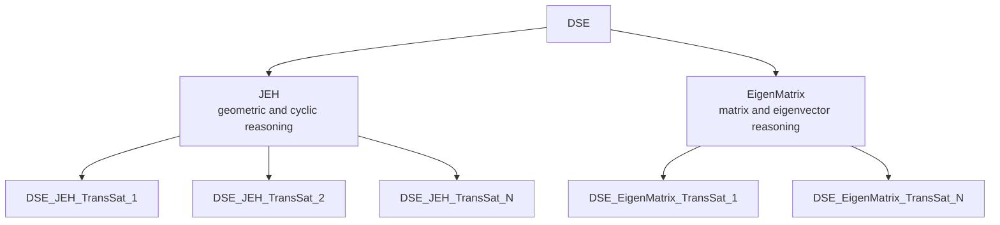
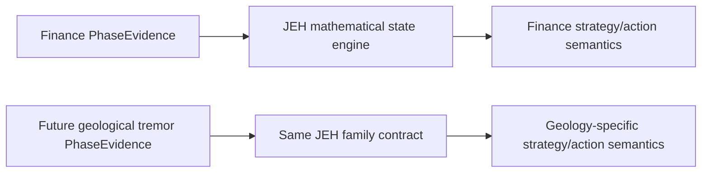
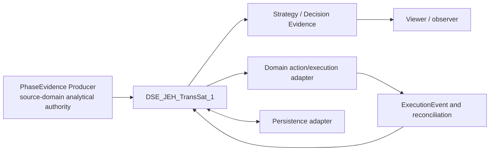
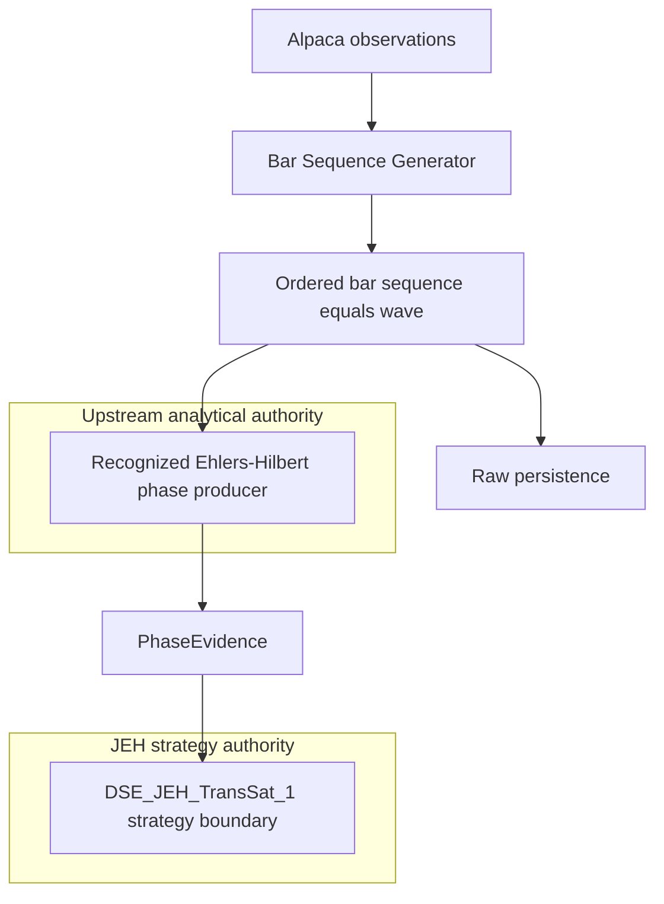
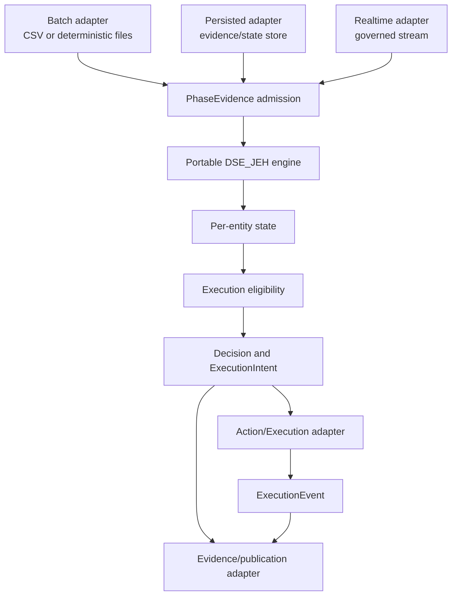
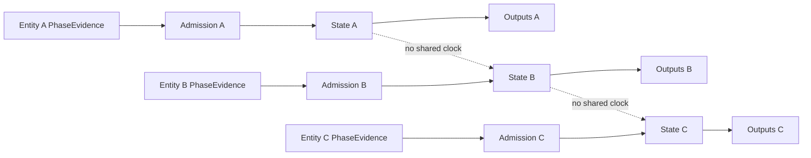
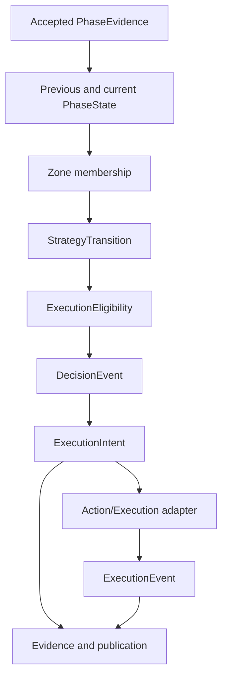
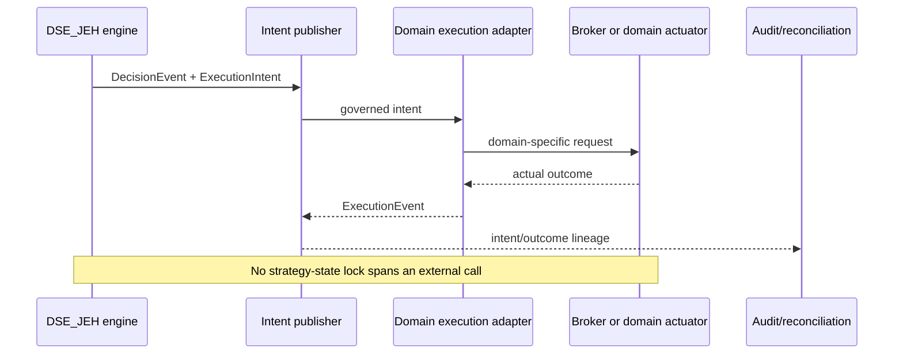
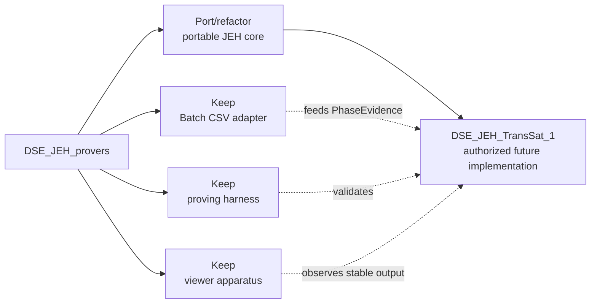

# DSE_JEH_TransSat_1 System Design V0.1

| Document control | Value |
| --- | --- |
| Filename | `DSE_JEH_TRANS_SAT_1_SYSTEM_DESIGN_V0_1_091226.md` |
| Date | 2026-09-12 |
| Version | V0.1 |
| Status | PROPOSED FOR HUMAN REVIEW |
| Implementation status | NOT YET AUTHORIZED |
| Architectural identity | `DSE_JEH_TransSat_1` |
| Physical documentation location | `DSE_JEH/docs` |
| Design lineage | First system design for `DSE_JEH_TransSat_1`; not a revision of the DSE_JEH Foundation Design lineage |
| Relationship to earlier DSE_JEH material | Evidence, approved foundation concepts, and unresolved questions; not automatic system authority |
| Relationship to `DSE_JEH_provers` | Experimental proving and observational apparatus; not a TransSat and not operational code |

**Purpose.** Define the proposed system architecture for the first concrete designed runtime instance that hosts the portable John Ehlers-Hilbert Decision Strategy Engine family. This document establishes boundaries, responsibilities, state and evidence models, operating modes, execution separation, migration classification, validation implications, and unresolved decisions. It creates no runtime, interface, protobuf, deployment, or implementation authority.

Normative terms `MUST`, `MUST NOT`, `SHOULD`, and `MAY` express design requirements. Labels distinguish **Inherited Concept**, **Experimentally Proven Behavior**, **Proposed V0.1 Design**, and **Unresolved Question**. An experimental result is not a runtime guarantee unless this document proposes it as a requirement and later validation accepts it.

---

## 1. Naming and Architectural Identity Standards

This section is normative for this design.

### 1.1 Runtime naming standard

Strategy runtime instances use:

```text
DSE_<StrategyFamily>_TransSat_<Instance>
```

| Element | Meaning |
| --- | --- |
| `DSE` | Decision Strategy Engine class and family context |
| `<StrategyFamily>` | Mathematical strategy family implemented by the satellite |
| `TransSat` | A transformation-satellite runtime instance that consumes input evidence and produces new strategy/decision information |
| `<Instance>` | Independently configured runtime instance of that strategy family |

Examples are `DSE_JEH_TransSat_1` through `DSE_JEH_TransSat_N` and, solely to establish the family principle, `DSE_EigenMatrix_TransSat_1` through `DSE_EigenMatrix_TransSat_N`.

The instance number MUST NOT imply one satellite per entity. One instance may process one, several, or many configured entities. Entity count and instance count are deployment, capacity, isolation, and configuration choices.



### 1.2 Strategy-family naming principle

Strategy-family names SHOULD identify mathematical method or reasoning structure, not only the current application domain.

- `DSE_JEH` is the John Ehlers-Hilbert family. Its vocabulary is phase, angle, circular state, rotation, cycle, angular transition, region, and boundary.
- `DSE_EigenMatrix` identifies a possible matrix/eigenvector family whose vocabulary includes matrix, vector, eigenvector, eigenvalue, dominant direction, and multivariate state relationship.

This document neither designs nor authorizes EigenMatrix. Its presence only demonstrates that JEH is one mathematical family among possible DSE families.

### 1.3 Domain independence

The mathematical family and the application domain are separate dimensions. `DSE_JEH` MUST NOT be defined fundamentally as a stock-trading algorithm. It may process suitable ordered phase evidence in more than one domain, but mathematical portability does not imply semantic equivalence.

The source-domain semantics govern the meaning of source evidence, thresholds, state interpretation, decisions, actions, and execution. JEH MUST NOT redefine source-domain science.



### 1.4 Family, instance, prover, and physical path

- `DSE_JEH` is the reusable mathematical strategy family/type.
- `DSE_JEH_TransSat_1` is the first concrete designed runtime instance of that family.
- `DSE_JEH_provers` is experimental proving apparatus and is not a TransSat.
- Physical folder `DSE_JEH` is the present design workspace; it is not embedded runtime identity.

Therefore `DSE_JEH != DSE_JEH_TransSat_1`. The reusable implementation MUST NOT embed an instance number, fixed entity population, fixed Finance semantics, or physical repository path. Experimental code is promoted only through explicit classification, human design approval, implementation authorization, and validation.

### 1.5 Local identity summary

`DSE_JEH_TransSat_1` is proposed as:

| Dimension | Value |
| --- | --- |
| Strategy family | `DSE_JEH` |
| Runtime instance | `1` |
| Runtime class | `TransSat` as locally defined in Section 1.1 |

These are distinct concepts. The proposed instance consumes input evidence and produces new authoritative JEH strategy/decision information. It does not own or redefine source-domain science.

---

## 2. Executive Summary

`DSE_JEH_TransSat_1` is the first concrete designed TransSat instance intended to host one configured instance of the portable `DSE_JEH` strategy engine. Its primary input is source-neutral `PhaseEvidence`, not raw OHLCV, CSV rows, MongoDB documents, Alpaca messages, or Fin_FeedSat_1 messages. It maintains independent per-entity circular phase and strategy state, derives versioned zone transitions, evaluates separately governed execution eligibility, creates strategy decisions and `ExecutionIntent`, and publishes auditable evidence.

The upstream producer owns phase calculation. The currently proven producer derives Median Price from ordered raw bars and applies recognized Ehlers Dominant Cycle Phase behavior compatible with the TA-Lib `HT_DCPHASE` reference. The TransSat does not require that solver internally. Hop-On/Hop-Off zones are downstream JEH strategy semantics, not John Ehlers definitions.

The same engine supports Batch, Persisted, and Realtime modes through adapters. Persistence, transport, viewing, and domain-specific execution MUST remain outside strategy mathematics. A Finance adapter may map `ExecutionIntent` to a paper or broker order, while another domain may map it to another governed action.

Current candidate zones and deterministic prover behavior are retained as a versioned baseline, not as evidence of efficacy. Velocity, ranking, execution eligibility policy, asynchronous candidate-set timing, portfolio capacity, recovery checkpoints, and final protobuf fields remain open. Implementation is not authorized.

---

## 3. Purpose, Scope, and Authority

### 3.1 Purpose

This design is intended to support later, separately approved work for:

1. standard interface/protobuf design;
2. Go module and package design;
3. implementation planning;
4. validation planning and deterministic replay tests; and
5. a bounded mock or paper execution proof.

### 3.2 In scope

- Concrete `DSE_JEH_TransSat_1` system context and ownership
- Portable PhaseEvidence-driven JEH engine
- Per-entity state, zone, transition, eligibility, decision, and intent models
- Batch, Persisted, and Realtime adapter boundaries
- Replay, recovery, persistence, failure isolation, lineage, and versioning
- Fin_FeedSat_1 input-compatibility relationship
- Prover migration classification and validation implications
- Standard interface families to design before implementation

### 3.3 Authority hierarchy

This is a new system-design lineage. Earlier approved DSE_JEH Foundation V0.1 supplies inherited concepts and evidence, but does not automatically control this system design. `DSE_JEH_provers` supplies experimentally proven behavior only. No earlier proving or design artifact becomes implementation authority without explicit classification and approval in this lineage.

---

## 4. System Purpose and Context

The proposed instance owns the JEH strategy interpretation applied to accepted phase evidence. It does not own source scientific data, upstream phase mathematics, or downstream execution outcomes.



### 4.1 Responsibilities

- Admit valid, attributable, ordered `PhaseEvidence`.
- Preserve producer and source-observation lineage.
- Maintain isolated per-entity JEH state.
- Classify observable phase using a versioned zone model.
- Emit true state transitions without fabricating transitions during persistence.
- Evaluate execution eligibility separately from analytical state.
- Create decisions and deterministic `ExecutionIntent` evidence.
- Publish runtime health/lifecycle and audit evidence.
- Support deterministic replay and defined recovery behavior.

### 4.2 Non-responsibilities

- Raw acquisition, bar construction, gap filling, or source scientific computation
- Ehlers/Hilbert implementation inside the portable strategy core
- Fin_FeedSat_1 Price, Volume, or adaptive Decision science
- Broker or actuator implementation
- Viewer calculation of phase, zones, eligibility, or decisions
- Cross-entity ranking or portfolio optimization until separately designed

---

## 5. Architectural Principles

1. **PhaseEvidence is the core input.** Adapters convert producer-specific records to the standard boundary.
2. **Source science remains upstream.** A recognized phase producer owns method correctness and solver validity.
3. **Strategy interpretation is JEH-owned.** Zone, transition, eligibility, decision, and intent semantics are versioned DSE outputs.
4. **Entity state is independent.** No entity sequence advances or timestamps another entity.
5. **Observability is not eligibility.** `phase_observable != phase_strategy_eligible`.
6. **Candidate, decision, intent, and execution are different evidence layers.**
7. **Adapters vary; strategy mathematics does not.**
8. **Replay and live processing use the same state-transition logic.**
9. **Authority follows ownership.** Producers own source science; JEH owns its transformation; executors own actual outcomes.
10. **Experimental success is not efficacy.** Determinism does not establish profitability or optimality.

---

## 6. Upstream Phase Production Boundary

The ordered bar sequence is itself the wave in bar/event-index space. No generic Wave Creation transform is introduced.



The initial proven path uses price only, with Median Price:

$$P[n] = \frac{High[n] + Low[n]}{2}$$

`generator_sequence_no` is the analytical axis. The current solver produces normalized phase in `[0,360)`, uses a 63-observation lookback, records observations 1 through 63 as `INITIALIZING`, and may first produce observable phase at observation 64. This is current solver/configuration behavior, not a universal JEH law. Initializing observations remain trajectory history; unavailable phase is null, never zero.

Price and Volume are independent trajectories. Price I/Q MUST NOT be modified using Volume. A future Volume JEH analysis requires its own recognized solver path and `PhaseEvidence`. Fin `DecisionEvent`, `PriceEvent`, and `VolumeEvent` are separate asynchronous streams; this design creates no synchronous tuple.

The rejected prototype with effectively identical Hilbert FIR I/Q and Volume-scaled Q is not acceptable phase science. TA-Lib `HT_DCPHASE` is an identified independent validation reference, but neither TA-Lib nor the raw solver is a dependency of the JEH strategy core.

---

## 7. Proven Experimental Baselines

### 7.1 Bar Sequence Lab baseline

| Measure | Verified value |
| --- | ---: |
| `collection_run_id` | `20260911T161623Z-1` |
| Symbols | 30 |
| Raw observations | 3,120 (`3120`) |
| `SERIES_SIZE` | 120 |
| Selected / produced / failures | 3,120 / 3,120 / 0 (`3120 / 3120 / 0`) |
| Observable / initializing | 1,272 / 1,848 (`1272 / 1848`) |
| Symbols with observable phase | 28 |
| Initialization-only symbols | DIA (33 observations), VXX (51 observations) |

Raw accepted, JSONL, and Mongo counts reconciled at 3,120; source sequences were contiguous per entity; no raw bars were fabricated or altered by phase generation. This proves collection, preservation, lineage, initialization, and phase-generation infrastructure. It does not prove profitability, optimal zones, ranking, execution performance, or production readiness.

### 7.2 DSE_JEH prover baseline

| Measure | Verified value |
| --- | ---: |
| Admitted observations | 3,120 |
| Entities | 30 |
| Observable / initializing | 1,272 / 1,848 |
| Final observable entity states | 28 |
| Genuine zone exits after prior state | 143 |
| Zone entries, including 28 initial entries | 171 |
| Hop-On candidate events | 39 |
| Hop-Off candidate events | 43 |
| Decisions | 82 |
| Duplicate inputs | 0 |
| Replay digest | `844111f7058fafe15ddb7f049656538a3d484ecd2e6e5cf164f45a825f9897ae` |
| Replay match | true |

The 143 value is the number of `ZONE_EXITED` events, each corresponding to a genuine post-initial zone change. Initial observable classification creates a `ZONE_ENTERED` without a prior exit, hence 171 entries. The baseline establishes deterministic admission, state, transition, candidate, decision, and replay evidence under `CANDIDATE_ZONES_V0.1`; it does not establish efficacy. `PROVING_ONLY_ORDER` is not scientific ranking.

---

## 8. Component Model

| Component | Responsibility | Must not own |
| --- | --- | --- |
| Host / lifecycle coordinator | Configure instance, adapters, engine, publication, readiness, shutdown | JEH mathematical rules |
| Input adapter | Convert Batch, Persisted, or Realtime source records into `PhaseEvidence` | Zone or decision semantics |
| Evidence admission | Validate identity, lineage, range, validity, order, duplicates/conflicts | Source scientific recomputation |
| Portable JEH engine | Per-entity phase state, zone classification, transitions | CSV, MongoDB, transport frameworks, broker APIs |
| Eligibility evaluator | Apply versioned execution-readiness policy | Alter or smooth phase evidence |
| Decision/intent producer | Create governed decisions and intents with lineage | Claim downstream execution success |
| Publication adapter | Expose stable runtime contracts | Mutate authoritative state |
| Persistence adapter | Store evidence/checkpoints under mode policy | Define science or strategy meaning |
| Action/execution adapter | Translate intent into domain action and return outcome | Run while holding JEH state locks |
| Observability adapter | Health, lifecycle, diagnostics, viewer backend | Become strategy authority |

---

## 9. Portable Multi-Mode Architecture

One reusable engine serves all modes.



The core MUST NOT depend on CSV parsing/BOM behavior, physical paths, `series_size`, `collection_run_id` selection, JSONL layout, `DSE_JEH_provers`, viewer code, Bar Sequence Lab packages, MongoDB, Alpaca, a broker SDK, a transport implementation, fixed entities/instance number, or Finance OHLCV structures.

---

## 10. Standard Interface Families

Interfaces MUST be designed before implementation; this section does not freeze protobuf names or fields.

| Contract family | Proposed responsibility | Classification |
| --- | --- | --- |
| `PhaseEvidence` | Source-neutral phase input, validity, order, producer/method identity, and lineage | JEH input with analytical provenance |
| `PhaseState` | Accepted previous/current circular phase state for one entity | JEH-specific state |
| `StrategyState` | Current zone and strategy interpretation under identified versions | Strategy-specific |
| `StrategyTransition` | Prior/current state and genuine transition cause | Strategy-specific |
| `ExecutionEligibility` | Versioned evaluation outcome between state and decision | Prefer strategy-neutral envelope with JEH reasons |
| `DecisionEvent` | Authoritative strategy determination and rationale | Strategy-neutral envelope plus typed strategy detail |
| `ExecutionIntent` | Governed downstream action request, not outcome | Strategy-neutral operational contract |
| `ExecutionEvent` | Actual downstream acceptance, rejection, fill/action, failure, or reconciliation outcome | Domain execution contract |
| Runtime health/lifecycle | Liveness, readiness, degradation, adapter state, recovery status | Strategy-neutral operational contract |

`google.protobuf.Any` MUST NOT be used merely to avoid contract design. Fin_FeedSat_1 schemas remain Fin-owned and MUST NOT be duplicated. Adapters should reference or map their lineage without importing source scientific payload wholesale.

### 10.1 PhaseEvidence requirements

The final contract must answer:

- Which entity and source domain?
- Which evidence producer, source, and observation lineage?
- Which solver/method and version?
- Which sequence/order identity and ordering scope?
- What normalized phase value, if observable?
- Is phase observable, and what validity state applies?
- When were source observation, phase production, and receipt recorded?
- Which configuration/provenance identity applies?

Universal identity belongs in typed fields. Adapter-specific provenance belongs in a bounded, versioned provenance structure, not universal CSV or Mongo fields.

---

## 11. Admission and Proven Runtime Invariants

1. **Input/source isolation.** Source, session/run where applicable, producer, solver, strategy configuration, and evidence provenance are identifiable. CSV selectors remain adapter concerns.
2. **Evidence admission.** Validate entity, source domain, producer, lineage, observability/validity consistency, finite normalized phase in `[0,360)`, order, precision representation, and duplicate/conflict disposition.
3. **Independent entities.** Each entity owns independent order and strategy state; no per-entity sequence is global.
4. **Initializing is first-class.** Unobservable evidence advances no observable zone or action; zero is never an initialization sentinel.
5. **Versioned zone model.** Zone semantics carry `CANDIDATE_ZONES_V0.1` or a later governed version.
6. **Transition integrity.** First observable, initial entry, same-zone persistence, genuine exit, genuine entry, and candidate creation are distinct. Same-zone evidence emits no false transition.
7. **Circular boundary.** Zero and 360 are geometrically equivalent; rectangular chart wrapping is not automatically scientific discontinuity.
8. **Candidate != decision != execution.** Each is separately identified and auditable.
9. **Deterministic replay.** Same admitted ordered evidence plus versions/configuration produces the same strategy output.
10. **Deterministic evidence identity.** Identity supports audit, idempotency, reconciliation, and replay without making file layout contractual.
11. **End-to-end lineage.** Source evidence links through state, transition, candidate, eligibility, decision, intent, and execution outcome where available.

---

## 12. Per-Entity State Model

The hot state is bounded and conceptually contains:

| State group | Required content |
| --- | --- |
| Identity | Entity, source domain, runtime/configuration identity |
| Input position | Current and previous accepted evidence references; entity-scoped order |
| Phase | Observability, current/prior phase, validity |
| Strategy | Current/prior zone, latest transition, candidate state if required |
| Eligibility | Current outcome, reason, policy version, evaluation evidence |
| Versioning | Solver identity, strategy, zone, eligibility, configuration versions |
| Lifecycle | Initializing/ready/degraded/recovering status as later defined |

Unbounded history is not required in hot state. Durable evidence and replay provide history. Existence is explicit; no valid phase value, including zero, serves as a sentinel.



Malformed or delayed evidence for one entity MUST NOT corrupt another entity's state.

---

## 13. Circular Phase and Zone Semantics

The authoritative phase is normalized to `[0,360)`. The current candidate model is:

| Half-open interval | Zone |
| --- | --- |
| `0 <= phase < 90` | `MOMENTUM_HOLD` |
| `90 <= phase < 180` | `HOP_OFF` |
| `180 <= phase < 270` | `DISREGARD` |
| `270 <= phase < 360` | `HOP_ON` |

These are JEH candidate semantics, not Ehlers definitions. Membership and crossover differ: an entity can remain inside `HOP_ON` without repeatedly entering it. Runtime evidence MUST distinguish zone state, zone entry, zone exit, and transition.

Signed circular difference remains unresolved. Naive `(current - previous) % 360` always returns a positive modular result; `10 -> 350` may mean approximately `-20`, not `+340`. Velocity, acceleration, candidate ranking, and cross-entity ranking MUST NOT be frozen until direction, shortest-arc/tie behavior, sampling basis, gaps, and validation are approved.

---

## 14. Strategy, Eligibility, Decision, and Intent Flow



### 14.1 Execution eligibility

Eligibility is explicit because analytical state should remain responsive while action may require controls. Potential mechanisms include safe interior, hysteresis, dwell, refractory/hold-off, confidence, and validity gates. None is approved.

Illustrative only: a future policy might define interior ranges `285..345` within Hop-On and `105..165` within Hop-Off. These numbers are not requirements. An entity may be in a strategy zone while `WAITING` or otherwise not execution eligible. Eligibility policy cannot smooth, delay, or falsify underlying phase state.

### 14.2 Decision and intent

A decision records the strategy determination; an intent requests a governed action. Intent identity, target entity, requested action class, strategy/configuration lineage, causal decision, idempotency/correlation identity, validity horizon, and domain adapter target require final interface design.

No intent implies execution success. Only downstream `ExecutionEvent` evidence may report actual acceptance, rejection, action, fill, cancellation, failure, or reconciliation.

---

## 15. Execution Adapter Boundary



The useful lesson from the prior `OrderExecutor` concept is boundary separation, not implementation reuse. The prototype's positive-modulo velocity, zero sentinel, possible wrong-entity quantity, lock across broker call, membership/transition confusion, single-position policy, mock capital, weak client-order identity, inconsistent boundary handling, and unresolved ranking are rejected as authority.

The portable boundary is conceptually an Action/Execution adapter. In Finance, a concrete `OrderExecutor` may map intent to paper order, broker order, or position adjustment. Another domain may use another actuator. The JEH engine uses neither stock-order vocabulary nor broker APIs internally.

---

## 16. Asynchronous Multi-Entity and Portfolio Boundary

`generator_sequence_no` is per entity, not a global market clock. Equal sequence values across entities do not form a synchronized frame. Fin ModelService streams are also independent and asynchronous.

Any cross-entity comparison requires an explicit candidate-set timing/snapshot policy defining time authority, completeness, lateness, expiry, and reconciliation. No such policy is invented here.

The current experimental single-active-position behavior is not JEH mathematics. Candidate ranking, one-versus-many active entities, capital allocation, replacement, simultaneous candidates, stale expiration, cross-entity comparison, and portfolio capacity remain a separable policy layer and open design work.

---

## 17. Persistence, Replay, and Recovery

### 17.1 Persistence boundary

Persistence is adapter-specific:

- **Batch:** deterministic input/replay and evidence output.
- **Persisted:** durable evidence, state, event, and checkpoint adapters.
- **Realtime:** live PhaseEvidence and downstream publication/execution adapters, optionally with durability.

MongoDB may support a local Persisted mode but is not mandatory and is not a core dependency. This design selects no Azure service or cloud deployment.

### 17.2 Replay versus recovery

**Replay** deterministically reprocesses admitted evidence through the same engine. **Recovery** restores or reconstructs operational state after restart/failure. They may share evidence and engine logic but are not assumed to use identical mechanics.

Replay requires defined per-entity ordering, configuration/version identity, duplicate behavior, and compared output fields. Recovery additionally requires checkpoint trust, compatibility, partial-write handling, resume position, intent/execution reconciliation, and fallback reconstruction. Exact checkpoint and atomicity policies remain open.

---

## 18. Failure Isolation and Lifecycle

| Failure | Required architectural response |
| --- | --- |
| Malformed entity evidence | Reject/quarantine with explicit evidence; do not mutate that or another entity incorrectly |
| Duplicate/conflict | Deterministic disposition; exact duplicate may be idempotent, conflict must not silently overwrite |
| Out-of-order/gap | Apply approved policy; do not fabricate order or silently advance |
| Eligibility/decision failure | Preserve accepted analytical state and surface explicit failure |
| Execution adapter failure/latency | Preserve analytical state; do not block unrelated entities unnecessarily |
| Persistence failure | Surface degradation; mode-specific continue/stop policy must be explicit; no silent evidence loss |
| Publication/viewer failure | Must not alter or control strategy processing |
| Restart/version mismatch | Refuse unsafe restore or rebuild under an approved recovery policy |

Runtime health/lifecycle evidence should distinguish process liveness, input connectivity, per-entity initialization/readiness, persistence health, publication health, execution-adapter health, replay/recovery state, and configuration/version identity. Exact lifecycle enum and aggregation rules remain open.

---

## 19. Fin_FeedSat_1 Relationship

Fin_FeedSat_1 owns its scientific outputs. `DSE_JEH_TransSat_1` owns the new JEH strategy interpretation it creates from accepted evidence.

Current `ModelService` exposes separate server streams for `DecisionEvent`, `PriceEvent`, and `VolumeEvent`. They share useful lineage such as entity/symbol, interval, `market_snapshot_id`, source timestamp, accepted sequence, and event identity, but stream-specific sequence/event IDs are not universal join keys. No synchronous triple is assumed.

Potential future paths are:

```text
Price Engine trajectory -> independent recognized phase producer -> Price PhaseEvidence -> JEH
Volume Engine trajectory -> independent recognized phase producer -> Volume PhaseEvidence -> JEH
DecisionEvent -> separate evidence path whose JEH role remains open
```

The current raw Median Price lineage is the initial validated experiment, not the permanent only source. No Fin schema or implementation change is authorized.

---

## 20. Evidence, Audit, and Versioning

An observer must be able to reconstruct:

```text
PhaseEvidence
  -> previous/current PhaseState
  -> previous/current zone
  -> StrategyTransition
  -> ExecutionEligibility
  -> DecisionEvent
  -> ExecutionIntent
  -> ExecutionEvent, where applicable
```

Prefer immutable lineage references over duplicating source scientific payload. Every derived record requires deterministic identity, producer identity, causal evidence references, applicable versions, event/effective times as defined, and result/reason.

At minimum distinguish:

- phase solver identity and version;
- strategy family and strategy version;
- zone-model version;
- eligibility-policy version;
- runtime/configuration identity;
- contract/schema version; and
- execution-adapter identity/version where applicable.

A material zone-boundary change alters strategy semantics and requires governance, versioning, replay comparison, and migration policy; it is not automatically harmless configuration.

---

## 21. Prover Migration Classification



| Class | Existing concepts | Disposition |
| --- | --- | --- |
| A. Port/refactor into reusable JEH engine | Source-neutral PhaseEvidence concept, initialization, per-entity state, circular validation, zone classifier, transition detection, lineage propagation, deterministic behavior, source-neutral duplicate/conflict behavior, relevant unit cases | Re-design behind portable contracts; do not copy apparatus wholesale |
| B. Keep in Batch/CSV adapter | CSV parser, BOM handling, columns, experiment filters, `collection_run_id`, `series_size`, CSV SHA provenance | Adapter-only; map into universal evidence/provenance |
| C. Keep in `DSE_JEH_provers` | `dse-jeh-prove`, run directories, JSON/JSONL proving layout/writers, repeated proof orchestration, digest comparison, summaries | Retain as independent proof and regression apparatus |
| D. Viewer/observational apparatus | Filesystem run discovery, TypeScript shaping, polar/rectangular charts, viewer schemas and evidence-root assumptions | Keep non-causal; future viewer consumes stable output through adapter/backend |

Working experimental code is not promoted merely because it works.

---

## 22. Viewer Boundary

The current proving viewer is observational, not strategy truth. It reads proving files and does not calculate phase, classify zones, rank candidates, or create decisions. Future viewers should consume stable runtime contracts through an appropriate adapter/backend rather than make current TypeScript structures authoritative.

Polar visualization is useful for current circular state; rectangular phase-versus-sequence visualization is useful for history. They are complementary. A sharp 360/0 rectangular wrap is not necessarily a scientific discontinuity. Viewer failure or latency must not affect the TransSat.

---

## 23. Validation Implications

Human approval of this document should lead to a separate validation plan covering:

1. Contract validation for every `PhaseEvidence` validity/identity combination.
2. Entity isolation, malformed input, duplicate, conflict, gap, regression, and out-of-order cases.
3. Zero-degree legitimacy and initialization without sentinel ambiguity.
4. Every zone boundary and circular wrap case.
5. Initial entry, same-zone persistence, genuine exit/entry, and candidate separation.
6. Candidate, eligibility, decision, intent, and execution non-equivalence.
7. Replay equivalence against the verified digest baseline and focused synthetic vectors.
8. Batch/Persisted/Realtime behavioral equivalence for identical admitted evidence.
9. Restart from checkpoint and reconstruction from evidence, including partial failure.
10. Persistence/publication/executor failure isolation and slow-consumer behavior.
11. End-to-end lineage and deterministic identity reconciliation.
12. Independent solver validation upstream; no solver correctness claim from the JEH runtime.
Promotion requires explicit acceptance criteria. The current baseline is a regression oracle for existing prover behavior, not proof that all behavior should be operationally promoted.

---

## 24. Open Questions and Design Decisions

1. What exact signed circular phase-difference definition applies, including direction and the 180-degree tie?
2. Whether and how angular velocity becomes strategy evidence.
3. Candidate and cross-entity ranking semantics.
4. Exact zone-entry, zone-exit, and boundary/crossover semantics.
5. Execution eligibility policy and outcome vocabulary.
6. Safe-interior policy, if any.
7. Hysteresis policy, if any.
8. Dwell requirements, if any.
9. Refractory/hold-off behavior, if any.
10. Candidate-set timing/completeness in asynchronous operation.
11. Stale PhaseEvidence detection and disposition.
12. Stale candidate expiration and reconciliation.
13. Portfolio/action capacity and one-versus-many active entities.
14. Cross-entity comparison timing and time authority.
15. Gap and out-of-order `PhaseEvidence` behavior.
16. Exact duplicate versus conflicting evidence identity and disposition.
17. Replay ordering guarantees across and within entities.
18. Restart, checkpoint, partial-write, and reconstruction semantics.
19. Standard protobuf names, fields, presence rules, services, and compatibility policy.
20. Runtime lifecycle state model and readiness aggregation.
21. Execution event taxonomy and reconciliation states.
22. Mapping from future Fin Price Engine trajectory to Price `PhaseEvidence`.
23. Mapping from future Fin Volume Engine trajectory to Volume `PhaseEvidence`.
24. Whether and how Fin `DecisionEvent` participates in JEH strategy.
25. Validation criteria for promotion from prover behavior to an authorized runtime.
26. Strategy configuration identity, rollout, and change governance.
27. Persistence adapter contract, durability classes, retention, and failure policy.
28. Generic `ActionExecutor` versus Finance-specific `OrderExecutor` boundary.
29. Multi-instance deployment, sharding, failover, and capacity rules.
30. Configuration relationship among `DSE_JEH_TransSat_1` and future instances.
31. Which producer will be authoritative for runtime `PhaseEvidence` in the first deployment.
32. Event-time, observation-time, production-time, and receipt-time semantics.
33. Intent idempotency, expiry, cancellation, and execution reconciliation identity.
34. Whether the current half-open candidate zones are promoted unchanged or revised after validation.
35. Whether checkpointed hot state or full replay is the primary recovery path at initial scale.
These questions remain open deliberately; implementation convenience cannot close them.

---

## 25. Non-Goals

This V0.1 does not authorize or define:

- Go implementation or package structure
- Protobuf implementation
- MongoDB implementation
- Azure deployment, Cosmos DB, Event Hubs, AKS, Blob Storage, or Fabric
- Alpaca paper execution, live brokerage, real capital, or real-money trading
- Portfolio optimizer, phase-velocity ranking, or neural network
- EigenMatrix implementation
- New phase mathematics or internal TA-Lib dependency
- Modification of Fin_FeedSat_1 or Bar Sequence Lab
- Modification of `DSE_JEH_provers`
- Modification of legacy `DSE_TransSat_1_worker` or `DSE_TransSat_1_viewer`
- Repository restructuring or generated-artifact regeneration

---

## 26. Traceability

| Source | Classification | Design use | Authority limit |
| --- | --- | --- | --- |
| `DSE_JEH_provers/docs/DSE_JEH_FOUNDATION_DESIGN_V0_1_091126.md` | Inherited concept; approved foundation | Per-entity state, circular validity, evidence separation, unresolved science | Earlier foundation lineage; raw bars/solver and Mongo centrality are not adopted |
| Bar Sequence Lab 2h/120-bar collection report | Experimentally proven behavior | Raw count, per-entity sequence, unequal history, DIA/VXX initialization | Collection evidence, not strategy evidence |
| Phase Angle Series Scientific Definition V0.1 | Approved Lab scientific definition | Median Price, price-only Ehlers method, 63 lookback, null initialization, `[0,360)` | DSE promotion not authorized; upstream producer responsibility |
| Phase generator implementation/tests | Experimental implementation evidence | TA-Lib-compatible behavior and independent-vector direction | Not copied into JEH core |
| `DSE_JEH_provers` Go engine/tests/evidence | Experimentally proven behavior | Admission, independent state, candidate zones, transition integrity, deterministic replay | CSV/file apparatus and efficacy claims excluded |
| Prover viewer design/source | Observational evidence | Polar/current and rectangular/history visualization roles | Non-causal, non-authoritative |
| Fin_FeedSat_1 protobuf and designs | Existing producer interface fact | Separate streams, lineage fields, source ownership | No synchronous tuple; no Fin schema duplication or modification |
| This document | Proposed `DSE_JEH_TransSat_1` design | Concrete proposed system boundary and future design requirements | Human review required; implementation not authorized |

### 26.1 Classification summary

- **Inherited concepts:** Scientific ownership separation, causal strategy processing versus non-causal observation, and per-entity isolation.
- **Experimentally proven:** baseline counts, warm-up behavior, normalized phase evidence, deterministic zone transitions, candidate/decision counts, replay digest.
- **Proposed here:** PhaseEvidence as the core input, portable multi-mode engine, eligibility and execution-intent layers, domain-independent action boundary, interface families.
- **Unresolved:** velocity, ranking, eligibility details, portfolio timing/capacity, protobuf fields, and persistence/recovery policy.

---

## 27. Key Material Changes from Earlier DSE_JEH Foundation Thinking

This is not Foundation V0.2; it is the first system design in a new `DSE_JEH_TransSat_1` lineage. The comparison records why inherited concepts were transformed.

| Earlier foundation tendency | This system design |
| --- | --- |
| Raw bars and phase solver were close to the strategy core | `PhaseEvidence` is the fundamental input; phase production is upstream |
| MongoDB appeared central to local operation | Persistence is an adapter and mode concern; no database is mandatory |
| Proto/API was deferred without a standard contract family | Portable interface families must be designed before implementation |
| Execution was outside the practical architecture | Eligibility, decision, `ExecutionIntent`, adapter, and `ExecutionEvent` are explicit boundaries |
| JEH could be read as Finance-specific | JEH is a mathematical family; source-domain semantics remain separate |
| Proving and proposed runtime were not physically/conceptually cleanly separated | `DSE_JEH_provers` remains experimental; proposed runtime architecture is separately defined |
| Strategy observability could be read too close to actionability | Observability, zone state, execution eligibility, decision, intent, and execution are separate |

---

## 28. Change Log

| Version | Date | Change |
| --- | --- | --- |
| V0.1 | 2026-09-12 | Initial system design for `DSE_JEH_TransSat_1`, derived from Bar Sequence Lab, Ehlers phase experiments, `DSE_JEH_provers`, earlier DSE_JEH design work, and Fin_FeedSat_1 input-compatibility facts. Revised in place to keep the design standalone and narrowly focused on JEH. New design lineage; not a Foundation Design revision. |

---

## 29. Authorization Statement

This document is **PROPOSED FOR HUMAN REVIEW**.

**Implementation remains NOT YET AUTHORIZED.**

Approval of this document would authorize only the next separately governed design activities. It would not itself authorize protobuf creation, source code, persistence implementation, execution integration, deployment, or trading.