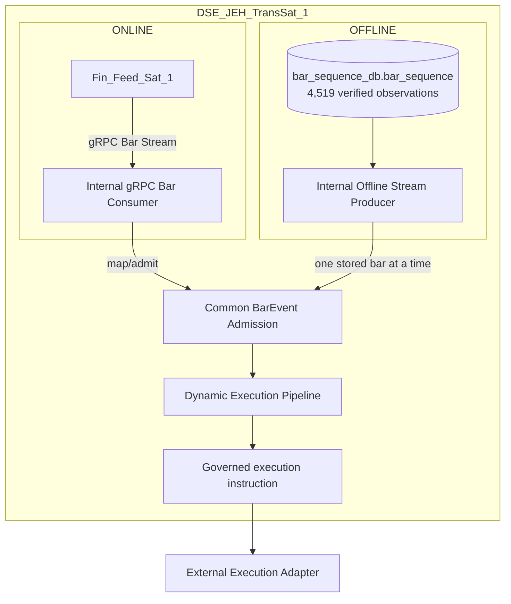
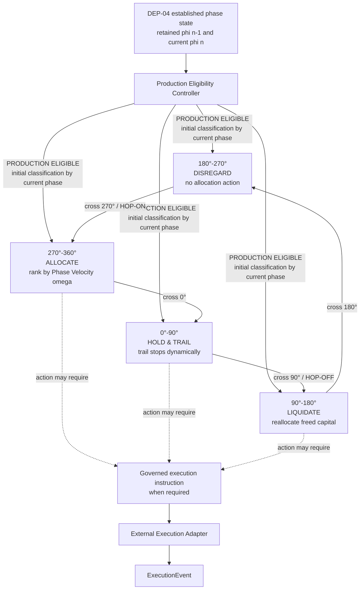
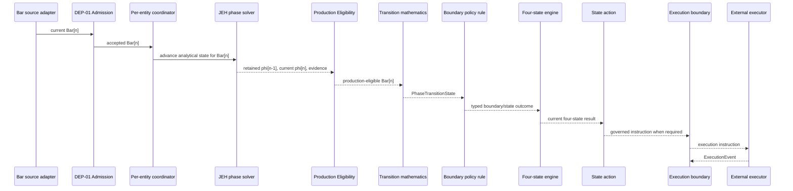
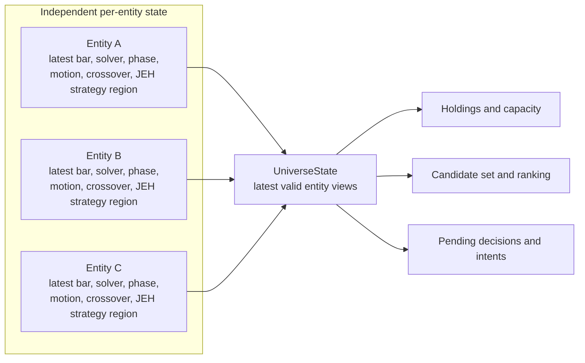
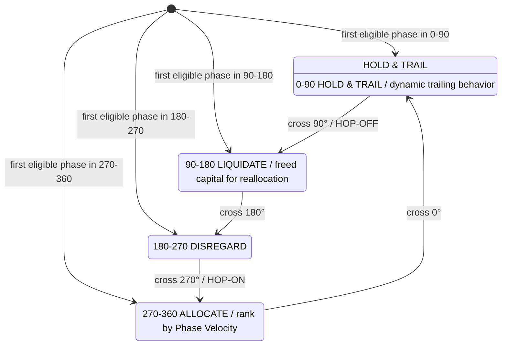
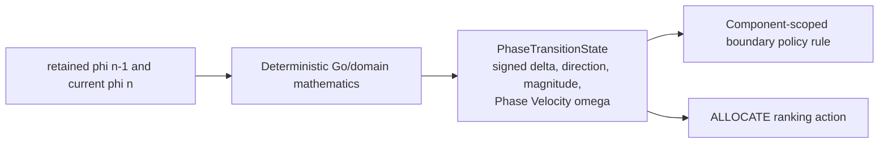
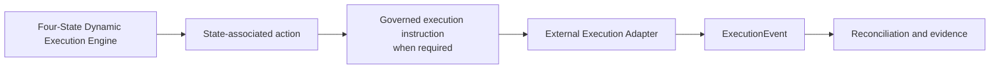
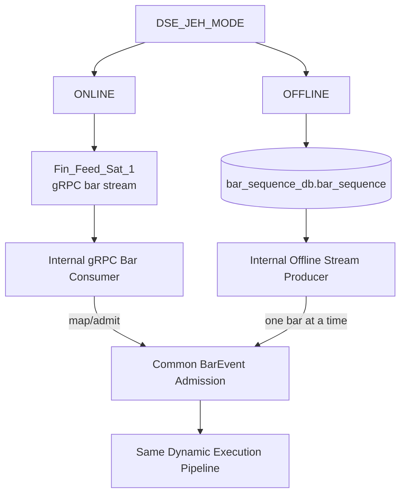
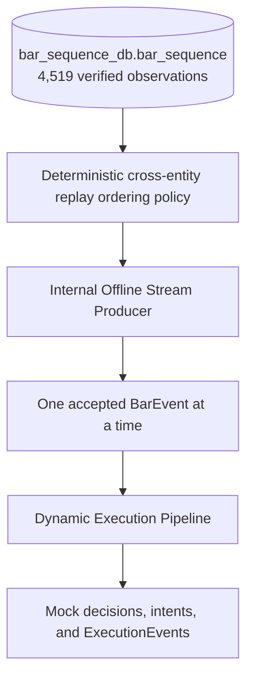
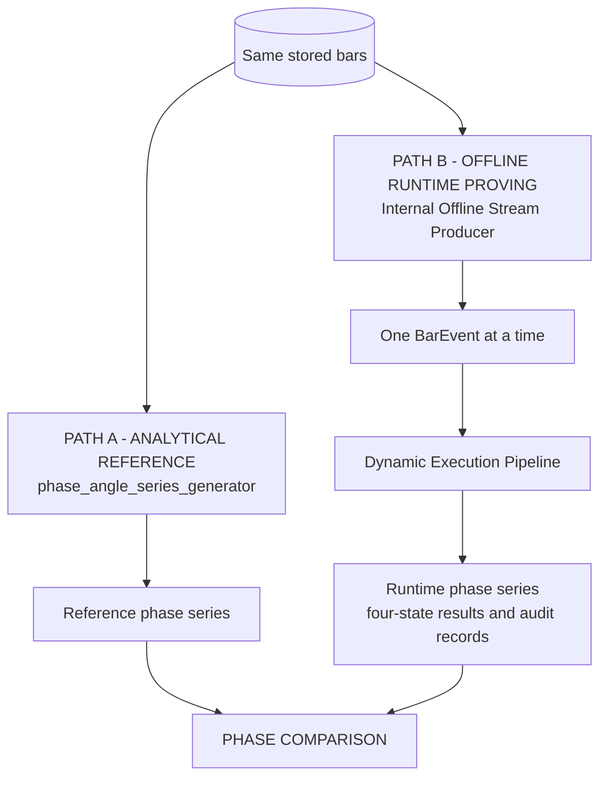

# DSE_JEH_TransSat_1 System Design V0.1

| Document control | Value |
| --- | --- |
| Filename | `DSE_JEH_TRANS_SAT_1_SYSTEM_DESIGN_V0_1_091226.md` |
| Date | 2026-09-13 |
| Version | V0.1 |
| Status | APPROVED |
| Implementation status | DEP-01 through DEP-04 implemented and validated; complete application architecture not implemented |
| Architectural identity | `DSE_JEH_TransSat_1` |
| Physical documentation location | `DSE_JEH/docs` |
| Relationship to `DSE_JEH_provers` | Experimental proving and regression apparatus; not a TransSat and not operational runtime code |

**Purpose.** Define the complete production application architecture for the first concrete runtime instance of the portable John Ehlers-Hilbert Decision Strategy Engine family. This in-place V0.1 architectural replacement governs the persistent runtime, the **Dynamic Execution Pipeline**, its single authoritative protobuf vocabulary, lifecycle, rule evaluation, evidence, telemetry, and execution boundary. It records the existing DEP-01 through DEP-04 implementation and the subsequently authorized and completed bounded `CalculatePhaseTransition` and `EvaluateDynamicExecution` implementations without authorizing broader state-action or execution work.

Normative terms `MUST`, `MUST NOT`, `SHOULD`, and `MAY` express design requirements. Strategy interpretations are hypotheses until separately validated; deterministic behavior alone does not establish scientific validity or efficacy.

---

## 1. Naming and Architectural Identity

Strategy runtime instances use `DSE_<StrategyFamily>_TransSat_<Instance>`.

- `DSE_JEH` is the reusable John Ehlers-Hilbert mathematical strategy family.
- `DSE_JEH_TransSat_1` is the first concrete designed runtime instance.
- `DSE_JEH_provers` is independent experimental apparatus, not a TransSat.
- The physical `DSE_JEH` folder is not part of runtime identity.

An instance may process one or many entities. Instance number does not imply one instance per entity. The reusable design MUST NOT embed an instance number, fixed entity population, Finance-only vocabulary, or repository path.

The JEH family concerns phase, angle, circular state, motion, boundary crossing, and strategy interpretation. It MUST remain portable across suitable domains, while each source domain retains authority over the meaning and validity of its source observations and actions. Mathematical portability does not imply semantic equivalence.

---

## 2. Executive Summary

`DSE_JEH_TransSat_1` V0.1 has exactly two bar-stream input modes: **ONLINE** and **OFFLINE**. The host selects one mode at startup through `DSE_JEH_MODE`. ONLINE acts as a gRPC client subscriber to the authoritative `Fin_FeedSat_1` stream. OFFLINE reads exactly one explicitly selected MongoDB `collection_run_id`, identified by `DSE_JEH_OFFLINE_COLLECTION_RUN_ID`, and emits its observations one at a time in the approved deterministic replay order. Absence of the OFFLINE selector is a startup configuration error; it never means all collection runs.

Both modes map their source observations to the same logical `BarEvent` and converge at the same admission boundary. Whether operating ONLINE or OFFLINE, `DSE_JEH_TransSat_1` receives an ordered stream of bar events through a common internal bar-event boundary. Source selection changes the producer and transport/input component, not JEH analytical or Dynamic Execution Pipeline behavior.

For every admitted `BarEvent`, `DSE_JEH_TransSat_1` advances that entity's ordered analytical state, runs the JEH/Ehlers phase solver, updates circular phase state from $\phi[n-1]$ to $\phi[n]$, and passes the result through an explicit Production Eligibility Controller. A blocked result terminates that bar's decision flow with audit evidence. An eligible result enters the authoritative four-state Dynamic Execution Engine, whose state and associated action may produce a governed execution instruction for an external execution adapter. Every received bar has an attributable terminal processing outcome; no bar silently disappears.

This event-driven loop is the **Dynamic Execution Pipeline**. Actual execution remains outside it in an external execution/action adapter, and only an `ExecutionEvent` can describe an execution outcome.

`PhaseEvidence` remains important upstream analytical evidence, but mathematical calculability is not production eligibility. A numerical phase value cannot by itself authorize a boundary event, strategy-state action, governed execution instruction, or order submission. The solver, eligibility control, deterministic algorithms, governed policy rules, four-state engine, and execution adapter are distinct responsibilities. No separate offline or backtest strategy implementation is permitted.

---

## 3. Scope, Authority, and Principles

### 3.1 In scope

- ONLINE and OFFLINE bar-stream inputs converging on source-independent `BarEvent` admission
- Startup mode selection through proposed `DSE_JEH_MODE=ONLINE|OFFLINE`
- Internal `Fin_Feed_Sat_1` gRPC bar consumption and internal offline stream production as transport/input boundaries
- Bounded per-entity ordered bar and phase-solver state
- In-runtime JEH/Ehlers phase calculation
- Circular phase and the four-state Dynamic Execution Engine
- Boundary-triggered policy events and state-associated ranking, trailing, reallocation, and disregard actions
- Governed execution instructions and mock `ExecutionEvent` proving boundaries
- Deterministic one-event-at-a-time replay and analytical phase equivalence
- Evidence lineage, versioning, failure isolation, recovery questions, and observational viewing

### 3.2 Governing principles

1. `BarEvent` is the primary V0.1 runtime input; `PhaseEvidence` is internal on that path.
2. Each accepted bar advances only its entity's trajectory.
3. The phase solver and strategy engine are separate internal responsibilities.
4. Initialization, phase observability, strategy eligibility, decision, intent, and execution are distinct.
5. Zero degrees is legitimate and MUST NOT be an initialization sentinel.
6. Strategy-region membership and boundary crossover events are distinct.
7. The universe view uses each entity's latest valid state; it is not a synchronized frame.
8. ONLINE and OFFLINE input MUST feed the same engine logic after common `BarEvent` admission.
9. Persistence, transport, viewing, and execution remain adapters around the mathematical and strategy core.
10. Solver, strategy, ranking, configuration, and evidence identities are versioned and attributable.
11. **State transitions are history-free:** each current transition is defined by its input state and resulting output state. Historical transition values do not alter an already-established state.

### 3.3 Complete Application and Proto Authority

`DSE_JEH_TransSat_1` SHALL be a complete, independent, persistent, startable, stoppable, observable, proto-governed Transformation Satellite application. It is not an experiment, proving utility, batch analysis program, `go run` harness, temporary Phase 1 executable, or offline-only replay tool. Proving and validation exercise this application; they do not define an alternate runtime.

The one authoritative DSE_JEH proto is `DSE_JEH/api/proto/dse_jeh/v1/DSE_JEH_TransSat_1.proto`. It SHALL remain one file and SHALL evolve to define the services, messages, enums, statuses, events, typed outcomes, evidence, and operational state required for all governed inbound, internal-processing, outbound, lifecycle, telemetry, and execution-boundary behavior. It is the satellite's authoritative operational vocabulary, not merely an external transport schema. Internal Go MUST NOT invent parallel financially meaningful enums, states, statuses, events, decisions, outcomes, or execution meanings that are absent from the proto. Ordinary locks, queues, recurrence buffers, and helper mechanics need not become proto concepts.

Proto-governed operational responsibility does not imply a network-distributed RPC boundary. Internal services MAY execute in-process, but their governed inputs, outcomes, state, and evidence remain described by the proto. No additional phase, motion, rule, telemetry, execution, or other DSE_JEH proto may be created.

The required development order is:

```text
System Design
  -> governed rule and outcome model
  -> authoritative proto
  -> generated Go types and service contracts
  -> Go implementation
  -> build
  -> governed start and stop of the built executable
  -> end-to-end validation
```

Before implementation of any governed process, its required services, messages, enums, statuses, typed outcomes, and evidence contracts MUST exist in the authoritative proto. Experimental Go-first behavior followed by contract retrofit is prohibited.

The target proto MUST comprehensively govern runtime lifecycle, mode, health, input source/subscription state, bar reception, admission and admission evidence, per-entity analytical identity/state, JEH evidence, production eligibility, the four-state Dynamic Execution Engine, `PhaseTransitionState`, boundary policy events, state-associated actions, the governed execution boundary, `ExecutionEvent`, rule identity/evaluation/outcomes/evidence, activity telemetry, diagnostics, degraded/error states, and governed outbound publication/producer behavior. Names MUST be fully descriptive where analytical, operational, or financial meaning is carried.

The bounded post-approval proto review replaced the active DEP-05-through-DEP-11 service decomposition with one cohesive `DynamicExecutionService`. Its separate `CalculatePhaseTransition` and `EvaluateDynamicExecution` RPCs preserve deterministic mathematics versus governed policy while representing the four states and their associated action boundary. Seven former services remain generated only as deprecated compatibility surfaces.

The authoritative proto now has 10 active services and 13 active RPCs. It includes `PhaseTransitionState`, typed boundary-policy outcomes, exactly four persistent `DynamicExecutionState` values, state-action outcomes, `GovernedExecutionInstruction`, the separate `ExecutionEvent`, current telemetry, and the Rule Registry. Including deprecated compatibility surfaces, generated code contains 17 services and 21 RPCs. This factual inventory does not claim that the corresponding hand-written Dynamic Execution or executor behavior is implemented.

## 4. Overall System Context



The mode distinction ends at `BarEvent`. The TransSat owns phase calculation and JEH strategy truth for admitted bars. The ONLINE consumer and OFFLINE producer own source access, mapping, and provenance. The execution adapter owns domain-specific action attempts and outcomes.

---

## 5. Four-State Dynamic Execution Engine

The **Dynamic Execution Engine** is the event-driven inner strategy engine of `DSE_JEH_TransSat_1`. Its atomic unit is the current production-eligible `Bar[n]`. Retained analytical phase state $\phi[n-1]$ is context used with current $\phi[n]$ to describe the current transition; it is not a separately executing event and need not come from a production-eligible predecessor bar.

The former DEP-05-through-DEP-11 conceptual decomposition is superseded. Dynamic Execution is authoritatively defined by exactly four strategy states, four boundary transitions, and the actions associated with those states. Supporting mathematics, rule evaluation, telemetry, and execution adapters do not create additional strategy states or numbered Dynamic Execution stages.



### 5.1 Design-local responsibilities

| ID | Logical responsibility |
| --- | --- |
| DEP-01 | Bar Event Admission: validate identity, required values, lineage, order, duplicate/conflict status, and admission disposition |
| DEP-02 | Per-Entity Ordered Analytical State: advance only the addressed entity and retain bounded sufficient solver state |
| DEP-03 | JEH / Ehlers Phase Update: calculate phase from the accepted ordered bar trajectory |
| DEP-04 | Circular Phase State: represent initialization, observability, validity, $\phi[n-1]$, and $\phi[n]$ without sentinels |
| Production Eligibility Controller | Governed event-flow gate after DEP-04 and before the four-state engine; map Rule #1 and continuity/phase validity to a typed outcome, emit audit evidence, and prevent blocked analytical results from reaching Dynamic Execution |
| Phase-transition mathematics | Deterministically derive the current `PhaseTransitionState`, including signed circular displacement and Phase Velocity where needed; this is supporting Go/domain mathematics, not a strategy state |
| Boundary policy | Evaluate the four governed crossings and produce typed policy outcomes: 270° `HOP-ON`, 0° enter `HOLD & TRAIL`, 90° `HOP-OFF`, and 180° enter `DISREGARD` |
| Four-state engine | Establish or maintain exactly one of `DISREGARD`, `ALLOCATE`, `HOLD & TRAIL`, or `LIQUIDATE` and invoke its associated action |
| State-associated actions | `ALLOCATE`: rank by Phase Velocity; `HOLD & TRAIL`: trail stops dynamically; `LIQUIDATE`: reallocate freed capital; `DISREGARD`: no allocation action |
| Execution boundary | Produce the governed execution instruction required by a state action without claiming execution; the external adapter owns attempts and outcomes |

DEP-01 through DEP-04 remain upstream analytical responsibilities. The responsibilities after Production Eligibility deliberately do not retain DEP-05-through-DEP-11 numbering. Their minimum proto and implementation structure must be derived later from this four-state design rather than from the superseded service decomposition.

---

## 6. One BarEvent Lifecycle



Every production-eligible `Bar[n]` represents a potential state transition from the entity's retained analytical state to the state established by the current bar. The retained state is causal context, not another Dynamic Execution event.

For one newly accepted `Bar[n]`:

1. Admit the event and establish deterministic identity and source lineage.
2. Advance only that entity's ordered bar/solver trajectory.
3. Run the JEH/Ehlers phase update.
4. Establish initialization or current observable phase $\phi[n]$.
5. Retain/use analytical phase state $\phi[n-1]$ as causal context where valid.
6. Apply Production Eligibility to current `Bar[n]`.
7. If eligible, derive the current `PhaseTransitionState` using deterministic Go/domain mathematics.
8. Evaluate the component-scoped boundary policy and produce a typed rule outcome.
9. Establish or maintain exactly one of the four authoritative strategy states.
10. Apply the associated state action: disregard, rank by Phase Velocity, trail dynamically, or reallocate freed capital.
11. Produce a governed execution instruction when the action requires external execution.
12. Leave action attempts to the external executor.
13. Record any executor outcome only as an `ExecutionEvent`.
14. Give `Bar[n]` an attributable terminal processing outcome.

Malformed input, missing prerequisites, or an unobservable phase MUST produce explicit non-action evidence and MUST NOT corrupt another entity.

---

## 7. BarEvent Semantics and Ordering

The fundamental event is **NEW ACCEPTED BAR FOR ENTITY S**. The JEH mathematics requires only finite `high` and `low` values to derive Median Price. Open, close, volume, timestamps, interval, and provider fields are not solver inputs. The common event still requires separately approved typed identity, ordering, provenance, and validation fields; those concerns MUST NOT be inferred from the mathematical minimum.

Repository evidence establishes that an OFFLINE observation is identified at least by `(collection_run_id, symbol, generator_sequence_no)`. Its `generator_sequence_no` is scoped to one symbol within one collection run. The stored source also preserves source timestamp text, received and persisted times, payload hash, provider message type, and duplicate/regression indicators. ONLINE currently exposes both `symbol` and `instrument_id`, uses `(symbol, interval_start)` for deduplication, and supplies no accepted sequence or resume cursor. The canonical DSE_JEH entity identity and cross-mode source-observation identity therefore remain human decisions.

Bars can arrive asynchronously:

```text
AAPL, AAPL, NVDA, SPY, AAPL, QQQ, NVDA
```

There is no required synchronized 30-symbol frame. `generator_sequence_no` represents accepted arrival order for one entity and is not a global market clock. The universe-level pipeline observes the latest valid state currently known for every entity.

Common admission requires explicit policy for duplicates, conflicts, gaps, missing bars, and out-of-order bars. No policy may silently rewrite accepted history or fabricate bars. These conditions can coexist and MUST NOT be collapsed into one mutually exclusive admission enum unless a precedence rule is approved. A terminal admission disposition and detected input conditions are distinct concepts. Rejected input MUST NOT mutate solver state.

The stored OFFLINE evidence cannot reconstruct a unique source-authentic cross-entity total arrival order: partition writers persist concurrently, `received_time` can tie, and `persisted_time` can be batch-assigned. OFFLINE replay therefore preserves authoritative entity-scoped order and requires an explicit versioned deterministic replay-order policy that distinguishes replay order from source order. Bars MUST NOT be globally sorted by `generator_sequence_no`.

The repository's current ONLINE candidate is `finfeedsat.v1.IngestionService.StreamBars(StreamBarsRequest) returns (stream Bar)`. Its implementation sends per-symbol chronological catch-up from process-local windows and then live accepted events, but does not provide a global order, accepted sequence, gap marker, resume cursor, or loss notification. Its bounded subscriber queue can discard the oldest queued bar for a slow consumer. Catch-up/live handoff can repeat a bar, and same-interval partial updates may be replaced or suppressed. These are observed interface semantics, not approval to bind DSE_JEH to that RPC. Ordering, finalized-bar meaning, duplicate/conflict handling, loss detection, reconnect/resumption, warm-up, backpressure, and lag policy MUST be approved or added upstream before ONLINE implementation. The Dynamic Execution Pipeline MUST NOT silently continue across an undetected missing accepted bar if doing so could alter solver state or evidence.

---

## 8. Phase Calculation Inside V0.1

The primary path is:

```text
BarEvent -> JEH phase solver -> PhaseEvidence -> Dynamic Execution Pipeline state logic
```

The JEH/Ehlers phase solver is inside the V0.1 TransSat runtime boundary. `PhaseEvidence` is therefore an internal analytical evidence/state concept on this path, not the sole primary external contract. The phase solver and strategy rules remain logically separate so solver equivalence, strategy behavior, version replacement, and failures can be tested independently.

The current approved-reference behavior uses ordered median price, $P[n]=(High[n]+Low[n])/2$, normalized observable phase in $[0,360)$, and the current solver/configuration's 63-observation lookback. This does not make median price or 63 observations a universal JEH law.

For the proven current configuration:

- sequence 1..63: `INITIALIZING`;
- sequence 64: first possible observable and production-eligible phase;
- all initializing bars are processed and advance analytical state;
- unavailable phase is represented explicitly, never as 0 degrees; and
- production eligibility permits a Phase Angle to enter future Dynamic Execution processing but does not itself authorize a strategy action.

No valid strategy action may be generated from unobservable phase.

### 8.1 Rule #1 - 63-Contiguous-Bar Eligibility

Each symbol owns an independent causal bar sequence and JEH state. A symbol's first 63 admitted contiguous valid bars update JEH state and emit `INITIALIZING` without an eligible Phase Angle. The next valid contiguous bar, sequence 64, updates JEH state and may emit `OBSERVABLE`; its Phase Angle is then eligible to enter Dynamic Execution processing. Every later admitted contiguous bar follows the same observable path.

Continuity is sequence integrity within the symbol's sequence scope, not elapsed wall-clock time. Irregular or long intervals between successive valid bars do not reset analytical history. Duplicate, conflicting, gapped, out-of-order, and invalid candidates retain their deterministic admission disposition and do not mutate JEH state. No missing bar is synthesized or interpolated. If causal sequence integrity is not restored, later candidates cannot advance the solver or regain production eligibility.

### 8.2 Production Eligibility Controller

Rule #1 is an explicit governed event-flow control rule, not merely warm-up prose or a `PhaseStatus` label. The Production Eligibility Controller consumes typed phase/admission evidence and an authorized context containing only phase status/presence, contiguous valid-bar count, sequence integrity, current-bar validity, and prior analytical-state validity. It maps its rule evaluation to a typed proto outcome such as initializing, production eligible, blocked continuity, blocked invalid phase, or error; exact declaration names require proto review.

The first 63 valid contiguous bars perform JEH mathematics, retain analytical state, and produce evidence, but the controller terminates their processing before the four-state Dynamic Execution Engine. Production Eligibility applies to current `Bar[n]`. The first eligible bar, normally bar 64, establishes only the initial four-state classification from its current phase and does not evaluate its retained predecessor as an actionable crossing. Retained $\phi[n-1]$ becomes transition context for later eligible bars; the predecessor bar does not become production eligible retroactively.

**Strict mathematical calculability is not production runtime eligibility.** Solver output, phase-value presence, `OBSERVABLE`, production eligibility, motion eligibility, crossover eligibility, and financial-action eligibility are separate governed concepts. No numerical phase value bypasses this controller.

---

## 9. Per-Entity and Universe State

### 9.1 Per-entity hot state

Each entity conceptually maintains:

- entity identity and source lineage;
- ordered bar and bounded sufficient solver state;
- initialization state and current bar identity;
- previous accepted analytical state;
- explicit $\phi[n-1]$ and $\phi[n]$ presence;
- phase observability and validity;
- current four-state strategy state;
- current `PhaseTransitionState` and most recent boundary policy event;
- candidate and holding status where applicable; and
- solver, strategy, ranking, and configuration version identity.

Hot state MUST NOT require unbounded bar history when bounded sufficient solver state can preserve equivalent behavior. Durable evidence may retain history outside hot state.

### 9.2 Universe state

Universe state is distinct from per-entity analytical state and includes current holdings, `ALLOCATE` candidates, `HOLD & TRAIL` entities, `LIQUIDATE` entities, `DISREGARD` entities, initializing/unavailable entities, candidate ranking state, execution capacity/capital state where applicable, and pending decisions/intents.



Universe state is not a claim that all entities were updated simultaneously. Each entity view needs freshness/staleness evidence. Snapshot semantics, stale-state eligibility, and stale candidate expiry remain open.

---

## 10. Authoritative Four-State Hop-On/Hop-Off Engine

The supplied Hop-On/Hop-Off diagram is the authoritative Dynamic Execution Engine. It defines exactly four persistent strategy states and their associated actions:

| Half-open phase interval | Canonical strategy region/action | Current strategy interpretation |
| --- | --- | --- |
| $0 \le \phi < 90$ | `HOLD & TRAIL` | Hold the active long position; maintain $P_{peak}$ and the governed $P_{stop}=P_{peak}(1-R)$ safety boundary |
| $90 \le \phi < 180$ | `LIQUIDATE` | Request 100% liquidation of the active position; apply position/capital changes only after confirmed `ExecutionEvent` |
| $180 \le \phi < 270$ | `DISREGARD` | Disregard; perform no allocation action |
| $270 \le \phi < 360$ | `ALLOCATE` | Size whole shares from per-symbol available capital and governed `AllocationPct`; preserve $\omega$ for later analysis |



The wheel is one full circular phase space, interpreted clockwise from top as `HOLD & TRAIL`, `LIQUIDATE`, `DISREGARD`, then `ALLOCATE`. The four transitions have fixed strategy-policy meanings: cross 270° to fire `HOP-ON` and enter `ALLOCATE`; cross 0° to enter `HOLD & TRAIL`; cross 90° to fire `HOP-OFF` and enter `LIQUIDATE`; and cross 180° to enter `DISREGARD`. These meanings are not open policy questions. Terms such as trough, peak, accelerating upward, or rolling over are JEH strategy interpretations, not universal scientific facts unless independently validated.

**Strategy-state membership is not a boundary event.** `HOP-ON` and `HOP-OFF` are typed rule-policy firing events, never persistent states. Five successive bars in `ALLOCATE` represent persistent membership, not five `HOP-ON` events. Operational state/value/result objects describe current engine behavior; separate telemetry, audit, and trace records establish attribution.

No additional HOP terminology is defined. Deterministic Go/domain code establishes factual phase and crossing values. Component-scoped `expr` rules evaluate the four governed boundary policies and map them to typed outcomes and state/action changes. Boundary derivation traverses only the signed shortest directed arc in `PhaseTransitionState`, excludes the start phase, includes the end phase, and emits each encountered authoritative boundary exactly once in strict directed encounter order. Wrap through 0 degrees is treated identically to 90, 180, and 270 degrees. Reverse crossings are valid facts but do not fire the forward state-wheel policy. A later-bar recross is a new fact and is not suppressed.

---

## 11. Phase Transition State and Phase Velocity ($\omega$)



`PhaseTransitionState` is the operational value describing the transition caused by current production-eligible `Bar[n]`. It contains the current signed circular displacement, direction, magnitude, Phase Velocity, validity, and causal references to retained $\phi[n-1]$ and current $\phi[n]$. It is not experimental proof. Separate telemetry/audit/trace records may record it for attribution and analysis.

For V1, both retained and current phase are normalized to the half-open interval $[0°,360°)$ before displacement is calculated. Thus 360 degrees is equivalent to 0 degrees. An implementation may use equivalent modulo arithmetic:

$$
\phi_{normalized} = ((\phi \bmod 360) + 360) \bmod 360
$$

Normalization is part of deterministic transition mathematics. It does not create an Edge Case Handler or any additional architectural stage.

The V1 fundamental quantities are

$$
\Delta\phi[n] = \operatorname{circular\_delta}(\phi[n-1],\phi[n]) \in (-180°,180°]
$$

$$
\omega[n] = \Delta\phi[n]
$$

where $\Delta Bar=1$ and $\omega$ is measured in **degrees per bar**. The displacement is the signed shortest circular displacement: 350 degrees to 10 degrees is +20 degrees, and 10 degrees to 350 degrees is -20 degrees. When the two shortest displacements are the exact +180/-180-degree tie, V1 canonically returns +180 degrees. The tie is deterministic mathematics, not a strategy-policy event, and MUST NOT consult $\phi[n-2]$, prior direction, prior $\omega$, or any other historical value.

`PhaseTransitionState.signed_circular_displacement_degrees` is $\Delta\phi[n]$; magnitude is $|\Delta\phi[n]|$; Phase Velocity is $\Delta\phi[n]$ degrees per bar; and direction is derived solely from its sign, with zero displacement represented as `STATIONARY`. Non-finite phase input is invalid. A small implementation epsilon MAY be used only for floating-point equivalence and MUST NOT move or widen the 0-, 90-, 180-, or 270-degree strategy boundaries.

V1 does not use wall-clock velocity, hysteresis, Schmitt-trigger deadbands, degree buffers, N-bar confirmation, anti-jitter history, smoothing, acceleration, higher-order motion, chaotic-volatility rules, trajectory reconstruction, or additional eligibility bars. Because $\Delta\phi \in (-180°,180°]$ and $\Delta Bar=1$, V1 does not add policy for velocity outside that representable range.

Phase Velocity is supporting mathematics used by the `ALLOCATE` state's ranking action. It is not a strategy state and does not create a separate conceptual Dynamic Execution stage. Velocity MUST NOT be called acceleration.

### 11.1 History-Free State Transitions

A state transition is defined by its input state and resulting output state. Historical state-transition values MUST NOT influence, redefine, smooth, accelerate, or reconstruct the current transition or an already-established state. The engine advances forward one eligible event at a time.

Derived values may describe the current transition and may be retained for telemetry, diagnostics, auditability, or analysis. They do not become historical inputs that alter current strategy state. The design prohibits historical trajectory inference, multi-transition lookback, transition smoothing, acceleration as a state determinant, and downstream reconstruction of an earlier state.

History creates the retained analytical input state upstream; transition calculation does not re-consult history after that state is established. After classification-only first entry, each later production-eligible `Bar[n]` owns the calculation from retained $\phi[n-1]$ to current $\phi[n]$. Bar 64 establishes initial state only; bar 65 is the first possible actionable transition when bar 64 is the first eligible observation.

### 11.2 Deterministic Mathematics and Governed Policy

Go/domain code computes `PhaseTransitionState`, Phase Velocity, and factual boundary-crossing inputs. `expr` MUST NOT implement circular mathematics or crossover algorithms. Component-scoped `expr` rules evaluate the authoritative boundary policies and produce typed outcomes that govern the resulting state/action change.

For every valid transition, deterministic boundary derivation traverses from normalized $\phi[n-1]$ along the signed displacement to normalized $\phi[n]$. The traversal interval is start-exclusive and end-inclusive. It emits every encountered boundary from the fixed ordered set $\{0°,90°,180°,270°\}$ exactly once, preserving forward or reverse direction and strict directed encounter order when one transition crosses multiple boundaries. `STATIONARY` emits no facts. Starting on a boundary does not re-emit it; ending on a boundary emits it once. A reverse crossing remains observable but produces no forward policy firing, and a recross on a later bar is a distinct factual crossing.

The forward governed meanings remain fixed: 270 degrees produces `HOP_ON_ALLOCATE` and `ALLOCATE`; 0 degrees produces `ENTER_HOLD_AND_TRAIL` and `HOLD_AND_TRAIL`; 90 degrees produces `HOP_OFF_LIQUIDATE` and `LIQUIDATE`; and 180 degrees produces `ENTER_DISREGARD` and `DISREGARD`. When no forward fact fires, `NO_TRANSITION` preserves the current strategy state. Multiple forward facts are evaluated in encounter order rather than collapsed to final quadrant membership. Boundary derivation introduces no architectural service or processing stage and uses no hysteresis, deadband, degree buffer, smoothing, N-bar confirmation, acceleration, historical direction inference, or cross-bar duplicate suppression.

### 11.3 Stable Policy and Future Adaptive Geometry

DSE_JEH adaptiveness refines governed policy geometry and response parameters while preserving deterministic phase-transition and boundary facts. It therefore adapts an existing policy rather than generating a new policy for each observation or run.

- **Deterministic model:** establishes what happened: phase, signed transition, direction, Phase Velocity, and ordered boundary facts.
- **Stable governed policy:** establishes what a forward boundary event means.
- **Future adaptive policy geometry:** may later tune governed response through controlled, versioned coefficients.
- **Execution:** determines what governed action or instruction is ultimately issued.

The authoritative 0-, 90-, 180-, and 270-degree phase boundaries remain deterministic reference facts. Future adaptive coefficients MUST NOT falsify whether a boundary crossing occurred. Coefficient names, formulas, ranges, learning algorithms, and persistence are not approved or implemented by this design change.

---

## 12. State-Associated Actions

The actions shown by the authoritative diagram are part of the four-state engine. They are not additional strategy states or numbered pipeline stages.

The minimum V1 action model exists to complete the pre-paper-trading **Dynamic Pipeline Execution Run**. Production Eligibility remains an upstream responsibility and MUST NOT be re-evaluated inside `ALLOCATE` or another state action. The immediate forward path is:

```text
Production Eligible Bar[n]
  -> CalculatePhaseTransition
  -> ordered boundary facts
  -> EvaluateDynamicExecution
  -> four-state outcome
  -> state-associated action / Emit
  -> capital calculation
  -> GovernedExecutionInstruction when applicable
  -> MockExecutor
  -> ExecutionEvent
  -> Dynamic Pipeline Execution Run results
  -> later Alpaca Paper execution
```

The initial run evaluates each symbol independently. `StartingCapital` is a configurable governed run parameter with an initial baseline of $100,000 per independently evaluated symbol. It is not one shared portfolio divided among symbols. `AllocationPct` is also a configurable governed run parameter; its initial baseline is `1.0`, permitting allocation of up to 100% of the capital available to that symbol. This baseline is not a permanent portfolio policy.

### 12.1 ALLOCATE V1 Mathematics

Entry into `ALLOCATE` remains caused only by the governed forward 270-degree crossing: `HOP_ON_ALLOCATE -> ALLOCATE`. There is no 272-degree threshold, buffer, or hysteresis.

Let $C_{available}$ be capital available immediately before entry, $A$ be `AllocationPct`, $P_{entry}$ be the reference entry price, and $Qty$ be whole-share quantity. Then:

$$
CapitalToAllocate = C_{available} A
$$

$$
Qty = \left\lfloor \frac{CapitalToAllocate}{P_{entry}} \right\rfloor
$$

$$
CashRemaining = C_{available} - (Qty \cdot P_{entry})
$$

For the initial baseline, $A=1.0$. The action conceptually produces a governed BUY `GovernedExecutionInstruction`; the strategy mathematics is not bound directly to Alpaca. Phase Velocity $\omega$ remains in run data for later analysis, but V1 defines no strength-weighted, omega-dependent, relative-symbol, or portfolio allocation formula.

### 12.2 HOLD_AND_TRAIL V1 Mathematics and HOLD Emit

`HOLD_AND_TRAIL` holds an active long position while maintaining a high-water price and one governed risk-based trailing safety boundary. Normal entry remains the governed forward crossing of 0 degrees. While this state remains active, the position is held unless the trailing safety condition fires or the normal forward 90-degree `HOP_OFF_LIQUIDATE` boundary causes `LIQUIDATE`.

Maintain the high-water mark price:

$$
P_{peak}[n] = \max(P_{peak}[n-1], Price[n])
$$

V1 has exactly one trailing-risk parameter, governed `Risk R`, constrained to $R \in [0,1]$. $R$ is the permitted percentage price retreat from the high-water mark. It is not itself a high-water or low-water mark. The trailing safety price is:

$$
P_{stop}[n] = P_{peak}[n](1-R)
$$

The decision is:

```text
if Price[n] > P_stop[n]:
    HOLD

if Price[n] <= P_stop[n]:
    SAFETY LIQUIDATION
```

At $R=0.0$, no retreat from $P_{peak}$ is permitted, $P_{stop}=P_{peak}$, and this is the lowest-risk endpoint. At $R=1.0$, a 100% retreat is permitted, $P_{stop}=0$ for a positive-priced instrument, the trailing safety mechanism is effectively non-binding, and the normal phase-driven `HOP_OFF` may determine exit. V1 does not introduce `BaseStopPct`, `TighteningFactor`, `MinStopPct`, or another trailing coefficient.

`HOLD` is a meaningful observable and persistable strategy action/Emit while the position remains active. It creates no broker transaction and no BUY or SELL instruction. `HOLD_AND_TRAIL` remains the persistent Dynamic Execution strategy state; `HOLD` is not an additional state.

### 12.3 LIQUIDATE V1 Mathematics and Causality

The two governed liquidation causes remain distinct:

- normal phase exit: forward crossing of 90 degrees -> `HOP_OFF_LIQUIDATE` -> `LIQUIDATE`;
- safety exit: $Price[n] \le P_{stop}[n]$ -> safety liquidation.

A safety liquidation MUST NOT be labeled `HOP_OFF`; `HOP_OFF` means specifically the forward 90-degree phase crossing. Both causes may produce a governed SELL instruction, but runtime data MUST preserve the cause. No reverse-direction liquidation policy is introduced.

For either cause, V1 requests 100% liquidation of the active position:

$$
Qty_{sell} = Qty_{active}
$$

The instruction expresses intent. The position MUST NOT be marked flat, and capital MUST NOT be finalized, until the `ExecutionEvent` confirms the exit. At confirmed exit:

$$
EndingCapital = CashRemaining + (Qty_{active} \cdot P_{exit})
$$

$$
RealizedPnL = (P_{exit} - P_{entry}) \cdot Qty_{active}
$$

Equivalently, when residual cash is carried consistently, $RealizedPnL = EndingCapital - CapitalAtEntry$. The resulting available capital may fund a subsequent allocation cycle in the same pipeline run.

While the position is active, mark-to-market capital is observational derived data only:

$$
CurrentCapital[n] = CashRemaining + (Qty_{active} \cdot Price[n])
$$

It creates neither a state transition nor an execution instruction.

### 12.4 Dynamic Pipeline Execution Run Identity and Comparison

For the bounded 2026-09-14 endpoint comparison, the runtime required the explicitly supplied `collection_run_id = 20260911T161623Z-1`, verified that exact run at startup, loaded it once, and froze it as the source for each complete run. It did not query for or substitute a newer source during that bounded objective. A distinct `pipeline_run_id` identified each Dynamic Pipeline Execution Run. Top-level `run_type` classified the two historical persistence sets as `RUN_A` and `RUN_B`; it was run metadata, not an architectural state or stage, and did not replace either run identifier or independently persisted Risk R.

The general runtime rule is broader than that historical comparison. `pipeline_run_id` uniquely identifies one actual pipeline execution; `run_type` is a required human/governance classification matching `^[A-Z0-9][A-Z0-9_-]*$`; Risk R is an independent governed parameter in $[0,1]$; and `collection_run_id` identifies source data. None of these fields encodes or determines another. Repeated executions may use the same or different run classifications, Risk R values, and source collections, but each execution uses a new `pipeline_run_id`. New valid run labels require no code, protobuf, validator, or rebuild-time addition.

Directly comparable repeated runs use the same frozen `collection_run_id` and a different `pipeline_run_id`:

| Run | run_type | StartingCapital | AllocationPct | Risk R | Purpose |
| --- | --- | --- | --- | --- | --- |
| A | `RUN_A` | $100,000 per independently evaluated symbol | 1.0 | 0.0 | Observe the lowest-risk endpoint |
| B | `RUN_B` | $100,000 per independently evaluated symbol | 1.0 | 1.0 | Observe the effectively non-binding trailing endpoint |
| C, if warranted after review | $100,000 per independently evaluated symbol | 1.0 | 0.20 example | Observe an intermediate governed setting; not an optimized or recommended value |

For each independently evaluated symbol:

$$
ReturnPct = \frac{EndingCapital-StartingCapital}{StartingCapital} \cdot 100
$$

The run comparison includes at minimum `StartingCapital`, `EndingCapital`, `RealizedPnL`, `ReturnPct`, HOP_ON/ALLOCATE count, HOLD count, normal HOP_OFF liquidation count, and safety-liquidation count. Phase, Phase Velocity $\omega$, ordered boundary facts, state outcomes, prices, and causal identifiers remain available for later analysis.

### 12.5 MongoDB Stage / Emit Traceability

The existing MongoDB collection `h_h_stage_emit_values` persists governed values produced through the Hop-On/Hop-Off Dynamic Execution path. Its validator and indexes were established separately without deleting source or trace data. One collection uses a `stage` discriminator; it does not create a collection per stage, and persistence classifications do not create new architectural pipeline stages.

Each persisted record carries the common causal envelope at minimum:

```text
pipeline_run_id
run_type
collection_run_id
symbol
sequence_no
stage
stage_order
event_time
emit_type
```

Structured input/output sections may carry stage-specific data. Capital-related derived values may be carried in `capital_allocation`; this field name remains fixed for this documentation update. Every persisted stage/Emit record carries both run identifiers.

The persistence objective is forward causal reconstruction for a symbol and `Bar[n]`:

```text
Bar[n]
  -> admission
  -> analytical state
  -> JEH phase
  -> production eligibility
  -> PhaseTransitionState
  -> ordered boundary facts
  -> Dynamic Execution state/outcome
  -> state-associated action / Emit
  -> GovernedExecutionInstruction when applicable
  -> ExecutionEvent
  -> capital result
```

Persistence supports runtime traceability, analysis, and validation; the mathematics does not depend on it. No backward traversal of historical/raw state is introduced.

### 12.6 Capital Reservoir

The runtime has one common Capital Reservoir and one bidirectional conceptual pipe for each of the 30 governed symbols. The opening reservoir is $3,000,000, calculated as 30 symbols times the governed $100,000 per-symbol allocation ceiling. The ceiling remains a sizing limit; it is not 30 isolated cash accounts.

Capital moves only after a confirmed `ExecutionEvent`. From the reservoir perspective, confirmed BUY/ALLOCATE fills produce negative `OUTFLOW` values with cause `HOP_ON`; confirmed liquidation fills produce positive `INFLOW` values with cause `HOP_OFF` or the distinct `SAFETY_LIQUIDATION`. HOLD and unconfirmed strategy/instruction events produce no reservoir event.

The pre-existing `capital_reservoir_events` collection is the compact authoritative replay ledger and does not replace `h_h_stage_emit_values`. Execution-derived events retain `stage_emit_value_id` as a BSON ObjectId referencing the originating `h_h_stage_emit_values._id`. A monotonic `event_sequence`, unique within `pipeline_run_id`, controls replay order. The same typed event is exposed through the existing runtime evidence stream.

`RUN_START` establishes the opening reservoir. `RUN_END` records reservoir cash, deployed marked capital, total marked capital, realized and unrealized P&L, total P&L, and active-position count. It marks open positions at their latest observed prices and does not synthesize HOP_OFF, safety liquidation, or another SELL at source completion.

### 12.7 Explicitly Deferred Policy

V1 does not define portfolio aggregation, spreads, diversification, cross-symbol capital balancing or capacity management, candidate-set optimization, portfolio rebalancing, strength-weighted or relative-symbol allocation, weak-position suppression, omega-dependent sizing, adaptive risk selection, entity/regime-specific risk coefficients, or optimized risk percentages. These remain deferred until Dynamic Pipeline Execution Runs provide observed evidence. This deferral preserves the principle that future adaptiveness may refine governed policy geometry and response parameters without changing deterministic `PhaseTransitionState` or boundary facts.

---

## 13. Governed External Execution Boundary



The four-state engine determines strategy state and action. It does not place orders or claim outcomes. When external action is required, it produces a governed execution instruction with deterministic identity, target, requested action, causal state/action, strategy/configuration lineage, idempotency/correlation identity, and validity semantics. The exact contract remains for later design-derived proto review. `ExecutionEvent` separately records acceptance, rejection, action/fill, cancellation, failure, or reconciliation.

The first proving executor is **MOCK / SIMULATED EXECUTION ONLY**: no broker, live order, or Alpaca submission. The proof chain is `bar event -> phase -> PhaseTransitionState -> boundary policy -> four-state result -> associated action -> governed execution instruction when required -> mock ExecutionEvent`. No external call may hold a strategy-state lock.

The execution boundary remains a proto-governed Executor interface with a `MockExecutor` as the first implementation and a future separately approved `AlpacaPaperExecutor` as a substitutable adapter. Both consume the same governed execution-instruction meaning and report the same `ExecutionEvent` meaning. Execution adapters contain no strategy logic. Neither the rule engine nor the JEH analytical engine imports an executor or Alpaca SDK. Live-money endpoints and orders are prohibited.

### 13.1 Governed Outcome-Based Rule Architecture

All rule-governed components use one common application facility:

```text
typed input / prior evidence
  -> component context builder
  -> component-scoped authorized dynamic variables
  -> Rule Registry rule_id + rule_version
  -> precompiled github.com/antonmedv/expr program
  -> raw implementation evaluation result
  -> rule-specific typed proto outcome mapper
  -> governed Go state transition or routing
  -> RuleEvaluationEvidence
  -> next component or attributable termination
```

`github.com/antonmedv/expr` is mandatory as the condition evaluator for governed dynamic rules. Expressions MUST normally compile once at application startup or governed rule-set load/reload, never once per bar. Compilation failure is a visible governed configuration/runtime failure and cannot silently disable a rule. Runtime hot reload and arbitrary in-market rule modification are not authorized by this design.

`expr` is not the rule architecture and is not authority: proto is the authoritative operational vocabulary; Go owns orchestration, state, and approved deterministic algorithms; and a typed proto outcome owns governed routing meaning. Raw `true` or `false` has no application-wide financial meaning. Each identified/versioned rule maps its raw result to its own typed success, block, no-action, not-applicable, or error outcome.

An expression MUST NOT perform circular mathematics, detect crossings algorithmically, submit an order, call Alpaca, mutate broker/cash/holding authority, claim execution, or create an `ExecutionEvent`. The rule engine and JEH engine have no Alpaca dependency. The execution chain remains `deterministic values -> scoped rule -> typed outcome -> four-state state/action change -> governed execution instruction when required -> Executor -> ExecutionEvent`.

### 13.2 Rule Object, Registry, and Evidence

The common Governed Rule Engine contains a Rule Registry, expr compiler, compiled-program cache, evaluator, typed-outcome mapper, and rule-evidence producer. It MUST NOT be reimplemented independently in each DEP component. Each logical rule identifies at least its rule ID, version, name, purpose, owning component, expression, authorized variables, expected raw result type, typed success and failure/block outcomes, routing behavior, permitted state mutation, evidence requirement, and rule-set/configuration identity. Anonymous expression strings scattered through Go are prohibited.

Every evaluation emits `RuleEvaluationEvidence` sufficient to establish rule ID/version, owning component, causal input identity, evaluation sequence, evaluation status, typed outcome, reason/diagnostic information, and rule-set/configuration identity. A blocked, not-applicable, no-action, or error result is still an attributable outcome. Financially meaningful outcomes MUST NOT be generic strings.

Approved rules and approved variables/thresholds may evolve without rewriting pipeline orchestration, but every activated rule set has identity/version, approval, validation, and historical attribution. Unsafe or unknown changes fail closed.

### 13.3 Component-Scoped Dynamic Variables

There is no unrestricted global pipeline rule context. Each rule-governed component exposes only its approved variables:

| Component | Authorized context boundary | Prohibited collapse / unresolved authority |
| --- | --- | --- |
| Production Eligibility Controller | phase status/value presence, contiguous valid-bar count, sequence integrity, current-bar validity, prior analytical-state validity | No cash, broker, fill, or quantity data |
| Phase-transition calculation | current production eligibility, retained $\phi[n-1]$, current $\phi[n]$, sequence integrity | Deterministic Go/domain mathematics produces `PhaseTransitionState`; `expr` does not calculate it |
| Boundary policy | current strategy state, current `PhaseTransitionState`, deterministic boundary facts | Typed outcomes implement the four authoritative boundary meanings; `HOP_ON`/`HOP_OFF` are events, never states |
| `ALLOCATE` action | current `ALLOCATE` state, available capital, `AllocationPct`, reference price, and current Phase Velocity value | V1 whole-share sizing is deterministic; Production Eligibility is not re-evaluated; ranking and cross-symbol allocation remain deferred |
| `HOLD & TRAIL` action | active position, current price, prior $P_{peak}$, and governed `Risk R` | V1 updates $P_{peak}$ and $P_{stop}$, emits `HOLD`, or causes a distinctly labeled safety liquidation |
| `LIQUIDATE` action | active quantity, entry/exit price, residual cash, and causal liquidation outcome | V1 requests the full active quantity; confirmed `ExecutionEvent` governs position and capital updates |
| Execution instruction eligibility | typed four-state result/action and pending execution/outcome facts | Instruction is a request, not execution evidence; `ExecutionEvent` is the authoritative execution outcome |

DEP-03 JEH/Hilbert recurrence, approved circular delta and velocity, ranking calculation, quantity sizing, and deterministic identity generation remain deterministic Go algorithms where appropriate. Rules govern conditions, eligibility, policy, routing, and outcome selection; they do not replace mathematics.

---

## 14. Online and Offline Stream Modes



The proposed startup environment variable accepts exactly:

```text
DSE_JEH_MODE=ONLINE
DSE_JEH_MODE=OFFLINE
```

The independently built executable is started through governed PowerShell, currently `scripts/Start-DSEJEHTransSat1.ps1`, and MUST NOT use `go run`. The complete lifecycle requires an approved `scripts/Stop-DSEJEHTransSat1.ps1` or equivalent explicit governed process-stop mechanism. Startup validates configuration before dependencies start; shutdown stops intake, drains or explicitly cancels accepted work, flushes evidence, and publishes final lifecycle state.

Existing configuration inspected on 2026-09-13 includes `DSE_JEH_MODE`, canonical `DSE_JEH_OFFLINE_COLLECTION_RUN_ID` (with a temporary legacy alias), `DSE_JEH_GRPC_ADDRESS`, `DSE_JEH_SYMBOLS`, `DSE_JEH_FINALIZED_ONLY`, `DSE_JEH_MAX_BARS`, `DSE_JEH_OUTPUT`, `DSE_JEH_REFERENCE_CSV`, and `DSE_JEH_COMPARISON_REPORT`, plus Mongo adapter settings. The target design requires contract review and normalization of endpoint, execution-mode, log-level, evidence-output, shutdown, and runtime-identity configuration; no variable listed as a target example is approved merely by appearing here.

The host/startup layer reads `DSE_JEH_MODE` and selects one producer/input component. The Dynamic Execution Pipeline MUST NOT read this variable or branch on source mode.

**ONLINE** maps bars from the `Fin_Feed_Sat_1` gRPC bar stream through an internal gRPC consumer into the common `BarEvent` boundary. The transport is not JEH mathematics, and the pipeline MUST NOT depend on Fin protobuf types or gRPC semantics. This design neither invents nor freezes a Fin service or protobuf contract.

The inspected candidate binding is `finfeedsat.v1.IngestionService.StreamBars`; the request is `finfeedsat.v1.StreamBarsRequest` and the server-streamed response is `finfeedsat.v1.Bar`. The DSE_JEH adapter would require adapter-local identity mapping, sequencing/continuity validation, and duplicate handling. The candidate is not approved for binding because its current contract cannot expose queue loss, guarantee finalized bars, or resume from an acknowledged position.

**OFFLINE** uses an internal stream producer to read exactly one explicitly selected `collection_run_id` from `bar_sequence_db.bar_sequence` in an approved deterministic order and emit one stored observation at a time into the common `BarEvent` boundary. The current validation selector is `20260911T161623Z-1`. OFFLINE remains a stream, not a batch strategy processor. The producer MUST NOT calculate phase, `PhaseTransitionState`, boundary policy outcomes, four-state strategy state/actions, or governed execution instructions, and MUST NOT invoke `phase_angle_series_generator`.

For equivalent admitted bars and entity-causal ordering under the same initial state, versions, rule set, and configuration, both modes MUST produce equivalent admission-through-execution records except for approved source provenance and transport timing. This is the ONLINE/OFFLINE convergence invariant. Both modes enter the same `BarEvent` boundary and execute identical eligibility, transition mathematics, boundary policy, four-state state/action, governed execution-boundary, and adapter-routing logic. A separate offline or backtest strategy implementation is prohibited. Optional future OFFLINE pacing is a producer/runtime concern and MUST NOT change bar interpretation or engine behavior.

---

## 15. The 4,519-Bar Offline Proving Stream

The initial OFFLINE proving source is the existing `bar_sequence` collection in `bar_sequence_db`. On 2026-09-12, a read-only local `countDocuments({})` query independently verified **4,519 bar observations**. This is a proving dataset size, not an architectural constant or the Dynamic Execution Pipeline input contract.



The OFFLINE producer must preserve entity-scoped `generator_sequence_no`. Available timestamp and persistence fields do not reconstruct a unique source-authentic total accepted-arrival order, so the chosen deterministic replay policy must be explicit, deterministic, versioned, and carried in replay/evidence configuration. It is incorrect to treat equal sequence numbers as frames or sort all entities globally by `generator_sequence_no`.

Bars 1 through 63 for an entity still enter the pipeline and advance solver state. They are not discarded merely because phase is initializing.

---

## 16. Independent Analytical Reference and Phase Equivalence

`Bar_Sequence_Lab/phase_angle_series_generator` is an **independent analytical reference / batch phase generator**. It calculates phase-angle series from collected sequences. It is not the Dynamic Execution Pipeline, is not moved or modified by this design, is not invoked as a batch application by the runtime, and its application structure is not copied into the runtime.



For matching observations, runtime phase behavior should equal the approved reference behavior by entity/symbol, collection run or equivalent source lineage, `generator_sequence_no`, solver identity/version, and input-series definition. The current reference test uses absolute tolerance `1e-9`; that is repository evidence, not an approved DSE_JEH production tolerance. Exact DSE_JEH numeric tolerance/precision remains open. Required mathematical equivalence does not imply code reuse.

The existing phase CSV and `DSE_JEH_provers` remain regression/reference evidence for `precomputed PhaseEvidence -> zone/transition` behavior. They are not the runtime input architecture and are not discarded or promoted as the runtime.

---

## 17. Determinism, Mode Equivalence, and Evidence Identity

For the same admitted bar observations and order, ONLINE and OFFLINE MUST produce equivalent results given the same solver version, strategy version, configuration, ranking policy, and initial state:

- phase evidence and `PhaseTransitionState` values;
- typed boundary-policy outcomes and four-state transitions;
- state-associated action results and governed execution instructions; and
- mock `ExecutionEvent` records.

Operational and audit identities must include enough typed and versioned information to distinguish entity, source observation, source mode/provenance, entity order, replay/order policy where applicable, solver, four-state strategy policy, transition-mathematics policy, action policy, configuration, causal predecessor, and output kind. IDs must support idempotency, mode-equivalence comparison, reconciliation, and conflict detection without making transport types, file layout, or database keys part of strategy mathematics.

---

## 18. Conceptual Component Model

```text
DSE_JEH_TransSat_1
|
+-- Runtime / Startup Configuration
|     +-- DSE_JEH_MODE = ONLINE | OFFLINE
+-- Lifecycle / Health / Governed Start and Stop
+-- ONLINE Bar Input
|     +-- Fin_Feed_Sat_1 gRPC Bar Consumer
+-- OFFLINE Bar Input
|     +-- Internal Bar Sequence Stream Producer
+-- Common BarEvent Admission
+-- Per-Entity Analytical State Coordinator
+-- JEH Phase Solver
+-- Circular Phase State Manager
+-- Production Eligibility Controller
+-- Governed Rule Engine
|     +-- Rule Registry
|     +-- expr Compiler and Compiled Program Cache
|     +-- Rule Evaluator and Typed Outcome Mapper
|     +-- RuleEvaluationEvidence
+-- Phase Transition Mathematics
+-- Four-State Dynamic Execution Engine
|     +-- Boundary Policy Rules
|     +-- DISREGARD / ALLOCATE / HOLD & TRAIL / LIQUIDATE State
|     +-- State-Associated Actions
+-- Governed Execution Instruction Boundary
+-- Execution Adapter Interface
+-- Runtime Activity / Evidence / Diagnostics
+-- Persistence and Publication Adapters
```

These are logical proto-governed operational responsibilities. They do not imply one process or RPC service per component. The bounded `CalculatePhaseTransition` and `EvaluateDynamicExecution` slices have been implemented under explicit authorization; no broader state-action or execution implementation is authorized here.

---

## 19. Portability, Persistence, and Failure Isolation

The Dynamic Execution Pipeline MUST NOT depend mathematically on MongoDB, CSV, phase CSV, proving folders, Next.js, a Bar Sequence Lab path, a broker SDK, Alpaca, a fixed 30-symbol population, a fixed 4,519-bar dataset, `collection_run_id`, or `SERIES_SIZE`.

For OFFLINE proving, MongoDB is the stored source used by the internal stream producer. The DSE_JEH engine consumes `BarEvent` streams, not a database. Persistence is an optional infrastructure adapter and does not define JEH mathematics. Checkpoint and recovery semantics remain open.

Failures must be isolated:

| Failure | Required response |
| --- | --- |
| Malformed, duplicate, conflicting, missing, or out-of-order bar | Apply explicit deterministic admission policy; do not silently mutate history |
| One entity's solver/state failure | Degrade/quarantine that entity without corrupting others |
| State-action or policy failure | Preserve accepted analytical state and audit records and surface failure |
| Persistence/publication/viewer failure | Surface health degradation; do not alter strategy truth |
| Execution adapter latency/failure | Preserve strategy state; do not claim execution; do not block unrelated entities |
| Restart/version mismatch | Refuse unsafe restoration or reconstruct under an approved policy |

Runtime health MUST distinguish liveness, selected mode, startup/running/draining/stopped/degraded/failure state as approved, input subscription/connectivity, per-entity initialization/readiness, universe readiness, persistence/publication health, execution-adapter health, recovery/replay state, and active version identities. A running process receiving zero bars remains alive; zero activity is not stopped, failed, completed, or disconnected unless separate health evidence establishes that condition. ONLINE is persistent despite a quiet stream. OFFLINE end-of-selection behavior requires an explicit policy distinguishing replay completion from application stop.

### 19.1 Runtime Activity, Telemetry, and Full Bar Accountability

The runtime exposes independently meaningful cumulative and/or interval activity for bar reception/admission, initialization, production eligibility, phase-transition calculations, boundary-policy firings, four-state transitions/persistence, state-associated actions, governed execution instructions, and execution events. Exact proto-safe declaration names and counter/reset semantics require review after the replacement design. These values are not interchangeable.

Every received bar produces a causal outcome chain. Rejection ends with admission evidence. An admitted initializing bar ends with a Production Eligibility blocked outcome and evidence. A production-eligible `Bar[n]` uses retained $\phi[n-1]$ as analytical context and owns its complete Dynamic Execution evaluation; no predecessor production eligibility is required. An eligible bar ends with a typed four-state result and associated action result, including persistence or no action where applicable. Any external-action path remains attributable through its governed instruction, executor, and `ExecutionEvent`. No branch may silently return or discard an event without governed audit records and activity accounting.

---

## 20. Viewer Boundary

The viewer is observational only and MUST NOT calculate authoritative phase, transition values, boundary outcomes, four-state state/actions, execution instructions, or execution truth. A future viewer may display phase, `PhaseTransitionState`, boundary-policy events, four-state membership, state-action results, governed execution instructions, and `ExecutionEvent`. Viewer failure or latency cannot affect processing.

Polar visualization represents one circular phase space. A rectangular chart's 360/0 wrap is not automatically a scientific discontinuity.

---

## 21. Validation Strategy

The first separately authorized validation plan should cover:

1. Every `BarEvent` admission state, identity combination, duplicate, conflict, gap, and out-of-order case.
2. Entity isolation and asynchronous sequences without synchronized frames.
3. Current 63-observation initialization behavior, first possible phase at 64, and legitimate zero degrees.
4. Phase equivalence against `phase_angle_series_generator` with approved tolerance.
5. `PhaseTransitionState` vectors, including signed motion, wrap, reverse motion, large transitions, and abnormal/invalid inputs.
6. Initial four-state classification, same-state persistence, and the four boundary-policy outcomes, including `HOP-ON` and `HOP-OFF`.
7. Deterministic boundary-fact handling for 90, 180, 270, and 360/0, including exact samples, reverse movement, multiple crossings, and jitter.
8. ALLOCATE ranking, HOLD & TRAIL behavior, LIQUIDATE freed-capital reallocation, and DISREGARD no-action behavior once their algorithms are approved.
9. Governed execution-instruction identity/idempotency and execution reconciliation.
10. Four-state action, execution instruction, and execution outcome non-equivalence.
11. Deterministic 4,519-event replay and repeated evidence identity/digest comparison.
12. ONLINE/OFFLINE semantic equivalence, source-specific recovery, and component failure isolation.
13. ONLINE ordering, duplicate/gap/loss detection, reconnect/resumption, backpressure, and lag behavior once contracted.
14. ONLINE startup with insufficient phase history and any approved solver warm-up mechanism.

Promotion requires explicit acceptance criteria. The dataset and existing prover are regression evidence, not proof of profitability, optimality, or production readiness.

---

## 22. Open Questions and Blocking Decisions

No answer is invented where evidence does not yet exist. `RESOLVED` below closes the design question stated, not implementation authorization.

### 22.1 Phase 1 contract decision register

| OQ | Classification | Decision, evidence, and reason | Initial proto consequence |
| --- | --- | --- | --- |
| OQ 1 | REQUIRES HUMAN DECISION | The mathematical minimum and OFFLINE identity are evidenced, but canonical entity identity, cross-mode observation identity, optionality, timestamp representation, and admission shape are not approved. | **BLOCKER:** do not freeze `BarEvent`, `SourceProvenance`, or admission evidence. |
| OQ 2 | REQUIRES HUMAN DECISION | Repository evidence identifies `finfeedsat.v1.IngestionService.StreamBars(StreamBarsRequest) returns (stream Bar)`. Existing code establishes only candidate behavior; approval must determine whether DSE_JEH binds it or requires an upstream revision. | Does not require Fin types in the DSE proto; blocks an approved ONLINE mapping. |
| OQ 3 | REQUIRES HUMAN DECISION | Current code provides chronological catch-up within each symbol, separate symbol traversal, then live delivery. It provides no global order or accepted sequence. | Define order scope independently; do not claim stronger ONLINE ordering. |
| OQ 4 | REQUIRES HUMAN DECISION | Fin deduplicates by `(symbol, interval_start)`, may replace/suppress partials, and can repeat a bar across catch-up/live handoff. DSE_JEH duplicate identity and handling are not approved. | **BLOCKER:** duplicate/conflict findings and disposition cannot be frozen. |
| OQ 5 | REQUIRES HUMAN DECISION | The stream carries no predecessor sequence, gap marker, or slow-consumer loss notification. | **BLOCKER:** continuity claims require an upstream contract or approved fail-closed adapter policy. |
| OQ 6 | REQUIRES HUMAN DECISION | No resume token or cursor exists; reconnect creates a new subscription over current process-local windows. | Resume fields MUST NOT be invented; recovery remains blocked. |
| OQ 7 | REQUIRES HUMAN DECISION | Current subscriber queues are bounded and lossy, dropping the oldest queued bar before retrying the newest. | **BLOCKER:** approve loss/backpressure behavior before ONLINE analytical use. |
| OQ 8 | REQUIRES HUMAN DECISION | Current catch-up may help prime from a retained window, but restart, loss, duplicates, and state compatibility are not guaranteed. | Recovery/warm-up fields remain undefined. |
| OQ 9 | REQUIRES HUMAN DECISION | Repository evidence proves no unique source-authentic cross-entity total order. Entity-local `(collection_run_id, symbol, generator_sequence_no)` order is authoritative; a versioned deterministic replay policy must be selected. | **BLOCKER:** represent entity order now only after replay-policy identity and evidence placement are approved. |
| OQ 10 | DEFERRED - NOT REQUIRED FOR INITIAL PHASE 1 PROTO | Pacing is producer control and cannot alter event semantics. No current evidence requires it. | Omit pacing declarations. |
| OQ 11 | RESOLVED BY EXISTING SYSTEM DESIGN | Equivalence compares outputs for the same admitted bars and order under the same solver/configuration/initial state and causal lineage. | Evidence must support typed joins; exact acceptance tolerance remains OQ 19. |
| OQ 12 | REQUIRES HUMAN DECISION | OFFLINE and ONLINE expose different identity schemes; source identity, runtime identity, evidence identity, entity identity, and order-policy identity must remain distinct. | **BLOCKER:** `SourceProvenance` identity fields cannot be frozen. |
| OQ 13 | REQUIRES HUMAN DECISION | A current Fin subscriber can receive a retained per-symbol window, but this is not a guaranteed compatible warm-up contract. | No warm-up source declaration is approved. |
| OQ 14 | RESOLVED BY EXISTING SYSTEM DESIGN | A fresh solver requires 63 ordered observations before observation 64 can first expose phase, unless compatible state restoration is separately approved. | Initialization count belongs in solver identity/configuration, not an availability sentinel. |
| OQ 15 | RESOLVED BY EXISTING SYSTEM DESIGN | Insufficient history yields explicit `INITIALIZING`; each admitted bar advances state and no strategy action is allowed. | `PhaseStatus` requires `UNSPECIFIED`, `INITIALIZING`, and `OBSERVABLE`; phase value requires presence. |
| OQ 16 | RESOLVED FROM REPOSITORY EVIDENCE | `phase.go` computes Median Price solely from finite `High` and `Low`: `P[n]=(High[n]+Low[n])/2`. Other bar fields are provenance/admission concerns, not JEH inputs. | Solver-value fields are `high` and `low`; this does not resolve the complete `BarEvent`. |
| OQ 17 | DEFERRED - NOT REQUIRED FOR INITIAL PHASE 1 PROTO | `phase.go` demonstrates bounded recurrence state, but checkpoint serialization is not approved and need not cross the initial contract. | Keep solver state internal; add no checkpoint message. |
| OQ 18 | RESOLVED FROM REPOSITORY EVIDENCE | The scientific definition, `phase.go`, and frozen vectors in `phase_test.go` establish the independent TA-Lib-compatible equivalence basis and exact current mathematics. | `SolverIdentity` must distinguish family/name, version, algorithm/reference version, input series, initialization requirement, and configuration identity; build identity belongs on production evidence if approved. |
| OQ 19 | REQUIRES HUMAN DECISION | The reference test uses absolute tolerance `1e-9`, but no DSE_JEH production precision/tolerance is approved. | Does not require a tolerance field in analytical evidence; blocks final equivalence acceptance. |
| OQ 31 | REQUIRES HUMAN DECISION | OFFLINE entity-sequence gaps are detectable; ONLINE gaps are not reliably detectable. The reference processor tolerates gaps, which is not authority for runtime admission. | **BLOCKER:** missing-predecessor finding and terminal effect are not approved. |
| OQ 32 | REQUIRES HUMAN DECISION | Generator, Fin, and prover behaviors differ for exact and conflicting duplicates. No DSE_JEH policy controls. | **BLOCKER:** duplicate/conflict identity, findings, and mutation rules are not fully defined beyond rejected input not mutating state. |
| OQ 33 | REQUIRES HUMAN DECISION | Generator preserves source-time regressions, Fin inserts/replaces chronologically, and the prover rejects non-increasing new positions. | **BLOCKER:** out-of-order finding and disposition are not approved. |
| OQ 45 | DEFERRED - NOT REQUIRED FOR INITIAL PHASE 1 PROTO | Checkpoint storage, compatibility, restart, and reconciliation mechanisms are not approved. | Omit checkpoint/recovery declarations; fresh initialization remains valid. |
| OQ 46 | DEFERRED - NOT REQUIRED FOR INITIAL PHASE 1 PROTO | DSE_JEH durability, retention, and publication boundaries are not approved. | Define no persistence API or service. |
| OQ 49 | REQUIRED FOR COMPLETE APPLICATION PROTO | Exact lifecycle and health enum/service shapes remain to be approved, but persistent liveness, governed start/stop, zero-input validity, source health, degradation, activity, and final-state evidence are mandatory target contract responsibilities. | Expand the single proto before lifecycle/health implementation; in-process operation does not remove proto governance. |
| OQ 50 | DEFERRED - NOT REQUIRED FOR INITIAL PHASE 1 PROTO | Promotion criteria require later validated OFFLINE evidence and safe ONLINE delivery semantics. | No promotion declaration belongs in the proto. |

### 22.2 Four-state engine decisions and remaining open questions

20. **RESOLVED:** `PhaseTransitionState` normalizes phases to $[0°,360°)$ and uses shortest signed `circular_delta` from retained $\phi[n-1]$ to current $\phi[n]$ in $(-180°,180°]$, with every exact 180-degree tie represented as +180 degrees. With $\Delta Bar=1$, $\omega=\Delta\phi$ degrees per bar.
21. **RESOLVED:** State transitions are history-free; no multi-transition lookback, smoothing, acceleration, or historical reconstruction determines current state.
22. **RESOLVED:** The strategy-policy meanings are fixed: 270° -> `HOP-ON`/`ALLOCATE`; 0° -> `HOLD & TRAIL`; 90° -> `HOP-OFF`/`LIQUIDATE`; 180° -> `DISREGARD`.
23. **RESOLVED:** Boundary derivation traverses the signed shortest directed arc in `PhaseTransitionState`, excludes the start, includes the end, emits every 0-, 90-, 180-, and 270-degree boundary exactly once in directed encounter order, preserves crossing direction, emits no facts for `STATIONARY`, treats wrap through 0 degrees identically, and records later-bar recrosses without suppression. Reverse crossings are facts but do not fire the forward policy. No hysteresis, deadband, degree buffer, smoothing, N-bar confirmation, acceleration, historical direction inference, or cross-bar duplicate suppression is authorized.
24. **DEFERRED - NOT REQUIRED FOR V1:** Candidate-set ranking, timing, tie-breaking, staleness, strength weighting, and cross-symbol allocation are not part of the independently evaluated per-symbol V1 baseline. Phase Velocity remains recorded for later evidence-based policy decisions.
25. **RESOLVED FOR V1:** `HOLD_AND_TRAIL` maintains high-water mark $P_{peak}$ and uses the single governed `Risk R` in $[0,1]$ to calculate $P_{stop}=P_{peak}(1-R)$. Price above $P_{stop}$ emits `HOLD`; price at or below it causes safety liquidation distinct from `HOP_OFF`.
26. **RESOLVED FOR V1:** Per-symbol `StartingCapital`, governed `AllocationPct`, whole-share allocation with residual cash, full-active-quantity liquidation, mark-to-market value, confirmed-exit capital, realized P&L, and return percentage are defined in §12. Portfolio aggregation, shared capacity, and cross-symbol reallocation remain deferred.
27. **RESOLVED FOR THE V1 BOUNDARY:** State actions produce `GovernedExecutionInstruction` intent only when applicable; `MockExecutor` precedes Alpaca Paper; `ExecutionEvent` is the authoritative execution outcome, and only a confirmed outcome changes position/capital state. Detailed adapter recovery behavior remains an implementation boundary.
28. **RESOLVED BY BOUNDED PROTO REVIEW:** one cohesive `DynamicExecutionService` owns deterministic `PhaseTransitionState` calculation and governed four-state evaluation; `ExecutorService` accepts `GovernedExecutionInstruction`; the seven former post-phase services remain deprecated compatibility surfaces.
29. **RESOLVED:** Current production-eligible `Bar[n]` owns its Dynamic Execution processing. The first eligible bar establishes initial state only and cannot synthesize an action from quadrant membership; only a later actual governed forward crossing may produce HOP_ON/ALLOCATE or HOP_OFF/LIQUIDATE.

### 22.3 Stage A proto gate

**PASSED BY EXPLICIT HUMAN IMPLEMENTATION DIRECTION ON 2026-09-12.** Phase 1 uses normalized symbol as canonical entity identity; typed source provenance keeps ONLINE and OFFLINE observation identities distinct; OFFLINE replay uses versioned `(collection_run_id, symbol, generator_sequence_no, payload_hash)` ordering; and admission conservatively rejects invalid, duplicate, conflicting, missing-predecessor, and out-of-order candidates without mutating solver state. ONLINE binds the current `finfeedsat.v1.IngestionService.StreamBars` contract with bounded reconnect and documents the upstream continuity limitations. These deterministic implementation choices do not claim stronger upstream guarantees or resolve Phase 2 semantics.

---

## 23. Traceability and Scientific Caution

| Source | Design use | Authority limit |
| --- | --- | --- |
| Supplied Hop On Hop Off strategy diagram | Authoritative four-state Dynamic Execution Engine, four boundary-policy meanings, and ALLOCATE, HOLD & TRAIL, LIQUIDATE, and DISREGARD actions | State and policy meanings are authoritative; V1 per-symbol action/capital mathematics is defined in §12; portfolio, ranking, adaptive, and detailed executor policies remain deferred |
| `phase_angle_series_generator` docs and implementation | Median-price solver behavior, 63-bar initialization, normalized phase, independent reference path | Standalone batch generator; not runtime or strategy authority |
| `DSE_JEH_provers` | PhaseEvidence admission, zone/transition regression evidence, deterministic proving patterns | Precomputed-phase apparatus; not runtime input architecture or efficacy evidence |
| `bar_sequence_db.bar_sequence` | Initial realtime-equivalent replay source; 4,519 observations verified 2026-09-12 | Dataset and MongoDB are not architectural dependencies |
| Rule-engine examples named for this architectural replacement (not present in the inspected workspace) | Architectural examples of typed contexts and `expr` use only | Not DSE_JEH business-rule authority; sample combined allocation/buy and region-only liquidation logic are expressly rejected |
| This document | Complete V0.1 target runtime boundary and requirements | Records the completed bounded transition, four-state, V1 state-action, local mock execution, confirmed-event capital update, and stage/Emit persistence path; does not authorize Alpaca or deferred portfolio/adaptive policy |

The source strategy's polar interpretation motivates the four states and dynamic behavior. It does not establish that a particular phase means a universal trough/peak, that one-bar motion proves acceleration, or that historical $\omega$ examples prove optimal allocation.

---

## 24. Non-Goals

The completed bounded work includes the approved `PhaseTransitionState` mathematics, deterministic ordered boundary derivation, governed forward-policy evaluation, V1 per-symbol state actions and capital mathematics, governed instruction generation, deterministic mock execution, confirmed-event account mutation, MongoDB stage/Emit persistence, and fixed-source endpoint runs. This bounded implementation does not authorize or perform:

- further Go implementation, gRPC client implementation, protobuf architecture modification, or generated-code changes beyond the approved boundary-fact/result representation;
- modification of `Fin_Feed_Sat_1`;
- replacement of the current Production Eligibility behavior with a broader controller redesign;
- replay against any source other than the explicitly supplied bounded run for the recorded endpoint comparison;
- modification of `phase_angle_series_generator`, Bar Sequence Lab, or `DSE_JEH_provers`;
- destructive MongoDB setup, source-data modification, or repository restructuring;
- live broker, Alpaca, real-capital, or live-order execution;
- candidate ranking, portfolio aggregation/reallocation, adaptive allocation/risk, or an external execution adapter;
- a separate backtest strategy;
- startup/stop-script changes, viewer changes, deployment, commit, or push.

### 24.1 Truthful Current Implementation Status

| Responsibility | Status on 2026-09-13 |
| --- | --- |
| DEP-01 Bar Event Admission | IMPLEMENTED and validated in Phase 1 |
| DEP-02 Per-Entity Ordered Analytical State | IMPLEMENTED and validated in Phase 1 |
| DEP-03 JEH / Ehlers Phase Update | IMPLEMENTED and validated in Phase 1 |
| DEP-04 Circular Phase State | IMPLEMENTED and validated in Phase 1 |
| Rule #1 behavior | IMPLEMENTED inside analytical status/state handling: contiguous bars 1-63 initialize and bar 64 can become `OBSERVABLE` |
| Explicit proto-governed Production Eligibility Controller | NOT IMPLEMENTED |
| `DynamicExecutionService.CalculatePhaseTransition` | IMPLEMENTED and focused-unit-tested against the approved V1 `PhaseTransitionState` mathematics; authoritative proto updated as required; generated Go regenerated by Buf; focused service tests PASS |
| `DynamicExecutionService.EvaluateDynamicExecution` | IMPLEMENTED and focused-tested for deterministic ordered boundary facts and governed forward four-state policy; reverse facts do not fire forward policy; no downstream execution instruction is generated |
| State-associated action algorithms | IMPLEMENTED for bounded V1 per-symbol ALLOCATE sizing, HOLD/high-water/trailing safety, causal safety liquidation, full LIQUIDATE, mark-to-market, P&L, and Emit behavior |
| Governed Rule Engine / Rule Registry / mandatory expr integration | PARTIALLY IMPLEMENTED: Rule #1 and fixed forward boundary policy use compile-once `expr`; complete shared Rule Registry integration remains NOT IMPLEMENTED |
| Complete proto operational vocabulary | FOUR-STATE CONTRACT REVIEW COMPLETE; current proto has 10 active services / 13 active RPCs plus deprecated compatibility surfaces; unresolved algorithms remain intentionally unspecified |
| Complete persistent lifecycle, stop mechanism, health, telemetry, and full bar outcome evidence | NOT IMPLEMENTED; current runtime/build/start path is partial |
| Local `MockExecutor` and authoritative `ExecutionEvent` path | IMPLEMENTED and validated; account state mutates only after a matching confirmed fill |
| MongoDB `h_h_stage_emit_values` persistence | IMPLEMENTED and validated for the common causal envelope, stage/Emit values, and capital values |
| Runtime Objective 1 fixed-source endpoint runs | COMPLETE for `20260911T161623Z-1`; governed `RUN_A` `DPE-GOVERNED-RUN-A-20260914-001` and `RUN_B` `DPE-GOVERNED-RUN-B-20260914-001` |
| Alpaca Paper / Runtime Objective 2 | NOT STARTED; separate authorization remains required |

The current runtime is useful Phase 1 implementation evidence, but completion of DEP-01 through DEP-04 does not make the complete Transformation Satellite or Phase 2 complete.

### 24.2 Current Consistency Invariants

- The complete target is one independently startable and stoppable persistent built application; startup and stop are governed, `go run` is prohibited, and zero input is a valid running state.
- **Mode convergence:** ONLINE and one-selector OFFLINE input converge at the same `BarEvent` boundary and use one E2E path.
- The single proto is authoritative for governed internal and external vocabulary while in-process implementation does not require artificial RPC hops.
- Rule #1 processes bars 1 through 63 as `INITIALIZING`; current eligible `Bar[n]` owns its complete downstream path; retained $\phi[n-1]$ is analytical context rather than another Dynamic Execution event; and bar 64 may establish only the initial four-state classification. Initial quadrant membership cannot synthesize HOP_ON, HOP_OFF, BUY, SELL, HOLD, safety liquidation, or another state-associated action.
- `expr` programs are identified/versioned and compiled once per startup or governed load; a raw boolean has no global business meaning and maps to a rule-specific typed proto outcome before Go routing.
- **Every-bar accountability and named metrics:** every received bar ends with attributable typed evidence. Current activity separately tracks `bars_received`, `bars_admitted`, `bars_rejected`, `bars_initializing`, `bars_phase_eligible`, `phase_transition_calculations`, `boundary_policy_evaluations`, `hop_on_events`, `hop_off_events`, four-state entries/persistence, `state_action_outcomes`, `governed_execution_instructions`, and `execution_events`. Superseded metric fields remain deprecated for compatibility.
- **Four-state authority:** `DISREGARD`, `ALLOCATE`, `HOLD & TRAIL`, and `LIQUIDATE` are the only strategy states. `HOP_ON` and `HOP_OFF` are rule-policy firing events, not states.
- **History-free transitions:** only input state and resulting output state define the current transition; retained transition values are telemetry/audit data, not state-determining history.
- `PhaseTransitionState` normalizes phase to $[0°,360°)$ and uses shortest signed single-bar circular delta in $(-180°,180°]$, with exact 180-degree ties represented as +180 degrees and $\omega=\Delta\phi$ degrees per bar. Directed boundary derivation and bounded V1 per-symbol action/capital mathematics are implemented; detailed external-executor recovery remains incomplete.
- The bounded `CalculatePhaseTransition`, `EvaluateDynamicExecution`, V1 state actions, governed local execution, confirmed capital updates, trace persistence, and fixed-source comparison are complete under explicit authorization. No Alpaca, live broker, portfolio, ranking, or adaptive-policy implementation is authorized by this completion.

---

## 25. Change Log

| Version | Date | Change |
| --- | --- | --- |
| V0.1 | 2026-09-12 | Initial proposed system design for `DSE_JEH_TransSat_1`. |
| V0.1 pre-approval revision | 2026-09-12 | Revised in place before approval to establish the Dynamic Execution Pipeline as the central inner decision engine; make `BarEvent` the common engine input; place JEH/Ehlers phase calculation, event-driven crossover processing, phase-motion analysis, four-region rules, universe state, and ranking inside the V0.1 runtime; and retain `phase_angle_series_generator` as an independent analytical reference. Refined before approval to establish two V0.1 bar-stream modes selected by proposed `DSE_JEH_MODE`: ONLINE through an internal `Fin_Feed_Sat_1` gRPC bar consumer and OFFLINE through an internal stream producer reading the verified 4,519-bar `bar_sequence` collection. Both modes converge at common `BarEvent` admission and use identical Dynamic Execution Pipeline behavior; DSE_JEH consumes bar streams rather than databases; ONLINE delivery semantics remain open interface-design questions. |
| V0.1 terminology refinement | 2026-09-12 | Aligned the Dynamic Execution Pipeline with the supplied Hop On Hop Off strategy artifact: established `DISREGARD`, `ALLOCATE`, `HOLD & TRAIL`, and `LIQUIDATE` as the four canonical persistent strategy region/action terms; defined `HOP-ON` and `HOP-OFF` as 270° and 90° crossover events rather than states; retained Phase Velocity ($\omega$) as the intended ranking quantity; and preserved unresolved crossover, velocity, ranking, trailing-stop, and capital-allocation mathematics. |
| V0.1 Phase 1 contract review | 2026-09-12 | Recorded repository evidence for source contracts, ordering, JEH inputs, and ONLINE delivery; classified Phase 1 OQs; and held the initial proto at the Stage A gate pending approved identity, provenance, admission, replay-order, and ONLINE continuity decisions. |
| V0.1 Phase 1 implementation authorization | 2026-09-12 | Human direction authorized deterministic Phase 1 implementation choices, the single authoritative proto, generated bindings, ONLINE and OFFLINE adapters, common admission, JEH analytical processing, executable validation, and reports while preserving all Phase 2 boundaries. |
| V0.1 complete-application reconciliation | 2026-09-13 | Revised in place to define an independently startable/stoppable persistent application; make the single proto authoritative for all governed operational vocabulary; add the explicit Production Eligibility Controller, outcome-based `expr` rule architecture, component-scoped contexts, Rule Registry, typed outcomes/evidence, complete bar accountability and telemetry; preserve execution separation and financial terminology; record truthful implementation status; and retain unresolved Phase 2 mathematics and policy. |
| V0.1 final Dynamic Execution Pipeline reconciliation | 2026-09-13 | Established current eligible `Bar[n]` as owner of the complete Dynamic Execution Pipeline, made $\phi[n-1]$ retained analytical context rather than a separately eligible bar, removed the bar-65 prerequisite, defined DEP-05 as the current bar's single-bar phase-state-transition mathematics, separated DEP-06 crossover interpretation from DEP-05 motion and DEP-07 persistent strategy state, and aligned diagrams, lifecycle, open questions, and consistency invariants. |
| V0.1 four-state Dynamic Execution replacement | 2026-09-13 | Superseded the former DEP-05-through-DEP-11 conceptual decomposition with the authoritative four-state Hop-On/Hop-Off Dynamic Execution Engine; established history-free transitions, `PhaseTransitionState`, fixed boundary-policy meanings, state-associated actions, deterministic-mathematics versus `expr` separation, and a design-derived future proto review. |
| V0.1 four-state proto inventory update | 2026-09-13 | Recorded the completed bounded proto review: cohesive `DynamicExecutionService`, 10 active services / 13 active RPCs, deprecated compatibility retention for the seven former post-phase services, direct governed execution-instruction boundary, regenerated Go contracts, and passing Buf lint/breaking validation. No approved engine semantics or unresolved algorithm was changed. |
| V0.1 V1 PhaseTransitionState mathematics approval | 2026-09-13 | Approved normalization to $[0°,360°)$, shortest signed displacement in $(-180°,180°]$, canonical +180-degree tie handling, $\omega=\Delta\phi$ degrees per bar, sign-derived direction, history-free two-phase input, and explicit exclusion of hysteresis, N-bar confirmation, smoothing, acceleration, higher-order motion, and any extra edge-case stage. Authorized only the bounded `CalculatePhaseTransition` implementation. |
| V0.1 post-implementation consistency correction | 2026-09-13 | Updated the authoritative System Design to reflect completed bounded `CalculatePhaseTransition` implementation and validation; removed obsolete documentation-only authorization language; aligned active architectural terminology with replacement/supersession of the former DEP-05-through-DEP-11 decomposition; no code, proto, generated artifacts, tests, mathematics, or runtime behavior changed by this correction. |
| V0.1 directed boundary semantics and adaptive-policy principle | 2026-09-13 | Approved deterministic start-excluded/end-included directed boundary traversal, ordered multiple-boundary facts, reverse-fact versus forward-policy treatment, and later-bar recross behavior so `EvaluateDynamicExecution` can be implemented without hysteresis or historical suppression; established that future adaptiveness may tune governed policy geometry while deterministic phase-transition and boundary facts remain authoritative. |
| V0.1 V1 state-action mathematics and Dynamic Pipeline Execution Run design | 2026-09-14 | Added the resolved V1 `StartingCapital`/`AllocationPct` basis, ALLOCATE whole-share sizing, $P_{peak}$ high-water mark, single governed `Risk R`, $P_{stop}$ trailing safety calculation, observable non-transactional HOLD behavior, safety-liquidation versus HOP_OFF causality, LIQUIDATE/mark-to-market/P&L mathematics, fixed-source repeated-run model, and one-collection `h_h_stage_emit_values` stage/Emit persistence design; explicitly deferred portfolio aggregation, strength-weighted allocation, and other adaptive capital/risk policy. No implementation was performed. |
| V0.1 bounded Runtime Objective 1 implementation and validation | 2026-09-14 | Recorded completed V1 per-symbol state actions, first-classification no-action semantics, governed instruction generation, deterministic `MockExecutor`, authoritative confirmed `ExecutionEvent` account updates, and `h_h_stage_emit_values` persistence. Verified the intentionally empty authoritative collection shape, then froze explicit source `20260911T161623Z-1` for governed `RUN_A` `DPE-GOVERNED-RUN-A-20260914-001` and `RUN_B` `DPE-GOVERNED-RUN-B-20260914-001`; both completed 3,120 bars with passing governed build/start, explicit independent run metadata and Risk R, and zero persisted envelope defects. Alpaca and deferred portfolio/adaptive policies remain unimplemented. |
| V0.1 Capital Reservoir implementation | 2026-09-14 | Added one common $3,000,000 Capital Reservoir for the 30-symbol universe, one bidirectional conceptual pipe per symbol, confirmed-execution-only signed flows, `RUN_START`/`OUTFLOW`/`INFLOW`/`RUN_END` events, monotonic replay sequence, direct BSON ObjectId reference to the originating stage/Emit record, live evidence publication, and non-liquidating marked end-of-run accounting. No Alpaca, ranking, redistribution, optimization, or adaptive allocation policy was introduced. |
| V0.1 generic run metadata correction | 2026-09-14 | Decoupled `pipeline_run_id`, generic `run_type`, Risk R, and `collection_run_id` after the bounded A/B endpoint comparison. Established `pipeline_run_id` as unique execution identity, `run_type` as required governance metadata matching `^[A-Z0-9][A-Z0-9_-]*$`, and Risk R as an independent value in $[0,1]$. Preserved the completed RUN_A/RUN_B results as historical endpoint records; no execution, strategy, boundary, allocation, or Capital Reservoir mathematics changed. |

---

## 26. Authorization Statement

This document is **APPROVED** as the V0.1 complete-application architectural authority.

**DEP-01 through DEP-04 are implemented and validated by existing Phase 1 evidence. The bounded `CalculatePhaseTransition`, `EvaluateDynamicExecution`, V1 state actions, governed instruction generation, local mock executor, authoritative confirmed-event capital updates, stage/Emit persistence, and fixed-source Runtime Objective 1 runs are implemented and validated. Existing post-phase services remain only as deprecated compatibility contracts and do not control this replacement design. Alpaca Paper remains not started.**

This in-place architectural replacement freezes the corrected application architecture. The bounded `PhaseTransitionState` mathematics, directed boundary facts, forward boundary policy, V1 per-symbol action/capital path, local execution boundary, persistence, endpoint runs, and focused/full validation are complete. No adaptive coefficients, portfolio policy, external broker integration, Alpaca Paper execution, deployment, or unrelated runtime changes are authorized or implemented by this task.