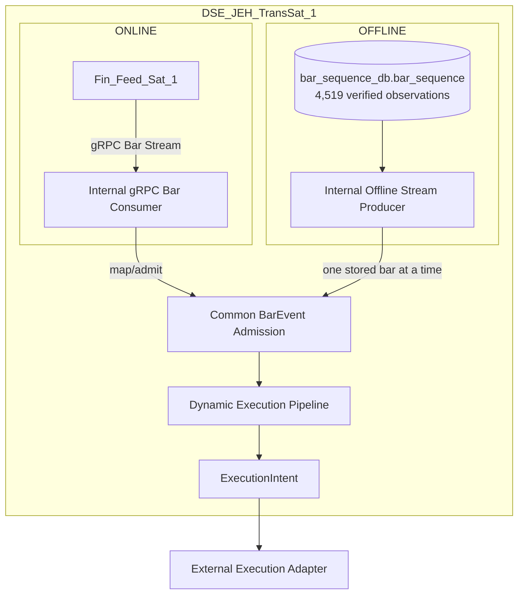
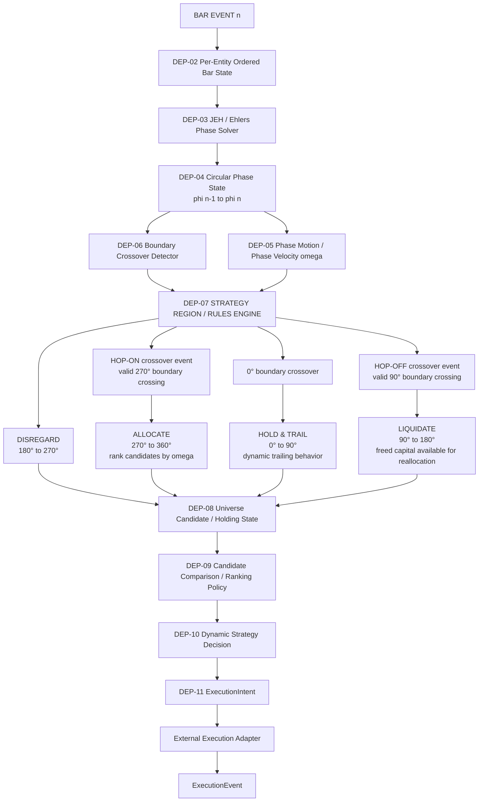
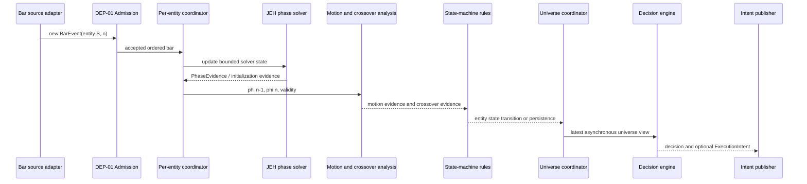
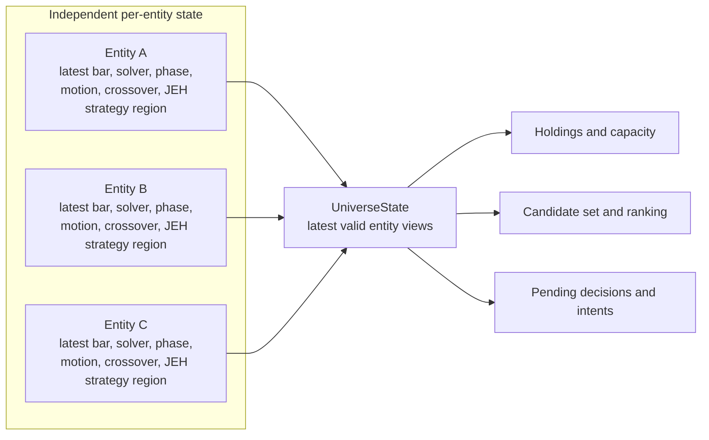
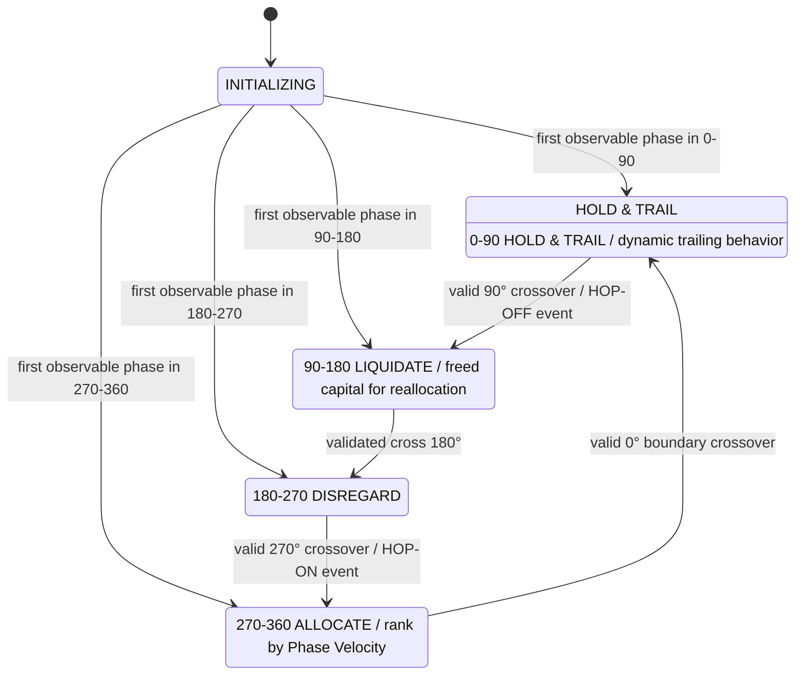
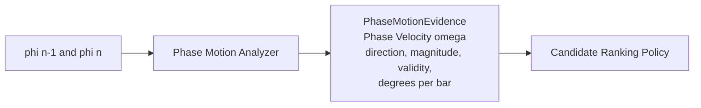
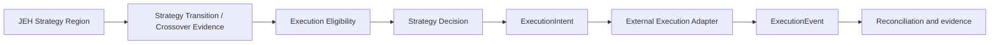
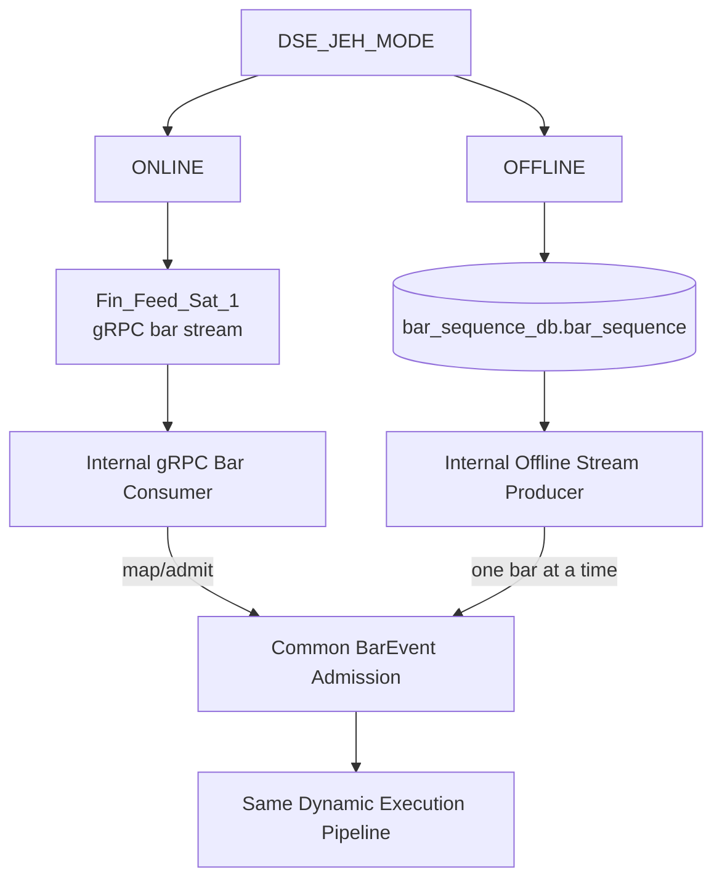
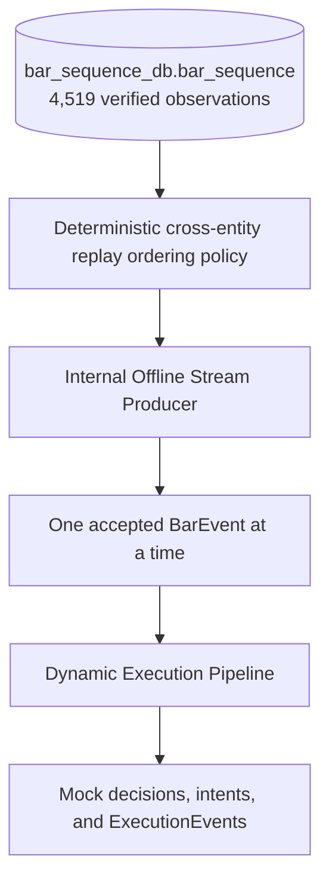
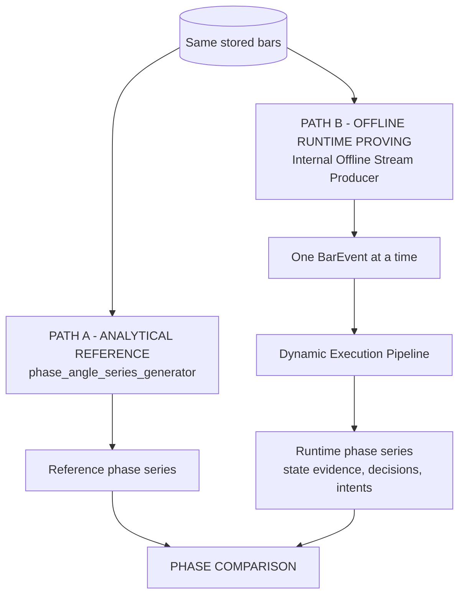

# DSE_JEH_TransSat_1 System Design V0.1

| Document control | Value |
| --- | --- |
| Filename | `DSE_JEH_TRANS_SAT_1_SYSTEM_DESIGN_V0_1_091226.md` |
| Date | 2026-09-12 |
| Version | V0.1 |
| Status | PROPOSED FOR HUMAN REVIEW |
| Implementation status | NOT YET AUTHORIZED |
| Architectural identity | `DSE_JEH_TransSat_1` |
| Physical documentation location | `DSE_JEH/docs` |
| Relationship to `DSE_JEH_provers` | Experimental proving and regression apparatus; not a TransSat and not operational runtime code |

**Purpose.** Define the proposed architecture for the first concrete runtime instance of the portable John Ehlers-Hilbert Decision Strategy Engine family. This pre-approval revision establishes the **Dynamic Execution Pipeline** as the event-driven inner decision engine. It creates no implementation, package, protobuf, deployment, persistence, or execution authority.

Normative terms `MUST`, `MUST NOT`, `SHOULD`, and `MAY` express design requirements. Strategy interpretations are hypotheses until separately validated; deterministic behavior alone does not establish scientific validity or efficacy.

---

## 1. Naming and Architectural Identity

Strategy runtime instances use `DSE_<StrategyFamily>_TransSat_<Instance>`.

- `DSE_JEH` is the reusable John Ehlers-Hilbert mathematical strategy family.
- `DSE_JEH_TransSat_1` is the first concrete designed runtime instance.
- `DSE_JEH_provers` is independent experimental apparatus, not a TransSat.
- The physical `DSE_JEH` folder is not part of runtime identity.

An instance may process one or many entities. Instance number does not imply one instance per entity. The reusable design MUST NOT embed an instance number, fixed entity population, Finance-only vocabulary, or repository path.

The JEH family concerns phase, angle, circular state, motion, boundary crossing, and strategy interpretation. It MUST remain portable across suitable domains, while each source domain retains authority over the meaning and validity of its source observations and actions. Mathematical portability does not imply semantic equivalence.

---

## 2. Executive Summary

`DSE_JEH_TransSat_1` V0.1 has exactly two bar-stream input modes: **ONLINE** and **OFFLINE**. The host selects one mode at startup through the proposed `DSE_JEH_MODE` environment variable. ONLINE consumes the `Fin_Feed_Sat_1` gRPC bar stream through an internal gRPC bar consumer. OFFLINE uses an internal stream producer to read the verified 4,519 observations in `bar_sequence_db.bar_sequence` and emit them one bar at a time in an approved deterministic replay order.

Both modes map their source observations to the same logical `BarEvent` and converge at the same admission boundary. Whether operating ONLINE or OFFLINE, `DSE_JEH_TransSat_1` receives an ordered stream of bar events through a common internal bar-event boundary. Source selection changes the producer and transport/input component, not JEH analytical or Dynamic Execution Pipeline behavior.

For every admitted `BarEvent`, `DSE_JEH_TransSat_1` advances that entity's ordered analytical state, runs the JEH/Ehlers phase solver, updates circular phase state from $\phi[n-1]$ to $\phi[n]$, derives phase-motion evidence, detects relevant boundary crossovers, advances the four-region rules engine, updates the latest universe state, evaluates `DISREGARD`, `ALLOCATE`, `HOLD & TRAIL`, and `LIQUIDATE` behavior, and produces a strategy decision and `ExecutionIntent` where applicable.

This event-driven loop is the **Dynamic Execution Pipeline**. Actual execution remains outside it in an external execution/action adapter, and only an `ExecutionEvent` can describe an execution outcome.

`PhaseEvidence` remains important, but it is internal analytical evidence produced by the in-boundary phase solver in both modes. The solver and strategy rules are logically distinct and independently testable components inside the V0.1 runtime. No separate offline or backtest strategy implementation is permitted.

---

## 3. Scope, Authority, and Principles

### 3.1 In scope

- ONLINE and OFFLINE bar-stream inputs converging on source-independent `BarEvent` admission
- Startup mode selection through proposed `DSE_JEH_MODE=ONLINE|OFFLINE`
- Internal `Fin_Feed_Sat_1` gRPC bar consumption and internal offline stream production as transport/input boundaries
- Bounded per-entity ordered bar and phase-solver state
- In-runtime JEH/Ehlers phase calculation
- Circular phase, phase motion, crossover, and four-region strategy processing
- Universe candidate/holding state and dynamic candidate comparison
- Strategy decisions, `ExecutionIntent`, and mock `ExecutionEvent` proving boundaries
- Deterministic one-event-at-a-time replay and analytical phase equivalence
- Evidence lineage, versioning, failure isolation, recovery questions, and observational viewing

### 3.2 Governing principles

1. `BarEvent` is the primary V0.1 runtime input; `PhaseEvidence` is internal on that path.
2. Each accepted bar advances only its entity's trajectory.
3. The phase solver and strategy engine are separate internal responsibilities.
4. Initialization, phase observability, strategy eligibility, decision, intent, and execution are distinct.
5. Zero degrees is legitimate and MUST NOT be an initialization sentinel.
6. Strategy-region membership and boundary crossover events are distinct.
7. The universe view uses each entity's latest valid state; it is not a synchronized frame.
8. ONLINE and OFFLINE input MUST feed the same engine logic after common `BarEvent` admission.
9. Persistence, transport, viewing, and execution remain adapters around the mathematical and strategy core.
10. Solver, strategy, ranking, configuration, and evidence identities are versioned and attributable.

## 4. Overall System Context



The mode distinction ends at `BarEvent`. The TransSat owns phase calculation and JEH strategy truth for admitted bars. The ONLINE consumer and OFFLINE producer own source access, mapping, and provenance. The execution adapter owns domain-specific action attempts and outcomes.

---

## 5. Dynamic Execution Pipeline

The **Dynamic Execution Pipeline** is the event-driven inner decision engine of `DSE_JEH_TransSat_1`. It continuously reacts to accepted bar events. It is not a batch phase classifier, CSV processor, viewer, precomputed-`PhaseEvidence` consumer, polling process, broker adapter, or downstream-only execution stage.



### 5.1 Design-local responsibilities

| ID | Logical responsibility |
| --- | --- |
| DEP-01 | Bar Event Admission: validate identity, required values, lineage, order, duplicate/conflict status, and admission disposition |
| DEP-02 | Per-Entity Ordered Analytical State: advance only the addressed entity and retain bounded sufficient solver state |
| DEP-03 | JEH / Ehlers Phase Update: calculate phase from the accepted ordered bar trajectory |
| DEP-04 | Circular Phase State: represent initialization, observability, validity, $\phi[n-1]$, and $\phi[n]$ without sentinels |
| DEP-05 | Phase Motion Analysis: derive versioned directional motion evidence in degrees per bar |
| DEP-06 | Boundary Crossover Detection: distinguish robust circular crossover events from strategy-region membership |
| DEP-07 | Strategy Region / Rules Engine: apply the governed four-region strategy interpretation and distinguish persistent strategy-region membership from crossover events; `HOP-ON` and `HOP-OFF` are not persistent states |
| DEP-08 | Universe Candidate / Holding State: maintain latest per-entity strategy region, allocation candidates, holdings, liquidation context, capacity, and pending work |
| DEP-09 | Candidate Comparison / Ranking: select among current eligible `ALLOCATE` candidates using an approved Phase Velocity ($\omega$) policy |
| DEP-10 | Strategy Decision Generation: decide whether to allocate, hold/trail, liquidate, disregard, or take no action with causal evidence |
| DEP-11 | ExecutionIntent Generation: publish an idempotent governed request without claiming execution |

These identifiers are local to this design. They are not repository package, service, type, or protobuf names and MUST NOT become implementation names without separate approval.

---

## 6. One BarEvent Lifecycle



For one newly accepted bar:

1. Admit the event and establish deterministic identity and source lineage.
2. Advance only that entity's ordered bar/solver trajectory.
3. Run the JEH/Ehlers phase update.
4. Record initialization or current observable phase $\phi[n]$.
5. Retain/use prior observable phase $\phi[n-1]$ where valid.
6. Derive phase-motion evidence and detect circular boundary crossover evidence.
7. Update the entity's four-region JEH rules state, preserving any distinct crossover event.
8. Update universe candidate, holding, unavailable, and pending state.
9. Evaluate liquidation first, then current candidate reallocation, hold, or disregard behavior.
10. Produce a strategy decision and optional `ExecutionIntent`.
11. Leave action and outcome production to the external adapter.

Malformed input, missing prerequisites, or an unobservable phase MUST produce explicit non-action evidence and MUST NOT corrupt another entity.

---

## 7. BarEvent Semantics and Ordering

The fundamental event is **NEW ACCEPTED BAR FOR ENTITY S**. Required bar fields and the exact contract remain open, but identity, entity, values required by the solver, event/provenance times, source, entity-scoped order, and deterministic evidence identity must be representable.

Bars can arrive asynchronously:

```text
AAPL, AAPL, NVDA, SPY, AAPL, QQQ, NVDA
```

There is no required synchronized 30-symbol frame. `generator_sequence_no` represents accepted arrival order for one entity and is not a global market clock. The universe-level pipeline observes the latest valid state currently known for every entity.

Common admission requires explicit policy for duplicates, conflicts, gaps, missing bars, and out-of-order bars. No policy may silently rewrite accepted history or fabricate bars. A cross-entity deterministic OFFLINE replay requires actual available event/provenance timestamps or other accepted-arrival evidence. If stored evidence cannot reconstruct a unique total arrival order, replay ordering is unresolved and MUST be declared in the validation configuration; bars MUST NOT be globally sorted by `generator_sequence_no`.

The exact `Fin_Feed_Sat_1` service and method binding is not established by this design and remains an interface-design question. ONLINE delivery semantics for ordering, duplicate and gap detection, dropped/lost bars, reconnect, recovery, resumption, provenance, backpressure, and consumer lag MUST be defined before implementation. The Dynamic Execution Pipeline MUST NOT silently continue across an undetected missing accepted bar if doing so could alter solver state, phase, crossover, state transition, ranking, or decision behavior.

---

## 8. Phase Calculation Inside V0.1

The primary path is:

```text
BarEvent -> JEH phase solver -> PhaseEvidence -> Dynamic Execution Pipeline state logic
```

The JEH/Ehlers phase solver is inside the V0.1 TransSat runtime boundary. `PhaseEvidence` is therefore an internal analytical evidence/state concept on this path, not the sole primary external contract. The phase solver and strategy rules remain logically separate so solver equivalence, strategy behavior, version replacement, and failures can be tested independently.

The current approved-reference behavior uses ordered median price, $P[n]=(High[n]+Low[n])/2$, normalized observable phase in $[0,360)$, and the current solver/configuration's 63-observation lookback. This does not make median price or 63 observations a universal JEH law.

For the proven current configuration:

- sequence 1..63: `INITIALIZING`;
- sequence 64: first possible observable phase;
- all initializing bars are processed and advance analytical state;
- unavailable phase is represented explicitly, never as 0 degrees; and
- `phase_observable != strategy_execution_eligible`.

No valid strategy action may be generated from unobservable phase.

---

## 9. Per-Entity and Universe State

### 9.1 Per-entity hot state

Each entity conceptually maintains:

- entity identity and source lineage;
- ordered bar and bounded sufficient solver state;
- initialization state and current bar identity;
- previous accepted analytical state;
- explicit $\phi[n-1]$ and $\phi[n]$ presence;
- phase observability and validity;
- previous and current JEH strategy region;
- most recent boundary crossover;
- phase-motion evidence and its validity/confidence;
- candidate and holding status where applicable; and
- solver, strategy, ranking, and configuration version identity.

Hot state MUST NOT require unbounded bar history when bounded sufficient solver state can preserve equivalent behavior. Durable evidence may retain history outside hot state.

### 9.2 Universe state

Universe state is distinct from per-entity analytical state and includes current holdings, `ALLOCATE` candidates, `HOLD & TRAIL` entities, `LIQUIDATE` entities, `DISREGARD` entities, initializing/unavailable entities, candidate ranking state, execution capacity/capital state where applicable, and pending decisions/intents.



Universe state is not a claim that all entities were updated simultaneously. Each entity view needs freshness/staleness evidence. Snapshot semantics, stale-state eligibility, and stale candidate expiry remain open.

---

## 10. Four-Region Circular JEH Rules Engine

The System Design adopts the canonical region/action vocabulary from the supplied Hop On Hop Off strategy artifact. The artifact itself is not stored in this repository, so no repository path is asserted. The four persistent strategy regions/actions are:

| Half-open phase interval | Canonical strategy region/action | Current strategy interpretation |
| --- | --- | --- |
| $0 \le \phi < 90$ | `HOLD & TRAIL` | Maintain the holding and trail dynamically; exact trailing-stop policy remains unresolved |
| $90 \le \phi < 180$ | `LIQUIDATE` | Liquidation context; freed capital becomes available for governed reallocation |
| $180 \le \phi < 270$ | `DISREGARD` | Not an allocation candidate |
| $270 \le \phi < 360$ | `ALLOCATE` | Allocation-candidate region; rank candidates by Phase Velocity ($\omega$) under an approved policy |



The wheel is one full circular phase space, interpreted clockwise from top as `HOLD & TRAIL`, `LIQUIDATE`, `DISREGARD`, then `ALLOCATE`. Terms such as trough, peak, accelerating upward, or rolling over are **JEH strategy interpretations**, not universal scientific facts unless independently validated.

**Strategy-region membership is not a boundary crossover event.** `HOP-ON` is the named event for a valid 270° boundary crossover in the approved direction into `ALLOCATE`. `HOP-OFF` is the named event for a valid 90° boundary crossover in the approved direction into `LIQUIDATE`. Neither is a persistent strategy state. Five successive bars in `ALLOCATE` represent persistent membership, not five `HOP-ON` events. First observable classification, same-region persistence, region exit, boundary crossover, region entry, candidate status, decision, and intent require distinct evidence.

The transition from `ALLOCATE` into `HOLD & TRAIL` uses the 0° boundary crossover; no additional event name is defined. Source trigger concepts such as $\phi[n]\ge270$ and $\phi[n-1]<270$, or $\phi[n]\ge90$ and $\phi[n-1]<90$, express intended directional cases only. They MUST NOT be applied blindly to circular wraps, reverse movement, exact-boundary samples, jitter, or large jumps. The names `HOP-ON` and `HOP-OFF` establish event semantics, not detection mathematics. Robust 270°, 90°, 180°, and 360°/0° crossover algorithms remain blocking questions.

---

## 11. Phase Motion and Phase Velocity ($\omega$)



The pipeline requires phase-motion evidence because multiple entities may occupy `ALLOCATE`. The canonical intended ranking quantity is **Phase Velocity ($\omega$)**, measured in **degrees per bar**, because V0.1 is driven by accepted bar index rather than wall-clock frequency. Phase Velocity is an intended ranking input; its exact definition remains unresolved.

The exact mathematics are not approved. In particular, the naive positive-modulo expression

$$
\omega = (\phi[n]-\phi[n-1]) \bmod 360
$$

MUST NOT be frozen as the definition. A transition from 10 degrees to 350 degrees may represent approximately -20 degrees of signed circular movement, not +340 degrees.

Explicit counterexample: $\phi[n-1] = 10°$ and $\phi[n] = 350°$ may represent approximately $-20°$ of signed circular movement; naive positive modulo produces $+340°$.

The approved design must resolve signed circular difference, direction, wrap handling, 180-degree ties, abnormal jumps, initialization, gaps, confidence/validity, smoothing, one-bar versus multi-bar estimation, and whether acceleration is separately required. Velocity MUST NOT be called acceleration. Historical candidate values or rankings from source analysis are examples, not evidence of acceleration, optimal allocation, or efficacy.

---

## 12. Dynamic Allocation and Strategy Behavior

Candidate comparison and ranking are part of the Dynamic Execution Pipeline. The first intended ranking signal is Phase Velocity ($\omega$), but its definition and the ranking formula, timing, ties, staleness, and eligibility are unresolved.

The current intended workflow is:

1. **LIQUIDATE first.** A valid 90° `HOP-OFF` crossover places the entity in the `LIQUIDATE` region/action context. The Strategy Decision determines whether liquidation should be requested; if eligible, it generates an `ExecutionIntent`. Freed capital becomes available for governed reallocation under still-unresolved sequencing and capital rules.
2. **ALLOCATE / reallocate.** When approved capacity/capital is available, inspect the current non-stale `ALLOCATE` candidate universe, rank candidates using the approved Phase Velocity ($\omega$) policy, and generate allocation intent only when the Strategy Decision permits it.
3. **HOLD & TRAIL.** Held entities in `HOLD & TRAIL` remain held under the strategy-region model and are intended to trail stops dynamically. Exact trailing-stop mathematics are not approved and remain open.
4. **DISREGARD.** Entities in `DISREGARD` are not allocation candidates under the current region model. Remaining in `DISREGARD` does not generate a `HOP-ON` event.

The design does not yet approve single versus multiple holdings, capital representation, capacity, replacement, candidate-set timing, or liquidation/allocation transaction semantics.

---

## 13. Decision and External Execution Boundary



The pipeline decides what should be requested. It does not place orders or claim outcomes. `ExecutionIntent` requires deterministic identity, target, requested action, causal decision, strategy/configuration lineage, idempotency/correlation identity, and validity semantics in the final contract. `ExecutionEvent` separately records acceptance, rejection, action/fill, cancellation, failure, or reconciliation.

The first proving executor is **MOCK / SIMULATED EXECUTION ONLY**: no broker, capital, live order, or Alpaca submission. The proof chain is `bar event -> phase -> motion -> crossover -> state -> ranking -> decision -> ExecutionIntent -> mock ExecutionEvent`. No external call may hold a per-entity or universe strategy-state lock.

---

## 14. Online and Offline Stream Modes



The proposed startup environment variable accepts exactly:

```text
DSE_JEH_MODE=ONLINE
DSE_JEH_MODE=OFFLINE
```

The host/startup layer reads `DSE_JEH_MODE` and selects one producer/input component. The Dynamic Execution Pipeline MUST NOT read this variable or branch on source mode.

**ONLINE** maps bars from the `Fin_Feed_Sat_1` gRPC bar stream through an internal gRPC consumer into the common `BarEvent` boundary. The transport is not JEH mathematics, and the pipeline MUST NOT depend on Fin protobuf types or gRPC semantics. This design neither invents nor freezes a Fin service or protobuf contract.

**OFFLINE** uses an internal stream producer to read `bar_sequence_db.bar_sequence` in an approved deterministic order and emit one stored observation at a time into the common `BarEvent` boundary. OFFLINE remains a stream, not a batch strategy processor. The producer MUST NOT calculate phase, phase motion, crossover, JEH strategy region, ranking, decisions, or `ExecutionIntent`, and MUST NOT invoke `phase_angle_series_generator`.

For equivalent admitted bars and ordering, both modes execute identical solver, motion, crossover, state, universe, ranking, decision, and intent logic. Source provenance may differ; strategy behavior must not. A separate offline or backtest strategy implementation is prohibited. Optional future OFFLINE pacing is a producer/runtime concern and MUST NOT change bar interpretation or pipeline behavior.

---

## 15. The 4,519-Bar Offline Proving Stream

The initial OFFLINE proving source is the existing `bar_sequence` collection in `bar_sequence_db`. On 2026-09-12, a read-only local `countDocuments({})` query independently verified **4,519 bar observations**. This is a proving dataset size, not an architectural constant or the Dynamic Execution Pipeline input contract.



The OFFLINE producer must preserve entity-scoped `generator_sequence_no` and use established timestamp/provenance evidence for cross-entity order. If available fields cannot reconstruct a unique total accepted-arrival order, that limitation is an explicit open question and the chosen deterministic replay policy must be versioned. It is incorrect to treat equal sequence numbers as frames or sort all entities globally by `generator_sequence_no`.

Bars 1 through 63 for an entity still enter the pipeline and advance solver state. They are not discarded merely because phase is initializing.

---

## 16. Independent Analytical Reference and Phase Equivalence

`Bar_Sequence_Lab/phase_angle_series_generator` is an **independent analytical reference / batch phase generator**. It calculates phase-angle series from collected sequences. It is not the Dynamic Execution Pipeline, is not moved or modified by this design, is not invoked as a batch application by the runtime, and its application structure is not copied into the runtime.



For matching observations, runtime phase behavior should equal the approved reference behavior by entity/symbol, collection run or equivalent source lineage, `generator_sequence_no`, solver identity/version, and input-series definition. Exact numeric tolerance/precision remains open. Required mathematical equivalence does not imply code reuse.

The existing phase CSV and `DSE_JEH_provers` remain regression/reference evidence for `precomputed PhaseEvidence -> zone/transition` behavior. They are not the runtime input architecture and are not discarded or promoted as the runtime.

---

## 17. Determinism, Mode Equivalence, and Evidence Identity

For the same admitted bar observations and order, ONLINE and OFFLINE MUST produce equivalent results given the same solver version, strategy version, configuration, ranking policy, and initial state:

- phase and phase-motion evidence;
- crossover and state-transition evidence;
- universe-state evolution and rankings;
- decisions and `ExecutionIntent` records; and
- mock `ExecutionEvent` records.

Evidence identity must include enough typed and versioned information to distinguish entity, source observation, source mode/provenance, entity order, replay/order policy where applicable, solver, strategy, zone model, phase-motion policy, ranking policy, configuration, causal predecessor, and output kind. IDs must support idempotency, mode-equivalence comparison, reconciliation, and conflict detection without making transport types, file layout, or database keys part of strategy mathematics.

---

## 18. Conceptual Component Model

```text
DSE_JEH_TransSat_1
|
+-- Runtime / Startup Configuration
|     +-- DSE_JEH_MODE = ONLINE | OFFLINE
+-- ONLINE Bar Input
|     +-- Fin_Feed_Sat_1 gRPC Bar Consumer
+-- OFFLINE Bar Input
|     +-- Internal Bar Sequence Stream Producer
+-- Common BarEvent Admission
+-- Per-Entity Analytical State Coordinator
+-- JEH Phase Solver
+-- Circular Phase State Manager
+-- Phase Motion Analyzer
+-- Boundary Crossover Detector
+-- Strategy Region / Rules Engine
+-- Universe State Coordinator
+-- Candidate Ranking Engine
+-- Strategy Decision Engine
+-- ExecutionIntent Publisher
+-- Execution Adapter Interface
+-- Evidence / Diagnostics
+-- optional Persistence Adapter
```

These are logical design components only. They do not authorize packages, services, files, or contracts.

---

## 19. Portability, Persistence, and Failure Isolation

The Dynamic Execution Pipeline MUST NOT depend mathematically on MongoDB, CSV, phase CSV, proving folders, Next.js, a Bar Sequence Lab path, a broker SDK, Alpaca, a fixed 30-symbol population, a fixed 4,519-bar dataset, `collection_run_id`, or `SERIES_SIZE`.

For OFFLINE proving, MongoDB is the stored source used by the internal stream producer. The DSE_JEH engine consumes `BarEvent` streams, not a database. Persistence is an optional infrastructure adapter and does not define JEH mathematics. Checkpoint and recovery semantics remain open.

Failures must be isolated:

| Failure | Required response |
| --- | --- |
| Malformed, duplicate, conflicting, missing, or out-of-order bar | Apply explicit deterministic admission policy; do not silently mutate history |
| One entity's solver/state failure | Degrade/quarantine that entity without corrupting others |
| Ranking or decision failure | Preserve accepted analytical evidence and surface failure |
| Persistence/publication/viewer failure | Surface health degradation; do not alter strategy truth |
| Execution adapter latency/failure | Preserve strategy state; do not claim execution; do not block unrelated entities |
| Restart/version mismatch | Refuse unsafe restoration or reconstruct under an approved policy |

Runtime health should distinguish liveness, input health, per-entity initialization/readiness, universe readiness, persistence/publication health, execution-adapter health, recovery/replay state, and active version identities.

---

## 20. Viewer Boundary

The viewer is observational only and MUST NOT calculate authoritative phase, motion, crossover, state, ranking, decision, intent, or execution truth. A future viewer may display polar universe state, entity phase/motion/state, crossovers, candidates, ranking, holdings, decisions, `ExecutionIntent`, and `ExecutionEvent`. Viewer failure or latency cannot affect processing.

Polar visualization represents one circular phase space. A rectangular chart's 360/0 wrap is not automatically a scientific discontinuity.

---

## 21. Validation Strategy

The first separately authorized validation plan should cover:

1. Every `BarEvent` admission state, identity combination, duplicate, conflict, gap, and out-of-order case.
2. Entity isolation and asynchronous sequences without synchronized frames.
3. Current 63-observation initialization behavior, first possible phase at 64, and legitimate zero degrees.
4. Phase equivalence against `phase_angle_series_generator` with approved tolerance.
5. Signed motion, wrap, reverse motion, large jump, and abnormal/invalid vectors.
6. Canonical strategy-region membership versus initial entry, persistence, exit, named `HOP-ON`/`HOP-OFF` events, other crossover evidence, and entry.
7. Every boundary, including 90, 180, 270, and 360/0 in both movement directions.
8. Stale universe members, candidate-set timing, ranking ties, and capacity behavior once approved.
9. Liquidation-before-allocation ordering and intent idempotency.
10. Decision, intent, mock execution, and reconciliation non-equivalence.
11. Deterministic 4,519-event replay and repeated evidence identity/digest comparison.
12. ONLINE/OFFLINE semantic equivalence, source-specific recovery, and component failure isolation.
13. ONLINE ordering, duplicate/gap/loss detection, reconnect/resumption, backpressure, and lag behavior once contracted.
14. ONLINE startup with insufficient phase history and any approved solver warm-up mechanism.

Promotion requires explicit acceptance criteria. The dataset and existing prover are regression evidence, not proof of profitability, optimality, or production readiness.

---

## 22. Open Questions and Blocking Decisions

No answer is invented where evidence does not yet exist.

1. What is the exact common internal `BarEvent` contract?
2. What exact existing `Fin_Feed_Sat_1` gRPC service, method, and bar contract bind to the ONLINE consumer?
3. What bar-ordering guarantees does the ONLINE stream provide?
4. What are the ONLINE duplicate identity and delivery semantics?
5. How does ONLINE detect gaps and dropped/lost accepted bars?
6. What reconnect and resumption semantics does ONLINE provide?
7. What backpressure and consumer-lag behavior is required ONLINE?
8. What recovery and warm-up behavior applies after ONLINE interruption?
9. What deterministic cross-entity OFFLINE order can available provenance support?
10. Is configurable OFFLINE replay pacing needed, and how is it kept outside strategy semantics?
11. What proves ONLINE/OFFLINE semantic equivalence for matching admitted bars and ordering?
12. How are source and provenance identities represented consistently across modes?
13. How is solver warm-up handled when ONLINE starts?
14. Are historical bars required to prime a newly started ONLINE solver?
15. What happens when ONLINE starts without sufficient phase history?
16. What minimum bar fields does the JEH solver require?
17. What bounded representation is sufficient for solver state?
18. What establishes exact solver equivalence with `phase_angle_series_generator`?
19. What numeric tolerance and precision apply to phase equivalence?
20. What is the exact signed circular $\Delta\phi$ definition, including tie behavior?
21. What is the exact Phase Velocity ($\omega$) definition in degrees per bar?
22. Does $\omega$ use one-bar or multi-bar estimation?
23. Is phase motion smoothed; if so, under what separately identified policy?
24. Is angular acceleration needed as a distinct quantity?
25. What are robust 90-degree `HOP-OFF` crossover semantics?
26. What are robust 180-degree crossover semantics?
27. What are robust 270-degree `HOP-ON` crossover semantics?
28. What are robust 360/0 crossover semantics?
29. How is reverse phase movement interpreted and processed?
30. How are large or abnormal phase jumps classified?
31. How are missing bars detected and handled after the common boundary?
32. How are exact duplicate and conflicting bars identified and handled?
33. How are out-of-order bars handled without rewriting accepted history?
34. How is entity-state staleness measured and exposed?
35. What are universe snapshot semantics under asynchronous arrivals?
36. What candidate ranking mathematics, tie-breaking, and validity rules are approved?
37. When is the candidate set sampled relative to an incoming event and decisions?
38. When and how do stale candidates expire?
39. How is allocation/execution capacity defined?
40. Are single or multiple simultaneous holdings supported?
41. How is capital state represented without coupling strategy mathematics to an executor?
42. What atomicity and reconciliation govern liquidation-before-allocation sequencing?
43. What are mock execution acceptance, rejection, fill, latency, and failure semantics?
44. Is a trailing-stop policy part of V0.1, and what mathematics would govern it?
45. What are recovery, checkpoint, compatibility, and intent-reconciliation semantics?
46. Which evidence requires persistence, at what durability and retention?
47. What is the exact versioned `ExecutionIntent` contract?
48. What is the exact versioned `ExecutionEvent` contract?
49. What runtime health, lifecycle, readiness, and degradation model applies?
50. What acceptance criteria permit promotion from 4,519-bar OFFLINE proving to ONLINE feed testing?

---

## 23. Traceability and Scientific Caution

| Source | Design use | Authority limit |
| --- | --- | --- |
| Supplied Hop On Hop Off strategy artifact (not stored in this repository) | Canonical `DISREGARD`, `ALLOCATE`, `HOLD & TRAIL`, and `LIQUIDATE` region/action names; `HOP-ON` and `HOP-OFF` crossover-event names; Phase Velocity ranking intent; trailing and reallocation intent | Terminology is authoritative for this design; crossover, velocity, ranking, trailing-stop, and capital mathematics remain unresolved |
| `phase_angle_series_generator` docs and implementation | Median-price solver behavior, 63-bar initialization, normalized phase, independent reference path | Standalone batch generator; not runtime or strategy authority |
| `DSE_JEH_provers` | PhaseEvidence admission, zone/transition regression evidence, deterministic proving patterns | Precomputed-phase apparatus; not runtime input architecture or efficacy evidence |
| `bar_sequence_db.bar_sequence` | Initial realtime-equivalent replay source; 4,519 observations verified 2026-09-12 | Dataset and MongoDB are not architectural dependencies |
| This document | Proposed V0.1 runtime boundary and requirements | Human review required; implementation not authorized |

The source strategy's polar interpretation motivates the four states and dynamic behavior. It does not establish that a particular phase means a universal trough/peak, that one-bar motion proves acceleration, or that historical $\omega$ examples prove optimal allocation.

---

## 24. Non-Goals

This revision does not authorize or perform:

- Go implementation, gRPC client implementation, or protobuf creation/modification;
- modification of `Fin_Feed_Sat_1`;
- implementation of the Internal Offline Stream Producer or Dynamic Execution Pipeline;
- replay execution;
- modification of `phase_angle_series_generator`, Bar Sequence Lab, or `DSE_JEH_provers`;
- MongoDB data modification or repository restructuring;
- live broker, Alpaca, real-capital, or live-order execution;
- trailing-stop implementation;
- final phase-velocity, crossover, or candidate-ranking mathematics;
- a separate backtest strategy;
- viewer changes, deployment, commit, or push.

---

## 25. Change Log

| Version | Date | Change |
| --- | --- | --- |
| V0.1 | 2026-09-12 | Initial proposed system design for `DSE_JEH_TransSat_1`. |
| V0.1 pre-approval revision | 2026-09-12 | Revised in place before approval to establish the Dynamic Execution Pipeline as the central inner decision engine; make `BarEvent` the common engine input; place JEH/Ehlers phase calculation, event-driven crossover processing, phase-motion analysis, four-region rules, universe state, and ranking inside the V0.1 runtime; and retain `phase_angle_series_generator` as an independent analytical reference. Refined before approval to establish two V0.1 bar-stream modes selected by proposed `DSE_JEH_MODE`: ONLINE through an internal `Fin_Feed_Sat_1` gRPC bar consumer and OFFLINE through an internal stream producer reading the verified 4,519-bar `bar_sequence` collection. Both modes converge at common `BarEvent` admission and use identical Dynamic Execution Pipeline behavior; DSE_JEH consumes bar streams rather than databases; ONLINE delivery semantics remain open interface-design questions. |
| V0.1 terminology refinement | 2026-09-12 | Aligned the Dynamic Execution Pipeline with the supplied Hop On Hop Off strategy artifact: established `DISREGARD`, `ALLOCATE`, `HOLD & TRAIL`, and `LIQUIDATE` as the four canonical persistent strategy region/action terms; defined `HOP-ON` and `HOP-OFF` as 270° and 90° crossover events rather than states; retained Phase Velocity ($\omega$) as the intended ranking quantity; and preserved unresolved crossover, velocity, ranking, trailing-stop, and capital-allocation mathematics. |

---

## 26. Authorization Statement

This document is **PROPOSED FOR HUMAN REVIEW**.

**Implementation remains NOT YET AUTHORIZED.**

Approval of this document would authorize only separately governed follow-on design and validation planning. It would not authorize source code, protobuf creation, replay execution, persistence implementation, execution integration, deployment, or trading.