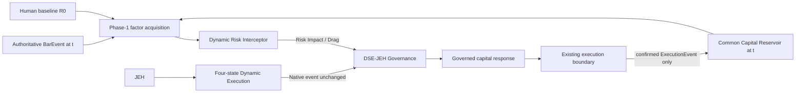
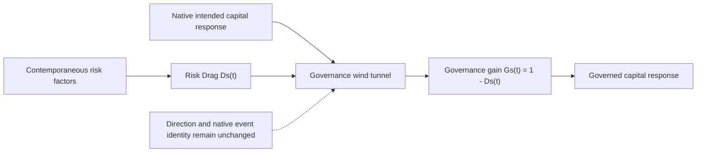
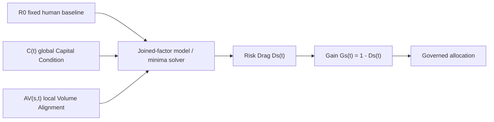
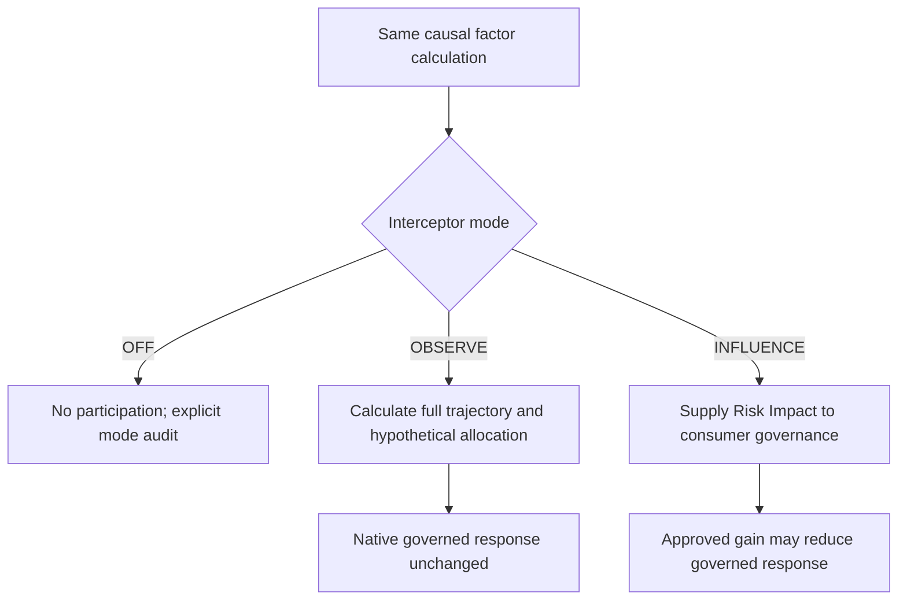
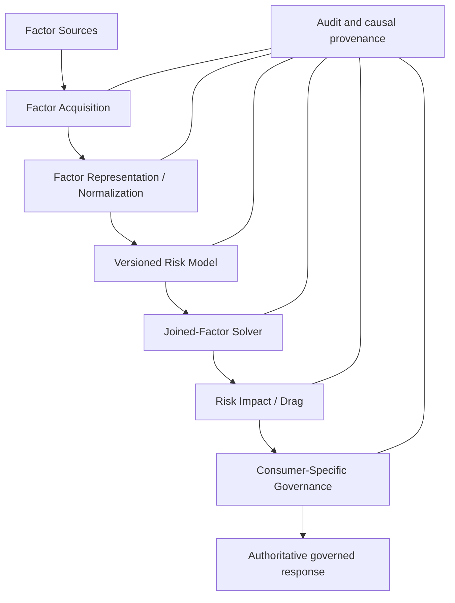
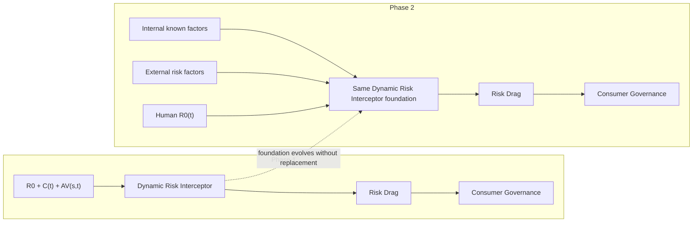

# Dynamic Risk Interceptor Module Design

**Date:** 2026-09-15  
**Version:** V0.1  
**Status:** PROPOSED — HUMAN DESIGN REVIEW REQUIRED  
**Authority:** Design proposal only; no production implementation is authorized by this document

## 1. Executive Overview

The Dynamic Risk Interceptor is a reusable, sideways risk mechanism. It observes contemporaneously known risk factors, derives a bounded **Risk Impact / Risk Drag**, and supplies that impact to an authoritative consumer. For DSE-JEH Phase 1, the consumer remains DSE-JEH governance and the initial factor set is exactly:

- fixed human strategic baseline $R_0$;
- global common-reservoir Capital Condition $C(t)$; and
- local symbol-specific Volume Alignment $A_V(s,t)$.

The Interceptor is not a sequential trading stage, signal generator, Decision Engine, executor, Capital Reservoir owner, or replacement for Risk R. It does not rewrite a native event. A native `HOP_ON` remains `HOP_ON` even when maximum drag reduces governed allocation to zero. The audit trail must preserve native intent, risk inputs, Risk Drag, governance gain, governed response, and execution outcome as distinct facts.

The primary mental model is wind-tunnel drag. Native DSE-JEH intent supplies the direction and permitted response; the Interceptor can resist the magnitude of the capital response but cannot reverse or amplify the native direction. In Phase 1:

$$
0 \le D_s(t) \le 1, \qquad G_s(t)=1-D_s(t), \qquad 0 \le G_s(t) \le 1
$$

For permitted native allocation $A_{native,s}(t)$:

$$
A_{governed,s}(t)=A_{native,s}(t)G_s(t),
\qquad 0\le A_{governed,s}(t)\le A_{native,s}(t)
$$

At the current V1 ceiling, $A_{native,s}(t)\le A_{max}=\$100{,}000$. Risk can reduce permitted exposure; it cannot create additional exposure.

Phase 1 validates this foundation first in `OBSERVE`, using the frozen RUN_C source without changing known capital behavior, then only after human approval in `INFLUENCE`. Phase 2 expands the **same Interceptor** with additional externally derived factors and may externalize it as a gRPC service. Phase 2 does not replace the foundation, consumer authority, causal-time rule, or sideways relationship.

## 2. Existing Authority and Compatibility

This design was checked against:

1. `docs/DSE_JEH_TRANS_SAT_1_SYSTEM_DESIGN_V0_1_091226.md` — four-state Dynamic Execution, one-BarEvent lifecycle, history-free transition mathematics, Risk R, state actions, common Capital Reservoir, execution causality, and explicit deferrals.
2. `docs/DSE_JEH_TRANS_SAT_1_IMPLEMENTATION_PLAN_V0_2_091326.md` — `HOP_ON`/`HOP_OFF` as policy events rather than states and governed implementation boundaries.
3. `docs/DSE_JEH_TRANS_SAT_1_PROTOBUF_GRPC_SERVICE_ARCHITECTURE_COMPLETION_REPORT_2026-09-13.md` — active service, RPC, runtime evidence, and producer-boundary architecture.
4. `docs/DSE_JEH_OFFLINE_DETERMINISTIC_REPLAY_REPORT_2026-09-12.md` — ordered, deterministic, one-event-at-a-time OFFLINE replay.
5. `docs/DSE_JEH_DYNAMIC_PIPELINE_EXECUTION_RUN_REPORT_2026-09-14.md` — frozen source, run identity, Risk R endpoint comparisons, and local-paper execution evidence.
6. `api/proto/dse_jeh/v1/DSE_JEH_TransSat_1.proto` — `BarEvent`, source provenance, four Dynamic Execution states, execution contracts, and Capital Reservoir event fields.

No existing authoritative document defines a Dynamic Risk Interceptor or Radar algorithm. No direct conflict was found. This design therefore remains proposed authority pending human approval.

One compatibility distinction is important: existing history-free transition rules prohibit historical transition reconstruction, smoothing, or redefinition of established phase/state facts. They do not authorize the Interceptor to alter those facts. A causal risk factor may use explicitly governed retained observations at or before $t$, such as a volume difference, provided its lookback, initialization, identity, and time lineage are independently defined and it affects only governed response. It must not become hidden evidence for rewriting the native transition.

## 3. Scope and Non-Scope

### 3.1 Phase-1 scope

- Define the sideways Interceptor contract and wind-tunnel Risk Drag model.
- Define $R_0$, candidate forms of $C(t)$, and candidate forms of $A_V(s,t)$.
- Investigate joined-factor formulations without inventing arbitrary weights.
- Define `OFF`, `OBSERVE`, and `INFLUENCE` behavior.
- Define logical observations, calculations, impacts, governed-response, and audit artifacts.
- Define deterministic, causal validation against the frozen RUN_C source.
- Preserve a reusable Risk Module decomposition that can accept more factors later.

### 3.2 Explicit non-scope

- Production code, protobuf changes, MongoDB schema changes, or deployment.
- A fifth Dynamic Execution state or any renamed state.
- New `HOP_*`, BUY, SELL, HOLD, or LIQUIDATE semantics.
- Modification of JEH phase, boundary facts, native event identity, or forward processing.
- Modification, absorption, or replacement of Risk R.
- Capital Reservoir ownership, debit/credit, execution, or broker behavior.
- Machine learning, parameter fitting, autonomous adaptation, or arbitrary factor weights.
- Phase-2 external-factor implementation or a Radar algorithm/design.
- Retrospective leakage, future observations, or historical state reconstruction.

## 4. Normative Invariants

1. **Consumer authority:** the Interceptor observes and influences; the consumer decides.
2. **Native identity preservation:** native DSE-JEH events and four-state outcomes remain unchanged and separately auditable.
3. **Sideways relationship:** the Interceptor is not another sequential trading pipeline stage.
4. **Phase-1 non-amplification:** $0\le A_{governed}\le A_{native}$.
5. **Causal time:** every participating observation satisfies $t_{observation}\le t_{decision}$.
6. **No capital mutation:** only existing confirmed `ExecutionEvent` semantics move common-reservoir capital.
7. **Global capital context:** $C(t)$ observes the one common reservoir, not 30 isolated accounts.
8. **Risk R independence:** Risk R remains the post-entry trailing-retreat tolerance.
9. **Cause preservation:** `HOP_OFF` and `SAFETY_LIQUIDATION` remain distinct.
10. **Determinism:** equal versioned inputs produce equal calculations and Risk Impact.
11. **No silent defaults:** missing, stale, invalid, or uninitialized factors produce an explicit governed disposition; they are not silently replaced with zero risk.
12. **Mode transparency:** `OBSERVE` cannot alter governed capital response; `INFLUENCE` participation is explicit in audit data.

## 5. Architectural Mental Models

### 5.1 Phase-1 sideways architecture



The diagram has two inputs to governance: native DSE-JEH intent and sideways Risk Impact. It does not insert the Interceptor between JEH and Dynamic Execution.

### 5.2 Wind-tunnel / Risk Drag model



Drag is continuous-capable resistance, not a NAND gate, low-pass filter, trading signal, or binary trade acceptance decision.

### 5.3 Phase-1 mathematical flow



### 5.4 Native event plus sideways Risk Drag

```mermaid
sequenceDiagram
  participant DSE as Dynamic Execution
  participant INT as Risk Interceptor
  participant GOV as DSE-JEH Governance
  participant EXE as Existing Executor Boundary
  DSE->>GOV: Native HOP_ON; permitted allocation
  INT->>GOV: Risk Impact Ds(t), causal calculation ID
  GOV->>GOV: Apply approved gain without rewriting HOP_ON
  GOV->>EXE: Governed instruction, possibly allocation = 0
  EXE-->>GOV: Existing ExecutionEvent semantics
```

## 6. Definitions and Notation

| Symbol | Definition | Units / domain | Causal interpretation |
| --- | --- | --- | --- |
| $s$ | governed symbol/entity | identifier | entity addressed at decision time |
| $t$ | authoritative decision/event time | timestamp | generic contract time |
| $t_B$ | authoritative Phase-1 BarEvent time | Unix ms / source time | Phase 1 sets $t=t_B$ |
| $R_0$ | human strategic risk baseline | proposed normalized bounded scalar; exact contract OPEN | fixed for one Phase-1 run |
| $C(t)$ | global Capital Condition | normalized adverse condition; exact formula OPEN | common-reservoir observation known by $t$ |
| $V_s(t)$ | raw symbol volume observation | source volume units, $V\ge0$ | admitted BarEvent volume known by $t$ |
| $M_V(s,t)$ | derived volume movement | dimensionless or volume/time; exact formula OPEN | causal derivation from versioned observations |
| $A_V(s,t)$ | alignment of volume behavior with native direction/event | candidate $[-1,1]$; exact contract OPEN | local factor known by $t$ |
| $D_s(t)$ | Risk Drag | $[0,1]$ | active sideways Risk Impact |
| $G_s(t)$ | governance gain | $[0,1]$ | $1-D_s(t)$ |
| $A_{native,s}(t)$ | capital response otherwise permitted by native governance | currency, $[0,A_{max}]$ | before Interceptor influence |
| $A_{governed,s}(t)$ | response after approved Risk Impact | currency, $[0,A_{native}]$ | consumer-owned output |
| $A_{max}$ | current V1 per-symbol ceiling | currency, $100,000$ baseline | ceiling, not a separate account |

An **observation** is a known source fact. A **factor** is a versioned risk-relevant derivation. **Risk Impact / Risk Drag** is the operational sideways output. A **governed response** is the consumer's authoritative action after considering native intent and Risk Impact. Persisted audit records are evidence in the provenance sense, but the operational output is not named “Risk Evidence.”

## 7. Authoritative Time Model

Phase 1 evaluates at $t=t_{BarEvent}$. Every source and retained value used by the calculation must satisfy:

$$
t_{observation}\le t_{decision}
$$

The calculation must record source event time, receipt/admission time where available, decision time, entity sequence, source observation identity, and derivation version. Equal timestamps require deterministic ordering by existing admitted entity sequence and causal identifiers.

The long-term contract remains event-time generic. Phase-2 observations may not be bar-shaped, but they remain subject to the same known-at-decision rule, freshness policy, and deterministic as-of selection. Wall-clock arrival after a decision cannot be back-applied to that decision.

Phase-1 volume derivation may require a prior admitted observation. That is bounded factor state, not reconstruction of a DSE strategy state. Its exact window, initialization, and missing-data policy are **OPEN — REQUIRES HUMAN DESIGN DECISION**.

## 8. Phase-1 Factor Model

### 8.1 $R_0$: human strategic baseline

$R_0$ represents the operator's strategic risk posture and is constant for a complete Phase-1 execution run. It is configuration, not an inferred market variable. A proposed normalized adverse-risk domain is $R_0\in[0,1]$, where larger values imply no less drag, but this scale and its economic calibration require human approval.

$$
R_0(t)=R_0 \quad \text{for all }t\text{ in one Phase-1 run}
$$

`RiskR` is not $R_0$. Risk R governs permitted retreat of an already active position:

$$
P_{peak}[n]=\max(P_{peak}[n-1],Price[n]),\qquad
P_{stop}[n]=P_{peak}[n](1-R)
$$

$$
Price[n]>P_{stop}[n]\Rightarrow HOLD,
\qquad Price[n]\le P_{stop}[n]\Rightarrow SAFETY\_LIQUIDATION
$$

Risk R remains local, position-specific, and post-entry. The Interceptor answers how much contemporaneous drag governance should apply to an otherwise permitted capital response. Both mechanisms remain.

In Phase 2, $R_0$ may become piecewise-constant $R_0(t)$ only through an authoritative human intervention/configuration event carrying previous value, new value, effective time, authority, and causal reference. It must not become autonomously adaptive.

### 8.2 $C(t)$: global Capital Condition

The Capital Reservoir is one common pool. At the current baseline:

$$
InitialCapital=30\times\$100{,}000=\$3{,}000{,}000
$$

Confirmed BUY fills debit the reservoir; confirmed SELL/liquidation fills credit it. The Interceptor observes this context but never mutates it.

Candidate representations are:

**C1 — normalized reservoir scarcity**

$$
C_{scarcity}(t)=clip_{[0,1]}\left(1-\frac{ReservoirCash(t)}{InitialCapital}\right)
$$

- Dimensionless and simple; $0$ means fully available and $1$ means zero cash.
- Monotone in cash scarcity and inexpensive to calculate.
- It treats deployed capital as scarcity pressure even though deployed marked capital remains economically owned; this may be appropriate for entry capacity but must not be labeled loss.
- It may not represent reservations, pending instructions, or a smaller native request.

**C2 — marginal request affordability**

$$
C_{afford}(t)=1-\frac{\min(ReservoirCash(t),A_{native,s}(t))}{A_{native,s}(t)}
$$

for $A_{native,s}(t)>0$.

- Directly describes inability to fund the current native response.
- Becomes symbol/request contextual and is therefore not purely global.
- Is zero whenever the request is fully affordable, hiding gradual system-wide scarcity.

**C3 — two-component capital context**

Preserve global availability and current request affordability as separate normalized observations, then let the joined model enforce both. This is richer and more auditable but expands the initial factor representation beyond one scalar $C(t)$.

**OPEN — REQUIRES HUMAN DESIGN DECISION:** select the exact $C(t)$ definition, identify whether pending/reserved capital participates, and define behavior when source capital data is unavailable or stale. C1 is the simplest Phase-1 experimental candidate, not approved authority.

### 8.3 Raw volume movement

`BarEvent.volume` is an optional unsigned source-unit observation. Raw volume and derived movement must both remain auditable. Candidate causal movements include:

**V1 — normalized first difference**

$$
M_V(s,t_n)=\frac{V_s(t_n)-V_s(t_{n-1})}{\max(V_s(t_{n-1}),\epsilon)}
$$

- Simple, dimensionless, closed-form, and responsive.
- Sensitive to small denominators and one-bar noise; requires explicit clipping and $\epsilon$ policy.

**V2 — log ratio**

$$
M_V(s,t_n)=\log\left(\frac{V_s(t_n)+\epsilon}{V_s(t_{n-1})+\epsilon}\right)
$$

- Symmetric for proportional increases/decreases and compresses extremes.
- Requires a justified positive $\epsilon$ and clipping range.

**V3 — causal baseline deviation**

$$
M_V(s,t_n)=\frac{V_s(t_n)-B_s(t_n)}{\max(B_s(t_n),\epsilon)}
$$

where $B_s(t_n)$ is a versioned, causal baseline using observations no later than $t_n$.

- More stable context but introduces window/decay/initialization policy.
- Must not use centered windows, future samples, or fitted future knowledge.

### 8.4 $A_V(s,t)$: Volume Alignment

Raw volume movement is not risk direction. Alignment must compare volume behavior with a separately preserved native direction/event descriptor $q_s(t)$. Candidate descriptors include intended exposure change (`increase`, `maintain`, `decrease`) or a current native event class. No Interceptor-owned BUY/SELL signal is authorized.

A candidate normalized alignment is:

$$
A_V(s,t)=clip_{[-1,1]}\big(q_s(t)\,h(M_V(s,t))\big)
$$

where $h$ is a versioned monotone normalization and $q_s(t)$ is derived solely from the current authoritative native result.

This candidate is convenient but not automatically economically correct. Increasing participation may confirm both entry and exit events rather than carry a signed exposure direction; a no-event bar still needs a trajectory definition. Alternatives are:

- **directional alignment:** sign volume movement by intended exposure change;
- **event-confirmation alignment:** treat strong contemporaneous participation as alignment with any native governable event;
- **two-dimensional representation:** preserve movement strength and native-relative alignment separately.

**OPEN — REQUIRES HUMAN DESIGN DECISION:** choose raw movement, normalization, native descriptor, neutral zone, missing-volume policy, initialization, clipping, and whether $A_V\in[-1,1]$ is the authoritative range. Phase 1 must not silently interpret raw rising/falling volume as risk without this approval.

### 8.5 Dynamic behavior

For one run:

$$
R_0=constant,\qquad C(t)=dynamic\ global,\qquad A_V(s,t)=dynamic\ local
$$

The Interceptor may calculate and audit $D_s(t)$ at every admitted authoritative BarEvent, producing a dynamic trajectory even when $R_0$ is unchanged. Calculation alone has no economic effect. Only an approved governable native event combined with contemporaneous Risk Impact can affect the governed response in `INFLUENCE`, and only confirmed execution moves capital.

## 9. Joined-Factor Minima / Optimization Investigation

### 9.1 Required properties

An acceptable Phase-1 join must be deterministic, monotone adverse-risk preserving, bounded, causally reproducible, computationally cheap per BarEvent, numerically stable, auditable, and resistant to a trivial zero-allocation solution. A generic statement such as “minimize exposure” is invalid because $G=0$ always wins.

The native desired gain is $G=1$ before risk. The objective or constraints must preserve that native target while applying explicit risk pressure.

### 9.2 Candidate A — conservative bottleneck constraints

Map approved factor representations to factor-specific maximum gains $g_0$, $g_C(t)$, and $g_V(s,t)$ in $[0,1]$. Solve:

$$
G_s^*(t)=\arg\min_G \frac{1}{2}(G-1)^2
$$

subject to:

$$
0\le G\le1,\quad G\le g_0,\quad G\le g_C(t),\quad G\le g_V(s,t)
$$

Closed form:

$$
G_s^*(t)=\min\{1,g_0,g_C(t),g_V(s,t)\}
$$

| Property | Assessment |
| --- | --- |
| Economic meaning | Preserve maximum native response allowed by every risk constraint |
| Monotonic/boundary behavior | Worsening any factor cannot increase gain; any zero constraint gives full drag |
| Unique minimum | Yes, for a nonempty bounded interval |
| Stability/cost | Stable $O(1)$ comparisons; no iterative optimizer |
| Auditability | High; binding factor is explicit |
| Trivial-zero resistance | Native-target objective selects largest feasible gain, not zero unless constrained |
| Rapid volume | Output can jump when volume constraint becomes binding; requires input stabilization policy |
| Capital scarcity | A zero capital gain can bind at zero cash |
| Neutral alignment | Requires approved mapping to nonbinding $g_V=1$ |
| Extreme inverse alignment | Can map to $g_V=0$ after approval |
| Concern | One adverse factor dominates completely; factor-to-gain mappings carry the unresolved mathematics |

### 9.3 Candidate B — multiplicative governance gains

Define approved factor gains in $[0,1]$ and set:

$$
G_s^*(t)=g_0\,g_C(t)\,g_V(s,t)
$$

This can be written as the unique minimizer of:

$$
J_B(G)=\frac{1}{2}\left(G-g_0g_Cg_V\right)^2,\qquad 0\le G\le1
$$

| Property | Assessment |
| --- | --- |
| Economic meaning | Independent gain permissions compound |
| Monotonic/boundary behavior | Monotone; any zero factor gives full drag; all ones give no drag |
| Unique minimum | Yes; closed form |
| Stability/cost | Stable $O(1)$ multiplication, subject to underflow only with many future factors |
| Auditability | High; each factor contribution remains visible |
| Trivial-zero resistance | Zero occurs only from an explicit zero factor mapping |
| Rapid volume | Smooth only if $g_V$ is smooth; otherwise can jump |
| Capital scarcity | $g_C=0$ enforces zero gain |
| Neutral alignment | Requires approved $g_V=1$ or another explicit neutral mapping |
| Extreme inverse alignment | Can map to $g_V=0$ |
| Concern | Multiplicative independence and compounding are assumptions; adding Phase-2 factors systematically lowers gain unless calibrated |

### 9.4 Candidate C — convex native-intent versus risk penalty

Let $\Psi_s(t)\ge0$ be a versioned joined adverse-risk potential derived from the three factors. Solve:

$$
G_s^*(t)=\arg\min_{0\le G\le1}
J_C(G)=\frac{w_N}{2}(1-G)^2+\frac{\Psi_s(t)}{2}G^2
$$

where $w_N>0$ expresses the fixed native-intent preservation term. Closed form:

$$
G_s^*(t)=\frac{w_N}{w_N+\Psi_s(t)}
$$

and:

$$
\frac{\partial^2J_C}{\partial G^2}=w_N+\Psi_s(t)>0
$$

so the minimum is unique and stable.

| Property | Assessment |
| --- | --- |
| Economic meaning | Balance native desired exposure against a penalty for exposure under adverse risk |
| Monotonic/boundary behavior | Gain decreases monotonically with $\Psi$; $\Psi=0$ gives $G=1$ |
| Unique minimum | Yes; strictly convex, closed form |
| Stability/cost | Stable $O(1)$ arithmetic; no iterative optimizer |
| Auditability | Good only if $\Psi$ composition is transparent and versioned |
| Trivial-zero resistance | Native term prevents zero for finite $\Psi$; full drag needs explicit hard constraint or $\Psi\to\infty$ |
| Rapid volume | Continuous when $\Psi$ is continuous |
| Capital scarcity | Zero cash should be a hard feasibility constraint, not merely a finite penalty |
| Neutral alignment | Must map to no additional adverse potential |
| Extreme inverse alignment | Requires approved finite penalty or explicit zero-gain constraint |
| Concern | Joining factors into $\Psi$ and selecting relative scale $w_N$ can reintroduce arbitrary weights |

### 9.5 Comparison and decision

Candidate A most directly implements a constrained minima model without arbitrary weighted scoring and has a transparent binding-factor explanation. Candidate B is simpler but assumes multiplicative independence. Candidate C has attractive smoothness and a rigorous convex minimum, but its risk-potential construction may hide the same weight-selection problem the design seeks to avoid.

No candidate is approved by V0.1. A hybrid may be defensible: hard feasibility constraints for common-reservoir affordability, plus an approved smooth model for strategic and volume drag. That too requires human approval.

**OPEN — REQUIRES HUMAN DESIGN DECISION:** factor domains/mappings, objective, hard versus soft constraints, neutral behavior, extreme inverse behavior, full-drag semantics, and final solver selection. No iterative numerical optimizer is justified for these candidates because all have closed forms.

## 10. Operating Modes



### OFF

The Interceptor does not calculate or influence Risk Drag. Runtime configuration still records that mode `OFF` was selected. No implicit default impact is claimed.

### OBSERVE

The Interceptor calculates the complete factor and Risk Drag trajectory, including hypothetical governed allocation, but the actual governed response remains the baseline native response. OBSERVE output must be unmistakably labeled hypothetical and non-causal to execution.

### INFLUENCE

The approved calculation participates in consumer governance. Native event identity remains separate. The governed instruction records the applied calculation and gain. Capital still moves only on confirmed execution.

Mode is governed run configuration and cannot silently change during a run in Phase 1.

## 11. Phase-1 Logical Architecture and Artifacts

Logical artifacts are defined before protobuf or persistence boundaries. IDs must support immutable causal references.

### 11.1 Risk Factor Observation

- observation ID and type;
- symbol or `GLOBAL` scope;
- raw value and units;
- source event/observation ID;
- observation, receipt, admission, and effective times where applicable;
- entity sequence and source lineage;
- validity, freshness, and missing-data disposition.

### 11.2 Volume Alignment Calculation

- calculation ID, symbol, BarEvent ID, and decision time;
- current and required prior raw volume observations;
- movement method/version, parameters, and raw movement result;
- native direction/event descriptor and causal ID;
- alignment method/version and $A_V(s,t)$;
- initialization, clipping, neutral, invalid, or missing disposition.

### 11.3 Capital Condition Observation

- observation ID and global scope;
- pipeline run ID;
- common-reservoir cash and initial capital;
- any approved reservation/deployable fields;
- authoritative reservoir event sequence and processed time;
- $C(t)$ method/version and result;
- as-of/freshness relationship to decision time.

### 11.4 Risk Interceptor Calculation

- calculation ID, symbol, decision/BarEvent ID, and time;
- mode and run-constant $R_0$ configuration reference;
- causal references to capital and volume calculations;
- complete normalized factor values;
- solver/model identity, version, objective, constraints, and parameters;
- binding constraint or factor contributions;
- $D_s(t)$, $G_s(t)$, numerical status, and deterministic digest.

### 11.5 Risk Impact

- operational impact ID and calculation ID;
- symbol, effective time, mode, $D_s(t)$, and $G_s(t)$;
- applicability and expiry/freshness policy;
- consumer identity and model version.

This is the active sideways output. Audit persistence of it is evidence, but its operational name is Risk Impact / Risk Drag.

### 11.6 Governed Capital Response

- native event and native causal references;
- $A_{native}$ and applicable V1 ceiling;
- Risk Impact ID, $D_s(t)$, and $G_s(t)$;
- $A_{governed}$ and rounding/whole-share effects;
- mode and whether impact was applied or hypothetical;
- governed instruction ID and eventual ExecutionEvent outcome.

### 11.7 Runtime/Audit Evidence

An investigator must reconstruct: what was known, when it was known, source and symbol, native event, participating factors, derivations, model/objective/version, binding constraints or contributions, Risk Drag, hypothetical or applied response, confirmed outcome, and reason. Records must preserve decimal/rounding policy, configuration hashes, causal IDs, and deterministic ordering.

**OPEN — REQUIRES HUMAN DESIGN DECISION:** exact artifact ownership, protobuf messages, persistence collections, service/RPC boundaries, retention, and compatibility policy. V0.1 does not freeze wire contracts.

## 12. Dedicated Risk Module Decomposition



The Phase-1 model is the first model hosted by this foundation, not a stock-specific permanent coupling. Factor acquisition, representation, model evaluation, joining, impact production, and consumer governance are conceptually separate so additional factors do not require redesigning the Interceptor.

## 13. Phase-1 Validation Strategy

### 13.1 Verified RUN_C baseline

The persisted baseline was verified read-only on 2026-09-15:

| Field | Authoritative value |
| --- | ---: |
| `pipeline_run_id` | `DPE-GOVERNED-RUN-C-20260915-002-8am` |
| `run_type` | `RUN_C` |
| `collection_run_id` | `20260911T161623Z-1` |
| Existing Risk R | `1.0` |
| Capital Reservoir events | `42`, sequence `1..42` |
| Initial common reservoir | `$3,000,000.00` (RUN_START/system baseline) |
| Endpoint reservoir cash | `$1,802,823.70` |
| Endpoint deployed marked capital | `$1,196,997.835` |
| Endpoint total marked capital | `$2,999,821.535` |
| Endpoint realized P&L | `$777.7000000000224` |
| Endpoint unrealized P&L | `-$956.1650000000004` |
| Endpoint total P&L | `-$178.464999999851` |
| Endpoint active positions | `12 / 30` |

Reconciliation passed within floating-point tolerance:

$$
1{,}802{,}823.70+1{,}196{,}997.835=2{,}999{,}821.535
$$

$$
777.7000000000224-956.1650000000004\approx-178.464999999851
$$

The RUN_END event omits `initial_reservoir`; the initial value comes from RUN_START and the established common-reservoir baseline. Validation must not infer that missing RUN_END field independently.

### 13.2 Progression

```text
RUN_C baseline
  -> same frozen source with Phase-1 OBSERVE
  -> inspect complete Risk Drag trajectory
  -> validate causal inputs, factor derivations, boundaries, and solver behavior
  -> human approval gate
  -> Phase-1 INFLUENCE run with a new pipeline_run_id
  -> compare governed allocations and aggregate outcomes
```

This document does not authorize either new run. Future validation uses the same frozen market source so differences can be attributed to Interceptor behavior.

### 13.3 OBSERVE requirements

For every admitted BarEvent, validate $R_0$, raw reservoir context, $C(t)$, raw current/prior volume, movement, $A_V(s,t)$, source/decision times, model inputs, method/version, objective/constraints, result, $D_s(t)$, $G_s(t)$, hypothetical governed allocation, native event/state result, and causal references.

Required tests include:

- repeatability and deterministic digest;
- no observation time after decision time;
- no impact on baseline instruction/execution/capital records in OBSERVE;
- monotonic response to worsening each factor with others fixed;
- no drag at approved all-benign boundary;
- maximum approved drag at explicit extreme boundaries;
- zero deployable cash behavior;
- neutral Volume Alignment behavior;
- rapidly changing volume and clipping/stability behavior;
- missing/zero volume and first-observation initialization;
- one factor stale or invalid;
- native `HOP_ON` preserved at $D=1$ and hypothetical allocation zero;
- `HOP_OFF` and `SAFETY_LIQUIDATION` identity preservation;
- $A_{governed}\le A_{native}\le A_{max}$ for all calculations.

### 13.4 INFLUENCE requirements

Only after model approval and OBSERVE acceptance:

- prove native events and four-state results match their authoritative derivation;
- prove governed response references the exact contemporaneous Risk Impact;
- reconcile permitted, governed, rounded quantity, confirmed fill, and reservoir flow;
- prove no allocation amplification;
- compare against baseline without claiming efficacy from one run;
- preserve Risk R behavior and liquidation causes unchanged.

## 14. Phase-2: Same Interceptor, Expanded Factors



Phase 2 adds risk-factor inputs; it does not replace the Interceptor, move decision authority, or change native signal identity. It may externalize the Interceptor as an independent gRPC service. Internal factors, external factors, and human $R_0(t)$ feed the same acquisition/representation/model/solver/impact structure.

Possible future external landscapes include cross-asset, volatility, macro, market, news/event, other financial, and non-financial factors for other consumers. This is not a frozen catalog. Radar remains only the mental abstraction “look outward to help look ahead.” No sweep, polling, geometry, scoring, prediction, or Radar algorithm is designed here. Every future observation still satisfies $t_{observation}\le t_{decision}$.

## 15. Auditability and Operational Requirements

1. Preserve raw observations and derived factors separately.
2. Preserve native events, Risk Impact, governed response, and execution outcome separately.
3. Record event time, as-of selection, receipt time, decision time, and sequence lineage.
4. Version factor normalization, model, objective, solver, parameter set, and consumer mapping.
5. Record factor units, domains, clipping, missing/stale disposition, and initialization.
6. Make binding constraints/contributions explainable without rerunning mutable code.
7. Use deterministic identities/digests and immutable causal references.
8. Record `OFF`, `OBSERVE`, or `INFLUENCE`; never infer it from missing records.
9. Label hypothetical OBSERVE allocation distinctly from applied allocation.
10. Retain human configuration authority for $R_0$ and future $R_0(t)$ changes.
11. Preserve common-reservoir event sequence and confirmed execution linkage.
12. Support exact reconstruction without future-data access.

## 16. Open Mathematical and Design Questions

All items below are **OPEN — REQUIRES HUMAN DESIGN DECISION**:

1. Domain, semantics, and calibration of $R_0$.
2. Exact definition of $C(t)$ and treatment of pending/reserved capital.
3. Exact raw volume movement, baseline/window, $\epsilon$, clipping, and initialization.
4. Native descriptor and exact mathematical definition/domain of $A_V(s,t)$.
5. Neutral and extreme inverse Volume Alignment behavior.
6. Final joined-factor formulation: bottleneck, multiplicative, convex, or approved hybrid.
7. Factor-to-gain/risk-potential mappings and full-drag boundary.
8. Missing, stale, invalid, and asynchronous factor policy.
9. Exact mapping from solver output to $D_s(t)$ if gain is not solved directly.
10. Currency/quantity rounding sequence when gain affects allocation.
11. Logical artifact ownership and protobuf/persistence boundaries.
12. Location of the DSE-JEH consumer-governance integration boundary.
13. Phase-2 factor normalization contract and independent gRPC boundary.
14. Phase-2 external factor catalog and Radar acquisition architecture.
15. Human approval criteria for moving from OBSERVE to INFLUENCE.

## 17. Final Design Check

- [x] Phase 1 uses only $R_0$, Capital Condition, and Volume Alignment as its initial factor set.
- [x] $R_0$ is fixed during Phase 1.
- [x] $C(t)$ is global and observes the common Capital Reservoir.
- [x] Volume Alignment is local, symbol-specific, and dynamic.
- [x] Risk uses information known by authoritative time $t$ only.
- [x] Risk R remains independent and unchanged.
- [x] The Interceptor is sideways.
- [x] Native `HOP_ON`/`HOP_OFF` and four-state semantics remain untouched.
- [x] Risk Drag acts on governed capital response, not native signal identity.
- [x] Phase-1 Risk Impact cannot increase allocation above native permission.
- [x] Joined-factor minima candidates are investigated without invented static weights.
- [x] The trivial zero-capital objective problem is explicitly addressed.
- [x] OBSERVE calculates a full trajectory without changing capital behavior.
- [x] INFLUENCE can participate in governed allocation after approval.
- [x] Capital Reservoir ownership remains outside the Interceptor.
- [x] Phase 2 adds factors to the same Interceptor foundation.
- [x] Phase 2 may externalize the Interceptor through gRPC.
- [x] Radar remains Phase 2 and no Radar algorithm is designed here.
- [x] Phase-2 $R_0(t)$ changes only through authoritative human intervention.
- [x] External factors cannot use future observations.
- [x] Operational output is Risk Impact / Risk Drag, not “Risk Evidence.”
- [x] Auditability and causal reconstruction are first-class requirements.

## 18. Approval Gates

This V0.1 document is not implementation authorization. Before Phase-1 implementation, human review must approve at least:

1. factor domains and normalization contracts;
2. exact $C(t)$ and $A_V(s,t)$ mathematics;
3. joined-factor solver and boundary behavior;
4. missing/stale/initialization policies;
5. logical artifact and integration boundaries;
6. OBSERVE acceptance criteria; and
7. a separate implementation plan and change authorization.

## 19. Change Log

| Date | Version | Status | Change |
| --- | --- | --- | --- |
| 2026-09-15 | V0.1 | Proposed for human design review | Initial authoritative design proposal: Phase-1 sideways foundation, drag/gain invariants, factor candidates, minima-model comparison, logical artifacts, RUN_C validation baseline, and same-foundation Phase-2 expansion. No implementation authorized. |