# DSE_TransSat_1 Process Model

**Title:** DSE_TransSat_1 Process Model
**Date:** 2026-09-10
**Version:** V0.2
**Status:** PROPOSED FOR HUMAN REVIEW
**Implementation:** NOT YET AUTHORIZED
**Engineering Artifact Type:** Functional Process Model
**Supersedes for engineering lineage:** V0.1 remains a prior narrative draft; V0.2 is the proposed functional engineering authority

Process Identifiers in this document are **proposed**. They become immutable engineering lineage only after human approval.

Evidence classes used in this document:

| Class | Meaning |
| --- | --- |
| ESTABLISHED / EXTERNAL METHOD | John Ehlers Hilbert-transform / Dominant Cycle Phase methodology |
| EXISTING REPOSITORY FACT | Limited published Fin_FeedSat_1 consumer-boundary evidence |
| DSE DESIGN DECISION | Proposed DSE functional architecture |
| EXPERIMENTAL STRATEGY | Hop-On / Hop-Off and evidence-fusion rules |
| OPEN ENGINEERING DECISION | Unresolved item; no further investigation in this task |

---

## 1. Executive Summary

DSE_TransSat_1 is a HACCAM Transformer Satellite (`TransSat`, `PRODUCER_CONSUMER`). It consumes published Fin_FeedSat_1 information, maintains independent 0..N per-entity state, applies established Ehlers phase/cycle analysis, assembles that analysis with upstream Price and Volume evidence and portfolio state, and publishes **new** authoritative Decision Strategy information.

This Process Model is the proposed upstream functional engineering authority. Later System Design, interface design, implementation, and validation shall reference Process Identifiers rather than redefine process meaning.

The causal system function is **DSE-00**. It decomposes into **DSE-01** through **DSE-09**. `DSE_TransSat_1_worker` realizes DSE-00. `DSE_TransSat_1_viewer` is a non-causal consumer of **DSE-07** / **DSE-09** outputs and is not a scientific process.

Volume remains outside the established phase solver. Phase-zone angles are not frozen. Exact DSE protobuf, strategy configuration schema, and the precise published Fin_FeedSat_1 messages consumed by the existing viewer remain Open Engineering Decisions.

---

## 2. Engineering Authority and Purpose

This document defines **what** DSE must do, the information it exchanges, the controls that govern it, and the state it owns.

It does **not** define:

- Go packages, structs, goroutines, queues, or concurrency mechanisms
- protobuf packages, services, messages, or field names
- Next.js/React components or browser transport selection
- broker/execution semantics
- HACCAM implementation
- Fin_FeedSat_1 internal science

Intended engineering lineage:

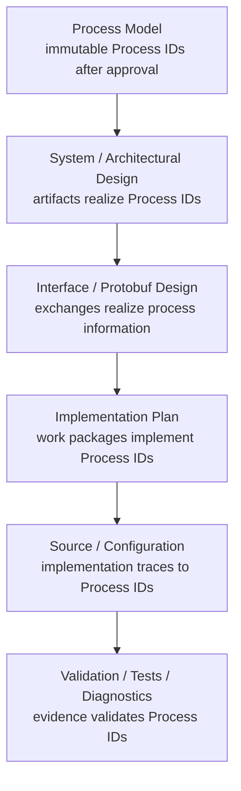

Downstream artifacts shall not create an independent functional naming scheme.

---

## 3. Standards and Modeling Method

### 3.1 IDEF0 / SADT

Each normative process is defined as a transformation with:

- **Inputs** — information consumed or transformed
- **Controls** — rules, authorities, configuration, validity constraints
- **Outputs** — information or state produced
- **Mechanisms** — logical capabilities only; not implementation artifacts

### 3.2 BPMN-style behavior, Mermaid representation

Event sequencing, asynchrony, loops, lifecycle, isolation, and external interaction are modeled with Mermaid `sequenceDiagram` and looped functional paths. BPMN XML is not used.

### 3.3 Traceability

Approved Process IDs are the stable cross-reference among Process Model, System Design, interfaces, implementation, tests, and diagnostics.

---

## 4. Process Identifier Governance

Proposed identifier form: `DSE-nn`. Hierarchical IDs (`DSE-nn.m`) are reserved and are **not** assigned in V0.2.

| Rule | Statement |
| --- | --- |
| Proposal | IDs in V0.2 are proposed until human approval |
| Immutability | After approval, IDs are not casually renumbered or reused |
| Meaning | An ID shall not silently acquire a materially different responsibility |
| Retirement | Removed processes retain the ID and are marked RETIRED |
| Supersession | Materially different replacement receives a new ID |

**DSE-00** is the top-level context function. **DSE-01** through **DSE-09** are its first-level decomposition.

---

## 5. Scope and System Boundary

In scope:

- inbound consumption of **published** Fin_FeedSat_1 information
- per-entity state coordination
- established Ehlers phase/cycle analysis
- evidence assembly
- experimental Strategy Maker and rotational transformation
- portfolio state
- Decision Strategy publication
- worker lifecycle/health
- diagnostics/evidence
- non-causal viewer boundary

Out of scope:

- Fin_FeedSat_1 internals, ingestion, gap filling, market-data acquisition
- Fin_FeedSat_1 Price Engine and Volume Engine internals
- DSE implementation, protobuf creation, viewer implementation
- broker execution, Cloudflare/Railway implementation, HACCAM implementation

Fin_FeedSat_1 is a **black-box upstream Producer**. The existing Fin_FeedSat_1 viewer is the intended proven external-consumer reference for inbound modeling. The exact viewer-consumed RPC/message set is an Open Engineering Decision. No Fin_FeedSat_1 change is required or authorized.

---

## 6. DSE Architectural Identity

| Attribute | Value | Class |
| --- | --- | --- |
| SatelliteRole | TransSat | DSE DESIGN DECISION |
| SubscriberType | PRODUCER_CONSUMER | DSE DESIGN DECISION |
| Causal runtime | DSE_TransSat_1_worker | DSE DESIGN DECISION |
| Non-causal surface | DSE_TransSat_1_viewer | DSE DESIGN DECISION |
| Upstream producer | Fin_FeedSat_1 published interface | EXISTING REPOSITORY FACT / OPEN ENGINEERING DECISION on exact consumed contract |

DSE consumes upstream authoritative information, performs its own transformation, and publishes new Decision Strategy information. It does not take ownership of consumed Fin_FeedSat_1 information.

---

## 7. Scientific / Information Ownership

| Information | Owner | DSE role |
| --- | --- | --- |
| Published Fin_FeedSat_1 information | Fin_FeedSat_1 | Consume; retain provenance; do not re-own |
| Phase/cycle evidence produced by DSE-03 | DSE_TransSat_1 | Own as DSE analytical information produced by an established external method |
| Assembled evidence pack | DSE_TransSat_1 | Own the assembly; do not own source Price/Volume science |
| Portfolio state | DSE_TransSat_1 | Own |
| Decision Strategy information | DSE_TransSat_1 | Own; this is the authoritative DSE Decision Strategy information |
| Viewer presentation/visual identity | DSE_TransSat_1_viewer | Present only; not scientifically authoritative |

Authoritative DSE output is Decision Strategy state, not chart geometry and not Fin_FeedSat_1 Price/Volume mathematics.

---

## 8. Top-Level Functional Context

DSE-00 transforms published upstream information into published DSE Decision Strategy information under strategy configuration, established Ehlers authority, validity rules, and lifecycle controls.

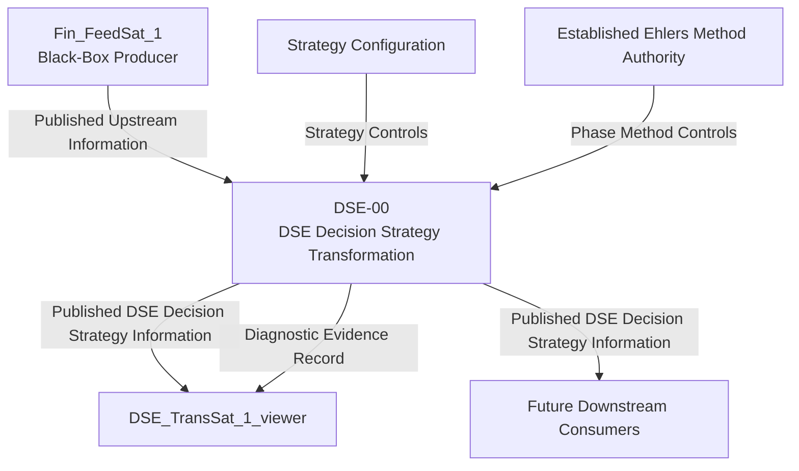

---

## 9. Functional Decomposition

Proposed first-level decomposition of DSE-00:

| ID | Label | One-line purpose |
| --- | --- | --- |
| DSE-00 | DSE Decision Strategy Transformation | Consume published upstream information and produce new authoritative Decision Strategy information |
| DSE-01 | Inbound Information Consumption | Consume published Fin_FeedSat_1 information, preserve provenance, and pass accepted information into per-entity processing without fabricating events |
| DSE-02 | Per-Entity State Coordination | Maintain independent 0..N entity input state so DSE-03 receives a usable ordered price-observation sequence per entity |
| DSE-03 | Established Phase / Cycle Analysis | Apply Ehlers Hilbert-transform / dominant-cycle phase method and emit phase evidence plus validity |
| DSE-04 | Evidence Assembly | Combine phase, Price, Volume, candidate, and portfolio evidence without destroying provenance |
| DSE-05 | Strategy Maker | Apply configured rotational strategy rules and emit a Decision Strategy determination |
| DSE-06 | Portfolio State Management | Own active/previous/mode portfolio state and apply only authorized portfolio-state transitions |
| DSE-07 | Decision Strategy Publication | Publish DSE-owned Decision Strategy information to downstream consumers |
| DSE-08 | Health / Lifecycle Management | Own runtime, connectivity, warm-up, validity, and strategy-readiness state |
| DSE-09 | Diagnostics / Evidence Recording | Record process evidence for proving, explanation, and validation |

Required internal stages of DSE-03, **not** assigned separate Process IDs in V0.2:

price observation sequence → smoothing → detrending → Hilbert transform → In-Phase I and Quadrature Q → dominant-cycle estimation → dominant period and phase → phase movement/delta → warm-up/validity.

---

## 10. Normative Process Definitions

Named information objects used below are normative for diagram linkage and the Process Interface / Linkage Table.

### DSE-00 — DSE Decision Strategy Transformation

| Field | Definition |
| --- | --- |
| PROCESS IDENTIFIER | DSE-00 |
| PROCESS LABEL | DSE Decision Strategy Transformation |
| PROCESS TYPE | Context function |
| PURPOSE | Transform published Fin_FeedSat_1 information into new DSE-owned Decision Strategy information |
| TRIGGER / INVOCATION | Presence of worker runtime and availability of published upstream information or lifecycle events |
| INPUTS | Published Upstream Information |
| CONTROLS | Strategy Configuration; Established Ehlers Method Authority; Validity/Readiness Rules; Isolation Rules |
| OUTPUTS | Published DSE Decision Strategy Information; Diagnostic Evidence Record; DSE Lifecycle Readiness State |
| MECHANISMS | Causal worker capability realizing DSE-01 through DSE-09 |
| STATE OWNERSHIP | Owns DSE-created state; does not own Fin_FeedSat_1 information |
| TRANSFORMATION | Consume → coordinate → analyze → assemble → decide → update portfolio → publish |
| PRECONDITIONS | Published upstream interface exists; DSE implementation is later authorized |
| POSTCONDITIONS | Downstream consumers can observe DSE-owned Decision Strategy information without affecting DSE science |
| READINESS / VALIDITY | Distinguishes runtime alive, phase warming, phase valid, strategy ready |
| UPSTREAM PROCESS REFERENCES | External: Fin_FeedSat_1 published interface |
| DOWNSTREAM PROCESS REFERENCES | DSE-01 through DSE-09; external viewer/consumers |
| FAILURE BEHAVIOR | Do not fabricate upstream events; degrade via DSE-08; continue science if viewer fails |
| ISOLATION BOUNDARY | Worker science isolated from viewer; entity states isolated from one another |
| CARDINALITY | One DSE-00 instance; 0..N entities |
| INFORMATION / SCIENTIFIC OWNERSHIP | Owns Decision Strategy information; consumes but does not own upstream authoritative information |
| NON-RESPONSIBILITIES | Fin_FeedSat_1 science; broker execution; HACCAM; viewer science |
| DIAGNOSTIC / VALIDATION EVIDENCE | End-to-end Decision Strategy publication under known upstream sequences |
| OPEN ITEMS | Exact consumed upstream contract; DSE outbound contract |

### DSE-01 — Inbound Information Consumption

| Field | Definition |
| --- | --- |
| PROCESS IDENTIFIER | DSE-01 |
| PROCESS LABEL | Inbound Information Consumption |
| PROCESS TYPE | Boundary consumption function |
| PURPOSE | Consume published Fin_FeedSat_1 information at the DSE boundary without modifying Fin_FeedSat_1 or reconstructing Fin_FeedSat_1 science |
| TRIGGER / INVOCATION | Upstream stream/event arrival; connect/reconnect lifecycle events |
| INPUTS | Published Upstream Information |
| CONTROLS | Published-interface contract; no-fabrication rule; no Fin_FeedSat_1 mutation rule; DSE boundary admissibility rules |
| OUTPUTS | Accepted Upstream Information Record; Inbound Connection Lifecycle Status |
| MECHANISMS | Logical inbound consumer capability modeled on the existing external viewer/client pattern |
| STATE OWNERSHIP | Owns inbound connection/admission state only |
| TRANSFORMATION | Receive published information → determine whether it is usable/admissible according to the published contract and DSE boundary rules → preserve required source identity/provenance → pass accepted information into per-entity processing; never fabricate, invent, or scientifically transform upstream observations |
| PRECONDITIONS | Upstream producer reachable or reconnect pending; contract identity known or explicitly open |
| POSTCONDITIONS | Only Accepted Upstream Information Records enter DSE-02 |
| READINESS / VALIDITY | Connection may be up/degraded/down independently of phase validity |
| UPSTREAM PROCESS REFERENCES | External Fin_FeedSat_1 published interface |
| DOWNSTREAM PROCESS REFERENCES | DSE-02; DSE-08; DSE-09 |
| FAILURE BEHAVIOR | On disconnect, stop admitting new records, report degraded status, retain last admitted state elsewhere; do not fabricate |
| ISOLATION BOUNDARY | Inbound failure does not itself mutate portfolio or invent strategy |
| CARDINALITY | One inbound consumer function; may admit records for 0..N entities |
| INFORMATION / SCIENTIFIC OWNERSHIP | Does not own upstream information |
| NON-RESPONSIBILITIES | Ingestion; gap filling; raw-market acquisition; Fin_FeedSat_1 internal engines; scientific transformation; speculative cross-stream correlation; imposing a total order not present in the published information; inventing missing observations; reconstructing unknown chronology |
| DIAGNOSTIC / VALIDATION EVIDENCE | Accepted-record log; disconnect/reconnect without fabricated events |
| OPEN ITEMS | Exact RPCs/messages consumed by the existing viewer; reconnect/backoff policy |

### DSE-02 — Per-Entity State Coordination

| Field | Definition |
| --- | --- |
| PROCESS IDENTIFIER | DSE-02 |
| PROCESS LABEL | Per-Entity State Coordination |
| PROCESS TYPE | State coordination function |
| PURPOSE | Maintain independent analytical input state per candidate entity and preserve a usable per-entity observation order so DSE-03 receives a sequential price-observation series per entity |
| TRIGGER / INVOCATION | Accepted Upstream Information Record for an entity |
| INPUTS | Accepted Upstream Information Record |
| CONTROLS | Entity identity rules; preservation of usable per-entity observation order; no lock-step rule; no wall-clock auto-advance rule; no synthetic cross-symbol or cross-stream total order |
| OUTPUTS | Per-Entity Analytical Input; Per-Entity Input State |
| MECHANISMS | Logical per-entity state store |
| STATE OWNERSHIP | Owns Per-Entity Input State for 0..N entities |
| TRANSFORMATION | Route accepted information to the corresponding entity state → update that entity only → preserve the order provided by the published interface and per-entity sequence continuity where the contract supplies the necessary information → emit Per-Entity Analytical Input for that entity |
| PRECONDITIONS | Record contains usable entity identity |
| POSTCONDITIONS | Unmentioned entities remain at last applicable state; DSE-03 receives a usable ordered price-observation sequence per entity |
| READINESS / VALIDITY | Entity may lack sufficient history even when runtime is alive |
| UPSTREAM PROCESS REFERENCES | DSE-01 |
| DOWNSTREAM PROCESS REFERENCES | DSE-03; DSE-04; DSE-09 |
| FAILURE BEHAVIOR | Fault in one entity state must not corrupt another entity state |
| ISOLATION BOUNDARY | Per-entity isolation is mandatory |
| CARDINALITY | 0..N entities; current four-entity proving is configuration, not architecture |
| INFORMATION / SCIENTIFIC OWNERSHIP | Owns DSE input-state assembly; not upstream science |
| NON-RESPONSIBILITIES | Phase mathematics; strategy decision; visual identity mapping; inventing missing upstream observations; synthesizing a cross-symbol total order; synthesizing a cross-stream total order; reconstructing unknown chronology; fabricating sequence values; changing scientific content |
| DIAGNOSTIC / VALIDATION EVIDENCE | Independent entity-advance tests; no wall-clock-only advance |
| OPEN ITEMS | Observation identity/order information available at the published boundary (OE-02); later Interface/System Design determines how the published contract satisfies DSE-03 sequential-input requirements |

### DSE-03 — Established Phase / Cycle Analysis

| Field | Definition |
| --- | --- |
| PROCESS IDENTIFIER | DSE-03 |
| PROCESS LABEL | Established Phase / Cycle Analysis |
| PROCESS TYPE | Established-method analytical function |
| PURPOSE | Compute dominant-cycle phase evidence from a sequential price-observation series using the recognized Ehlers method |
| TRIGGER / INVOCATION | Per-Entity Analytical Input containing an applicable observation for that entity |
| INPUTS | Per-Entity Analytical Input |
| CONTROLS | Established Ehlers Method Authority; Volume-exclusion rule; sequential-observation rule; warm-up/validity rules |
| OUTPUTS | Phase Cycle Evidence; Phase Validity State |
| MECHANISMS | Logical established phase-solver capability |
| STATE OWNERSHIP | Owns per-entity phase analytical state |
| TRANSFORMATION | Sequential price observations → smoothing → detrending → Hilbert transform → I and Q → dominant-cycle estimation → period, phase, phase delta → validity |
| PRECONDITIONS | Applicable observation exists; Volume is not a phase-solver input |
| POSTCONDITIONS | Phase Cycle Evidence is emitted with explicit Phase Validity State |
| READINESS / VALIDITY | Must distinguish warming versus valid; invalid phase is not strategy-ready evidence |
| UPSTREAM PROCESS REFERENCES | DSE-02 |
| DOWNSTREAM PROCESS REFERENCES | DSE-04; DSE-08; DSE-09 |
| FAILURE BEHAVIOR | Solver fault or insufficient history yields invalid/not-ready, not a silent valid phase |
| ISOLATION BOUNDARY | One entity's phase fault does not alter another entity's phase state |
| CARDINALITY | One logical solver application per entity observation advance |
| INFORMATION / SCIENTIFIC OWNERSHIP | DSE owns the computed phase evidence; method authority remains Ehlers |
| NON-RESPONSIBILITIES | Strategy; portfolio; Volume-modified Q; custom phase approximation |
| DIAGNOSTIC / VALIDATION EVIDENCE | Independent reference-method comparison; I/Q, period, phase, validity traces |
| OPEN ITEMS | Exact price-observation field from published upstream information; reference dataset selection |

### DSE-04 — Evidence Assembly

| Field | Definition |
| --- | --- |
| PROCESS IDENTIFIER | DSE-04 |
| PROCESS LABEL | Evidence Assembly |
| PROCESS TYPE | Provenance-preserving assembly function |
| PURPOSE | Assemble sibling evidence for strategy evaluation without destroying source provenance or mixing ownership |
| TRIGGER / INVOCATION | New Phase Cycle Evidence and/or available upstream Price/Volume evidence and/or candidate/entity context and/or Portfolio State relevant to evaluation |
| INPUTS | Phase Cycle Evidence; Phase Validity State; available upstream Price evidence; available upstream Volume evidence; candidate/entity context; Portfolio State; provenance/lineage necessary to keep evidence distinguishable |
| CONTROLS | Provenance-retention rule; sibling-evidence rule; invalid-phase exclusion from valid strategy evidence |
| OUTPUTS | Assembled Strategy Evidence Pack |
| MECHANISMS | Logical evidence-assembly capability |
| STATE OWNERSHIP | Owns the assembled pack, not the source sciences |
| TRANSFORMATION | Bind phase/cycle evidence, available upstream Price evidence, available upstream Volume evidence, and candidate/portfolio context into one evaluation pack with retained provenance. These remain logical sibling inputs; the exact messages, RPCs, fields, streams, and mapping that supply them belong to later Interface/System Design. |
| PRECONDITIONS | Entity identity is consistent across assembled items |
| POSTCONDITIONS | Strategy Maker can see what is valid versus warming versus absent |
| READINESS / VALIDITY | Pack carries validity; it does not upgrade invalid phase to valid |
| UPSTREAM PROCESS REFERENCES | DSE-02; DSE-03; DSE-06 |
| DOWNSTREAM PROCESS REFERENCES | DSE-05; DSE-09 |
| FAILURE BEHAVIOR | Missing/invalid items remain explicitly missing/invalid |
| ISOLATION BOUNDARY | Assembly for one entity does not rewrite another entity's evidence |
| CARDINALITY | One pack per evaluation trigger; pack may include 0..N candidate snapshots |
| INFORMATION / SCIENTIFIC OWNERSHIP | Fin_FeedSat_1 remains owner of Price/Volume information; DSE owns phase/cycle information and the assembly |
| NON-RESPONSIBILITIES | Recalculating upstream Price science; recalculating upstream Volume science; altering Ehlers phase mathematics; destroying source provenance; making the strategy decision |
| DIAGNOSTIC / VALIDATION EVIDENCE | Pack traces showing provenance and validity flags |
| OPEN ITEMS | Exact Price and Volume fields, streams, and mapping from the published consumer contract (OE-01, OE-03) |

### DSE-05 — Strategy Maker

| Field | Definition |
| --- | --- |
| PROCESS IDENTIFIER | DSE-05 |
| PROCESS LABEL | Strategy Maker |
| PROCESS TYPE | Experimental strategy function |
| PURPOSE | Create a Decision Strategy determination from assembled evidence and configuration |
| TRIGGER / INVOCATION | Assembled Strategy Evidence Pack when strategy evaluation is permitted by readiness |
| INPUTS | Assembled Strategy Evidence Pack; Portfolio State |
| CONTROLS | Strategy Configuration; phase-zone definitions as configuration; confirmation/transition rules; no-silent-invalid-phase rule |
| OUTPUTS | Decision Strategy Determination |
| MECHANISMS | Logical strategy-evaluation capability |
| STATE OWNERSHIP | Owns current Decision Strategy Determination until replaced |
| TRANSFORMATION | Evaluate candidates and active portfolio context → HOLD or rotational action determination with reason/evidence |
| PRECONDITIONS | Strategy ready, or explicit not-ready determination is emitted; invalid phase cannot be treated as valid decision evidence |
| POSTCONDITIONS | A determination exists: ready action or explicit not-ready |
| READINESS / VALIDITY | Strategy ready is distinct from phase valid and runtime alive |
| UPSTREAM PROCESS REFERENCES | DSE-04; DSE-06 |
| DOWNSTREAM PROCESS REFERENCES | DSE-06; DSE-07; DSE-09 |
| FAILURE BEHAVIOR | On insufficient evidence, emit not-ready/hold-without-transition; do not invent superiority |
| ISOLATION BOUNDARY | Strategy evaluation does not execute broker orders |
| CARDINALITY | One current determination; candidate universe 0..N |
| INFORMATION / SCIENTIFIC OWNERSHIP | Owns experimental Decision Strategy information |
| NON-RESPONSIBILITIES | Established phase mathematics; broker execution; viewer ranking |
| DIAGNOSTIC / VALIDATION EVIDENCE | Deterministic determination logs with evidence references |
| OPEN ITEMS | Exact action vocabulary; phase-zone angles; confirmation rules; ranking method |

Proposed action concepts, **not frozen enums**: HOLD, HOP_ON, HOP_OFF, HOP_FROM_A_TO_B.

### DSE-06 — Portfolio State Management

| Field | Definition |
| --- | --- |
| PROCESS IDENTIFIER | DSE-06 |
| PROCESS LABEL | Portfolio State Management |
| PROCESS TYPE | State ownership function |
| PURPOSE | Own active/previous/mode portfolio occupancy separately from candidate analytics and from recommendation |
| TRIGGER / INVOCATION | Decision Strategy Determination that requires a portfolio update, or initialization |
| INPUTS | Decision Strategy Determination |
| CONTROLS | Portfolio constraints; active strategy mode; Decision Strategy Determination; future approved Manual/Auto transition rules; no collapse of recommendation into occupancy |
| OUTPUTS | Portfolio State; Portfolio Transition Record |
| MECHANISMS | Logical portfolio-state capability |
| STATE OWNERSHIP | Owns Portfolio State |
| TRANSFORMATION | Apply an authorized portfolio-state transition only when authorized by the active strategy mode and controls; retain current occupancy on HOLD or not-ready. Authorization is not implied merely because DSE-05 emits a recommendation. |
| PRECONDITIONS | Determination is interpretable; authorization conditions are satisfied if occupancy changes |
| POSTCONDITIONS | Active entity, previous entity, and mode remain explicit |
| READINESS / VALIDITY | Occupancy may exist while strategy is not ready; that does not validate phase |
| UPSTREAM PROCESS REFERENCES | DSE-05 |
| DOWNSTREAM PROCESS REFERENCES | DSE-04; DSE-07; DSE-09 |
| FAILURE BEHAVIOR | Reject unauthorized or corrupt transition; retain last valid occupancy; report via DSE-08/DSE-09 |
| ISOLATION BOUNDARY | Portfolio occupancy is not visual identity and not broker position |
| CARDINALITY | At most one active entity in the current rotational concept; 0 is allowed |
| INFORMATION / SCIENTIFIC OWNERSHIP | DSE owns occupancy state |
| NON-RESPONSIBILITIES | Capital allocation; broker fills; trade execution; automatic execution merely because DSE-05 emits a recommendation; frozen Auto/Manual semantics; viewer active-styling |
| DIAGNOSTIC / VALIDATION EVIDENCE | Occupancy transition log with causing determination and authorization context |
| OPEN ITEMS | Multi-active constraints; Auto Engine / Manual Hop transition rules (OE-10) |

### DSE-07 — Decision Strategy Publication

| Field | Definition |
| --- | --- |
| PROCESS IDENTIFIER | DSE-07 |
| PROCESS LABEL | Decision Strategy Publication |
| PROCESS TYPE | Outbound publication function |
| PURPOSE | Publish DSE-owned Decision Strategy information without making downstream consumers causal |
| TRIGGER / INVOCATION | New Decision Strategy Determination and/or Portfolio State change authorized for publication |
| INPUTS | Decision Strategy Determination; Portfolio State; DSE Lifecycle Readiness State |
| CONTROLS | DSE outbound contract; non-causal consumer rule; no-wait-for-viewer rule |
| OUTPUTS | Published DSE Decision Strategy Information |
| MECHANISMS | Logical outbound publisher capability |
| STATE OWNERSHIP | Owns publication/session state, not consumer state |
| TRANSFORMATION | Project owned DSE state onto the published DSE information set |
| PRECONDITIONS | There is DSE-owned state to publish, including explicit not-ready |
| POSTCONDITIONS | Consumers may receive information; science continues if they do not |
| READINESS / VALIDITY | Published readiness must not overstate validity |
| UPSTREAM PROCESS REFERENCES | DSE-05; DSE-06; DSE-08 |
| DOWNSTREAM PROCESS REFERENCES | External viewer and future consumers |
| FAILURE BEHAVIOR | Slow or failed consumer does not block DSE-02 through DSE-06 |
| ISOLATION BOUNDARY | Publication isolated from scientific progress |
| CARDINALITY | 0..N downstream consumers |
| INFORMATION / SCIENTIFIC OWNERSHIP | Publishes DSE-owned information only |
| NON-RESPONSIBILITIES | Browser transport choice; Cloudflare/Railway; HACCAM |
| DIAGNOSTIC / VALIDATION EVIDENCE | Publication traces independent of viewer presence |
| OPEN ITEMS | Exact messages, RPCs, enums, package/service names |

### DSE-08 — Health / Lifecycle Management

| Field | Definition |
| --- | --- |
| PROCESS IDENTIFIER | DSE-08 |
| PROCESS LABEL | Health / Lifecycle Management |
| PROCESS TYPE | Control / lifecycle function |
| PURPOSE | Own and expose runtime, inbound connectivity, phase warming/valid, and strategy-ready states |
| TRIGGER / INVOCATION | Startup; Inbound Connection Lifecycle Status; Phase Validity State changes; process faults |
| INPUTS | Inbound Connection Lifecycle Status; Phase Validity State |
| CONTROLS | Readiness model; no-fabrication rule; no-silent-invalid-phase rule |
| OUTPUTS | DSE Lifecycle Readiness State |
| MECHANISMS | Logical lifecycle/health capability |
| STATE OWNERSHIP | Owns DSE Lifecycle Readiness State |
| TRANSFORMATION | Combine connectivity and validity signals into explicit readiness without inventing upstream data |
| PRECONDITIONS | Worker process exists |
| POSTCONDITIONS | Consumers and Strategy Maker can distinguish alive, warming, valid, strategy ready, degraded |
| READINESS / VALIDITY | This process is the readiness authority |
| UPSTREAM PROCESS REFERENCES | DSE-01; DSE-03 |
| DOWNSTREAM PROCESS REFERENCES | DSE-05; DSE-07; DSE-09 |
| FAILURE BEHAVIOR | Upstream loss → degraded, hold last DSE state, no fabricated observations |
| ISOLATION BOUNDARY | Lifecycle reporting does not itself compute phase or strategy |
| CARDINALITY | One readiness authority per worker |
| INFORMATION / SCIENTIFIC OWNERSHIP | Owns readiness interpretation |
| NON-RESPONSIBILITIES | Infrastructure deployment health except as later mapped |
| DIAGNOSTIC / VALIDATION EVIDENCE | Readiness transition log |
| OPEN ITEMS | Reconnect policy; degraded-publication detail |

### DSE-09 — Diagnostics / Evidence Recording

| Field | Definition |
| --- | --- |
| PROCESS IDENTIFIER | DSE-09 |
| PROCESS LABEL | Diagnostics / Evidence Recording |
| PROCESS TYPE | Evidence function |
| PURPOSE | Record raw phase diagnostics, strategy evidence, transitions, and explanations for proving and later tests |
| TRIGGER / INVOCATION | Outputs of DSE-01 through DSE-08 that constitute evidence |
| INPUTS | Accepted Upstream Information Record; Per-Entity Analytical Input; Phase Cycle Evidence; Phase Validity State; Assembled Strategy Evidence Pack; Decision Strategy Determination; Portfolio Transition Record; DSE Lifecycle Readiness State |
| CONTROLS | Evidence-retention rules; hide-complexity-not-information principle for later presentation |
| OUTPUTS | Diagnostic Evidence Record |
| MECHANISMS | Logical evidence/recording capability |
| STATE OWNERSHIP | Owns diagnostic records |
| TRANSFORMATION | Capture process evidence without changing scientific results |
| PRECONDITIONS | Source process has produced an evidence-bearing output |
| POSTCONDITIONS | Validation and explanation can trace to Process IDs |
| READINESS / VALIDITY | Diagnostics may exist while strategy is not ready |
| UPSTREAM PROCESS REFERENCES | DSE-01 through DSE-08 |
| DOWNSTREAM PROCESS REFERENCES | External viewer diagnostic layers; future TEST-DSE-nn artifacts |
| FAILURE BEHAVIOR | Diagnostic failure must not stop DSE-02 through DSE-07 |
| ISOLATION BOUNDARY | Evidence recording is non-causal to strategy |
| CARDINALITY | Evidence per entity and per determination as applicable |
| INFORMATION / SCIENTIFIC OWNERSHIP | Owns records of DSE-owned information and consumed upstream references |
| NON-RESPONSIBILITIES | Human-interface layout; log-vendor choice |
| DIAGNOSTIC / VALIDATION EVIDENCE | Self-describing traces tagged with Process IDs |
| OPEN ITEMS | Retention/export format |

---

## 11. Process Interface / Linkage Table

This table is normative. Split diagrams reconnect through these named objects.

| From | To | Information / State | Producer ownership | Consumer use | Trigger / delivery | Cardinality | Sync / async | Validity / precondition |
| --- | --- | --- | --- | --- | --- | --- | --- | --- |
| Fin_FeedSat_1 | DSE-01 | Published Upstream Information | Fin_FeedSat_1 | Consume at DSE boundary | Upstream publication | 0..N entities | Async stream | External producer available or reconnecting |
| DSE-01 | DSE-02 | Accepted Upstream Information Record | DSE admission only; content remains Fin_FeedSat_1 | Update entity input state | On accepted information | 1 record / 1 entity | Async per observation | Usable/admissible at published-contract boundary |
| DSE-01 | DSE-08 | Inbound Connection Lifecycle Status | DSE-01 | Readiness | On connect/disconnect/degrade | 1 worker | Async | Status is explicit |
| DSE-02 | DSE-03 | Per-Entity Analytical Input | DSE-02 | Phase analysis | On applicable entity observation | 1 entity | Async per entity | Usable per-entity observation order preserved; no synthetic cross-entity total order |
| DSE-02 | DSE-04 | Candidate/entity context | DSE-02 | Candidate context for evidence assembly | On state change or evaluation need | 0..N | Async | Provenance retained; does not imply physical carriage of all Price/Volume evidence |
| DSE-03 | DSE-04 | Phase Cycle Evidence | DSE-03 | Strategy evidence | After phase computation | 1 entity | Async per entity | Accompanied by validity |
| DSE-03 | DSE-04 / DSE-08 | Phase Validity State | DSE-03 | Exclude invalid evidence; readiness | After phase computation | 1 entity | Async | Warming is not valid |
| Fin_FeedSat_1 | DSE-04 | Available upstream Price evidence | Fin_FeedSat_1 | Sibling evidence | When available at published boundary | 0..N | Async | Mapping is Interface Design; OE-01/OE-03 remain open |
| Fin_FeedSat_1 | DSE-04 | Available upstream Volume evidence | Fin_FeedSat_1 | Sibling evidence | When available at published boundary | 0..N | Async | Mapping is Interface Design; OE-01 remains open |
| DSE-06 | DSE-04 | Portfolio State | DSE-06 | Active-context assembly | On occupancy change or evaluation | 0..1 active | Async | Occupancy explicit |
| DSE-04 | DSE-05 | Assembled Strategy Evidence Pack | DSE-04 | Strategy evaluation | When evaluation triggered | 1 pack | Async | Invalid phase not upgraded |
| DSE-06 | DSE-05 | Portfolio State | DSE-06 | Rotation context | With evaluation | 0..1 active | Async | Distinct from recommendation |
| DSE-05 | DSE-06 | Decision Strategy Determination | DSE-05 | Input to authorized portfolio-state transition or HOLD | After evaluation | 1 current | Async | Ready or explicit not-ready; recommendation is not occupancy |
| DSE-05 | DSE-07 | Decision Strategy Determination | DSE-05 | Publish | After evaluation | 1 current | Async | Do not wait for viewer |
| DSE-06 | DSE-07 | Portfolio State | DSE-06 | Publish occupancy | After authorized transition or HOLD publish | 0..1 active | Async | Occupancy is not visual identity |
| DSE-08 | DSE-05 / DSE-07 | DSE Lifecycle Readiness State | DSE-08 | Permit/deny ready decisions; publish readiness | On readiness change | 1 worker | Async | Alive, valid, and strategy ready are distinct |
| DSE-01..DSE-08 | DSE-09 | Evidence-bearing process outputs | Source process | Record | On evidence events | many | Async | Non-causal |
| DSE-07 | Viewer / future consumers | Published DSE Decision Strategy Information | DSE | Display/consume | On publication | 0..N consumers | Async | Consumer failure isolated |
| DSE-09 | Viewer diagnostic layer | Diagnostic Evidence Record | DSE-09 | Explain/prove | On record | 0..N | Async | Not authoritative for strategy |
| Strategy Configuration | DSE-00 / DSE-05 | Strategy Controls | Human/config authority | Govern experimental strategy | Configuration load/update | 1 active config | Control, not event fabric | Not a scientific output |
| Established Ehlers Method Authority | DSE-03 | Phase Method Controls | External method | Govern DSE-03 | Constant method authority | 1 method | Control | No Volume-altered Q |

---

## 12. State Ownership Model

Three DSE states are distinct and must not be collapsed.

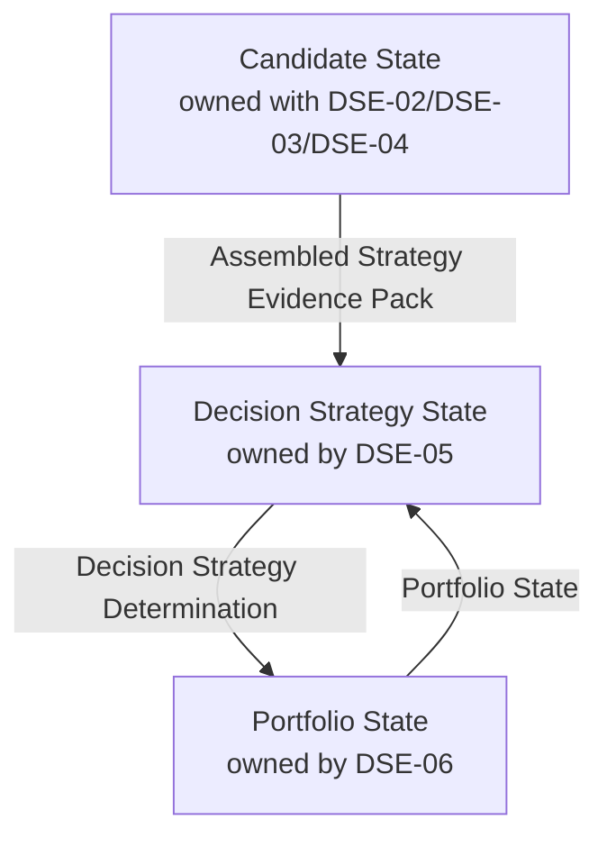

| State | Owner | Contains conceptually | Must not be treated as |
| --- | --- | --- | --- |
| Candidate State | DSE-02 / DSE-03 / DSE-04 | Entity analytical/strategy evidence, phase, period, Price/Volume references, eligibility | Active occupancy or visual Alpha/Beta/Gamma/Delta identity |
| Portfolio State | DSE-06 | Active entity, previous entity, entry context, strategy mode | Recommendation, broker fill, viewer highlight |
| Decision Strategy State | DSE-05 | HOLD / hop concepts, target entity, reason/evidence, not-ready | Occupancy already applied, or viewer interpretation |

Visual identity (Alpha/Beta/Gamma/Delta) is presentation mapping only. Scientific identity remains `entity_id`.

---

## 13. Event / Asynchronous Behavior

Required properties:

- Entities do not advance in lock-step.
- Wall-clock elapsed time does not by itself advance phase state.
- Only an applicable observation/event advances that entity's sequential calculation.
- Asynchronous arrival does **not** by itself prove phase correctness; observation/bar semantics remain an Open Engineering Decision.
- DSE science does not wait for the viewer.
- Publication and diagnostics are asynchronous with respect to scientific progress.

Persistent loop:

receive applicable observation → DSE-01 accept at boundary → DSE-02 update that entity → DSE-03 analyze → DSE-04 assemble → DSE-05 evaluate if permitted → DSE-06 apply authorized portfolio-state transition if required → DSE-07 publish → DSE-09 record → wait for next applicable observation.

---

## 14. Readiness / Validity Model

| State | Meaning | Permitted |
| --- | --- | --- |
| Runtime alive | DSE-00/worker process is operating | Lifecycle reporting |
| Inbound connected / degraded / down | DSE-01/DSE-08 connectivity | Consume only when connected; never fabricate when down |
| Phase warming | DSE-03 insufficient sequential history | Diagnostics; not valid strategy evidence |
| Phase valid | DSE-03 method output is usable | May enter assembled valid evidence |
| Strategy ready | DSE-05 may emit a ready determination | Decision Strategy action |
| Strategy not-ready | Explicit non-decision or constrained HOLD | Must not silently look like a validated hop |

Invalid/uninitialized phase must not silently become valid strategy evidence.

---

## 15. Failure Isolation Model

| Failure | Required isolation |
| --- | --- |
| Viewer absent, slow, or failed | DSE-02 through DSE-07 continue |
| One downstream consumer slow | Other consumers and science continue |
| One entity analytical fault | Other entity states remain intact |
| Upstream disconnect | No fabricated Published Upstream Information; last DSE state retained; degraded readiness |
| Diagnostic sink failure | Science and publication continue |
| Invalid phase | No ready hop determination using that phase as valid evidence |

---

## 16. Mermaid Functional Diagrams

Count: **5**. Linkage names match Section 11.

### 16.1 Inbound and per-entity state

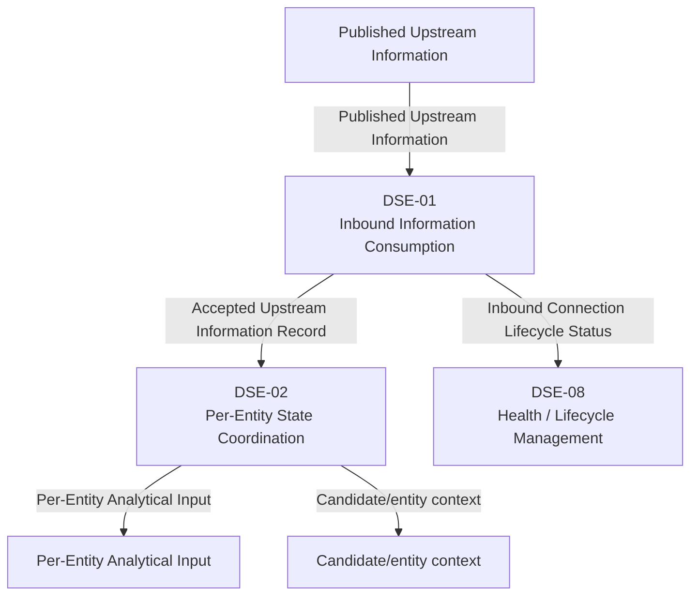

### 16.2 Analytical functions

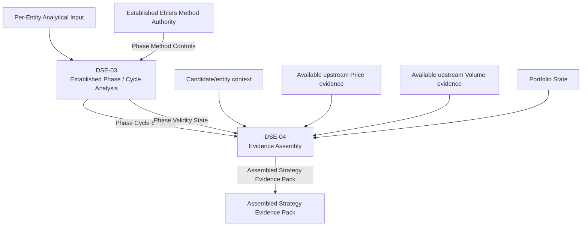

### 16.3 Strategy, portfolio, and publication

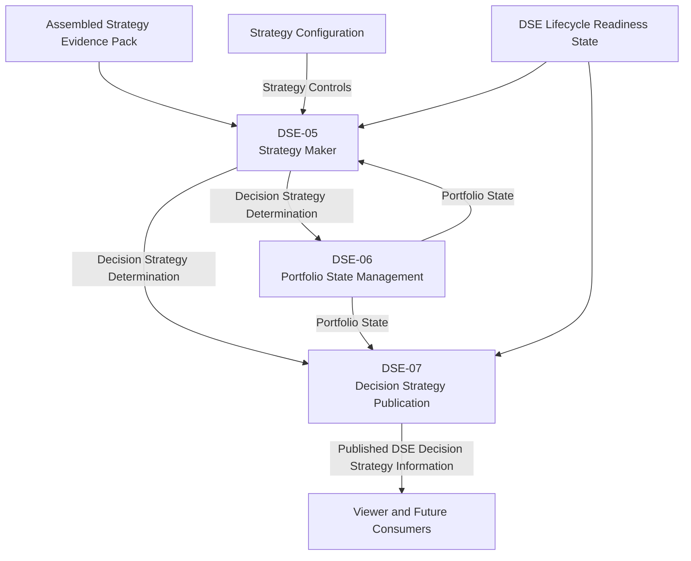

### 16.4 Lifecycle and diagnostics

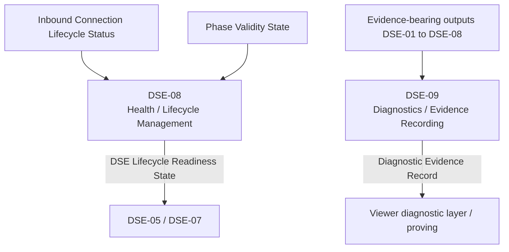

### 16.5 Isolation and non-causal viewer boundary

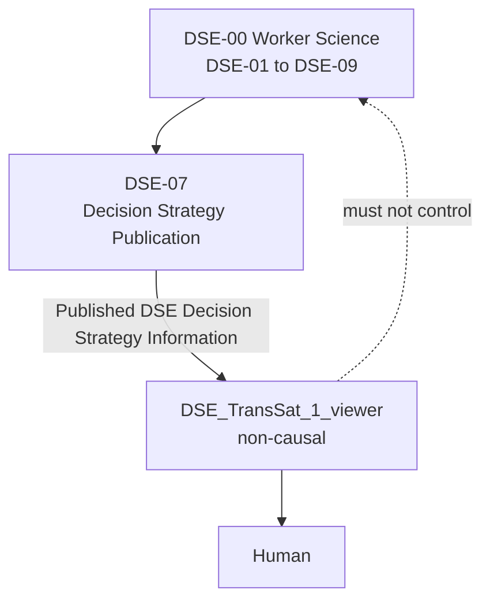

---

## 17. Mermaid Sequence Diagrams

Count: **8**.

### 17.1 Normal observation loop

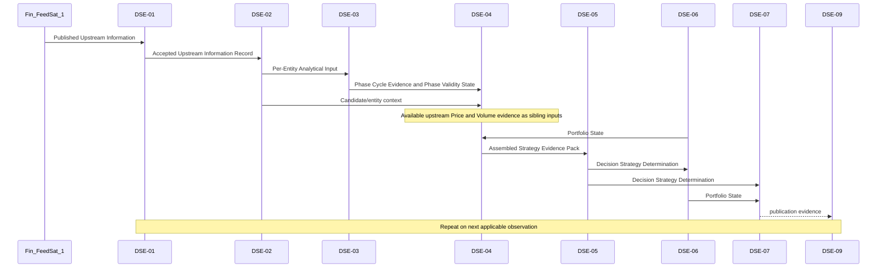

### 17.2 Independent asynchronous entity arrival

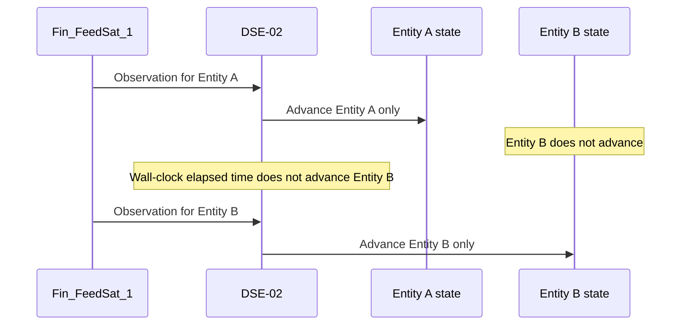

### 17.3 Phase warm-up to valid

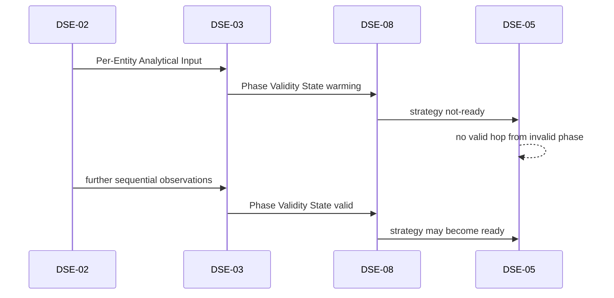

### 17.4 HOLD versus rotation

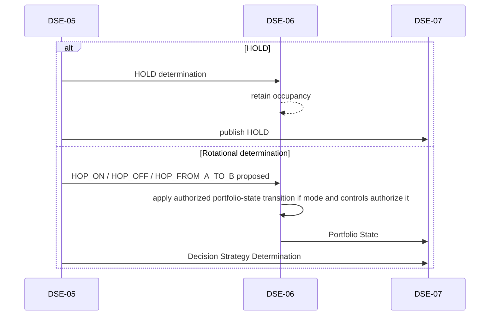

### 17.5 Viewer consumption is non-causal

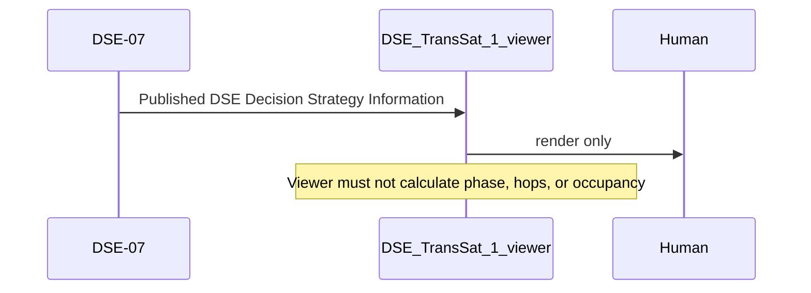

### 17.6 Upstream disconnect and recovery

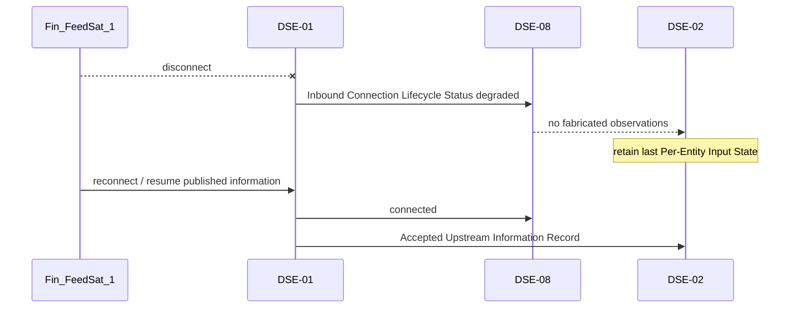

### 17.7 Isolated entity failure

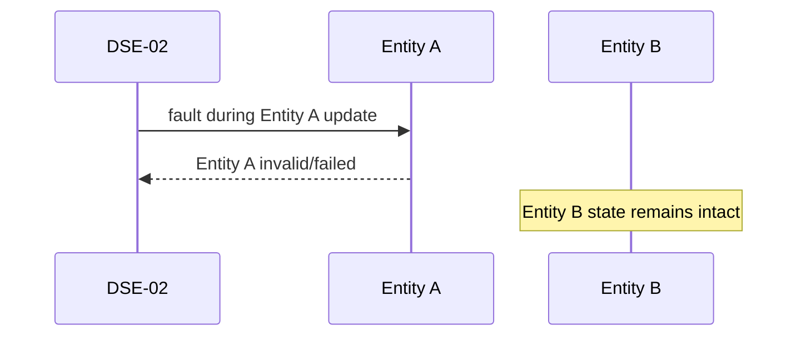

### 17.8 Downstream viewer failure or slow consumer

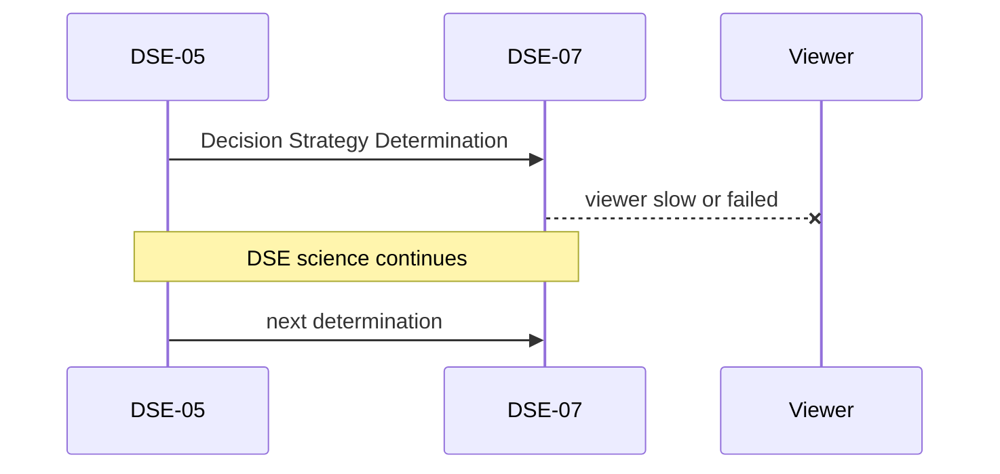

---

## 18. Viewer Boundary

`DSE_TransSat_1_viewer` is non-causal. It consumes **Published DSE Decision Strategy Information** and optional **Diagnostic Evidence Record**.

It must not:

- calculate phase, period, or I/Q
- determine Hop-On / Hop-Off
- rank candidates
- determine portfolio ownership
- calculate Decision Strategy

Presentation modes LIVE / LEARN / GAME are application modes, not separate engines.

Human-facing principle: hide complexity, not information. Primary UI uses ride/trajectory/HOLD/HOP language; mathematics remains in diagnostic layers.

Visual model may show four waves (Alpha/Beta/Gamma/Delta) as configuration. Architecture remains 0..N. Proposed target must remain visually distinct from active occupancy. Visualization is not authoritative.

Auto Engine and Manual Hop are future interaction modes. DSE recommendation is not broker execution.

---

## 19. Current Tramuthus Topology

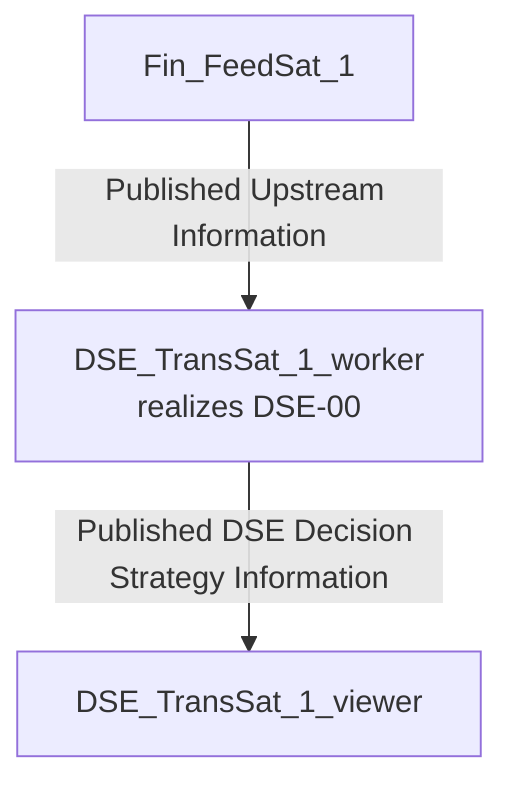

Direct connection is the proving topology. Deployment mechanics are System Design, not this Process Model.

---

## 20. Future HACCAM Topology

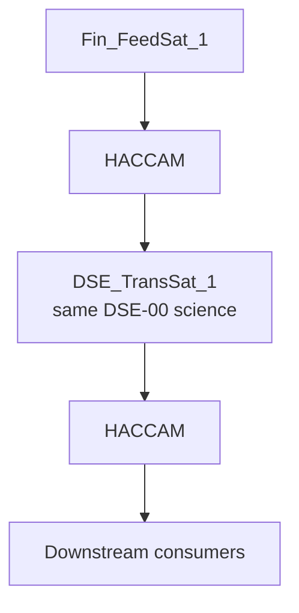

HACCAM is not implemented here. Given the same ordered Published Upstream Information, DIRECT and FEDERATED paths shall produce behaviorally equivalent DSE scientific/strategy results, subject only to explicitly modeled transport/lifecycle metadata.

---

## 21. Process Traceability Matrix

| Process ID | Label | Primary inputs | Primary outputs | State ownership | Upstream ID | Downstream ID | Scientific / policy authority | Validation evidence | Design artifact | Implementation artifact | Test artifact |
| --- | --- | --- | --- | --- | --- | --- | --- | --- | --- | --- | --- |
| DSE-00 | DSE Decision Strategy Transformation | Published Upstream Information | Published DSE Decision Strategy Information | DSE-created state | Fin_FeedSat_1 | DSE-01..09 / consumers | TransSat PRODUCER_CONSUMER | End-to-end sequence equivalence | TBD | TBD | TBD |
| DSE-01 | Inbound Information Consumption | Published Upstream Information | Accepted Upstream Information Record; Inbound Connection Lifecycle Status | Inbound connection/admission | Fin_FeedSat_1 | DSE-02, DSE-08, DSE-09 | No-fabrication; published-interface only | Consume unchanged published streams | TBD | TBD | TBD |
| DSE-02 | Per-Entity State Coordination | Accepted Upstream Information Record | Per-Entity Analytical Input; Per-Entity Input State | Per-Entity Input State | DSE-01 | DSE-03, DSE-04, DSE-09 | Preserve usable per-entity observation order; no synthetic total order | Independent entity advance | TBD | TBD | TBD |
| DSE-03 | Established Phase / Cycle Analysis | Per-Entity Analytical Input | Phase Cycle Evidence; Phase Validity State | Per-entity phase state | DSE-02 | DSE-04, DSE-08, DSE-09 | Ehlers method; Volume excluded | Reference-method comparison | TBD | TBD | TBD |
| DSE-04 | Evidence Assembly | Phase Cycle Evidence; Phase Validity State; available upstream Price evidence; available upstream Volume evidence; candidate/entity context; Portfolio State | Assembled Strategy Evidence Pack | Assembled pack | DSE-02, DSE-03, DSE-06 | DSE-05, DSE-09 | Provenance retention; sibling evidence; interface-neutral mapping | Pack provenance/validity traces | TBD | TBD | TBD |
| DSE-05 | Strategy Maker | Assembled Strategy Evidence Pack; Portfolio State | Decision Strategy Determination | Decision Strategy State | DSE-04, DSE-06, DSE-08 | DSE-06, DSE-07, DSE-09 | Experimental strategy configuration | Deterministic HOLD/HOP logs | TBD | TBD | TBD |
| DSE-06 | Portfolio State Management | Decision Strategy Determination | Portfolio State; Portfolio Transition Record | Portfolio State | DSE-05 | DSE-04, DSE-07, DSE-09 | Occupancy is not recommendation; transition only if authorized | Occupancy transition log | TBD | TBD | TBD |
| DSE-07 | Decision Strategy Publication | Determination; Portfolio State; readiness | Published DSE Decision Strategy Information | Publication session state | DSE-05, DSE-06, DSE-08 | Viewer / consumers | Non-causal consumers | Publish with viewer absent | TBD | TBD | TBD |
| DSE-08 | Health / Lifecycle Management | Connection status; Phase Validity State | DSE Lifecycle Readiness State | Readiness state | DSE-01, DSE-03 | DSE-05, DSE-07, DSE-09 | Alive, valid, and strategy ready are distinct | Readiness transition log | TBD | TBD | TBD |
| DSE-09 | Diagnostics / Evidence Recording | Evidence-bearing outputs | Diagnostic Evidence Record | Diagnostic records | DSE-01..DSE-08 | Viewer diagnostics / tests | Non-causal evidence | Process-ID-tagged traces | TBD | TBD | TBD |

---

## 22. Validation Model

Validation is defined, not implemented. Future tests shall use IDs of the form `TEST-DSE-nn-xxx` and validate the named Process ID.

| Order | Validates | Process IDs |
| --- | --- | --- |
| 1 | Consume published Fin_FeedSat_1 information unchanged | DSE-01 |
| 2 | Established Ehlers solver against reference method/dataset | DSE-03 |
| 3 | Independent per-entity analytical state | DSE-02, DSE-03 |
| 4 | Raw phase diagnostics | DSE-03, DSE-09 |
| 5 | Warm-up/valid/not-ready behavior | DSE-03, DSE-08, DSE-05 |
| 6 | Deterministic Strategy Maker | DSE-05 |
| 7 | Logged HOLD/HOP determinations with evidence | DSE-05, DSE-09 |
| 8 | Portfolio occupancy transitions | DSE-06 |
| 9 | Publication with viewer absent | DSE-07 |
| 10 | Viewer isolation / slow-consumer isolation | DSE-07, DSE-08 |
| 11 | Entity-fault isolation | DSE-02 |
| 12 | DIRECT vs later FEDERATED sequence equivalence | DSE-00 |

Do not optimize concurrency for four-entity proving.

---

## 23. Explicit Non-Responsibilities

DSE_TransSat_1 initially does **not** own or perform:

- Fin_FeedSat_1 internal science
- Fin_FeedSat_1 ingestion
- raw-market-data acquisition
- Fin_FeedSat_1 internal Price mathematics
- Fin_FeedSat_1 internal Volume mathematics
- Fin_FeedSat_1 protobuf ownership
- broker execution
- Cloudflare routing implementation
- Railway deployment implementation
- HACCAM implementation
- viewer-side strategy or phase calculations

---

## 24. Open Engineering Decisions

| ID | Item | Why open |
| --- | --- | --- |
| OE-01 | Exact published Fin_FeedSat_1 RPCs/messages consumed by the existing viewer | Bounded task uses viewer as consumer reference; exact contract not frozen here |
| OE-02 | Observation identity/order information available at the published boundary | Must come from published contract, not producer internals; later Interface Design determines how DSE-03 sequential-input requirements are satisfied |
| OE-03 | Which published field is the Ehlers price-observation sequence | DSE-03 requires sequential price observations; source field not frozen |
| OE-04 | DSE outbound protobuf/package/service/RPC/field names | Later interface design |
| OE-05 | Phase-zone angular boundaries | Experimental strategy configuration; prior 0/90/180/270 material was inconsistent |
| OE-06 | Frozen action enum names | HOLD / HOP_* remain proposed |
| OE-07 | Strategy configuration schema | Role defined; file/schema not created |
| OE-08 | Reconnect/backoff/replay policy | Implementation policy later; no fabrication is already mandatory |
| OE-09 | Browser update transport SSE versus WebSocket | Implementation-level; not frozen |
| OE-10 | Auto Engine versus Manual Hop acceptance rules | Interaction modes only; not broker execution |
| OE-11 | Candidate ranking method | Experimental |
| OE-12 | Diagnostic retention/export format | Later design |
| OE-13 | Hierarchical Process IDs under DSE-03 | Reserved; not assigned in V0.2 |

---

## 25. Implementation Preconditions

Implementation is **not authorized** by this document.

Before implementation:

1. Human approval of proposed Process IDs and boundaries
2. Confirmation of the published inbound consumer contract (OE-01) without modifying Fin_FeedSat_1
3. Separate System / Architectural Design mapped to Process IDs
4. Separate Interface / Protobuf Design mapped to Process IDs
5. Separate Implementation Plan organized by Process IDs
6. Independent Ehlers reference-validation approach for DSE-03
7. Explicit strategy configuration authority for experimental rules

Do not proceed from this document directly to Go, protobuf, or viewer source.

---

## 26. Change Log

| Version | Date | Change |
| --- | --- | --- |
| V0.1 | 2026-09-10 | Prior narrative process-model draft retained at `DSE_TRANS_SAT_1_PROCESS_MODEL_V0_1_091026.md`. |
| V0.2 | 2026-09-10 | Engineering-standard functional Process Model proposed for human review. Process IDs DSE-00 through DSE-09 proposed, not yet immutable. Final normalization before human approval: terminology cleanup, inbound-boundary neutralization, per-entity ordering clarification, interface-neutral evidence assembly, and portfolio-transition authorization clarification. |
