# DSE_TransSat_1 System / Architectural Design

**Title:** DSE_TransSat_1 System / Architectural Design
**Date:** 2026-09-10
**Version:** V0.1
**Status:** PROPOSED FOR HUMAN REVIEW
**Implementation:** NOT YET AUTHORIZED
**Parent Functional Authority:** DSE_TRANS_SAT_1_PROCESS_MODEL_V0_2_091026.md
**Parent Process Model Status:** APPROVED

This document is a System / Architectural Design. It realizes approved Process Identifiers **DSE-00 through DSE-09**. It does not redefine those identifiers. It does not authorize implementation, protobuf, Go, configuration files, or viewer source.

---

## 1. Executive Summary

DSE_TransSat_1 is architected as a causal worker realizing **DSE-00**, consuming **Published Upstream Information** from Fin_FeedSat_1 as a black-box producer and publishing **Published DSE Decision Strategy Information** to a non-causal viewer and future consumers.

This design is derived only from the APPROVED Process Model, principally Sections 10–17, 21–22, and 24–25, and from the normative Process Interface / Linkage Table in Section 11. Architectural artifacts exist only where a process mechanism or ownership boundary requires them. No additional scientific function is introduced.

The worker is composed of nine logical capabilities (**ARC-001** through **ARC-009**) plus the composition artifact **ARC-010** (DSE-00). Dependency order is taken from Section 11 edges, not from numeric Process ID order. **DSE-00 / ARC-010** is specified last.

Bounded published-consumer inspection found:

- [DSE_TransSat_1_viewer](DSE_TransSat_1_viewer/) is empty. The existing viewer contract named by the Process Model is **not present in this repository**.
- The Fin_FeedSat_1 published proto surface exists and is Fin_FeedSat_1-owned. It is evidence of a producer contract, not a frozen DSE inbound contract.
- An in-repo ingest client exists as a client-pattern fact. It is **not** the existing viewer.

Therefore **OE-01, OE-02, and OE-03 remain OPEN**. This design does not select RPCs, observation-order rules, or an Ehlers price field. **OE-04 through OE-13 remain OPEN**. New design gaps are recorded as **DG-01 through DG-06**.

Physical directory and package names under [DSE_TransSat_1_worker](DSE_TransSat_1_worker/) are proposed only. Names that are not justified by the Process Model are marked **PHYSICAL NAME NOT YET FROZEN**. No source, proto, stub, or test files are created by this document.

**Implementation is NOT YET AUTHORIZED.**

---

## 2. Engineering Authority and Scope

### 2.1 Authority

| Item | Value |
| --- | --- |
| Functional authority | APPROVED Process Model V0.2 |
| Process IDs | DSE-00 through DSE-09, immutable |
| This artifact type | System / Architectural Design (engineering lineage step SD) |
| Next authorized design step | Interface / Protobuf Design (not this document) |
| Implementation | NOT YET AUTHORIZED |

Intended lineage, unchanged from the Process Model:

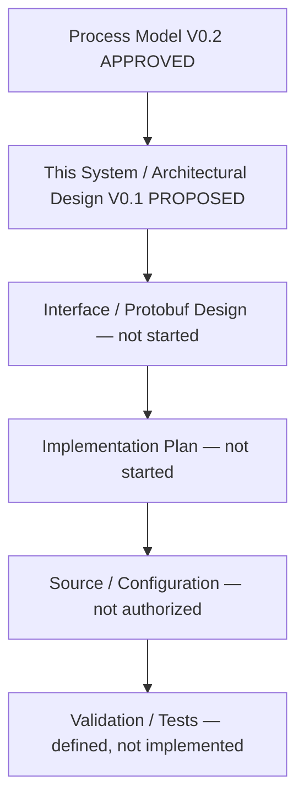

### 2.2 What this document defines

- Logical architectural artifacts that realize Process IDs
- Information-object catalog using Process Model names exactly
- Process-to-artifact mapping
- Information-linkage table reconciling exactly with Process Model Section 11
- One mutation authority per owned state
- Lifecycle, isolation, and DIRECT vs FEDERATED seam
- Proposed physical map without creating files
- Classification of OE-01..OE-13 and new DG-xx gaps

### 2.3 What this document does not define

- Go packages, structs, goroutines, queues, or concurrency mechanisms as implementation
- DSE protobuf packages, services, messages, or field names
- Frozen Fin_FeedSat_1 RPC/message consumption set
- Next.js/React components or SSE versus WebSocket
- Broker/execution semantics
- HACCAM implementation
- Fin_FeedSat_1 internal science or any Fin_FeedSat_1 change
- Resolution of OE-01..OE-13 by preference

### 2.4 Inspection bound used for DSE-01

Allowed: existing published consumer boundary (viewer / proto used by the viewer).

Performed:

| Target | Result |
| --- | --- |
| [DSE_TransSat_1_viewer](DSE_TransSat_1_viewer/) | Empty directory. No viewer source. Interface gap. |
| [Fin_FeedSat_1/api/proto/fin_feedsat/v1/Fin_FeedSat_1.proto](Fin_FeedSat_1/api/proto/fin_feedsat/v1/Fin_FeedSat_1.proto) | Published producer surface read at message/service names only |
| [Fin_FeedSat_1/cmd/fin-feedsat-ingest-client/main.go](Fin_FeedSat_1/cmd/fin-feedsat-ingest-client/main.go) | In-repo client pattern; not the existing viewer |
| Fin_FeedSat_1 internal engines, ingestion, pricing, volume, model host | **Not inspected** |

No Fin_FeedSat_1 change is proposed.

---

## 3. Design Method

1. Read the APPROVED Process Model as sole functional authority.
2. Treat Section 11 as the normative edge set.
3. Build the architectural dependency graph from those edges only.
4. Catalog named information objects without inventing proto or Go types.
5. Realize DSE-01 through DSE-09 in dependency order.
6. Realize DSE-00 last as worker composition.
7. Assign **ARC-xxx** only when a process mechanism or ownership boundary requires a distinct artifact.
8. Record remaining OE status and new design gaps. Do not close gaps by preference.

Forbidden moves used as a continuous check:

- Do not invent architecture absent from the Process Model.
- Do not resolve Open Engineering Decisions.
- Do not create code, proto, stubs, configuration, or tests.
- Do not modify the Process Model, Fin_FeedSat_1, or the viewer.
- Do not treat numeric Process ID order as runtime order.

---

## 4. Architectural Dependency Graph

Derived only from Process Model Section 11. Numeric IDs are labels, not schedule.

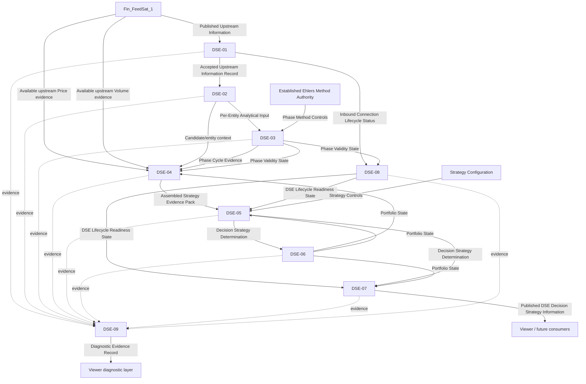

Feedback required by Section 11 and not collapsed:

- **DSE-06 → DSE-04** and **DSE-06 → DSE-05** (Portfolio State)
- **DSE-05 → DSE-06** (Decision Strategy Determination)
- Lifecycle: **DSE-01 / DSE-03 → DSE-08 → DSE-05 / DSE-07**
- Diagnostics: **DSE-01..DSE-08 → DSE-09** (non-causal)

DSE-06 may initialize occupancy without a prior determination. That initialization is a Process Model trigger, not a new edge.

Realization order used in this document:

1. DSE-01
2. DSE-02
3. DSE-03
4. DSE-08
5. DSE-06 (initialization and ownership; authorized transition remains downstream of DSE-05)
6. DSE-04
7. DSE-05
8. DSE-07
9. DSE-09
10. DSE-00 last

---

## 5. Information Object Catalog

Names are exactly those of the Process Model. These are logical objects. They are not protobuf messages and not Go structs.

| Information object | Producer | Consumer(s) | Architectural meaning | Must not be treated as |
| --- | --- | --- | --- | --- |
| Published Upstream Information | Fin_FeedSat_1 | DSE-01 | Producer-owned published information at the DSE boundary | DSE-owned science; fabricated events |
| Accepted Upstream Information Record | DSE-01 (admission only; content remains Fin_FeedSat_1) | DSE-02, DSE-09 | Boundary-admitted published information with preserved identity/provenance | Scientifically transformed observation; validated-beyond-contract claim |
| Inbound Connection Lifecycle Status | DSE-01 | DSE-08, DSE-09 | Explicit connect / degrade / down | Phase validity; strategy readiness |
| Per-Entity Analytical Input | DSE-02 | DSE-03, DSE-09 | Sequential price-observation series input for one entity | Cross-entity total order; Volume-modified phase input |
| Per-Entity Input State | DSE-02 | Owned state; not a Section 11 inter-process object except via Candidate/entity context | Last applicable per-entity input assembly | Occupancy; visual identity |
| Candidate/entity context | DSE-02 | DSE-04, DSE-09 | Candidate context for assembly; provenance retained | Physical carriage of all Price/Volume evidence |
| Phase Cycle Evidence | DSE-03 | DSE-04, DSE-09 | DSE-owned Ehlers-method evidence | Strategy determination; Volume-altered Q |
| Phase Validity State | DSE-03 | DSE-04, DSE-08, DSE-09 | Warming versus valid versus invalid/not-ready | Worker-level strategy ready by itself |
| Available upstream Price evidence | Fin_FeedSat_1 | DSE-04 | Sibling evidence at published boundary | DSE-recalculated Price science; phase-solver input |
| Available upstream Volume evidence | Fin_FeedSat_1 | DSE-04 | Sibling evidence at published boundary | Phase-solver input; Q = I * volume_modifier |
| Portfolio State | DSE-06 | DSE-04, DSE-05, DSE-07, DSE-09 | Active/previous/mode occupancy | Recommendation; broker fill; viewer highlight |
| Assembled Strategy Evidence Pack | DSE-04 | DSE-05, DSE-09 | Provenance-preserving evaluation pack | Upgrade of invalid phase to valid |
| Decision Strategy Determination | DSE-05 | DSE-06, DSE-07, DSE-09 | HOLD or rotational determination, or explicit not-ready | Occupancy already applied |
| Portfolio Transition Record | DSE-06 | DSE-09 | Record of authorized transition or retained occupancy | Viewer styling; broker execution |
| DSE Lifecycle Readiness State | DSE-08 | DSE-05, DSE-07, DSE-09 | Alive / connected-degraded-down / warming / valid / strategy ready distinctions | Fabricated upstream recovery |
| Published DSE Decision Strategy Information | DSE-07 | Viewer / future consumers | DSE-owned published projection | Causal control of the worker |
| Diagnostic Evidence Record | DSE-09 | Viewer diagnostic layer / future TEST-DSE-nn | Non-causal traces tagged with Process IDs | Authoritative strategy |
| Strategy Controls | Human/config authority | DSE-00 / DSE-05 | Govern experimental strategy | Scientific output; frozen schema (OE-07 open) |
| Phase Method Controls | Established Ehlers Method Authority | DSE-03 | Govern the established solver; Volume excluded | Experimental strategy rules |

---

## 6. Published Consumer Boundary Evidence (DSE-01 only)

### 6.1 Viewer

[DSE_TransSat_1_viewer](DSE_TransSat_1_viewer/) exists as a top-level directory and is empty. The Process Model’s “existing viewer/client pattern” therefore **cannot be confirmed inside this repository**. This is an interface gap, not a license to invent a viewer contract or to change Fin_FeedSat_1.

### 6.2 Published producer surface (evidence only; not frozen as DSE inbound contract)

From [Fin_FeedSat_1.proto](Fin_FeedSat_1/api/proto/fin_feedsat/v1/Fin_FeedSat_1.proto), Fin_FeedSat_1 publishes at least:

| Service | RPC | Message | Boundary note |
| --- | --- | --- | --- |
| IngestionService | StreamBars | Bar | OHLCV bar publication |
| IngestionService | GetBarWindow | BarWindow | Window retrieval |
| IngestionService | TriggerGapFill | GapFillResult | Gap fill. DSE-01 non-responsibility |
| ModelService | StreamDecisions | DecisionEvent | Model stream |
| ModelService | StreamPriceEvents | PriceEvent | Price evidence stream candidate |
| ModelService | StreamVolumeEvents | VolumeEvent | Volume evidence stream candidate |
| MarketFeedService | GetFeedHealth / GetActiveSource | FeedHealth / ActiveSource | Producer feed health |
| OperationsService | GetHealth / GetReadiness | HealthReport / ReadinessReport | Producer operations health; not DSE-08 |
| SemanticService | GetTerm / ListTerms / GetSemanticContract | semantic types | Vocabulary; not scientific input |

`Bar` includes `symbol`, `interval_start_unix_ms`, `market_snapshot_id`, `open`, `high`, `low`, `close`, `volume`, and related provenance fields. `DecisionEvent`, `PriceEvent`, and `VolumeEvent` also carry `symbol`, `interval_start_unix_ms`, and `market_snapshot_id`. Some model events carry `accepted_sequence`.

These facts do **not** freeze:

- which RPCs DSE-01 consumes (OE-01)
- how observation identity/order at the published boundary satisfies DSE-03 (OE-02)
- which published field is the Ehlers price-observation sequence (OE-03)

This design does not choose `close`, does not impose a cross-stream join, and does not impose a cross-symbol total order.

### 6.3 In-repo client pattern

[fin-feedsat-ingest-client](Fin_FeedSat_1/cmd/fin-feedsat-ingest-client/main.go) demonstrates a gRPC consumer of producer RPCs. It is not the existing viewer. DSE-01 may later be *modeled on* a consumer pattern; this document does not copy that client’s operation set into DSE. In particular, gap fill remains a DSE-01 non-responsibility.

### 6.4 Classification

| ID | Status after this design | Evidence class |
| --- | --- | --- |
| OE-01 | OPEN — partial producer-surface evidence; viewer consumption unconfirmed | EXISTING REPOSITORY FACT + OPEN ENGINEERING DECISION |
| OE-02 | OPEN | OPEN ENGINEERING DECISION |
| OE-03 | OPEN | OPEN ENGINEERING DECISION |

---

## 7. State Ownership Model

Unchanged from Process Model Section 12. One mutation authority per owned state.

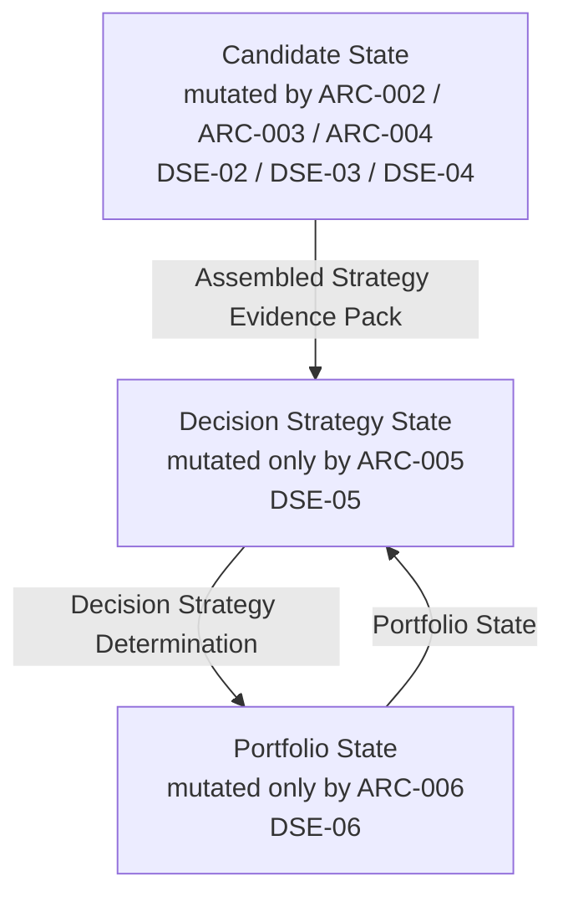

| State | Mutation authority | Contains conceptually | Must not be treated as |
| --- | --- | --- | --- |
| Candidate State | DSE-02 / DSE-03 / DSE-04 via ARC-002, ARC-003, ARC-004 | Analytical/strategy evidence, phase, period, Price/Volume references, eligibility | Active occupancy; Alpha/Beta/Gamma/Delta identity |
| Portfolio State | DSE-06 via ARC-006 only | Active entity, previous entity, entry context, strategy mode | Recommendation; broker fill; viewer highlight |
| Decision Strategy State | DSE-05 via ARC-005 only | HOLD / hop concepts, target entity, reason/evidence, not-ready | Occupancy already applied; viewer interpretation |
| Inbound connection/admission | DSE-01 via ARC-001 only | Connection/admission | Portfolio or phase |
| Per-entity phase analytical state | DSE-03 via ARC-003 only | Solver state per entity | Strategy or occupancy |
| DSE Lifecycle Readiness State | DSE-08 via ARC-008 only | Readiness interpretation | Phase mathematics; fabricated data |
| Publication/session state | DSE-07 via ARC-007 only | Publication session | Consumer state |
| Diagnostic records | DSE-09 via ARC-009 only | Evidence records | Authoritative strategy |

Visual identity (Alpha/Beta/Gamma/Delta) remains presentation mapping only. Scientific identity remains `entity_id`. Architecture remains **0..N** entities. Four-entity proving is configuration, not architecture.

---

## 8. Process Realizations and Architectural Artifacts

Each artifact below is justified by a Process Model mechanism and ownership boundary. Fields follow the Process Model ICOM set. Mechanisms remain logical capabilities.

---

### 8.1 DSE-01 — Inbound Information Consumption — ARC-001

| Field | Definition |
| --- | --- |
| ARTIFACT IDENTIFIER | ARC-001 |
| ARTIFACT LABEL | Inbound Consumer Boundary |
| ARTIFACT TYPE | Boundary consumption capability |
| REALIZES | DSE-01 |
| PURPOSE | Consume published Fin_FeedSat_1 information at the DSE boundary without modifying Fin_FeedSat_1 or reconstructing Fin_FeedSat_1 science |
| TRIGGER / INVOCATION | Upstream stream/event arrival; connect/reconnect lifecycle events |
| INPUTS | Published Upstream Information |
| CONTROLS | Published-interface contract; no-fabrication rule; no Fin_FeedSat_1 mutation rule; DSE boundary admissibility rules |
| OUTPUTS | Accepted Upstream Information Record; Inbound Connection Lifecycle Status |
| MECHANISMS | Logical inbound consumer capability modeled on the existing external viewer/client pattern |
| STATE OWNERSHIP | Owns inbound connection/admission state only |
| TRANSFORMATION | Receive published information → determine usable/admissible according to the published contract and DSE boundary rules → preserve required source identity/provenance → pass accepted information into per-entity processing; never fabricate, invent, or scientifically transform upstream observations |
| PRECONDITIONS | Upstream producer reachable or reconnect pending; contract identity known or explicitly open |
| POSTCONDITIONS | Only Accepted Upstream Information Records enter DSE-02 |
| READINESS / VALIDITY | Connection may be up/degraded/down independently of phase validity |
| UPSTREAM | External Fin_FeedSat_1 published interface |
| DOWNSTREAM | DSE-02 (ARC-002); DSE-08 (ARC-008); DSE-09 (ARC-009) |
| FAILURE BEHAVIOR | On disconnect, stop admitting new records, report degraded status; do not fabricate |
| ISOLATION BOUNDARY | Inbound failure does not itself mutate portfolio or invent strategy |
| CARDINALITY | One inbound consumer function; may admit records for 0..N entities |
| INFORMATION / SCIENTIFIC OWNERSHIP | Does not own upstream information |
| NON-RESPONSIBILITIES | Ingestion; gap filling; raw-market acquisition; Fin_FeedSat_1 internal engines; scientific transformation; speculative cross-stream correlation; imposing a total order not present in the published information; inventing missing observations; reconstructing unknown chronology |
| OPEN ITEMS | OE-01, OE-02, OE-08; DG-01, DG-02 |

**Architectural constraint:** ARC-001 does not realize the Section 11 edges Fin_FeedSat_1 → DSE-04 (Price/Volume). Those remain sibling inputs to ARC-004. Collapsing them into ARC-001 would invent a process edge that Section 11 does not contain.

---

### 8.2 DSE-02 — Per-Entity State Coordination — ARC-002

| Field | Definition |
| --- | --- |
| ARTIFACT IDENTIFIER | ARC-002 |
| ARTIFACT LABEL | Per-Entity Input State Store |
| ARTIFACT TYPE | State coordination capability |
| REALIZES | DSE-02 |
| PURPOSE | Maintain independent analytical input state per candidate entity and preserve a usable per-entity observation order so DSE-03 receives a sequential price-observation series per entity |
| TRIGGER / INVOCATION | Accepted Upstream Information Record for an entity |
| INPUTS | Accepted Upstream Information Record |
| CONTROLS | Entity identity rules; preservation of usable per-entity observation order; no lock-step rule; no wall-clock auto-advance rule; no synthetic cross-symbol or cross-stream total order |
| OUTPUTS | Per-Entity Analytical Input; Per-Entity Input State; Candidate/entity context |
| MECHANISMS | Logical per-entity state store |
| STATE OWNERSHIP | Owns Per-Entity Input State for 0..N entities |
| TRANSFORMATION | Route accepted information to the corresponding entity state → update that entity only → preserve the order provided by the published interface and per-entity sequence continuity where the contract supplies the necessary information → emit Per-Entity Analytical Input for that entity |
| PRECONDITIONS | Record contains usable entity identity |
| POSTCONDITIONS | Unmentioned entities remain at last applicable state; DSE-03 receives a usable ordered price-observation sequence per entity |
| READINESS / VALIDITY | Entity may lack sufficient history even when runtime is alive |
| UPSTREAM | DSE-01 (ARC-001) |
| DOWNSTREAM | DSE-03 (ARC-003); DSE-04 (ARC-004); DSE-09 (ARC-009) |
| FAILURE BEHAVIOR | Fault in one entity state must not corrupt another entity state |
| ISOLATION BOUNDARY | Per-entity isolation is mandatory |
| CARDINALITY | 0..N entities; current four-entity proving is configuration, not architecture |
| NON-RESPONSIBILITIES | Phase mathematics; strategy decision; visual identity mapping; inventing missing upstream observations; synthesizing a cross-symbol total order; synthesizing a cross-stream total order; reconstructing unknown chronology; fabricating sequence values; changing scientific content |
| OPEN ITEMS | OE-02 |

---

### 8.3 DSE-03 — Established Phase / Cycle Analysis — ARC-003

| Field | Definition |
| --- | --- |
| ARTIFACT IDENTIFIER | ARC-003 |
| ARTIFACT LABEL | Established Phase Solver |
| ARTIFACT TYPE | Established-method analytical capability |
| REALIZES | DSE-03 |
| PURPOSE | Compute dominant-cycle phase evidence from a sequential price-observation series using the recognized Ehlers method |
| TRIGGER / INVOCATION | Per-Entity Analytical Input containing an applicable observation for that entity |
| INPUTS | Per-Entity Analytical Input |
| CONTROLS | Established Ehlers Method Authority / Phase Method Controls; Volume-exclusion rule; sequential-observation rule; warm-up/validity rules |
| OUTPUTS | Phase Cycle Evidence; Phase Validity State |
| MECHANISMS | Logical established phase-solver capability |
| STATE OWNERSHIP | Owns per-entity phase analytical state |
| TRANSFORMATION | Sequential price observations → smoothing → detrending → Hilbert transform → I and Q → dominant-cycle estimation → period, phase, phase delta → validity |
| PRECONDITIONS | Applicable observation exists; Volume is not a phase-solver input |
| POSTCONDITIONS | Phase Cycle Evidence is emitted with explicit Phase Validity State |
| READINESS / VALIDITY | Must distinguish warming versus valid; invalid phase is not strategy-ready evidence |
| UPSTREAM | DSE-02 (ARC-002) |
| DOWNSTREAM | DSE-04 (ARC-004); DSE-08 (ARC-008); DSE-09 (ARC-009) |
| FAILURE BEHAVIOR | Solver fault or insufficient history yields invalid/not-ready, not a silent valid phase |
| ISOLATION BOUNDARY | One entity's phase fault does not alter another entity's phase state |
| CARDINALITY | One logical solver application per entity observation advance |
| INFORMATION / SCIENTIFIC OWNERSHIP | DSE owns the computed phase evidence; method authority remains Ehlers |
| NON-RESPONSIBILITIES | Strategy; portfolio; Volume-modified Q; custom phase approximation; hierarchical child Process IDs (OE-13 reserved, not assigned) |
| OPEN ITEMS | OE-03, OE-05 (angles are strategy, not solver), OE-13 |

**Architectural constraint:** Volume remains outside ARC-003. There is no architectural path that multiplies Q by a volume modifier.

---

### 8.4 DSE-08 — Health / Lifecycle Management — ARC-008

Specified here because Section 11 makes DSE-08 a consumer of DSE-01 and DSE-03 before it controls DSE-05 and DSE-07.

| Field | Definition |
| --- | --- |
| ARTIFACT IDENTIFIER | ARC-008 |
| ARTIFACT LABEL | Lifecycle Readiness Authority |
| ARTIFACT TYPE | Control / lifecycle capability |
| REALIZES | DSE-08 |
| PURPOSE | Own and expose runtime, inbound connectivity, phase warming/valid, and strategy-ready states |
| TRIGGER / INVOCATION | Startup; Inbound Connection Lifecycle Status; Phase Validity State changes; process faults |
| INPUTS | Inbound Connection Lifecycle Status; Phase Validity State |
| CONTROLS | Readiness model; no-fabrication rule; no-silent-invalid-phase rule |
| OUTPUTS | DSE Lifecycle Readiness State |
| MECHANISMS | Logical lifecycle/health capability |
| STATE OWNERSHIP | Owns DSE Lifecycle Readiness State. This process is the readiness authority. |
| TRANSFORMATION | Combine connectivity and validity signals into explicit readiness without inventing upstream data |
| PRECONDITIONS | Worker process exists |
| POSTCONDITIONS | Consumers and Strategy Maker can distinguish alive, warming, valid, strategy ready, degraded |
| UPSTREAM | DSE-01 (ARC-001); DSE-03 (ARC-003) |
| DOWNSTREAM | DSE-05 (ARC-005); DSE-07 (ARC-007); DSE-09 (ARC-009) |
| FAILURE BEHAVIOR | Upstream loss → degraded, hold last DSE state, no fabricated observations |
| ISOLATION BOUNDARY | Lifecycle reporting does not itself compute phase or strategy |
| CARDINALITY | One readiness authority per worker |
| NON-RESPONSIBILITIES | Infrastructure deployment health except as later mapped; Fin_FeedSat_1 OperationsService readiness is not this state |
| OPEN ITEMS | OE-08; DG-04 |

**Design gap DG-04:** Section 11 cardinality of Phase Validity State is per entity; DSE Lifecycle Readiness State is one per worker. This design does not invent an aggregation rule for mixed per-entity warming/valid conditions.

---

### 8.5 DSE-06 — Portfolio State Management — ARC-006

Specified before DSE-04 because Section 11 requires Portfolio State as an input to assembly and strategy evaluation. Authorized occupancy change remains downstream of DSE-05.

| Field | Definition |
| --- | --- |
| ARTIFACT IDENTIFIER | ARC-006 |
| ARTIFACT LABEL | Portfolio Occupancy Authority |
| ARTIFACT TYPE | State ownership capability |
| REALIZES | DSE-06 |
| PURPOSE | Own active/previous/mode portfolio occupancy separately from candidate analytics and from recommendation |
| TRIGGER / INVOCATION | Decision Strategy Determination that requires a portfolio update, or initialization |
| INPUTS | Decision Strategy Determination |
| CONTROLS | Portfolio constraints; active strategy mode; Decision Strategy Determination; future approved Manual/Auto transition rules; no collapse of recommendation into occupancy |
| OUTPUTS | Portfolio State; Portfolio Transition Record |
| MECHANISMS | Logical portfolio-state capability |
| STATE OWNERSHIP | Owns Portfolio State. Sole mutation authority for occupancy. |
| TRANSFORMATION | Apply an authorized portfolio-state transition only when authorized by the active strategy mode and controls; retain current occupancy on HOLD or not-ready. Authorization is not implied merely because DSE-05 emits a recommendation. |
| PRECONDITIONS | Determination is interpretable; authorization conditions are satisfied if occupancy changes |
| POSTCONDITIONS | Active entity, previous entity, and mode remain explicit |
| READINESS / VALIDITY | Occupancy may exist while strategy is not ready; that does not validate phase |
| UPSTREAM | DSE-05 (ARC-005); initialization |
| DOWNSTREAM | DSE-04 (ARC-004); DSE-05 (ARC-005); DSE-07 (ARC-007); DSE-09 (ARC-009) |
| FAILURE BEHAVIOR | Reject unauthorized or corrupt transition; retain last valid occupancy; report via DSE-08/DSE-09 |
| ISOLATION BOUNDARY | Portfolio occupancy is not visual identity and not broker position |
| CARDINALITY | At most one active entity in the current rotational concept; 0 is allowed |
| NON-RESPONSIBILITIES | Capital allocation; broker fills; trade execution; automatic execution merely because DSE-05 emits a recommendation; frozen Auto/Manual semantics; viewer active-styling |
| OPEN ITEMS | OE-10 |

---

### 8.6 DSE-04 — Evidence Assembly — ARC-004

| Field | Definition |
| --- | --- |
| ARTIFACT IDENTIFIER | ARC-004 |
| ARTIFACT LABEL | Evidence Assembler |
| ARTIFACT TYPE | Provenance-preserving assembly capability |
| REALIZES | DSE-04 |
| PURPOSE | Assemble sibling evidence for strategy evaluation without destroying source provenance or mixing ownership |
| TRIGGER / INVOCATION | New Phase Cycle Evidence and/or available upstream Price/Volume evidence and/or candidate/entity context and/or Portfolio State relevant to evaluation |
| INPUTS | Phase Cycle Evidence; Phase Validity State; available upstream Price evidence; available upstream Volume evidence; candidate/entity context; Portfolio State; provenance/lineage necessary to keep evidence distinguishable |
| CONTROLS | Provenance-retention rule; sibling-evidence rule; invalid-phase exclusion from valid strategy evidence |
| OUTPUTS | Assembled Strategy Evidence Pack |
| MECHANISMS | Logical evidence-assembly capability, including logical access to available upstream Price/Volume at the published boundary **without** routing those sibling inputs through DSE-01 admission into DSE-02/DSE-03 |
| STATE OWNERSHIP | Owns the assembled pack, not the source sciences |
| TRANSFORMATION | Bind phase/cycle evidence, available upstream Price evidence, available upstream Volume evidence, and candidate/portfolio context into one evaluation pack with retained provenance. These remain logical sibling inputs. Exact messages, RPCs, fields, streams, and mapping belong to later Interface Design. |
| PRECONDITIONS | Entity identity is consistent across assembled items |
| POSTCONDITIONS | Strategy Maker can see what is valid versus warming versus absent |
| READINESS / VALIDITY | Pack carries validity; it does not upgrade invalid phase to valid |
| UPSTREAM | DSE-02 (ARC-002); DSE-03 (ARC-003); DSE-06 (ARC-006); Fin_FeedSat_1 published Price/Volume evidence |
| DOWNSTREAM | DSE-05 (ARC-005); DSE-09 (ARC-009) |
| FAILURE BEHAVIOR | Missing/invalid items remain explicitly missing/invalid |
| ISOLATION BOUNDARY | Assembly for one entity does not rewrite another entity's evidence |
| CARDINALITY | One pack per evaluation trigger; pack may include 0..N candidate snapshots |
| INFORMATION / SCIENTIFIC OWNERSHIP | Fin_FeedSat_1 remains owner of Price/Volume information; DSE owns phase/cycle information and the assembly |
| NON-RESPONSIBILITIES | Recalculating upstream Price science; recalculating upstream Volume science; altering Ehlers phase mathematics; destroying source provenance; making the strategy decision |
| OPEN ITEMS | OE-01, OE-03; DG-02, DG-05 |

---

### 8.7 DSE-05 — Strategy Maker — ARC-005

| Field | Definition |
| --- | --- |
| ARTIFACT IDENTIFIER | ARC-005 |
| ARTIFACT LABEL | Strategy Evaluator |
| ARTIFACT TYPE | Experimental strategy capability |
| REALIZES | DSE-05 |
| PURPOSE | Create a Decision Strategy determination from assembled evidence and configuration |
| TRIGGER / INVOCATION | Assembled Strategy Evidence Pack when strategy evaluation is permitted by readiness |
| INPUTS | Assembled Strategy Evidence Pack; Portfolio State; DSE Lifecycle Readiness State as control/permit |
| CONTROLS | Strategy Configuration / Strategy Controls; phase-zone definitions as configuration; confirmation/transition rules; no-silent-invalid-phase rule; DSE Lifecycle Readiness State |
| OUTPUTS | Decision Strategy Determination |
| MECHANISMS | Logical strategy-evaluation capability |
| STATE OWNERSHIP | Owns current Decision Strategy Determination until replaced |
| TRANSFORMATION | Evaluate candidates and active portfolio context → HOLD or rotational action determination with reason/evidence |
| PRECONDITIONS | Strategy ready, or explicit not-ready determination is emitted; invalid phase cannot be treated as valid decision evidence |
| POSTCONDITIONS | A determination exists: ready action or explicit not-ready |
| READINESS / VALIDITY | Strategy ready is distinct from phase valid and runtime alive |
| UPSTREAM | DSE-04 (ARC-004); DSE-06 (ARC-006); DSE-08 (ARC-008) |
| DOWNSTREAM | DSE-06 (ARC-006); DSE-07 (ARC-007); DSE-09 (ARC-009) |
| FAILURE BEHAVIOR | On insufficient evidence, emit not-ready/hold-without-transition; do not invent superiority |
| ISOLATION BOUNDARY | Strategy evaluation does not execute broker orders |
| CARDINALITY | One current determination; candidate universe 0..N |
| NON-RESPONSIBILITIES | Established phase mathematics; broker execution; viewer ranking |
| OPEN ITEMS | OE-05, OE-06, OE-07, OE-10, OE-11 |

Proposed action concepts, **not frozen enums**: HOLD, HOP_ON, HOP_OFF, HOP_FROM_A_TO_B.

---

### 8.8 DSE-07 — Decision Strategy Publication — ARC-007

| Field | Definition |
| --- | --- |
| ARTIFACT IDENTIFIER | ARC-007 |
| ARTIFACT LABEL | Decision Strategy Publisher |
| ARTIFACT TYPE | Outbound publication capability |
| REALIZES | DSE-07 |
| PURPOSE | Publish DSE-owned Decision Strategy information without making downstream consumers causal |
| TRIGGER / INVOCATION | New Decision Strategy Determination and/or Portfolio State change authorized for publication |
| INPUTS | Decision Strategy Determination; Portfolio State; DSE Lifecycle Readiness State |
| CONTROLS | DSE outbound contract; non-causal consumer rule; no-wait-for-viewer rule |
| OUTPUTS | Published DSE Decision Strategy Information |
| MECHANISMS | Logical outbound publisher capability |
| STATE OWNERSHIP | Owns publication/session state, not consumer state |
| TRANSFORMATION | Project owned DSE state onto the published DSE information set |
| PRECONDITIONS | There is DSE-owned state to publish, including explicit not-ready |
| POSTCONDITIONS | Consumers may receive information; science continues if they do not |
| READINESS / VALIDITY | Published readiness must not overstate validity |
| UPSTREAM | DSE-05 (ARC-005); DSE-06 (ARC-006); DSE-08 (ARC-008) |
| DOWNSTREAM | External viewer and future consumers; DSE-09 (ARC-009) for publication evidence |
| FAILURE BEHAVIOR | Slow or failed consumer does not block DSE-02 through DSE-06 |
| ISOLATION BOUNDARY | Publication isolated from scientific progress |
| CARDINALITY | 0..N downstream consumers |
| NON-RESPONSIBILITIES | Browser transport choice (OE-09); Cloudflare/Railway; HACCAM; DSE protobuf names (OE-04) |
| OPEN ITEMS | OE-04, OE-09 |

---

### 8.9 DSE-09 — Diagnostics / Evidence Recording — ARC-009

| Field | Definition |
| --- | --- |
| ARTIFACT IDENTIFIER | ARC-009 |
| ARTIFACT LABEL | Diagnostic Recorder |
| ARTIFACT TYPE | Evidence capability |
| REALIZES | DSE-09 |
| PURPOSE | Record raw phase diagnostics, strategy evidence, transitions, and explanations for proving and later tests |
| TRIGGER / INVOCATION | Outputs of DSE-01 through DSE-08 that constitute evidence |
| INPUTS | Accepted Upstream Information Record; Per-Entity Analytical Input; Phase Cycle Evidence; Phase Validity State; Assembled Strategy Evidence Pack; Decision Strategy Determination; Portfolio Transition Record; DSE Lifecycle Readiness State |
| CONTROLS | Evidence-retention rules; hide-complexity-not-information principle for later presentation |
| OUTPUTS | Diagnostic Evidence Record |
| MECHANISMS | Logical evidence/recording capability |
| STATE OWNERSHIP | Owns diagnostic records |
| TRANSFORMATION | Capture process evidence without changing scientific results |
| PRECONDITIONS | Source process has produced an evidence-bearing output |
| POSTCONDITIONS | Validation and explanation can trace to Process IDs |
| READINESS / VALIDITY | Diagnostics may exist while strategy is not ready |
| UPSTREAM | DSE-01 through DSE-08 (ARC-001 through ARC-008) |
| DOWNSTREAM | External viewer diagnostic layers; future TEST-DSE-nn artifacts |
| FAILURE BEHAVIOR | Diagnostic failure must not stop DSE-02 through DSE-07 |
| ISOLATION BOUNDARY | Evidence recording is non-causal to strategy |
| CARDINALITY | Evidence per entity and per determination as applicable |
| NON-RESPONSIBILITIES | Human-interface layout; log-vendor choice |
| OPEN ITEMS | OE-12 |

---

### 8.10 DSE-00 — DSE Decision Strategy Transformation — ARC-010 (LAST)

| Field | Definition |
| --- | --- |
| ARTIFACT IDENTIFIER | ARC-010 |
| ARTIFACT LABEL | Causal Worker Composition |
| ARTIFACT TYPE | Context / composition capability |
| REALIZES | DSE-00 |
| PURPOSE | Transform published Fin_FeedSat_1 information into new DSE-owned Decision Strategy information |
| TRIGGER / INVOCATION | Presence of worker runtime and availability of published upstream information or lifecycle events |
| INPUTS | Published Upstream Information |
| CONTROLS | Strategy Configuration; Established Ehlers Method Authority; Validity/Readiness Rules; Isolation Rules |
| OUTPUTS | Published DSE Decision Strategy Information; Diagnostic Evidence Record; DSE Lifecycle Readiness State |
| MECHANISMS | Causal worker capability realizing DSE-01 through DSE-09 as ARC-001 through ARC-009 |
| STATE OWNERSHIP | Owns DSE-created state; does not own Fin_FeedSat_1 information |
| TRANSFORMATION | Consume → coordinate → analyze → assemble → decide → update portfolio → publish |
| PRECONDITIONS | Published upstream interface exists; DSE implementation is later authorized |
| POSTCONDITIONS | Downstream consumers can observe DSE-owned Decision Strategy information without affecting DSE science |
| READINESS / VALIDITY | Distinguishes runtime alive, phase warming, phase valid, strategy ready |
| UPSTREAM | External: Fin_FeedSat_1 published interface |
| DOWNSTREAM | DSE-01 through DSE-09; external viewer/consumers |
| FAILURE BEHAVIOR | Do not fabricate upstream events; degrade via DSE-08; continue science if viewer fails |
| ISOLATION BOUNDARY | Worker science isolated from viewer; entity states isolated from one another |
| CARDINALITY | One DSE-00 instance; 0..N entities |
| INFORMATION / SCIENTIFIC OWNERSHIP | Owns Decision Strategy information; consumes but does not own upstream authoritative information |
| NON-RESPONSIBILITIES | Fin_FeedSat_1 science; broker execution; HACCAM; viewer science |
| PHYSICAL REALIZATION | `DSE_TransSat_1_worker` realizes DSE-00. `DSE_TransSat_1_viewer` is not a mechanism of DSE-00. |
| OPEN ITEMS | Exact consumed upstream contract; DSE outbound contract |

ARC-010 introduces no additional transformation beyond the composition of ARC-001 through ARC-009.

---

## 9. Artifact Catalog

| Artifact | Label | Realizes | Type | Mutation / ownership | Justification |
| --- | --- | --- | --- | --- | --- |
| ARC-001 | Inbound Consumer Boundary | DSE-01 | Boundary consumption | Inbound connection/admission | Process mechanism: logical inbound consumer |
| ARC-002 | Per-Entity Input State Store | DSE-02 | State coordination | Per-Entity Input State | Process mechanism: logical per-entity state store |
| ARC-003 | Established Phase Solver | DSE-03 | Established-method analysis | Per-entity phase analytical state | Process mechanism: logical established phase-solver |
| ARC-004 | Evidence Assembler | DSE-04 | Provenance-preserving assembly | Assembled pack | Process mechanism: logical evidence-assembly; sibling Price/Volume access |
| ARC-005 | Strategy Evaluator | DSE-05 | Experimental strategy | Decision Strategy State | Process mechanism: logical strategy-evaluation |
| ARC-006 | Portfolio Occupancy Authority | DSE-06 | State ownership | Portfolio State | Process mechanism: logical portfolio-state |
| ARC-007 | Decision Strategy Publisher | DSE-07 | Outbound publication | Publication/session state | Process mechanism: logical outbound publisher |
| ARC-008 | Lifecycle Readiness Authority | DSE-08 | Control / lifecycle | DSE Lifecycle Readiness State | Process mechanism: logical lifecycle/health |
| ARC-009 | Diagnostic Recorder | DSE-09 | Evidence | Diagnostic records | Process mechanism: logical evidence/recording |
| ARC-010 | Causal Worker Composition | DSE-00 | Context / composition | DSE-created state as composed | Process mechanism: worker realizing DSE-01 through DSE-09 |

No other ARC identifiers are assigned. Strategy Configuration and Established Ehlers Method Authority remain **controls**, not architectural artifacts.

---

## 10. Process-to-Artifact Mapping

This table fills the Process Model Section 21 “Design artifact” column for this SD step only. Implementation and test artifacts remain TBD.

| Process ID | Label | Design artifact | Primary inputs | Primary outputs | State ownership |
| --- | --- | --- | --- | --- | --- |
| DSE-00 | DSE Decision Strategy Transformation | ARC-010 | Published Upstream Information | Published DSE Decision Strategy Information; Diagnostic Evidence Record; DSE Lifecycle Readiness State | DSE-created state |
| DSE-01 | Inbound Information Consumption | ARC-001 | Published Upstream Information | Accepted Upstream Information Record; Inbound Connection Lifecycle Status | Inbound connection/admission |
| DSE-02 | Per-Entity State Coordination | ARC-002 | Accepted Upstream Information Record | Per-Entity Analytical Input; Per-Entity Input State; Candidate/entity context | Per-Entity Input State |
| DSE-03 | Established Phase / Cycle Analysis | ARC-003 | Per-Entity Analytical Input | Phase Cycle Evidence; Phase Validity State | Per-entity phase state |
| DSE-04 | Evidence Assembly | ARC-004 | Phase Cycle Evidence; Phase Validity State; available upstream Price evidence; available upstream Volume evidence; candidate/entity context; Portfolio State | Assembled Strategy Evidence Pack | Assembled pack |
| DSE-05 | Strategy Maker | ARC-005 | Assembled Strategy Evidence Pack; Portfolio State | Decision Strategy Determination | Decision Strategy State |
| DSE-06 | Portfolio State Management | ARC-006 | Decision Strategy Determination | Portfolio State; Portfolio Transition Record | Portfolio State |
| DSE-07 | Decision Strategy Publication | ARC-007 | Determination; Portfolio State; readiness | Published DSE Decision Strategy Information | Publication session state |
| DSE-08 | Health / Lifecycle Management | ARC-008 | Connection status; Phase Validity State | DSE Lifecycle Readiness State | Readiness state |
| DSE-09 | Diagnostics / Evidence Recording | ARC-009 | Evidence-bearing outputs | Diagnostic Evidence Record | Diagnostic records |

---

## 11. Information-Linkage Reconciliation with Process Model Section 11

Every Section 11 row is realized. No extra inter-process scientific edge is added.

| From | To | Information / State | Producing artifact | Consuming artifact | Trigger / delivery | Cardinality | Sync / async | Validity / precondition | Reconciliation |
| --- | --- | --- | --- | --- | --- | --- | --- | --- | --- |
| Fin_FeedSat_1 | DSE-01 | Published Upstream Information | External producer | ARC-001 | Upstream publication | 0..N entities | Async stream | External producer available or reconnecting | Exact |
| DSE-01 | DSE-02 | Accepted Upstream Information Record | ARC-001 | ARC-002 | On accepted information | 1 record / 1 entity | Async per observation | Usable/admissible at published-contract boundary | Exact |
| DSE-01 | DSE-08 | Inbound Connection Lifecycle Status | ARC-001 | ARC-008 | On connect/disconnect/degrade | 1 worker | Async | Status is explicit | Exact |
| DSE-02 | DSE-03 | Per-Entity Analytical Input | ARC-002 | ARC-003 | On applicable entity observation | 1 entity | Async per entity | Usable per-entity observation order preserved; no synthetic cross-entity total order | Exact |
| DSE-02 | DSE-04 | Candidate/entity context | ARC-002 | ARC-004 | On state change or evaluation need | 0..N | Async | Provenance retained; does not imply physical carriage of all Price/Volume evidence | Exact |
| DSE-03 | DSE-04 | Phase Cycle Evidence | ARC-003 | ARC-004 | After phase computation | 1 entity | Async per entity | Accompanied by validity | Exact |
| DSE-03 | DSE-04 / DSE-08 | Phase Validity State | ARC-003 | ARC-004 / ARC-008 | After phase computation | 1 entity | Async | Warming is not valid | Exact |
| Fin_FeedSat_1 | DSE-04 | Available upstream Price evidence | External producer | ARC-004 | When available at published boundary | 0..N | Async | Mapping is Interface Design; OE-01/OE-03 remain open | Exact |
| Fin_FeedSat_1 | DSE-04 | Available upstream Volume evidence | External producer | ARC-004 | When available at published boundary | 0..N | Async | Mapping is Interface Design; OE-01 remains open | Exact |
| DSE-06 | DSE-04 | Portfolio State | ARC-006 | ARC-004 | On occupancy change or evaluation | 0..1 active | Async | Occupancy explicit | Exact |
| DSE-04 | DSE-05 | Assembled Strategy Evidence Pack | ARC-004 | ARC-005 | When evaluation triggered | 1 pack | Async | Invalid phase not upgraded | Exact |
| DSE-06 | DSE-05 | Portfolio State | ARC-006 | ARC-005 | With evaluation | 0..1 active | Async | Distinct from recommendation | Exact |
| DSE-05 | DSE-06 | Decision Strategy Determination | ARC-005 | ARC-006 | After evaluation | 1 current | Async | Ready or explicit not-ready; recommendation is not occupancy | Exact |
| DSE-05 | DSE-07 | Decision Strategy Determination | ARC-005 | ARC-007 | After evaluation | 1 current | Async | Do not wait for viewer | Exact |
| DSE-06 | DSE-07 | Portfolio State | ARC-006 | ARC-007 | After authorized transition or HOLD publish | 0..1 active | Async | Occupancy is not visual identity | Exact |
| DSE-08 | DSE-05 / DSE-07 | DSE Lifecycle Readiness State | ARC-008 | ARC-005 / ARC-007 | On readiness change | 1 worker | Async | Alive, valid, and strategy ready are distinct | Exact |
| DSE-01..DSE-08 | DSE-09 | Evidence-bearing process outputs | ARC-001..ARC-008 | ARC-009 | On evidence events | many | Async | Non-causal | Exact |
| DSE-07 | Viewer / future consumers | Published DSE Decision Strategy Information | ARC-007 | External non-causal consumer | On publication | 0..N consumers | Async | Consumer failure isolated | Exact |
| DSE-09 | Viewer diagnostic layer | Diagnostic Evidence Record | ARC-009 | External diagnostic consumer | On record | 0..N | Async | Not authoritative for strategy | Exact |
| Strategy Configuration | DSE-00 / DSE-05 | Strategy Controls | Human/config authority | ARC-010 / ARC-005 | Configuration load/update | 1 active config | Control, not event fabric | Not a scientific output | Exact |
| Established Ehlers Method Authority | DSE-03 | Phase Method Controls | External method | ARC-003 | Constant method authority | 1 method | Control | No Volume-altered Q | Exact |

---

## 12. Architectural Views

### 12.1 Context — DSE-00 / ARC-010

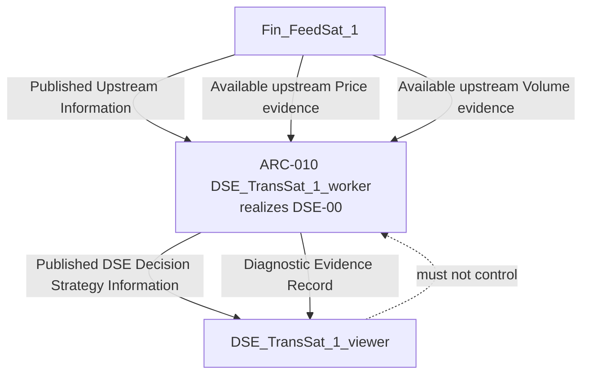

### 12.2 Inbound and per-entity state — DSE-01 / DSE-02

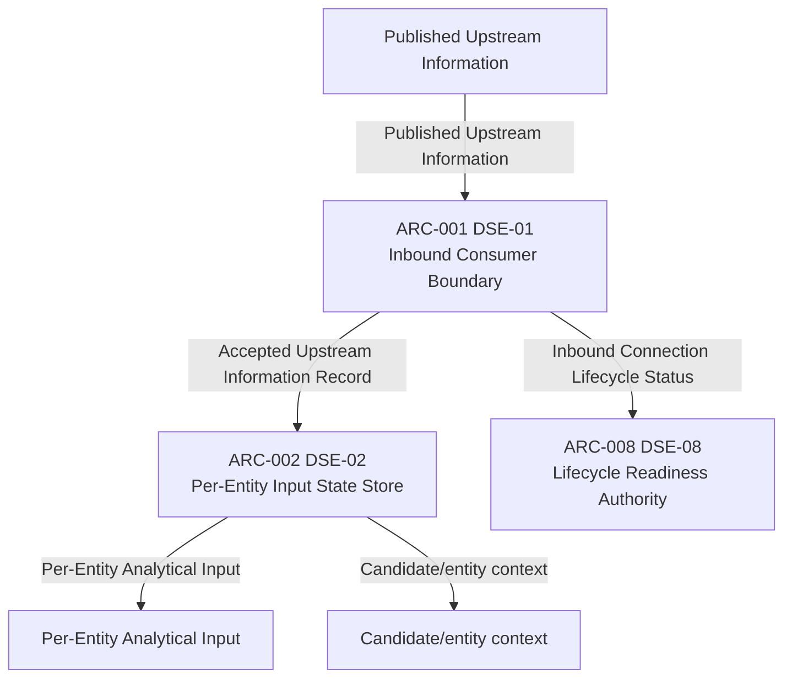

### 12.3 Analytical functions — DSE-03 / DSE-04

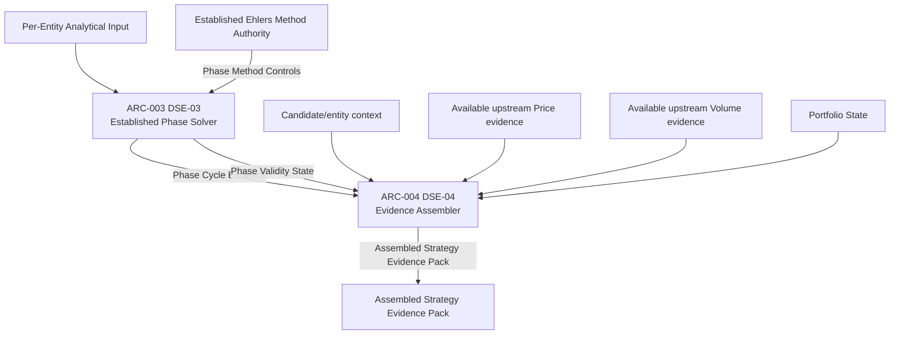

### 12.4 Strategy, portfolio, and publication — DSE-05 / DSE-06 / DSE-07

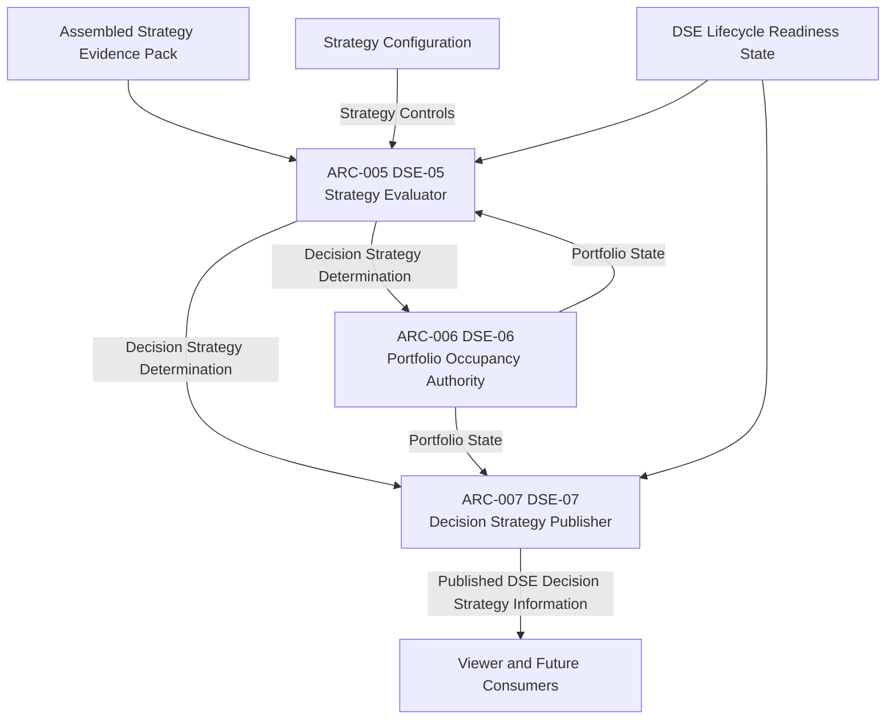

### 12.5 Lifecycle and diagnostics — DSE-08 / DSE-09

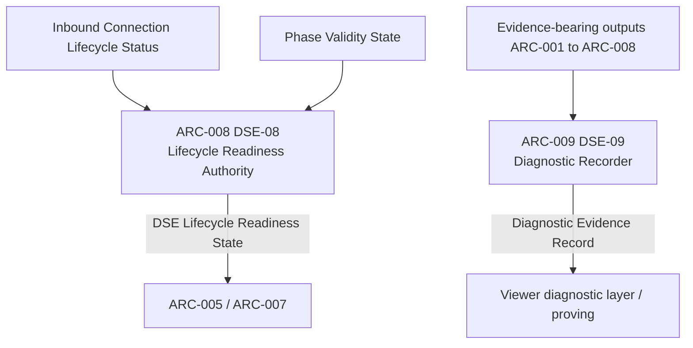

### 12.6 Isolation and non-causal viewer

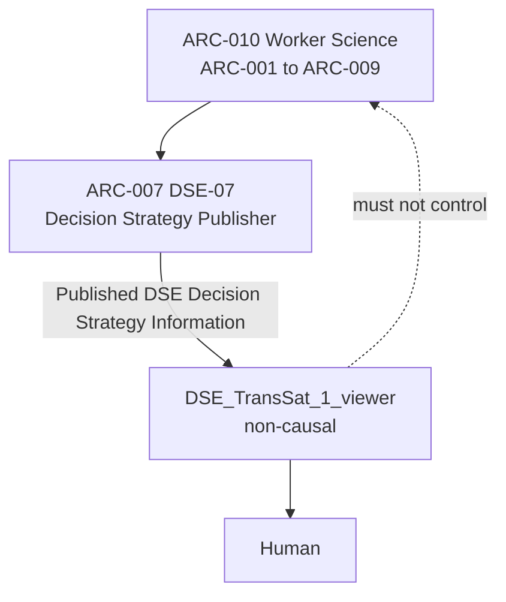

---

## 13. Lifecycle Sequence Diagrams

Process IDs and ARC IDs are both shown. These realize Process Model Section 17; they do not add scientific steps.

### 13.1 Normal observation loop

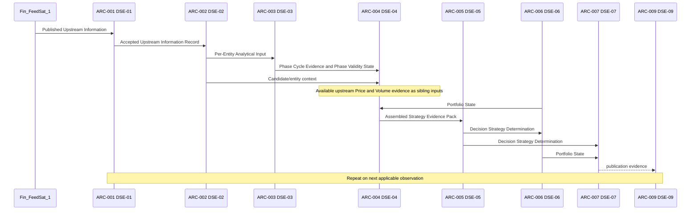

### 13.2 Independent asynchronous entity arrival

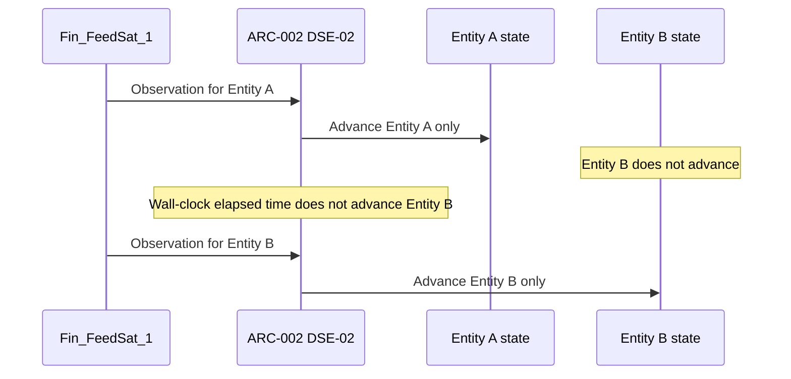

### 13.3 Phase warm-up to valid

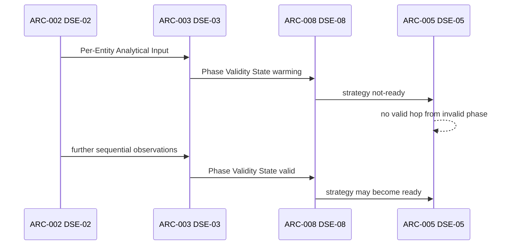

### 13.4 HOLD versus authorized rotation

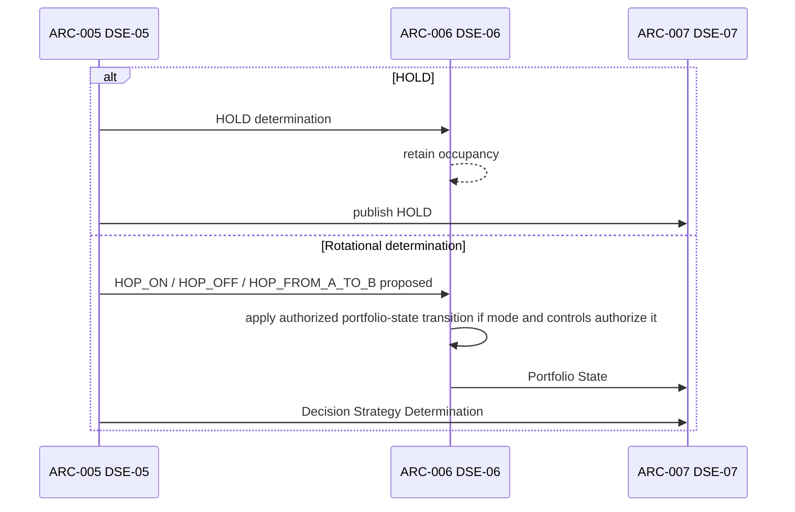

### 13.5 Viewer consumption is non-causal

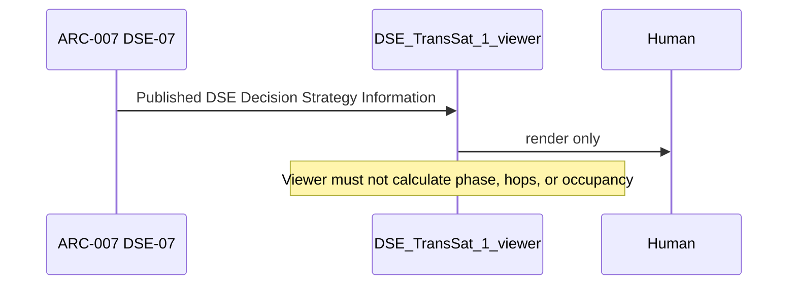

### 13.6 Upstream disconnect and recovery

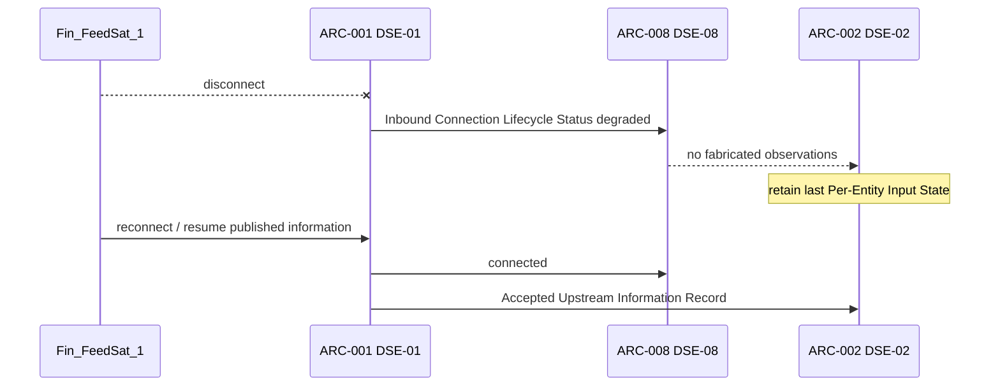

### 13.7 Isolated entity failure

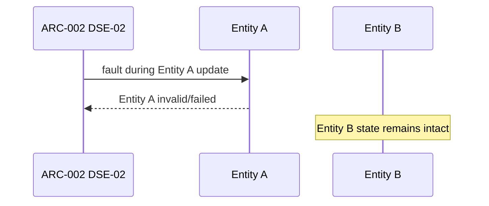

### 13.8 Downstream viewer failure or slow consumer

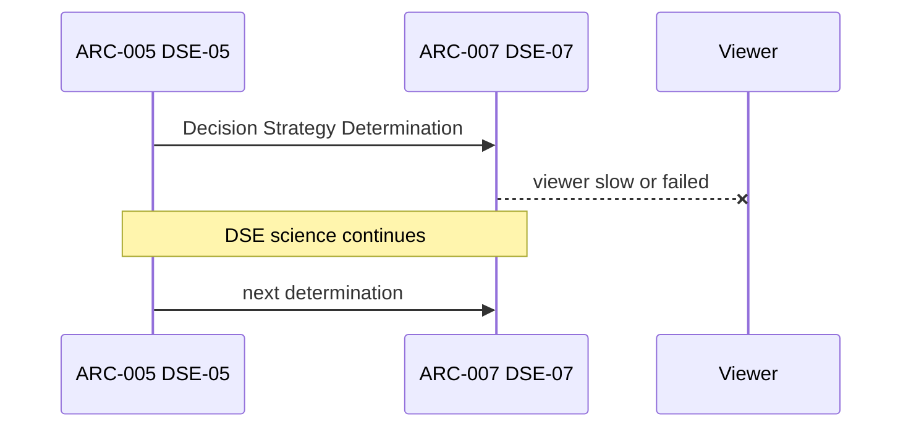

Persistent logical loop, unchanged:

receive applicable observation → DSE-01 accept at boundary → DSE-02 update that entity → DSE-03 analyze → DSE-04 assemble → DSE-05 evaluate if permitted → DSE-06 apply authorized portfolio-state transition if required → DSE-07 publish → DSE-09 record → wait for next applicable observation.

Entities do not advance in lock-step. Wall-clock elapsed time does not by itself advance phase state.

---

## 14. Failure Isolation Matrix

| Failure | Required isolation | Artifacts that must continue | Artifacts that must not invent |
| --- | --- | --- | --- |
| Viewer absent, slow, or failed | DSE-02 through DSE-07 continue | ARC-002..ARC-007 | ARC-007 must not wait; ARC-001 must not fabricate to “keep the UI busy” |
| One downstream consumer slow | Other consumers and science continue | ARC-002..ARC-007 | None |
| One entity analytical fault | Other entity states remain intact | ARC-002 / ARC-003 for other entities | ARC-003 must not emit silent valid phase for the failed entity |
| Upstream disconnect | No fabricated Published Upstream Information; last DSE state retained; degraded readiness | ARC-002 retains last state; ARC-006 retains occupancy; ARC-008 reports degraded | ARC-001 |
| Diagnostic sink failure | Science and publication continue | ARC-002 through ARC-007 | ARC-009 failure is non-causal |
| Invalid phase | No ready hop determination using that phase as valid evidence | ARC-005 emits not-ready/HOLD-without-transition as required | ARC-004 must not upgrade validity; ARC-005 must not invent superiority |
| Unauthorized determination | Occupancy unchanged | ARC-006 retains last valid occupancy | ARC-006 must not treat recommendation as occupancy |

---

## 15. Readiness / Validity Realization

| State | Meaning | Authority | Permitted |
| --- | --- | --- | --- |
| Runtime alive | DSE-00/worker process is operating | ARC-010 / ARC-008 | Lifecycle reporting |
| Inbound connected / degraded / down | DSE-01/DSE-08 connectivity | ARC-001 produces status; ARC-008 interprets | Consume only when connected; never fabricate when down |
| Phase warming | DSE-03 insufficient sequential history | ARC-003 produces; ARC-008 interprets | Diagnostics; not valid strategy evidence |
| Phase valid | DSE-03 method output is usable | ARC-003 produces; ARC-008 interprets | May enter assembled valid evidence |
| Strategy ready | DSE-05 may emit a ready determination | ARC-008 is readiness authority; ARC-005 emits determinations | Decision Strategy action |
| Strategy not-ready | Explicit non-decision or constrained HOLD | ARC-005 / ARC-008 | Must not silently look like a validated hop |

Invalid/uninitialized phase must not silently become valid strategy evidence.

---

## 16. DIRECT versus FEDERATED Seam

Current proving topology is DIRECT:

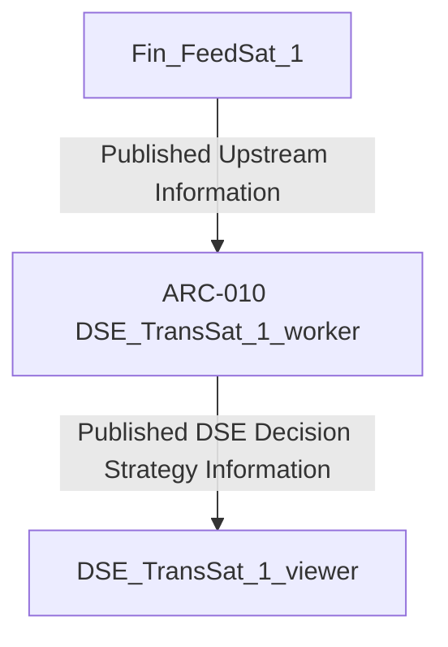

Future HACCAM topology is not implemented here:

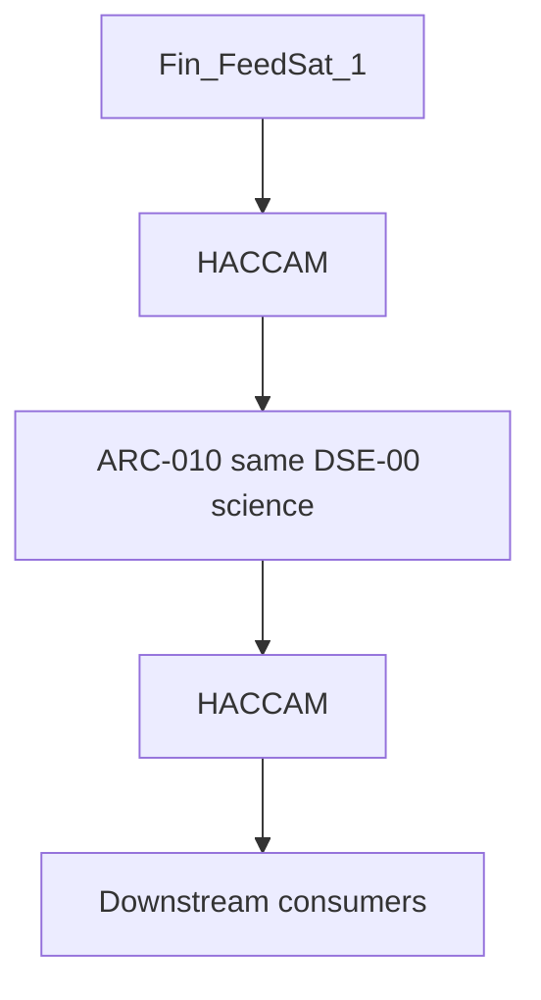

Architectural seam rule, from the Process Model and not extended:

Given the same ordered Published Upstream Information, DIRECT and FEDERATED paths shall produce behaviorally equivalent DSE scientific/strategy results, subject only to explicitly modeled transport/lifecycle metadata.

Therefore:

- ARC-001 through ARC-006 scientific transformations must not depend on DIRECT-only transport tricks.
- ARC-007 / ARC-008 may later distinguish transport/lifecycle metadata; they must not change phase or strategy results for the same ordered published information.
- This document does not design HACCAM.

---

## 17. Open Engineering Decisions — Status After This Design

None of OE-01..OE-13 is closed by preference.

| ID | Item | Status | Architectural handling |
| --- | --- | --- | --- |
| OE-01 | Exact published Fin_FeedSat_1 RPCs/messages consumed by the existing viewer | OPEN — partial producer-surface evidence; in-repo viewer absent | ARC-001 and ARC-004 remain contract-neutral |
| OE-02 | Observation identity/order information available at the published boundary | OPEN | ARC-002 preserves published order; does not synthesize total order |
| OE-03 | Which published field is the Ehlers price-observation sequence | OPEN | ARC-003 requires sequential price observations; field not selected |
| OE-04 | DSE outbound protobuf/package/service/RPC/field names | OPEN | ARC-007 is logical publication only |
| OE-05 | Phase-zone angular boundaries | OPEN | ARC-005 treats angles as configuration, not architecture |
| OE-06 | Frozen action enum names | OPEN | HOLD / HOP_* remain proposed |
| OE-07 | Strategy configuration schema | OPEN | Strategy Controls remain a control, not an artifact schema |
| OE-08 | Reconnect/backoff/replay policy | OPEN | No-fabrication is already mandatory on ARC-001 / ARC-008 |
| OE-09 | Browser update transport SSE versus WebSocket | OPEN | Out of scope for worker architecture |
| OE-10 | Auto Engine versus Manual Hop acceptance rules | OPEN | ARC-006 authorization remains unspecified beyond “authorized transition” |
| OE-11 | Candidate ranking method | OPEN | Experimental; not assigned to the viewer |
| OE-12 | Diagnostic retention/export format | OPEN | ARC-009 records logically only |
| OE-13 | Hierarchical Process IDs under DSE-03 | OPEN / reserved | No child Process IDs or child ARC IDs assigned |

---

## 18. New Design Gaps (DG-xx)

These are gaps created or made visible by architectural realization. They are not silent closures of OE items.

| ID | Gap | Why it is a gap | What this design does not do |
| --- | --- | --- | --- |
| DG-01 | In-repo published-consumer (viewer) evidence is missing | Process Model uses the existing viewer as inbound-contract reference; [DSE_TransSat_1_viewer](DSE_TransSat_1_viewer/) is empty | Does not invent a viewer contract; does not modify Fin_FeedSat_1 |
| DG-02 | Physical identity of DSE-01 inbound path versus DSE-04 sibling Price/Volume path is not frozen | Section 11 keeps distinct edges; later Interface Design may or may not share one physical client | Does not collapse the edges into one process |
| DG-03 | Proposed physical directory and package names are not frozen | Process Model forbids treating physical layout as functional architecture | Names marked PHYSICAL NAME NOT YET FROZEN |
| DG-04 | Worker-level DSE Lifecycle Readiness State versus per-entity Phase Validity State reduction is unspecified | Section 11: Phase Validity State cardinality is 1 entity; readiness is 1 worker | Does not invent all-valid, any-valid, or active-entity-only rules |
| DG-05 | Evaluation-trigger granularity for Assembled Strategy Evidence Pack is unspecified | Pack may include 0..N candidate snapshots while entities advance independently | Does not invent global-on-any-advance versus per-entity pack rules |
| DG-06 | Whether Fin_FeedSat_1 MarketFeed/Operations health RPCs contribute to Inbound Connection Lifecycle Status is unspecified | DSE-01 trigger includes connect/reconnect; producer health RPCs exist; mapping is not in Section 11 | Does not add a Section 11 edge from OperationsService to DSE-08 |

---

## 19. Proposed Physical Map

No files or directories beyond this document are created. Names not justified by the Process Model are **PHYSICAL NAME NOT YET FROZEN**.

```
DSE_TransSat_1_worker/                          realizes ARC-010 / DSE-00
  docs/                                         exists; design authority documents
    DSE_TRANS_SAT_1_PROCESS_MODEL_V0_1_091026.md
    DSE_TRANS_SAT_1_PROCESS_MODEL_V0_2_091026.md
    DSE_TRANS_SAT_1_SYSTEM_ARCHITECTURAL_DESIGN_V0_1_091026.md
  cmd/                                          PHYSICAL NAME NOT YET FROZEN
  internal/                                     PHYSICAL NAME NOT YET FROZEN
    inbound/                                    proposed seat of ARC-001 — PHYSICAL NAME NOT YET FROZEN
    entitystate/                                proposed seat of ARC-002 — PHYSICAL NAME NOT YET FROZEN
    phase/                                      proposed seat of ARC-003 — PHYSICAL NAME NOT YET FROZEN
    evidence/                                   proposed seat of ARC-004 — PHYSICAL NAME NOT YET FROZEN
    strategy/                                   proposed seat of ARC-005 — PHYSICAL NAME NOT YET FROZEN
    portfolio/                                  proposed seat of ARC-006 — PHYSICAL NAME NOT YET FROZEN
    publish/                                    proposed seat of ARC-007 — PHYSICAL NAME NOT YET FROZEN
    lifecycle/                                  proposed seat of ARC-008 — PHYSICAL NAME NOT YET FROZEN
    diagnostics/                                proposed seat of ARC-009 — PHYSICAL NAME NOT YET FROZEN
  api/                                          PHYSICAL NAME NOT YET FROZEN; OE-04 open
    proto/                                      not created; outbound contract unfrozen
```

`DSE_TransSat_1_viewer/` remains the non-causal consumer location. It is empty and is not modified.

Fin_FeedSat_1 remains an unmodified black-box producer.

---

## 20. Explicit Non-Responsibilities (unchanged)

DSE_TransSat_1 initially does **not** own or perform:

- Fin_FeedSat_1 internal science
- Fin_FeedSat_1 ingestion
- raw-market-data acquisition
- Fin_FeedSat_1 internal Price mathematics
- Fin_FeedSat_1 internal Volume mathematics
- Fin_FeedSat_1 protobuf ownership
- broker execution
- Cloudflare routing implementation
- Railway deployment implementation
- HACCAM implementation
- viewer-side strategy or phase calculations

---

## 21. Validation Mapping (defined, not implemented)

Future tests shall use IDs of the form `TEST-DSE-nn-xxx` and validate the named Process ID. This design does not create tests.

| Order | Validates | Process IDs | Artifacts |
| --- | --- | --- | --- |
| 1 | Consume published Fin_FeedSat_1 information unchanged | DSE-01 | ARC-001 |
| 2 | Established Ehlers solver against reference method/dataset | DSE-03 | ARC-003 |
| 3 | Independent per-entity analytical state | DSE-02, DSE-03 | ARC-002, ARC-003 |
| 4 | Raw phase diagnostics | DSE-03, DSE-09 | ARC-003, ARC-009 |
| 5 | Warm-up/valid/not-ready behavior | DSE-03, DSE-08, DSE-05 | ARC-003, ARC-008, ARC-005 |
| 6 | Deterministic Strategy Maker | DSE-05 | ARC-005 |
| 7 | Logged HOLD/HOP determinations with evidence | DSE-05, DSE-09 | ARC-005, ARC-009 |
| 8 | Portfolio occupancy transitions | DSE-06 | ARC-006 |
| 9 | Publication with viewer absent | DSE-07 | ARC-007 |
| 10 | Viewer isolation / slow-consumer isolation | DSE-07, DSE-08 | ARC-007, ARC-008 |
| 11 | Entity-fault isolation | DSE-02 | ARC-002 |
| 12 | DIRECT vs later FEDERATED sequence equivalence | DSE-00 | ARC-010 |

Do not optimize concurrency for four-entity proving.

---

## 22. Implementation Preconditions (still not satisfied)

Implementation is **not authorized** by this document.

Process Model Section 25, with this SD step marked:

1. Process Model approval completed on 2026-09-10. Does not authorize implementation.
2. Confirmation of the published inbound consumer contract (OE-01) without modifying Fin_FeedSat_1 — **not completed** (DG-01).
3. Separate System / Architectural Design mapped to Process IDs — **this document, PROPOSED FOR HUMAN REVIEW, not approved**.
4. Separate Interface / Protobuf Design mapped to Process IDs — **not started**.
5. Separate Implementation Plan organized by Process IDs — **not started**.
6. Independent Ehlers reference-validation approach for DSE-03 — **not started**.
7. Explicit strategy configuration authority for experimental rules — **not started** (OE-07).

Do not proceed from this document directly to Go, protobuf, or viewer source.

---

## 23. Reconciliation Checklist

| # | Check | Result |
| --- | --- | --- |
| 1 | Parent is Process Model V0.2 APPROVED | Yes |
| 2 | Process IDs DSE-00..DSE-09 unchanged | Yes |
| 3 | All Section 11 edges present | Yes, Section 11 of this document |
| 4 | No extra scientific inter-process edges | Yes |
| 5 | Information object names exact | Yes, Section 5 |
| 6 | Volume outside Ehlers solver | Yes, ARC-003 |
| 7 | No Q = I * volume_modifier path | Yes |
| 8 | Cardinality 0..N entities | Yes |
| 9 | No lock-step | Yes |
| 10 | No wall-clock auto-advance | Yes |
| 11 | No synthetic total order | Yes |
| 12 | DSE-01 output is Accepted Upstream Information Record | Yes |
| 13 | DSE-06 applies authorized transitions only | Yes, ARC-006 |
| 14 | Candidate / portfolio / decision states distinct | Yes, Section 7 |
| 15 | Viewer is non-causal | Yes, ARC-007 / Section 12.6 |
| 16 | DIRECT vs FEDERATED scientific equivalence stated, HACCAM not designed | Yes, Section 16 |
| 17 | Implementation not authorized | Yes |
| 18 | OE-01..OE-13 not resolved by preference | Yes, Section 17 |
| 19 | DSE-00 / ARC-010 specified last | Yes, Section 8.10 |
| 20 | ARC assigned only when justified | Yes, ARC-001..ARC-010 |
| 21 | Physical names not frozen where unjustified | Yes, Section 19 |
| 22 | No proto, Go, stubs, tests, or config created | Yes |
| 23 | Fin_FeedSat_1 and viewer unmodified | Yes |
| 24 | Exactly one design document | This file |
| 25 | Engineering lineage remains PM → SD → IF → IP → SC → VAL | Yes |

---

## 24. Next Authorized Engineering Artifact

After human architectural review of this document:

1. Do not implement.
2. Do not treat this V0.1 as approved until separately approved.
3. Next design artifact, when authorized: Interface / Protobuf Design mapped to Process IDs, addressing OE-01..OE-04 only with evidence, without modifying Fin_FeedSat_1.

---

## 25. Change Log

| Date | Version | Change |
| --- | --- | --- |
| 2026-09-10 | V0.1 | Initial System / Architectural Design derived from APPROVED Process Model V0.2. Status PROPOSED FOR HUMAN REVIEW. Implementation NOT YET AUTHORIZED. |
