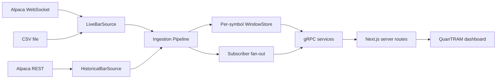

# QuanTRAM Current Code Functional Specification

**Date:** August 31, 2026  
**Source repository:** `C:\Users\chino\QuanTRAM`  
**Consumer repository:** `C:\Users\chino\quantram-dashboard`  
**Implementation status:** Increment 1 data ingestion

## Purpose

This document describes the functionality currently implemented in the QuanTRAM Go repository. It is intended to support continued development of the separate QuanTRAM dashboard by recording the runtime architecture, public gRPC contract, data semantics, health behavior, configuration, and known implementation boundaries that the dashboard can rely on today.

This is a code-derived specification, not a roadmap. Proposed model, risk, order, ledger, persistent history, and paper-trading capabilities are identified as unimplemented where relevant.

## System Scope

The current Go application implements the first QuanTRAM increment:

- live one-minute market-bar ingestion from Alpaca WebSocket feeds
- historical one-minute bar retrieval from Alpaca REST for gap filling
- local CSV bar replay for development and validation
- a bounded in-memory bar window per symbol
- server-streamed bar delivery to gRPC clients
- feed, component-health, and readiness reporting
- a command-line gRPC client for validation and diagnostics

The application does not currently implement model inference, signal generation, risk decisions, broker order submission, execution tracking, positions, PnL, ledger storage, benchmark analysis, authentication, or durable bar persistence.

## Repository and Module Structure

The Go module is named `quantram`, targets Go 1.25.3, and directly depends on Gorilla WebSocket, gRPC-Go, and Protocol Buffers.

| Area | Location in `C:\Users\chino\QuanTRAM` | Current responsibility |
| :--- | :--- | :--- |
| Server command | `cmd/quantram-server/main.go` | Loads configuration, constructs adapters and pipeline, hosts gRPC, and handles process signals. |
| Diagnostic client | `cmd/quantram-ingest-client/main.go` | Invokes stream, window, gap-fill, source, health, and readiness operations. |
| Public contract | `api/proto/quantram/v1/quantram.proto` | Defines bar and health messages and the three implemented gRPC services. |
| Generated Go API | `gen/quantram/v1` | Generated protobuf messages and gRPC client/server bindings. |
| Configuration | `internal/config/config.go` | Reads environment variables and defines runtime constants and limits. |
| Domain | `internal/domain` | Owns internal bar, quality, feed-state, component-state, and readiness types. |
| Market-feed adapters | `internal/marketfeed` | Implements Alpaca WebSocket, Alpaca REST, CSV replay, provider decoding, and source interfaces. |
| Ingestion | `internal/ingestion` | Owns the pipeline, circuit breaker, subscriber fan-out, gap recovery, deduplication, and bar windows. |
| gRPC adapter | `internal/server/server.go` | Validates requests and maps domain objects to protobuf responses. |
| Startup scripts | `scripts` | Provides PowerShell startup and local validation entry points. |
| Tests | `internal/**/*_test.go` | Covers decoding, REST behavior, circuit-breaker logic, and ingestion behavior. |

Domain and ingestion packages do not expose protobuf types. Conversion to the versioned API contract occurs in the gRPC server adapter.

## Runtime Architecture



The browser does not connect to Go gRPC directly. The dashboard's Next.js server is the gRPC client and translates protobuf values into JSON or Server-Sent Events for React.

## Process Startup and Shutdown

### Startup sequence

`cmd/quantram-server/main.go` performs the following steps:

1. Calls `config.Load()` and terminates the process if configuration is invalid.
2. Constructs either a CSV live source or an Alpaca live source plus Alpaca historical source.
3. Constructs one ingestion pipeline with a circuit breaker and a 64-bar window store.
4. Opens a TCP listener on `:<GRPC_PORT>`. This binds on all available interfaces, not only loopback.
5. Creates a gRPC server and registers `MarketFeedService`, `IngestionService`, and `OperationsService` on the same server object.
6. Starts `Pipeline.Run` in a goroutine.
7. Starts serving gRPC and waits for either a server error or a process interrupt/termination signal.

### Pipeline termination behavior

If the live source returns, `Pipeline.Run` drains bars already queued in its incoming channel, updates feed state, disables inference readiness, and returns. The caller logs a non-cancellation error. The current main function does not propagate that return into the gRPC server's control loop, so the gRPC server can remain reachable after the pipeline goroutine has stopped.

This behavior is especially visible with CSV replay: reaching end-of-file returns normally, the finite replay stops, and the gRPC server remains available with the last in-memory window.

### Shutdown sequence

On `Ctrl+C`, `SIGINT`, or `SIGTERM`, the shared context is cancelled and gRPC graceful shutdown begins. The server allows up to five seconds for active RPCs to finish, then calls a forced stop if necessary. There is no persistent store to flush.

## Configuration

Configuration is read from environment variables when the server starts.

| Variable | Default | Current behavior |
| :--- | :--- | :--- |
| `GRPC_PORT` | `50051` | Port used by the plaintext gRPC listener. |
| `QUANTRAM_SOURCE` | `alpaca` | Must be `alpaca` or `csv`. |
| `QUANTRAM_FEED` | `iex` | `test` selects the Alpaca test WebSocket; every other value selects the IEX WebSocket URL. The value is not otherwise rejected. |
| `QUANTRAM_SYMBOLS` | `AAPL` | Comma-separated symbols; values are trimmed, uppercased, deduplicated, and limited to 30. |
| `QUANTRAM_INTERVAL` | `1Min` | Loaded into configuration but not used by the current adapters; emitted and fetched bars are always `1Min`. |
| `QUANTRAM_CSV_PATH` | `AAPL_1min_firstratedata.csv` | CSV input path when `QUANTRAM_SOURCE=csv`. |
| `ALPACA_API_KEY` | none | Required for the Alpaca source. Surrounding spaces and single/double quotes are trimmed. |
| `ALPACA_API_SECRET` | none | Preferred Alpaca secret variable. |
| `ALPACA_SECRET_KEY` | none | Fallback secret variable when `ALPACA_API_SECRET` is absent. |
| `ALPACA_DATA_REST` | `https://data.alpaca.markets` | Base URL for historical bar requests. |

When the feed is `test` and `QUANTRAM_SYMBOLS` is unset, the configured symbol becomes `FAKEPACA`. CSV mode uses only the first configured symbol. Alpaca mode rejects more than 30 symbols, matching the Basic-plan cap encoded in the application.

Credentials are used in the Alpaca authentication requests and must not be logged, stored in either repository, or sent to the browser.

## Domain Bar Model

The internal `domain.Bar` is the canonical object passed from feed adapters through ingestion to the gRPC boundary.

| Field | Current semantics |
| :--- | :--- |
| `Symbol` | Provider ticker, such as `AAPL`; configured symbols are normalized to uppercase. |
| `InstrumentID` | Currently the same value as `Symbol`. |
| `InstrumentType` | Every non-empty symbol is currently classified as `STOCK`. |
| `Tradable` | `true` for every non-empty symbol. This is classification logic, not broker tradability confirmation. |
| `Interval` | Always `1Min`. |
| `IntervalStart` | Provider/CSV timestamp parsed to UTC. |
| `IntervalEnd` | `IntervalStart + 1 minute`. |
| `Open`, `High`, `Low`, `Close` | `float64` price values. |
| `Volume` | Unsigned 64-bit quantity; negative values are rejected. Decimal input is truncated when accepted through the float fallback. |
| `EventCount` | Alpaca trade count as `uint32`; zero for CSV. Invalid trade-count parsing is tolerated as zero. |
| `SourceTimestamp` | Exact provider or CSV timestamp text. QuanTRAM assigns no additional timing semantics to it. |
| `ReceiptTime` | Local UTC time at decode or CSV row conversion. |
| `Source` | `ALPACA_IEX`, `ALPACA_TEST`, or `CSV`. |
| `QualityStatus` | Live and CSV bars are `COMPLETE`; REST gap-fill bars are `RECONSTRUCTED`. |
| `IsFinal` | `true` for Alpaca `b` bars, REST bars, and CSV rows; `false` for Alpaca updated-bar messages of type `u`. |
| `IsBackfilled` | `true` only for bars created by the REST historical adapter. |
| `SourceTransition` | Defined and serialized but not set by current adapters, so it remains `false`. |
| `DataAgeMs` | Computed at gRPC serialization time as current time minus interval start. It can differ between responses for the same bar. |
| `MarketSnapshotID` | SHA-256 of symbol, source, source timestamp, OHLC values formatted to eight decimals, and volume. |

The decoder requires a symbol and timestamp and rejects a bar when `high < low`. It does not currently enforce positive prices, open/close within the high-low range, or monotonic timestamps.

## Live Market Feed

### Alpaca WebSocket adapter

The Alpaca adapter connects to one of these endpoints:

| Feed setting | WebSocket endpoint | Reported source ID |
| :--- | :--- | :--- |
| `iex` or any non-`test` value | `wss://stream.data.alpaca.markets/v2/iex` | Normally `ALPACA_IEX`; unknown feed names also map to this source ID. |
| `test` | `wss://stream.data.alpaca.markets/v2/test` | `ALPACA_TEST`. |

For each connection session, the adapter:

1. opens a WebSocket with a ten-second handshake timeout
2. reads the Alpaca greeting
3. sends API-key authentication if the greeting is not already authenticated
4. subscribes to both `bars` and `updatedBars` for all configured symbols
5. marks the source healthy after subscription
6. reads messages while sending a WebSocket ping every second

Message arrays are decoded by exact JSON field names. Messages of type `b` and `u` become bars. Other messages are ignored except Alpaca control errors, which end the session. Invalid individual bars are logged and skipped without ending the session.

Each read has a 45-second deadline. A connection with no inbound frames for that period is treated as failed and reconnected, even if an idle market is otherwise expected.

### Reconnection

Dial, authentication, subscription, read, and heartbeat failures cause the adapter to enter `FAILED`, retain the error text, and retry. Reconnect delay starts at 100 ms, doubles after each failed session, and is capped at 30 seconds. The delay is not reset after a successful session, so failures later in the same process can continue at the accumulated backoff.

The WebSocket adapter reconnects internally and normally does not return from `Run` until its context is cancelled.

### Heartbeats

The adapter writes a ping every second. Three consecutive ping-write failures end the current session. A pong records round-trip time and updates the last-message timestamp. A pong-handler error is returned when measured RTT exceeds 1.5 seconds, which causes the reader to fail and the session to reconnect.

The measured RTT is based on the timestamp of the most recently written ping. Because pings are periodic and pong handling is asynchronous, the value should be displayed as operational telemetry rather than a precision network benchmark.

## CSV Replay Source

CSV mode expects this exact, case-sensitive header and field order:

```text
timestamp,open,high,low,close,volume
```

Accepted timestamps are RFC 3339 with nanoseconds, RFC 3339, or `YYYY-MM-DD HH:MM:SS`; timestamps without an explicit offset are interpreted as UTC. Each row is converted and emitted as quickly as the consumer channel allows. There is no event-time pacing, loop mode, historical adapter, or multi-symbol field.

The source reports healthy before opening the file. File-open and row-read failures set it to failed. Header, row-conversion, and some parse errors return from `Run` without consistently updating source health first; the pipeline still observes and logs the termination.

## Historical Bars and Gap Fill

The Alpaca REST adapter calls:

```text
GET {ALPACA_DATA_REST}/v2/stocks/bars
```

It sends `symbols`, `timeframe=1Min`, `feed`, `limit=10000`, optional RFC 3339 `start` and `end`, and an Alpaca `page_token` until no continuation token remains. Requests use API-key headers and a 15-second HTTP client timeout.

The test WebSocket feed has no matching test historical endpoint in this implementation. The REST constructor converts `test` to `iex`, so gap-fill requests made while live data uses `ALPACA_TEST` retrieve `ALPACA_IEX` historical data and produce bars whose source is `ALPACA_IEX`.

Malformed individual REST bars are skipped. HTTP failures or response-decoding failures fail the whole request. No sort, completeness check, retry, or range-size limit is applied after pagination.

### Gap-fill operation

`Pipeline.GapFill`:

1. rejects the operation if no historical source is configured, as in CSV mode
2. defaults the start to the latest window bar's interval start, or 15 minutes before current time when no bar exists
3. defaults the end to current UTC time
4. marks the breaker `RECOVERING` and disables inference readiness
5. fetches all historical pages
6. adds unseen bars to the window and fans them out to subscribers
7. counts duplicate bars rejected by the window
8. marks the breaker healthy and enables inference readiness after success

There is no validation that start precedes end or that the requested symbol is configured. Concurrent manual `TriggerGapFill` calls are not serialized. The atomic `filling` guard applies only to automatic recovery started by `startRecovery`.

If a gap-fill request fails, its caller receives a gRPC `INTERNAL` error and the breaker remains in `RECOVERING` until another code path changes it.

## In-Memory Window and Deduplication

`WindowStore` maintains independent slices, seen-key sets, and latest-bar records for each symbol under an `RWMutex`.

- the default capacity is 64 bars per symbol
- insertion order is retained; bars are not sorted by timestamp
- the deduplication key is `symbol|interval_start_utc`
- source, quality, OHLCV values, and snapshot ID are not part of the deduplication key
- a second live update or correction for the same symbol and minute is rejected
- after the oldest stored bar is evicted, its deduplication key is removed and can be accepted again
- `Last` tracks the greatest interval-start time observed, even if later insertion order differs
- `Window(symbol, limit)` returns a copy of the last inserted items, with zero meaning all retained items

### Rolling window flow used by the viewer

The collection behaves as a bounded rolling buffer, not as a persistent sink that is repeatedly rewritten. For each configured symbol, accepted one-minute bars are appended until the collection reaches 64 entries. After it reaches capacity, accepting another bar removes the oldest retained bar and appends the new bar. Existing accepted bars are not updated in place; another bar for the same symbol and interval start is rejected as a duplicate while that deduplication key remains in the window.

```text
Before capacity:
[oldest ... newest] + new bar -> [oldest ... newest, new bar]

At 64-bar capacity:
[oldest, ... newest] + new bar -> [... newest, new bar]
 ^ removed
```

The viewer first requests the current buffer through `GetBarWindow`, then receives newly accepted bars through `StreamBars`. It should merge each new bar into its displayed series and remove or hide bars beyond the desired visible range. The Go buffer contains approximately the latest 64 trading minutes when one finalized bar arrives per minute, but updated bars, gaps, backfills, duplicate rejection, and periods when the market is closed mean it is more accurately described as the latest 64 accepted bar records.

This rolling buffer is a short-lived observation cache. It does not preserve full-session or multi-day history, and eviction does not write the removed bar anywhere else.

All state is process-local. Restarting the server removes every bar and subscriber. There is no SQLite, PostgreSQL, file-backed repository, startup rehydration, retention job, or historical pagination API.

## Subscriber and Streaming Behavior

The pipeline's incoming channel and default subscriber channel each have capacity 16. Every accepted live or gap-fill bar is offered to every subscriber.

When a subscriber channel is full, the pipeline removes one queued bar and retries the newest bar. If the retry still cannot send, it logs a drop. Slow consumers therefore lose older queued data rather than applying backpressure to ingestion.

`StreamBars` subscribes before sending catch-up data. It then:

1. sends each requested symbol's current in-memory window in request order, or every configured symbol's window when no symbols were requested
2. consumes the live subscriber channel
3. filters live bars to the requested symbol set when provided
4. exits after `max_bars` messages when the value is greater than zero
5. otherwise streams until cancellation or transport failure

Requested symbols are trimmed and uppercased. Empty entries cause `INVALID_ARGUMENT`. Duplicate requested symbols are deduplicated for live filtering but remain duplicated in the catch-up traversal, so the same catch-up window can be sent more than once. Symbols do not have to be configured; an unknown symbol normally yields no catch-up bars and no matching live events.

Because the subscription is opened before catch-up is sent, a bar accepted during catch-up can appear once from the window and again from the queued live channel. Clients should use interval or snapshot identity when merging stream data.

## gRPC API Contract

The API package is `quantram.v1`. All services are hosted without TLS or application authentication in the current server.

### MarketFeedService

#### GetFeedHealth

Returns:

- source ID
- circuit-breaker state
- last inbound message or pong time in Unix milliseconds
- last pong RTT in milliseconds
- consecutive heartbeat write failures
- most recent source error text
- subscribed symbols

The pipeline replaces the adapter's own state with the circuit-breaker state. The other telemetry fields still come from the live adapter. The dashboard should therefore treat state as the pipeline's operational classification, not a raw socket state.

#### GetActiveSource

Returns only current source ID and circuit-breaker state. There is no source failover or source-selection RPC; "active" means the configured adapter.

### IngestionService

#### StreamBars

Server-streams catch-up and subsequent bars. An empty symbol list means all configured symbols. `max_bars=0` means stream until the client cancels. The count includes catch-up bars.

#### GetBarWindow

Requires a non-empty symbol and returns up to `limit` retained bars. A zero limit or a limit larger than the retained count returns all retained bars. The response symbol is normalized to uppercase. An unknown symbol returns an empty successful window.

#### TriggerGapFill

Requires a non-empty symbol and accepts optional `from_unix_ms` and `to_unix_ms`. Non-positive timestamps are treated as unspecified defaults. On success it returns fetched, injected, and deduplicated counts. On failure it constructs a result message but returns it with a non-OK gRPC status; standard clients generally expose the status error rather than the response body.

### OperationsService

#### GetHealth

Returns overall component state plus two components:

| Component | Detail value | State source |
| :--- | :--- | :--- |
| `marketfeed` | Source ID | Mapped circuit-breaker state. |
| `ingestion` | Feed-state text | Same mapped circuit-breaker state. |

State mapping is:

| Feed state | Component state |
| :--- | :--- |
| `HEALTHY` | `HEALTHY` |
| `DEGRADED` | `DEGRADED` |
| `RECOVERING` | `DEGRADED` |
| `FAILED` | `UNAVAILABLE` |

There is no independent component check for the gRPC listener, window store, REST service, disk, database, model, broker, or ledger.

#### GetReadiness

Returns `ready`, `observe`, `infer`, and a message:

| Breaker condition | `ready` | `observe` | `infer` |
| :--- | :---: | :---: | :---: |
| Healthy and an accepted live bar has enabled inference | true | true | true |
| Healthy without inference enabled | true | true | false |
| Degraded or recovering | true | true | false |
| Failed | false | false | false |

`ready` currently means observable rather than inference-ready. The dashboard should display `infer` separately and must not infer model-service availability from it; no model service exists yet.

## Circuit-Breaker Behavior

The breaker begins in `FAILED` and is evaluated after each incoming bar and once per second.

- adapter `RECOVERING` becomes breaker `RECOVERING`
- any recorded pong RTT over 1.5 seconds immediately sets `FAILED`
- three or more recorded heartbeat write failures set `FAILED`
- a non-zero last-message timestamp older than three seconds sets `FAILED`
- adapter `FAILED` sets `FAILED`
- otherwise the breaker becomes `HEALTHY`

The stale-message rule includes pong/control activity because the adapter updates `LastMessage` for these frames. Before any first message is recorded, zero time is not considered stale.

When the periodic pipeline check sees `RECOVERING`, it starts one guarded automatic recovery goroutine. For each configured symbol, automatic recovery requests from the most recent known interval start, or from 15 minutes ago, through a single captured current time. A successful per-symbol gap fill marks the shared breaker healthy immediately, even if additional symbols remain or another symbol later fails.

For CSV, there is no historical source. Automatic recovery marks the breaker healthy and returns. This state does not restart an exhausted or failed CSV source.

## Dashboard Integration Requirements

The current dashboard can rely on the following implemented surfaces:

- `GetBarWindow` for at most the current 64-item in-memory window
- `StreamBars` for catch-up plus newly accepted live and gap-fill bars
- `GetFeedHealth` for source-specific telemetry and pipeline state
- `GetHealth` for the current two-component summary
- `GetReadiness` for observe and infer gating
- `GetActiveSource` for the configured source identity
- `TriggerGapFill` only when an operator-facing mutation is deliberately introduced

The dashboard should account for these behaviors:

1. Treat successful gRPC calls and healthy ingestion as separate states. The server can answer RPCs after a CSV replay or pipeline goroutine has ended.
2. Merge bars by symbol and interval start and decide how to represent updated or corrected bars. The Go store currently keeps only the first bar for a symbol-minute.
3. Do not assume stream order is chronological; gap-fill bars and multi-symbol catch-up are delivered in adapter/insertion order.
4. Treat `data_age_ms` as a response-time calculation. Use interval start and receipt time when the UI needs stable timestamps.
5. Display source, `is_backfilled`, `is_final`, and quality fields together. Test-live and REST gap-fill bars can carry different sources in one window.
6. Treat `market_snapshot_id` as content identity, but use symbol plus interval start for parity with current Go deduplication.
7. Expect stream cancellation to be normal when navigating away or changing symbols.
8. Keep protobuf `int64` and `uint64` conversion at the Next.js boundary because generated TypeScript values may be `bigint`.
9. Do not expose Alpaca credentials, raw server environment, or mutation RPCs to untrusted browser callers.
10. Do not label `infer=true` as evidence that a model ran; it only indicates the ingestion pipeline considers data suitable for a future inference stage.

## Diagnostic Client

`cmd/quantram-ingest-client` connects insecurely to `localhost:50051` by default and supports:

| Operation | RPC behavior |
| :--- | :--- |
| `stream` | Streams bars for comma-separated symbols; default maximum is five. |
| `window` | Gets the first requested symbol's current window; default limit is eight. |
| `gapfill` | Triggers default-range gap fill for the first requested symbol. |
| `source` | Calls both feed-health and active-source RPCs. |
| `health` | Prints overall and component health. |
| `ready` | Prints readiness flags and message. |

The client applies a 45-second request timeout by default. Its operation help text and switch implement these six operations; there is no seventh separate CLI operation.

## Error Handling and Concurrency

- feed health and window state use mutexes
- inference readiness and the automatic recovery guard use atomics
- the subscriber map is mutex-protected
- Alpaca reads occur in a session goroutine while the session loop sends heartbeat controls
- manual gap-fill HTTP work occurs in the calling RPC goroutine
- automatic gap fill runs in a background goroutine
- gRPC handles concurrent requests using the standard gRPC-Go server model

The code generally returns adapter and RPC errors directly with context. Invalid symbol input uses gRPC `INVALID_ARGUMENT`; gap-fill failures use `INTERNAL`. There is no structured error-detail schema, retry metadata, rate limiting, request logging interceptor, panic-recovery interceptor, metrics exporter, or tracing integration.

## Security and Deployment Characteristics

The server uses plaintext gRPC and has no authentication or authorization. It binds to all interfaces at its configured port. This is suitable only for a trusted local or otherwise isolated environment unless network controls are added.

Alpaca WebSocket and REST connections use TLS through their `wss` and `https` endpoints. Credential values are held in process memory. The repository includes an `.env.example`, but runtime configuration is read directly from the process environment; the Go code does not load dotenv files.

There are no containers, Kubernetes manifests, Azure deployment resources, service discovery, database migrations, or production observability integrations in the current increment.

## Implemented Limitations

- only provider-supplied one-minute bars are supported
- no quote or trade-tick ingestion or local bar aggregation exists
- no durable bar history or restart recovery exists
- no historical range-listing RPC exists
- no source failover or mid-bar source reconciliation exists
- no correction/version policy exists for duplicate symbol-minute bars
- no per-subscriber delivery guarantees or replay cursor exists
- no model, risk, execution, order, broker, account, position, PnL, ledger, or benchmark services exist
- no broker-side paper trading is started by this application
- no TLS, user authentication, authorization, or audit trail exists
- health reports do not include database, storage, broker, model, or dashboard state
- CSV replay is finite, immediate, single-symbol, and non-persistent
- configuration is startup-only and cannot be changed through gRPC

## Current Public Contract Summary

```text
quantram.v1.MarketFeedService
  GetFeedHealth(GetFeedHealthRequest) -> FeedHealth
  GetActiveSource(GetActiveSourceRequest) -> ActiveSource

quantram.v1.IngestionService
  StreamBars(StreamBarsRequest) -> stream Bar
  GetBarWindow(GetBarWindowRequest) -> BarWindow
  TriggerGapFill(TriggerGapFillRequest) -> GapFillResult

quantram.v1.OperationsService
  GetHealth(GetHealthRequest) -> HealthReport
  GetReadiness(GetReadinessRequest) -> ReadinessReport
```

New dashboard views for decisions, risk, orders, fills, positions, PnL, reconciliation, or benchmark results require corresponding Go domain behavior and versioned protobuf services before they can represent live system state.

## Source Basis

This specification was derived from the current implementation in:

- `go.mod` and `README.md`
- `cmd/quantram-server/main.go`
- `cmd/quantram-ingest-client/main.go`
- `api/proto/quantram/v1/quantram.proto`
- `internal/config/config.go`
- `internal/domain/bar.go`
- `internal/domain/health.go`
- `internal/marketfeed/*.go`
- `internal/ingestion/*.go`
- `internal/server/server.go`
- related Go tests, scripts, and repository design notes

Generated files under `gen/quantram/v1` reproduce the protobuf contract and are not treated as a separate source of business behavior.

## Summary Finding

Overall, the ingestion layer is a sound foundation for a real-time monitoring prototype, but it should not yet be considered sufficiently correct or resilient to drive automated model inference or order execution without additional hardening.

The architecture is directionally appropriate:

- feed adapters are separated from domain and ingestion logic
- Alpaca reconnects with bounded exponential backoff
- live streaming, recent catch-up, gap fill, health, and readiness are separated
- shared collections are concurrency-protected
- slow dashboard clients cannot block ingestion
- protobuf provides a clean boundary for future processes

The principal correctness gaps to address before downstream trading are:

1. **Updated bars are discarded.** Alpaca `u` messages for an existing symbol-minute are rejected by the deduplication rule. The first accepted bar wins, even when a later update is more complete.
2. **Subscriber delivery is lossy.** A slow model or risk subscriber can silently lose an older queued bar. This is acceptable for a viewer but not necessarily for inference or execution.
3. **No persistence exists.** Restarting the process loses all bars, and evicted bars are discarded.
4. **Ordering is not guaranteed.** Live bars and gap-fill bars can be delivered in insertion order rather than chronological order.
5. **Health can be misleading.** The three-second stale threshold may classify a quiet but connected feed as failed, while gRPC can remain reachable after the ingestion pipeline stops.
6. **Recovery is not atomic across symbols.** One successful symbol gap fill can mark the shared feed healthy before all symbols recover.
7. **Readiness is too broad.** `ready=true` currently means observable, while only `infer=true` is intended to indicate data suitability. Neither validates bar continuity, freshness per symbol, or market-session state.
8. **No canonical correction policy exists.** Final bars, updated bars, reconstructed bars, and later provider corrections need explicit precedence and versioning rules.

Readiness by development stage is therefore assessed as follows:

| Development stage | Assessment |
| :--- | :--- |
| Dashboard and local paper experimentation | Suitable with the current documented limitations. |
| Near-real-time model development | Suitable after correction, ordering, continuity, and delivery controls are added. |
| Automated paper-order decisions | Requires persistence, reliable delivery, per-symbol readiness, reconciliation, and stronger recovery. |
| Live trading | Requires the preceding improvements plus durable event tracking, idempotency, auditability, security, and fail-safe risk controls. |

The current implementation is not fundamentally misdesigned. Its package and protobuf boundaries provide a useful base for further development, but the rolling window and best-effort fan-out should remain an observation path rather than the authoritative input path for trading decisions.