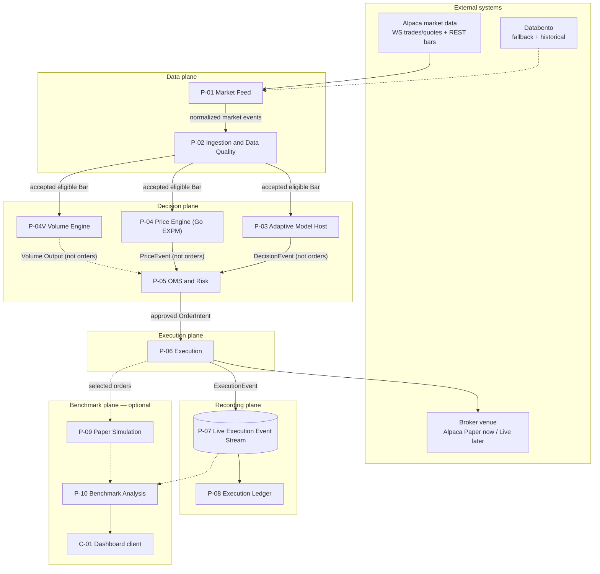

# QuanTRAM Process Model

**Date:** August 29, 2026  
**Last updated:** September 5, 2026
**Status:** Process decomposition and service-contract proposal. P-01–P-04 are in-process (P-04 Go PriceEngine/EXPM landed 2 Sep, default `QUANTRAM_PRICING=off`). P-04V Volume Engine is an approved scientific sibling (design only; implementation not authorized).  
**Parent Architecture:** [QuanTRAM System Specification](QuanTRAM_hi-level_design_082826.md)  
**Derived Artifact Specification:** [E2E QuanTRAM Artifacts](E2E_QuanTRAM_ARTIFACTS.md)  
**Open Design Gaps:** [QuanTRAM Decision Integrity and Design Gap Analysis](QuanTRAM_DECISION_INTEGRITY_GAP_ANALYSIS_082826.md)

**Increment 1 (P-01 / P-02):** [QuanTRAM Ingestion Increment 1](QuanTRAM_INGESTION_INCREMENT_1_083026.md)  
**Increment 1 continuation (P-02 quality):** [P-02 Data Quality](QuanTRAM_INGESTION_P02_DATA_QUALITY_083126.md)  
**P-03 (landed):** [Adaptive Model Host](QuanTRAM_P03_ADAPTIVE_MODEL_HOST_083126.md) · [Implementation](QuanTRAM_P03_IMPLEMENTATION_083126.md)  
**P-04 (landed, default off):** [Price Engine](QuanTRAM_P04_PRICE_ENGINE_090226.md) · [Implementation](QuanTRAM_P04_IMPLEMENTATION_090226.md)  
**P-04V (design approved):** [Volume Engine](QuanTRAM_VOLUME_ENGINE_090526.md)

## 1. Purpose and Authority

This document translates the parent architecture diagram into a **process model**: named runtime units, their inputs and outputs, failure domains, scale axes, and gRPC contracts. It exists so QuanTRAM can define microservices and `quantram.proto` from process boundaries rather than from package folders.

The parent architecture remains authoritative for system intent and end-to-end behavior. The artifact specification remains authoritative for Go package ownership, ports-and-adapters, and the single-file protobuf policy. This process model is authoritative for:

- logical process inventory and ownership
- required versus optional runtime paths
- east-west and northbound service surfaces
- local paper-trading topology and later Azure scale-out
- how adaptive (P-03, Go), PriceEngine (P-04, Go EXPM), and Volume Engine (P-04V, design-approved sibling) join the scientific path; Python is an offline oracle, not a sidecar

Process names here do not force one container per process on day one. A process is a **logical runtime unit** with a contract, a scale axis, and a failure domain. A binary or container may host one or more processes until an independent-scaling or isolation need is demonstrated.

QuanTRAM v1 is limited to U.S. stocks, ETFs, and published market indices. Indices remain analytics-only and must never become broker orders.

## 2. Why Processes Before Proto

The architecture diagram is a data-flow picture. A proto file needs **callers, callees, streaming versus unary, and who owns state**. Those are process questions:

| Architecture box | Process question the proto must answer |
| :--- | :--- |
| Alpaca SIP / Databento | Who owns reconnect, credentials, and provider schemas? |
| Circuit breaker and failover | Who decides the active source and when inference may resume? |
| OHLCV aggregator and gap-filler | Who emits the canonical bar stream, and is it pull or push? |
| Adaptive Model Engine | Is inference in-process Go, a Python sidecar, or both? |
| OMS and Risk Guardrails | Who holds reserved exposure and kill switches? |
| Execution Router / broker adapter | Who is allowed to call a broker, and under which venue? |
| Live Execution Events sink | Is this a gRPC service or a durable log? |
| Ledger | Who is the source of truth for positions and PnL? |
| Paper engine / benchmark | Which work may fail without touching the live path? |

The answer used throughout this document: **gRPC defines service contracts; a durable event log carries high-volume and multi-consumer facts; in-process channels are an allowed transport only while processes are collocated.**

## 3. Process Model Principles

1. **One owner per fact.** A bar, decision, risk reservation, broker order, or ledger projection has a single writing process.
2. **Required path is isolated from optional path.** Paper simulation, correlation, telemetry storage, and the dashboard must never delay or reject a live or paper-venue order.
3. **Ticks do not cross unary gRPC.** Trade and quote ingress stays inside the feed and ingestion processes. Downstream consumers see **finalized bars** and snapshots, not raw tick RPCs.
4. **Decisions are request-response.** Model evaluation, risk evaluation, and order submit are unary (or short client-stream) RPCs so deadlines, idempotency keys, and rejection reasons stay explicit.
5. **Execution facts are events.** Broker acknowledgments, fills, cancels, and rejects are append-only stream records. Ledger and benchmark are independent consumers.
6. **Python is an offline scientific oracle, not the control plane.** Adaptive and PriceEngine run in Go. P-04V Volume Engine, when implemented, is also a Go scientific process. Frozen SADE (and SADE RK45) stay outside the live path. Go owns identifiers, quality gating, risk, routing, and recording.
7. **Contracts outlive topology.** Local single-binary, local multi-process, and Azure AKS must implement the same proto and event envelopes.
8. **Fail closed on the live path.** Unknown data quality, expired decisions, non-tradable indices, and kill switches produce auditable rejects. Observation may continue when submission must stop.
9. **Open integrity gaps remain open.** This model names the processes that will enforce DI/RV/OP decisions; it does not close those gaps.

## 4. Process Inventory

Processes are numbered `P-01` through `P-10`, plus inserted scientific sibling **P-04V**. `C-01` is a client, not a core server. P-05 through P-10 are **not** renumbered.

| ID | Process | Architecture box | Path | Scale axis | Initial language |
| :--- | :--- | :--- | :--- | :--- | :--- |
| P-01 | Market Feed | Alpaca SIP, Databento | Required data | Connection and universe shard | Go |
| P-02 | Ingestion and Data Quality | Circuit breaker, failover, OHLCV aggregator, REST gap-filler | Required data | Symbol shard | Go |
| P-03 | Adaptive Model Host | Adaptive Model Engine (Go orchestration) | Required decision | Symbol shard | Go |
| P-04 | Price Engine | PriceEngine on analytic EXPM trajectories | Required decision | Symbol shard | Go |
| P-04V | Volume Engine | Volume feature mathematics and Volume interpretation mathematics | Required decision / scientific input | Symbol shard / per-entity owned VolumeState | Go |
| P-05 | OMS and Risk | OMS and Risk Guardrails | Required decision | Account (single writer) | Go |
| P-06 | Execution | Execution Router, Live Broker Adapter | Required execution | Account / venue connection | Go |
| P-07 | Live Execution Event Stream | Live Execution Events sink | Required recording | Partition by account or order | Log (not a domain RPC) |
| P-08 | Execution Ledger | Authoritative ledger and audit store | Required recording | Account | Go |
| P-09 | Paper Simulation | Paper Execution Engine | Optional benchmark | Symbol / order | Go |
| P-10 | Benchmark Analysis | Correlation engine, telemetry store | Optional benchmark | Time range / strategy | Go |
| C-01 | Harness Dashboard | Harness Benchmark Dashboard | Optional read | Stateless replicas | Any gRPC client |

P-01 and P-02 form the **data plane**. P-03, P-04, P-04V, P-05, and P-06 form the **decision and execution plane**. P-07 and P-08 form the **recording plane**. P-09 and P-10 form the **benchmark plane**.

P-04V is one Volume Engine. It is **not** a child of P-04, **not** a Volume Policy service or layer, and **not** a replacement for P-04. Approved sequence: P-01, P-02, P-03, P-04, **P-04V**, P-05, P-06, P-07, P-08, P-09, P-10, C-01.

### 4.1 Two meanings of “paper”

The architecture diagram and the local test plan use “paper” for different things. They must not be collapsed.

| Name | What it is | Process | Local Phase 0 |
| :--- | :--- | :--- | :--- |
| **Venue: Alpaca Paper** | Alpaca’s paper brokerage API. QuanTRAM treats it as the configured broker. | P-06 | **On.** This is the execution venue for local testing. |
| **Internal paper engine** | QuanTRAM’s L2 fill simulator for live-versus-modeled comparison. | P-09 | **Off** unless benchmark mode is `SAMPLED` or `FULL`. |

Local testing therefore runs a **real execution path** against Alpaca paper. It does not require P-09. When live brokerage is later enabled, P-06 points at the live Alpaca (or IBKR) adapter and P-09 may mirror selected orders.

## 5. Logical Process Map

This is the parent diagram restated as processes and contracts. Solid arrows are the required path except as noted. Dashed arrows are optional benchmark work, except the P-04V → P-05 arrow, which is a provisional undesigned join sketch only.



### 5.1 Scientific sibling consume (authoritative)

P-03, P-04, and P-04V are scientific siblings. They consume the **same accepted eligible canonical Bar** produced through the existing P-01 / P-02 ingress path. This is **not** `P-03 → P-04 → P-04V`. P-04V does **not** consume Price Output.

```text
                         P-01 MARKET FEED
                                |
                                v
                    P-02 INGESTION / DATA QUALITY
                                |
                      Accepted Eligible Bar
                                |
              +-----------------+-----------------+
              |                 |                 |
              v                 v                 v
       P-03 ADAPTIVE        P-04 PRICE       P-04V VOLUME
       MODEL HOST           ENGINE           ENGINE
              |                 |                 |
           CONSUME           CONSUME           CONSUME
              |                 |                 |
              v                 v                 v
       Adaptive State       Price State       Volume State
              |                 |                 |
              v                 v                 v
       Adaptive Math        Price Math        Volume Math
              |                 |                 |
              v                 v                 v
            EMIT              EMIT              EMIT
              |                 |                 |
              v                 v                 v
       Adaptive Output      Price Output      Volume Output
```

They do not call each other over gRPC. Adaptive BUY/SELL/HOLD is not an input to PriceEngine or P-04V. Price GREEN/AMBER/RED is not an input to Adaptive or P-04V. Volume Output is not an input to Adaptive or Price. There is no P/V fusion in this process model.

P-04V does **not** create another market subscription, provider connection, independent market-data path, or `SubscribeModelBars` mailbox solely for Volume.

Today’s collocated host may invoke P-04 after P-03 accepts a bar. That is in-process fan-out on the same observation, not a scientific chain. P-04V, when implemented, joins that same accepted-bar fan-out.

Raw `Bar.Volume` is already used by P-03 D01 `updateVolumeInfluence` and will also be used by P-04V as `V_RAW`. Those paths share only the originating observation. They are not scientifically dependent.

How (or whether) P-05 later joins Adaptive, Price, and Volume outputs is undesigned. The arrows into P-05 are a provisional topology sketch only. They do **not** authorize a Decision Neural Network, P/V fusion, or P-04V emitting BUY/SELL/HOLD or orders. P-05 through P-10 are unchanged as processes.

## 6. Process Catalog

Each process lists what it owns, what it consumes and produces, how it fails, how it scales, and which proto service it implements. Open integrity gaps that this process must later enforce are cited by ID.

### 6.1 P-01 Market Feed

**Owns:** Provider sessions, reconnect loops, credential retrieval, provider-payload decoding, instrument classification at ingress.

**Consumes:** Alpaca SIP or IEX WebSocket trades and quotes; Alpaca REST bars; later Databento real-time and historical.

**Produces:** Provider-tagged `MarketEvent` candidates with source timestamp, local receipt timestamp, `InstrumentType`, and tradability metadata. Does not emit canonical bars.

**Does not own:** Source selection, bar construction, model state, orders.

**Failure domain:** A provider disconnect must not crash ingestion. P-01 reports `FeedHealth` to P-02 and retries with exponential backoff. Secrets never enter logs or domain events.

**Scale:** Horizontal by symbol universe shard or by provider connection. Alpaca session limits are the practical cap.

**Proto:** `MarketFeedService` (northbound health and active-source queries). East-west tick handoff to P-02 is an internal stream or in-process channel, not a public unary RPC.

**Gaps:** DI-01, DI-04, DI-05, OP-03, OP-07.

**Local Phase 0:** Alpaca only. Databento adapter may exist as a stub. Use the Alpaca feed the account is entitled to (IEX or SIP). Record the feed product in every event so a later SIP upgrade is visible in provenance.

### 6.2 P-02 Ingestion and Data Quality

**Owns:** Heartbeat evaluation, circuit-breaker state, failover and failback, normalization, OHLCV aggregation, gap detection, REST backfill, rolling windows, bar finalization, quality flags.

**Consumes:** `MarketEvent` from P-01; historical bars from P-01’s `HistoricalBarSource` during recovery.

**Produces:** A continuous, causally ordered `Bar` stream with `quality_status`, `is_final`, `is_backfilled`, `source`, `source_transition`, `data_age`, and `market_snapshot_id`. Also emits ingestion health and capability flags (`observe`, `infer`).

**Does not own:** Signals, risk, orders. Must **quarantine** inference (tell P-03 to pause) when continuity cannot be proven.

**Failure domain:** Unhealthy or reconciling ingestion disables new inference and new submissions while remaining able to observe and recover. It does not cancel in-flight broker orders.

**Scale:** Partition by symbol. Each shard owns open-bar state for its symbols. Do not share mutable open bars across processes.

**Proto:** `IngestionService` — `StreamBars`, `GetBarWindow`, `TriggerGapFill` (ops). Heartbeat remains 1000 ms; three consecutive failures or latency above 1500 ms still trip failover as specified in the parent.

**Gaps:** DI-01, DI-02, DI-03, DI-04, DI-06. This is the highest-risk process until those gaps close.

**Local Phase 0:** Single shard, Alpaca-only source, REST gap-fill after reconnect. Circuit breaker may have no alternate source; in that case the state is `failed` or `degraded`, not a silent Databento switch.

### 6.3 P-03 Adaptive Model Host

**Owns:** Subscription to the P-02 model-consumer path (`SubscribeModelBars`), per-symbol adaptive scientific state (D01 → D02 → D04 → emitter), `DecisionEvent` identifiers, model-deadline watchdog, decision provenance.

**Consumes:** Finalized, model-eligible bars from P-02 — the same accepted eligible Bar supplied to P-04 and P-04V. Does **not** consume PriceEngine output or Volume Output and does not call a Python worker.

**Produces:** Versioned `DecisionEvent` (`oneof` decision | skip). HOLD is a decision. Never sends orders. After a bar is accepted, the same host may invoke collocated P-04 (and later P-04V) on that same observation. That is sibling fan-out, not a scientific chain.

**Does not own:** Risk limits, broker calls, F4/EXPM/PriceEngine mathematics (P-04), Volume mathematics (P-04V).

**Failure domain:** Inference timeout or stale/discontinuous bars produce **no new DecisionEvent reuse** (OP-05). P-03 stays up and reports model-host health separately from feed health.

**Scale:** Horizontal by symbol shard. One keyed worker per symbol; no concurrent `Step`.

**Proto:** `ModelService` — `StreamDecisions` (live). `Evaluate` / `GetModelInfo` remain later. `ModelInferenceService` is **not** used for adaptive.

**Gaps:** DI-06, DI-07, MV-01, OP-05.

**Local Phase 0:** Collocated in `quantram-server`. `QUANTRAM_MODEL=off` by default; `adaptive` enables the host. Live IEX DecisionEvents observed 1 Sep.

### 6.4 P-04 Price Engine

**Owns:** Bounded per-symbol pricing history (default 31 rows), causal quadratic derivatives, F4 ridge fit, analytic EXPM cover (`time_term == false`), numerical assembly, `EmissionPolicy` / `PriceEngine`, optional cockpit, `PriceEvent` identifiers.

**Consumes:** The **same accepted eligible bar** supplied to P-03 and P-04V (OHLCV + `IntervalStart`). Not `Decision.side`. Not Volume Output. Not the lossy observe stream. Not a `PredictRequest` window RPC.

**Produces:** `PriceEvent` (`oneof` PriceEmission | pricing skip). Colors GREEN/AMBER/RED/INVALID; trajectory phase and confidence. **Does not** produce BUY/SELL/HOLD and must not call Alpaca.

**Does not own:** Adaptive emitter state, VolumeState, risk, tradability, or broker semantics.

**Failure domain:** A pricing panic or timeout is contained in the symbol worker. Host marks pricing unhealthy and emits a typed skip; do not reset adaptive state because pricing failed unless the shared transactional prepare explicitly rolls both back (see P-04 implementation Phase H). Restart of pricing must not require P-02 restart.

**Scale:** Same symbol shard / keyed worker as P-03. Collocated Go. Replicas are not a Python pool.

**Proto:** `ModelService.StreamPriceEvents` fans out `PriceEvent` the way `StreamDecisions` fans out `DecisionEvent`. Off → `FailedPrecondition`; unavailable → `Unavailable`. Last-per-symbol catch-up, no durable history. Do **not** implement `ModelInferenceService`.

**Local Phase 0:** Collocated in `quantram-server`. `QUANTRAM_PRICING=off` by default; `expm` requires `QUANTRAM_MODEL=adaptive`. Phases A–I landed 2 Sep. Continuity is causal observation order: a skipped provider minute is a valid irregular interval, not `INPUT_GAP`. `STATE_DISCONTINUOUS` is reserved for proven loss (overflow / panic / proven missing eligible). `Host.ResetSymbol` reinitializes one symbol; no operator reset RPC yet.

**Oracle:** SADE `solve_cover_rk45_reference` stays outside QuanTRAM. Go production is EXPM only (`gonum` v0.17.0 `Dense.Exp`).

### 6.4V P-04V Volume Engine

**Status:** Design approved 5 Sep 2026. Implementation is **not** authorized by this process-model insertion. Detailed scientific definitions, invariants, lifecycle, maturation, frozen mathematics, and APTF equivalence authority live in [Volume Engine](QuanTRAM_VOLUME_ENGINE_090526.md). This catalog does not duplicate those formulas.

**Owns:** Bounded per-entity causal scientific working state: `VolumeState`, conceptually including Volume Feature State and Volume Interpretation State. Exact Go structs are not frozen here. `VolumeState` is **not** Snapshot, Persistence, MongoDB, a database, historical storage, or replay storage.

**Consumes:** The **same accepted eligible canonical Bar** produced through P-01 / P-02 and already supplied to P-03 and P-04. Uses `Bar.Volume` as `V_RAW`. Does **not** consume Adaptive Output or Price Output. Does **not** create another market subscription, provider connection, independent market-data path, or `SubscribeModelBars` mailbox solely for Volume.

**Produces:** Independent Volume Output from Volume Feature Mathematics plus Volume Interpretation Mathematics inside **one** engine:

```text
accepted Bar.Volume
        ->
bounded causal VolumeState
        ->
validated Volume feature mathematics
        ->
validated Volume interpretation mathematics
        ->
Volume Output
```

Does **not** emit BUY/SELL/HOLD, an order, OMS/Risk action, or a trade. Does **not** perform P/V fusion.

**Does not own:** Adaptive influence (P-03 D01 `updateVolumeInfluence` remains P-03), PriceEngine mathematics, risk, tradability, broker semantics, Snapshot, Persistence, or a separate Volume Policy process. There is no QuanTRAM Volume Policy service, layer, or process.

**Failure domain:** When implemented, a Volume failure must be contained in the symbol worker and must not reset Adaptive or Price scientific state unless a later implementation design explicitly defines a shared transactional prepare. Restart of Volume must not require P-02 restart. Persistence must not delay or control realtime Volume science.

**Scale:** Same symbol shard / per-entity owned `VolumeState` as the other scientific siblings. Collocated Go when implemented.

**Proto:** No Volume message, enum, RPC, or field number is authorized here. Do not invent `VolumeEvent` in this increment.

**StageTransition:** V1.1 remains frozen. Future P-04V StageTransition publication is deferred, outside P-04V V1, and non-blocking.

**Local Phase 0:** Not started. Not packed into `quantram-server` by this change.

**Raw-volume dual use:** P-03 already uses raw volume through D01 `updateVolumeInfluence`. P-04V uses raw volume as `V_RAW` for dedicated Volume mathematics. The paths share only the originating observation.

### 6.5 P-05 OMS and Risk

**Owns:** Risk policy version, limit evaluation, pending-exposure reservation, kill switches, last-moment data-age and tradability checks, machine-readable reject/resize reasons.

**Consumes:** `DecisionEvent` from P-03 and, when P-04 is live, `PriceEvent`. How (or whether) P-05 later consumes Volume Output is undesigned; this insertion does not add a join, fusion, or decision-network architecture. Portfolio, cash, and working-order state from P-08 (and local reservation memory); current spread/snapshot age from P-02 or a snapshot reference on the decision. P-05 is **not** started in the P-04 increment. P-04V does not feed orders or execution.

**Produces:** `RiskDecision`: approved, resized, or rejected `OrderIntent` with `decision_id` preserved. Approved intents are the only inputs P-06 may submit.

**Does not own:** Broker sessions or ledger projections. It **reserves** exposure; P-08 **confirms** it after fills.

**Failure domain:** Risk unavailability or uncertain exposure is fail-closed for new submits. Cancels of working orders may still be allowed per the capability matrix (RV-03).

**Scale:** **Single writer per account.** Horizontal scale is by account, not by symbol. This is the consistency bottleneck and must stay small and correct.

**Proto:** `RiskService` — `Evaluate`, `GetPortfolioView`, `SetKillSwitch` (also mirrored on `OperationsService` for operators), `GetRiskPolicy`.

**Gaps:** RV-01, RV-02, RV-03, DI-05 (index reject), DI-06 (data-age recheck).

### 6.6 P-06 Execution

**Owns:** Venue selection, idempotent broker submit/cancel, broker-protocol translation, assignment of `order_id` and optional `benchmark_id`, fan-out to P-09 when policy selects the order, publication of lifecycle events to P-07.

**Consumes:** Risk-approved `OrderIntent`. Broker acknowledgments, rejects, replaces, cancels, and fills.

**Produces:** Broker-facing orders; `ExecutionEvent` records; optional handoff to P-09. Must not wait on P-09, P-10, or C-01.

**Does not own:** Portfolio truth (P-08) or signal generation.

**Failure domain:** Broker disconnect disables new live/paper-venue submits and keeps cancel/reconcile capabilities as defined by RV-03. Event-publish failure is a **live-path fault**: if an order was sent and the event cannot be recorded, the process must enter a degraded execution state and reconcile rather than silently continue (OP-01, OP-02).

**Scale:** One process (or session manager) per venue connection and account. Throughput is order-rate, not tick-rate.

**Proto:** `ExecutionService` — `SubmitOrder`, `CancelOrder`, `GetOrderStatus`, `StreamOrderUpdates`.

**Local Phase 0:** `AlpacaBrokerAdapter` with base URL `https://paper-api.alpaca.markets`. Trading mode is `PAPER_VENUE`, not `LIVE_VENUE`. Benchmark mode defaults to `OFF`.

### 6.7 P-07 Live Execution Event Stream

**Owns:** Durable, append-only delivery of `ExecutionEvent`. Independent consumer checkpoints. Partitioning and retention policy (once OP-02 is decided).

**Consumes:** Events published by P-06. Does not interpret them.

**Produces:** Ordered (within partition key) event log to P-08 and, optionally, to P-10.

**This is infrastructure, not a domain gRPC service.** Local candidates: NATS JetStream, or an embedded outbox plus Postgres. Azure candidates: Event Hubs or a Kafka-compatible log. The Go ports remain `ExecutionEventPublisher` and `ExecutionEventConsumer`.

**Failure domain:** Separate from P-10. Ledger consumption must continue if benchmark consumption stops.

**Gaps:** OP-02, OP-04.

### 6.8 P-08 Execution Ledger

**Owns:** Authoritative orders, fills, positions, cash, fees, PnL projections, broker reconciliation views, audit retention of applied events.

**Consumes:** P-07 events. Broker snapshot queries during reconcile.

**Produces:** Queryable execution state for P-05, operators, and C-01. Never takes writes from the dashboard.

**Scale:** Write path is the P-07 consumer (one active projector per account partition). Read replicas are allowed for queries.

**Proto:** `LedgerService` — order, fill, position, cash, PnL, and reconciliation queries with pagination.

**Local Phase 0:** Postgres or SQLite via the `ExecutionLedger` port. SQLite is acceptable for single-host paper testing if the port stays technology-neutral.

### 6.9 P-09 Paper Simulation

**Owns:** Internal L2 fill model, simulated execution events, simulator version.

**Consumes:** Selected `OrderIntent` copies at live/paper-venue submit time, plus a contemporaneous L2 or quote snapshot.

**Produces:** `PaperExecutionEvent` to P-10 only.

**Must:** Bound queues and drop or degrade optional work rather than block P-06.

**Proto:** No northbound mutate API. Optional internal `PaperService.Simulate` for tests. Results are read through `BenchmarkService`.

**Gaps:** BV-01. Keep **off** for local Alpaca-paper testing.

### 6.10 P-10 Benchmark Analysis

**Owns:** Pairing by `benchmark_id`, derived fill/latency/slippage/PnL comparison records, benchmark-mode configuration persistence.

**Consumes:** Selected live events from P-07 and paper events from P-09.

**Produces:** Query and stream APIs for C-01.

**Proto:** `BenchmarkService` — summary, comparisons, metric stream, authenticated mode change.

**Local Phase 0:** Optional. Dashboard is not required to paper-trade.

### 6.11 C-01 Harness Dashboard

Read-only gRPC client of `BenchmarkService`, `LedgerService`, `MarketFeedService`, and `OperationsService`. Not a core microservice. May be deferred until P-08 queries exist.

### 6.12 Cross-cutting: Operations

Every server process exposes the same health surface so RV-03 can be implemented without a hidden shared status bit.

**Proto:** `OperationsService` — aggregate health, readiness, capability matrix (`observe`, `infer`, `submit`, `cancel`, `reconcile`, `benchmark`), kill switches, config version.

A dedicated ops binary is unnecessary locally. Each Go process registers `OperationsService` on its gRPC server; a later Azure ingress can aggregate.

## 7. End-to-End Process Flows

### 7.1 Required bar-to-venue path

This is the path that must work on this machine with Alpaca live data and Alpaca paper trading.

```mermaid
sequenceDiagram
    participant AlpacaMD as Alpaca market data
    participant P01 as P-01 Feed
    participant P02 as P-02 Ingestion
    participant P03 as P-03 Model Host
    participant P04 as P-04 Price Engine
    participant P04V as P-04V Volume Engine
    participant P05 as P-05 Risk
    participant P06 as P-06 Execution
    participant AlpacaP as Alpaca paper API
    participant P07 as P-07 Event stream
    participant P08 as P-08 Ledger

    AlpacaMD->>P01: trades/quotes
    P01->>P02: MarketEvent
    P02->>P02: aggregate and finalize Bar
    P02->>P03: accepted eligible Bar
    P02->>P04: accepted eligible Bar
    P02->>P04V: accepted eligible Bar
    Note over P04V: P-04V design-approved; not on the live path yet
    alt quality or deadline fails
        P03-->>P03: skip, record reason
    else eligible
        P03->>P03: AdaptiveEngine DecisionEvent
        P04->>P04: PriceEvent
        Note over P03,P04,P04V: Same observation; scientific siblings; no P/V fusion
        Note over P05: P-05 not implemented; Adaptive/Price stop here today
        P03->>P05: DecisionEvent + PriceEvent (later)
        P05->>P08: read positions/reservations
        alt rejected or resized to flat
            P05-->>P07: risk reject event via P-06 publish path
        else approved
            P05->>P06: OrderIntent
            P06->>AlpacaP: submit
            AlpacaP-->>P06: ack/fill/reject
            P06->>P07: ExecutionEvent
            P07->>P08: project
        end
    end
```

Identifier chain on a successful order: `market_snapshot_id` → `signal_id` → `decision_id` → `order_id` → `broker_order_id` → `event_id`. Optional `benchmark_id` is assigned in P-06 only when P-09 is selected.

P-04V is shown as a sibling consumer of the same accepted eligible Bar. It is **not** on the Phase 0 live venue path, does not emit orders, and does not change P-05–P-10. Today's collocated host may still invoke P-04 after accept; that remains in-process fan-out on the same observation.

### 7.2 Feed interrupt and inference quarantine

1. P-01 detects socket loss or heartbeat failure and reports unhealthy Alpaca.
2. P-02 trips the breaker, records `T_last`, and sets capability `infer=false`, `submit=false`.
3. P-01 reconnects with backoff. P-02 REST-backfills `[T_last, T_now]`, deduplicates, and rebuilds or quarantines open bars (DI-03 still to be specified).
4. Only after continuity is proven does P-02 set `infer=true`. P-05 still rechecks data age before any new submit.
5. With no Databento locally, there is no failover source. The process model still has the Databento port so Phase 2 can attach it without changing P-03 through P-08.

### 7.3 Offline CSV versus live inference

SADE Unit Run 001 (adaptive) and Pricing Unit Run 001 are the numerical authorities. Live trading is only valid if QuanTRAM Go engines reproduce those frozen sequences, not a Python sidecar.

| Step | Offline harness | Live path |
| :--- | :--- | :--- |
| Bar source | Checked-in CSV OHLCV | P-02 model-eligible finalized bars |
| Time | `source_timestamp` → `IntervalStart` | `Bar.IntervalStart` |
| Adaptive | `internal/adaptive` Step | Same engine in the host |
| Pricing | `internal/pricing` Step on the same bars | Same engine after accept |
| Volume | Approved P-04V mathematics; not implemented | Same accepted bars when authorized; no proto yet |
| Output | DecisionEvent + PriceEvent | Same domain events; proto fan-out later. Volume Output later |
| Risk / broker | Absent | P-05 then P-06 (not this increment) |
| Provenance | File name and row range | `market_snapshot_id`, versions, quality |

Promotion rule (MV-01, still open): a live scientific outcome is not trusted until replay of stored accepted bars reproduces offline scores. Persist enough input to replay without reading mutable current bars. This is **not** a `PredictRequest` body.

### 7.4 Optional benchmark path

Enabled only when benchmark mode is `SAMPLED` or `FULL`:

1. P-06 assigns `benchmark_id` and submits to the venue without waiting.
2. P-06 enqueues a copy plus snapshot reference to P-09.
3. P-09 simulates and emits paper events.
4. P-10 correlates with selected P-07 events and stores derived metrics.
5. C-01 queries P-10 and P-08.

If the P-09 queue is full, P-06 logs a dropped-mirror event and continues. That drop must not fail the venue submit.

## 8. Communication Model

Three planes, three transports.

| Plane | Content | Transport | Latency class |
| :--- | :--- | :--- | :--- |
| Data | Ticks inside P-01/P-02; finalized bars out of P-02 | In-process channel if collocated; gRPC `StreamBars` or a bus if split | Tick-rate / bar-rate |
| Decision | Predict, risk evaluate, submit, cancel | gRPC unary with deadlines and idempotency keys | Milliseconds |
| Recording | Execution and paper events | Durable log with independent checkpoints | Asynchronous |

### 8.1 Collocated transport rule

While P-01, P-02, P-03, P-04, P-04V (when implemented), P-05, P-06, and P-08 share a process, they **call Go interfaces**, not loopback gRPC. Generated proto types stay at the process edge. This matches the artifact specification and keeps the local hot path off the serialization tax.

When a process is split out, the same interface is satisfied by a gRPC adapter. That is the move from “one binary” to “microservice” without redesigning the domain.

### 8.2 P-04 is collocated Go (supersedes Python sidecar)

The August 29 rule that P-04 is always an out-of-process Python worker is **withdrawn**. Adaptive inference is in-process P-03. PriceEngine is in-process P-04 in the same keyed symbol worker. There is no Phase 0 `Predict` RPC.

A future split of P-04 into its own binary would use a Go adapter over the same domain `PriceEvent` contract, not `ModelInferenceService`.

### 8.3 Backpressure

| Boundary | Policy |
| :--- | :--- |
| Alpaca WS → P-01 | Provider-limited. If local queues fill, drop quotes before trades and mark quality degraded. Never block the socket read until memory is exhausted. |
| P-02 → P-03 | P-03 consumes finalized bars only. If inference lags, skip the bar and record a deadline miss; do not let an unbounded queue replay stale bars as if they were live. |
| P-03 → P-04 | In-process call on the same accepted bar. No second mailbox. Timeout/skip per P-04 implementation Phase H (prepare both, commit both or neither). |
| Host → P-04V | Same accepted eligible Bar; no second subscription or Volume mailbox. Prepare/commit details are not authorized in this increment. |
| P-05 | In-process, account-serialized. No queue of unreserved intents. |
| P-06 → venue | Broker rate limits. Excess intents reject with `RATE_LIMIT`. |
| P-06 → P-07 | Publish with timeout. Failure degrades submit capability. |
| P-06 → P-09 | Bounded queue, drop-oldest or shed. |

## 9. Proposed gRPC Surface

Single file, per the artifact policy:

```text
api/proto/quantram/v1/quantram.proto
```

Package: `quantram.v1`. Organize the file by area: common types, market data, model, risk, execution, ledger, benchmark, operations, then service definitions. Do not split the file until review or generation friction is demonstrated.

### 9.1 Services and RPC sketch

This sketch is the input to the first proto authoring pass. Field lists belong in the proto; behavior belongs here.

```text
service MarketFeedService {
  rpc GetFeedHealth(GetFeedHealthRequest) returns (FeedHealth);
  rpc GetActiveSource(GetActiveSourceRequest) returns (ActiveSource);
  rpc StreamFeedHealth(StreamFeedHealthRequest) returns (stream FeedHealthEvent);
}

service IngestionService {
  rpc StreamBars(StreamBarsRequest) returns (stream Bar);
  rpc GetBarWindow(GetBarWindowRequest) returns (BarWindow);
  rpc TriggerGapFill(TriggerGapFillRequest) returns (GapFillResult);
}

service ModelService {
  rpc Evaluate(EvaluateRequest) returns (DecisionVector);
  rpc StreamDecisions(StreamDecisionsRequest) returns (stream DecisionEvent);
  rpc GetModelInfo(GetModelInfoRequest) returns (ModelInfo);
}

service ModelInferenceService {
  // Reserved in the August 29 sketch. Not implemented.
  // Adaptive is P-03 in-process Go. Pricing is P-04 in-process Go EXPM.
  rpc Predict(PredictRequest) returns (PredictResponse);
  rpc GetModelVersion(GetModelVersionRequest) returns (ModelVersion);
  rpc ResetState(ResetStateRequest) returns (ResetStateResponse);
}

service RiskService {
  rpc Evaluate(EvaluateOrderRequest) returns (RiskDecision);
  rpc GetPortfolioView(GetPortfolioViewRequest) returns (PortfolioView);
  rpc GetRiskPolicy(GetRiskPolicyRequest) returns (RiskPolicy);
  rpc SetKillSwitch(SetKillSwitchRequest) returns (KillSwitchState);
}

service ExecutionService {
  rpc SubmitOrder(SubmitOrderRequest) returns (SubmitOrderResponse);
  rpc CancelOrder(CancelOrderRequest) returns (CancelOrderResponse);
  rpc GetOrderStatus(GetOrderStatusRequest) returns (OrderStatus);
  rpc StreamOrderUpdates(StreamOrderUpdatesRequest) returns (stream OrderUpdate);
}

service LedgerService {
  rpc GetOrder(GetOrderRequest) returns (OrderRecord);
  rpc ListOrders(ListOrdersRequest) returns (ListOrdersResponse);
  rpc GetPosition(GetPositionRequest) returns (Position);
  rpc ListPositions(ListPositionsRequest) returns (ListPositionsResponse);
  rpc GetAccountPnL(GetAccountPnLRequest) returns (PnLReport);
  rpc GetReconciliation(GetReconciliationRequest) returns (ReconciliationReport);
}

service BenchmarkService {
  rpc GetSummary(GetSummaryRequest) returns (BenchmarkSummary);
  rpc ListComparisons(ListComparisonsRequest) returns (ListComparisonsResponse);
  rpc StreamMetrics(StreamMetricsRequest) returns (stream BenchmarkMetricEvent);
  rpc SetBenchmarkMode(SetBenchmarkModeRequest) returns (BenchmarkModeState);
}

service OperationsService {
  rpc GetHealth(GetHealthRequest) returns (HealthReport);
  rpc GetReadiness(GetReadinessRequest) returns (ReadinessReport);
  rpc GetCapabilities(GetCapabilitiesRequest) returns (CapabilityMatrix);
  rpc SetKillSwitch(SetKillSwitchRequest) returns (KillSwitchState);
}
```

`SetBenchmarkMode` and kill-switch RPCs are operator APIs. They require authentication once that gap (OP-03 / rollout) is specified. C-01 must not call them in ordinary dashboard use.

### 9.2 Shared types the proto must include

From the parent and artifact specs, plus this process model:

- IDs: `event_id`, `signal_id`, `decision_id`, `order_id`, `broker_order_id`, `benchmark_id`, `market_snapshot_id`, `account_id`, `strategy_id`, `instrument_id`
- `InstrumentType`: `STOCK`, `ETF`, `INDEX`
- `Tradability` and `SessionState`
- `QualityStatus`: complete, degraded, stale, partial, reconstructed, invalid
- `RiskOutcome`: approved, resized, rejected
- `BenchmarkMode`: `OFF`, `SAMPLED`, `FULL`
- `TradingVenue`: `ALPACA_PAPER`, `ALPACA_LIVE`, `IBKR_LIVE`
- `Capability`: observe, infer, submit, cancel, reconcile, benchmark
- Bar, DecisionVector, OrderIntent, ExecutionEvent, and pagination/filter messages

Generated protobuf types **do not** become the Go or Python domain model. Each language maps at its adapter boundary.

### 9.3 What stays out of proto

- Raw provider payloads
- Credentials
- Tick-by-tick public subscribe (ticks stay inside P-01/P-02)
- Direct SQL or file paths
- Azure-specific resource IDs

## 10. Scalability Model

Realtime load is dominated by **market events**, not orders. Design for that split.

### 10.1 Volume classes

| Class | Approximate rate | Owning processes | Scale method |
| :--- | :--- | :--- | :--- |
| Ticks (trades/quotes) | High, bursty | P-01, P-02 | Symbol shards; keep in the data plane |
| Finalized bars | Interval × symbols | P-02 → P-03 | Stream or bus; shard with symbols |
| Inference | Bars that pass quality gates | P-03, P-04, P-04V (when implemented) | Replicas / GPU later |
| Risk + submit | Sparse | P-05, P-06 | Single writer per account |
| Execution events | Per order lifecycle | P-07, P-08 | Partitioned log |
| Benchmark | Subset of orders | P-09, P-10 | Independent consumer lag |

### 10.2 Independent scale-out triggers

Split a collocated process into its own service when one of these is true:

| Trigger | First split |
| :--- | :--- |
| Ingestion CPU or memory grows with universe size | P-01+P-02 out of the decision binary |
| Python inference latency or RAM contends with Go | withdrawn: no Python sidecar; split P-03/P-04/P-04V binaries only if Go CPU contends |
| Risk evaluation blocks on ledger reads | cache account state in P-05; keep P-08 as source of truth |
| Dashboard or replay queries slow ledger writes | read replica or separate query API in front of P-08 |
| Benchmark backlog | scale P-10 only |
| Multiple accounts or strategies | shard P-05/P-06/P-08 by `account_id` |

### 10.3 Provisional latency budgets

OP-05 is still open. Until it is closed, use these as engineering targets, not production SLOs:

| Stage | 1s bars | 1m bars |
| :--- | :--- | :--- |
| Tick apply inside P-02 | 2 ms p99 | 2 ms p99 |
| Bar finalize to P-03 start | 5 ms | 20 ms |
| P-03 + P-04 Step (adaptive + EXPM) | inside 200 ms host deadline | 200 ms deadline |
| P-05 Evaluate | 10 ms | 10 ms |
| P-06 submit call start | 10 ms local | 10 ms local |
| Venue RTT | Alpaca-bound | Alpaca-bound |

If the combined adaptive+pricing step exceeds its deadline, skip and leave committed scientific state unchanged. Prefer no order over a late order (when P-05 exists).

### 10.4 State that prevents naive scale-out

- Open bars and rolling windows: sticky to a P-02 shard.
- Adaptive, Price, and Volume scientific working state: sticky to the symbol shard that owns that entity.
- Account exposure and kill switches: sticky to one P-05 writer.
- Broker session: sticky to one P-06.
- Ledger projections: single active consumer per partition.

## 11. Runtime Topologies

### 11.1 Phase 0 — this machine, Alpaca data, Alpaca paper

Goal: exercise the required path with live market data and non-live money.

```text
localhost
  quantram-server            P-01 P-02 P-03 P-04 + Operations
                             (P-04V design-approved, not implemented)
                             (P-05 P-06 P-08 compiled later, not started)
       |
  optional NATS or Postgres  P-07 (or core-embedded outbox)
       |
  Alpaca data WS/REST        live quotes/trades/bars
  quantram-dashboard         C-01 observe + Adaptive Pipeline (not required path)
```

**On today:** P-01 (Alpaca), P-02, P-03 (`QUANTRAM_MODEL=adaptive`), P-04 (`QUANTRAM_PRICING=expm` opt-in; default `off`). Viewer Price Engine cards and airport boards landed 2 Sep.  
**Off:** Python model worker, Databento, P-04V implementation, P-05–P-10, live venue. Dashboard is optional observation.

**Suggested local config**

| Setting | Phase 0 value |
| :--- | :--- |
| `trading_venue` | `ALPACA_PAPER` |
| `benchmark_mode` | `OFF` |
| `feed_product` | Alpaca IEX or SIP as entitled |
| `databento_enabled` | false |
| `bar_interval` | match the offline model (start with the CSV interval) |
| `kill_switch` | on until an operator enables submit |
| `universe` | small symbol list used in CSV tests |

**Suggested commands / packages** (aligns with the artifact tree; no Python worker):

```text
cmd/quantram-server          collocated Go processes (P-01–P-04; P-04V not implemented)
internal/ingestion
internal/adaptive
internal/pricing             P-04 (landed 2 Sep; default off)
internal/modelhost
internal/risk
internal/execution
internal/liveevents
internal/ledger
internal/paper               compiled, not started
internal/benchmark           compiled, not started
internal/transport/grpc
api/proto/quantram/v1/quantram.proto
```

### 11.2 Phase 1 — local multi-process (still this machine)

Split only if Phase 0 proves contention:

```text
quantram-ingest     P-01 P-02
quantram-model      P-03 + P-04 + P-04V when implemented (same binary until CPU split)
quantram-risk       P-05
quantram-exec       P-06
quantram-ledger     P-08
NATS JetStream      P-07
```

Bars move by `IngestionService.StreamBars` or a JetStream subject `bars.finalized.{interval}.{symbol}`. Decisions stay unary gRPC.

### 11.3 Phase 2 — Databento attach

P-01 gains the Databento adapter. P-02 gains a real alternate source. No change to P-03–P-08 contracts. Do not enable failover for production decisions until DI-01 and DI-03 exit criteria exist.

### 11.4 Phase 3 — Azure

Same processes, different hosts.

| Process | Azure mapping (indicative) |
| :--- | :--- |
| P-01, P-02 | AKS Deployment, HPA on CPU; or Container Apps |
| P-03 | AKS, symbol-sharded |
| P-04 | AKS, same shard as P-03 until CPU split; no GPU/Python pool |
| P-04V | When implemented: AKS, same shard as P-03/P-04 until CPU split |
| P-05, P-06 | AKS, replica 1 per account writer; pod anti-affinity later |
| P-07 | Event Hubs or managed NATS; keep the Go ports |
| P-08 | AKS + Azure Database for PostgreSQL |
| P-09, P-10 | Separate Deployment; scale to zero when mode is `OFF` |
| C-01 | Static web app or small Container App |
| Secrets | Key Vault; `FeedCredentialsProvider` / broker credential port |
| Observability | Azure Monitor / OpenTelemetry; do not parse free-form logs for dashboard metrics |

AKS ingress exposes northbound services (`Operations`, `Ledger`, `Benchmark`, `Execution` cancel/status). East-west stays on the cluster service mesh or internal load balancers. Trading credentials never go on a public ingress.

Live venue (`ALPACA_LIVE` or IBKR) is an environment change in P-06 plus Gate B in the gap analysis. It is not a new process.

## 12. Capability Matrix (process-level)

RV-03 requires independent health domains. Until that gap closes, processes must at least emit these capabilities.

| Condition | observe | infer | submit | cancel | reconcile | benchmark |
| :--- | :---: | :---: | :---: | :---: | :---: | :---: |
| All required processes healthy, venue connected | yes | yes | yes | yes | yes | if enabled |
| Feed degraded, bars still finalized with quality flag | yes | strategy policy | P-05 recheck | yes | yes | if enabled |
| Ingestion reconciling / gap filling | yes | no | no | yes | yes | if enabled |
| P-04 down | yes | yes (adaptive may continue) | no | yes | yes | if enabled |
| P-05 kill switch | yes | optional | no | yes | yes | if enabled |
| Venue disconnected | yes | optional | no | no* | yes | if enabled |
| P-07 publish failing | yes | no** | no | yes | yes | no |
| P-10 down | yes | yes | yes | yes | yes | no |

\* Cancel may still be attempted depending on broker session state; define in OP-01.  
\*\* Prefer no new inference that can create submits while recording is unsafe.

## 13. Implementation Sequence

This replaces “start coding services in diagram order” with a contract-first sequence that still matches the parent roadmap.

| Step | Status | Deliverable | Processes | Exit |
| :--- | :--- | :--- | :--- | :--- |
| S0 | **Partial** | `quantram.proto` increment-1 services generated in Go. Risk, execution, ledger, benchmark, and Python stubs are not in the file yet. | contracts | Ingestion/ops RPCs compile. Full-file golden round-trip still open. |
| S1 | **Partial** | Alpaca IEX/test WebSocket, REST historical client, CSV replay, thin reconnect, bar window, `StreamBars`. Full circuit breaker is **not completed** and is **deferred**. See [Increment 1](QuanTRAM_INGESTION_INCREMENT_1_083026.md). | P-01, P-02 | CSV and Alpaca test-feed bars received 2026-08-30. Near-term exit is IEX RTH. Failover, live gap-fill proof, and DI-01 qualification are later. |
| S2 | **Partial** | Adaptive Go black box + host + `StreamDecisions` (Phases A–E, live IEX 1 Sep). Pricing: Go EXPM PriceEngine + `StreamPriceEvents` (Phases A–I, 2 Sep). Oracle SADE `solve_cover_rk45_reference` (not in Go, not APTF). | P-03 done; P-04 landed, default off | Unit Run 001 adaptive done. Pricing Unit Run 001 semantic PASS 15/30/55. Live IEX color not yet claimed. |
| S3 | **Partial** | Model host assigns IDs and skips on quality/deadline | P-03 | Landed 1 Sep (`DecisionEvent`, typed skips). |
| S4 | Not started | Risk rules + kill switch; index intents rejected | P-05 | Auditable reject reasons |
| S5 | Not started | Alpaca paper submit/cancel + event publish + ledger | P-06, P-07, P-08 | Paper fill appears in ledger; restart is idempotent |
| S6 | Deferred | Databento adapter and **full circuit breaker** (failover, failback, production trip rules). Thin Alpaca reconnect in increment 1 does not count as done. | P-01, P-02 | Only after IEX E2E, the model/paper slice, and DI-01/DI-03 policy |
| S7 | Not started | Internal paper + correlation + dashboard client | P-09, P-10, C-01 | Benchmark stop does not affect paper-venue orders |

S1–S5 are the local paper-trading slice. S6–S7 are scale and measurement. S2 is adaptive-in-Go (done) plus PriceEngine-in-Go (landed 2 Sep, default off). P-04V Volume Engine is design-approved as a scientific sibling (5 Sep) and is **not** an implementation step in this sequence. A Python sidecar is not part of the live path.

## 14. Mapping to Existing Documents

| Topic | Where it lives |
| :--- | :--- |
| Layered architecture, feed SLAs, dashboard views, parent diagram | System specification |
| Go interfaces, packages, single proto file, acceptance criteria | E2E artifacts |
| Unresolved correctness and production gaps | Gap analysis |
| Runtime units, RPCs, local vs Azure topology, P-04 PriceEngine, P-04V process identity | This document |
| Increment 1 ingestion implementation and Alpaca/CSV evidence | [Ingestion Increment 1](QuanTRAM_INGESTION_INCREMENT_1_083026.md) |
| P-03 adaptive host | [P-03 design](QuanTRAM_P03_ADAPTIVE_MODEL_HOST_083126.md) |
| P-04 PriceEngine / EXPM | [P-04 design](QuanTRAM_P04_PRICE_ENGINE_090226.md) |
| P-04V Volume Engine science, invariants, lifecycle, frozen mathematics, APTF equivalence | [Volume Engine](QuanTRAM_VOLUME_ENGINE_090526.md) |

This document **proposes** a resolution for the artifact specification’s open item “process decomposition and independent scaling thresholds.” It does not close P0/P1 gaps. Implementation of S1 decision-quality behavior still waits on Gate A (DI-01 through DI-07) for any path treated as a production decision contract. Do not prototype a Python inference sidecar; that path is withdrawn.

## 15. Decisions Made Here

| Decision | Choice |
| :--- | :--- |
| Process inventory | P-01 through P-10 plus inserted sibling P-04V plus C-01. P-05–P-10 not renumbered. |
| Local execution venue | Alpaca paper API via P-06 |
| Internal paper engine | Separate optional process P-09 |
| Existing Python model | **Withdrawn as live P-04.** Adaptive is P-03 Go. PriceEngine is P-04 Go EXPM. Volume Engine is P-04V (design-approved; implementation not authorized). SADE Python (including RK45) is an offline oracle only. |
| P-04V relationship | Scientific sibling of P-03 and P-04 on the same accepted eligible Bar. Not a child of P-04. Not a Volume Policy process. No P/V fusion or Decision Neural Network in this model. |
| Core control plane | Go gRPC |
| Tick transport | Not public unary gRPC |
| Proto layout | Still one `quantram.v1` file; services listed in §9 |
| Phase 0 packing | One Go server (`quantram-server`); no Python worker |
| Split rule | Contract-preserving adapters when a scale or isolation trigger fires |
| Azure | Same processes; AKS + managed log + Postgres + Key Vault as the default sketch |
| Full circuit breaker | **Not completed.** Deferred until after Alpaca live/IEX E2E and the model/paper slice. Increment 1 keeps thin reconnect only. |

## 16. Still Open (owned by the gap register)

Do not invent silent defaults for these in code that will drive money or promotion:

- Canonical bar math and provider qualification (DI-01)
- Finalization, watermarks, and look-ahead (DI-02)
- Failover reconciliation (DI-03)
- Session and calendar policy (DI-04)
- Point-in-time reference data (DI-05)
- Quality gating policy (DI-06)
- Full provenance store layout (DI-07)
- Pending exposure (RV-01), stale-order rules (RV-02), exact capability matrix (RV-03)
- Event-log product and retention (OP-02)
- Authn/z for operator RPCs
- Paper-fill methodology (BV-01)

## 17. Change Log

| Date | Version | Change |
| :--- | :--- | :--- |
| September 5, 2026 | 0.8 | Added approved P-04V Volume Engine as a scientific sibling of P-03 Adaptive Model Host and P-04 Price Engine. P-04V consumes the same accepted eligible Bar, owns bounded per-entity VolumeState, performs validated Volume Feature and Volume Interpretation mathematics, and emits independent Volume Output. Existing P-01 through P-10 numbering preserved; P-05 through P-10 unchanged. No P/V fusion, decision-network architecture, proto, StageTransition, or production implementation authorized by this change. See [Volume Engine](QuanTRAM_VOLUME_ENGINE_090526.md). |
| September 4, 2026 | 0.7 | Sideways StageTransition publication V1.1 (`internal/stagetransition`). P-01–P-04 publish only on meaningful StageState change. Bar-driven P-03/P-04 events carry a value copy of the accepted `domain.Bar`. Not a new pipeline stage. Snapshot/Persistence not implemented. See [Stage Transition Publication](QuanTRAM_STAGE_TRANSITION_PUBLICATION_V1_2026-09-04.md). |
| September 2, 2026 | 0.4 | P-04 redefined as collocated Go PriceEngine (EXPM). Python `ModelInferenceService` sidecar withdrawn. Linked P-04 design/implementation. S2/S3 marked partial after P-03 live DecisionEvents. |
| September 2, 2026 | 0.5 | P-04 Phases A–I landed: `internal/pricing`, host join, `StreamPriceEvents`, dashboard Price Engine cards/boards. Default still `QUANTRAM_PRICING=off`. Live IEX `INPUT_GAP` documented as missing adjacent minute, not end-of-data. |
| September 2, 2026 | 0.6 | Causal continuity: skipped provider minutes no longer latch `STATE_DISCONTINUOUS`. D01/D02/D04/P-04 mathematics unchanged. |
| August 30, 2026 | 0.3 | Deferred full circuit breaker / Databento failover (S6); increment-1 reconnect is not treated as complete. |
| August 30, 2026 | 0.2 | Marked S0/S1 partial after increment-1 ingestion implementation; linked the increment design; noted the adaptive model as a Go black box for S2. |
| August 29, 2026 | 0.1 | Initial process model: ten server processes, Python inference sidecar, gRPC sketch, local Alpaca-paper topology, Azure scale-out mapping, and required versus optional planes. |
