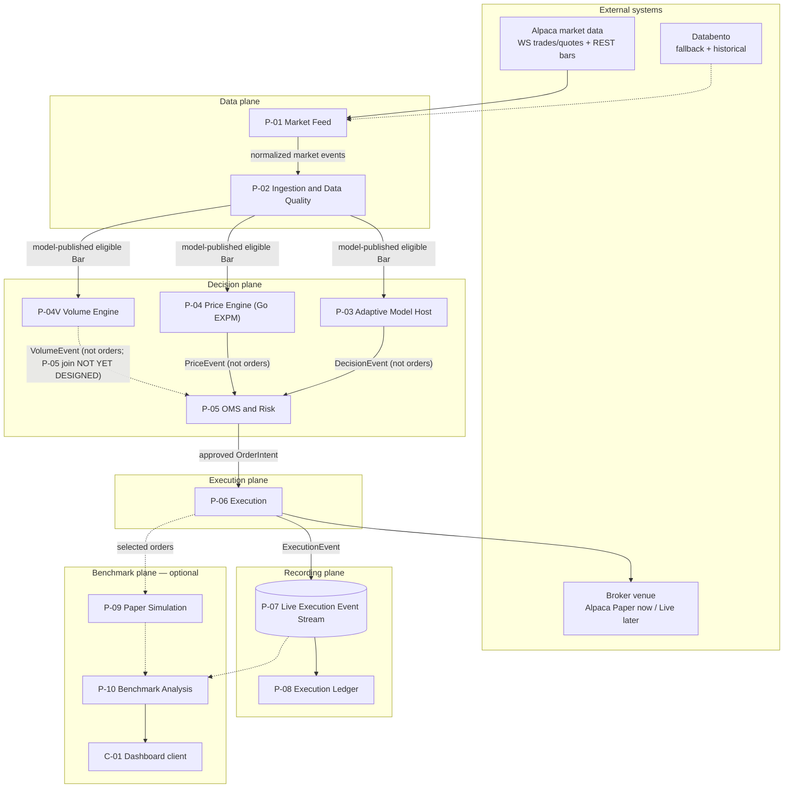
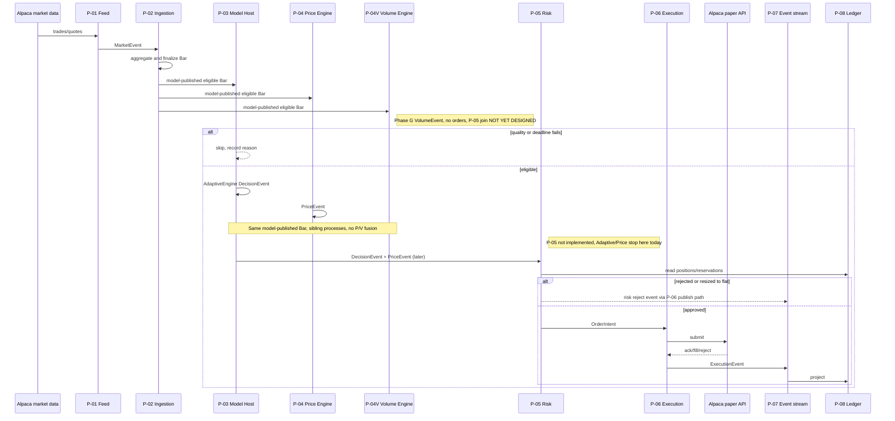

# QuanTRAM Process Model

**Version:** V2  
**Date:** September 6, 2026  
**Derived from:** [Process Model V1](QuanTRAM_PROCESS_MODEL_V1_082926.md) (29 Aug 2026; last V1 update 5 Sep 2026)  
**Status:** Process decomposition and service-contract proposal. P-01–P-04 are in-process (P-04 Go PriceEngine/EXPM landed 2 Sep, default `QUANTRAM_PRICING=off`). P-04V Volume Engine is an implemented sibling model-processing process, validated through ModelHost Phase G (6 Sep 2026).  
**Parent Architecture:** [QuanTRAM System Specification](QuanTRAM_hi-level_design_082826.md)  
**Derived Artifact Specification:** [E2E QuanTRAM Artifacts](E2E_QuanTRAM_ARTIFACTS.md)  
**Open Design Gaps:** [QuanTRAM Decision Integrity and Design Gap Analysis](QuanTRAM_DECISION_INTEGRITY_GAP_ANALYSIS_082826.md)

**Increment 1 (P-01 / P-02):** [QuanTRAM Ingestion Increment 1](QuanTRAM_INGESTION_INCREMENT_1_083026.md)  
**Increment 1 continuation (P-02 quality):** [P-02 Data Quality](QuanTRAM_INGESTION_P02_DATA_QUALITY_083126.md)  
**P-03 (landed):** [Adaptive Model Host](QuanTRAM_P03_ADAPTIVE_MODEL_HOST_083126.md) · [Implementation](QuanTRAM_P03_IMPLEMENTATION_083126.md)  
**P-04 (landed, default off):** [Price Engine](QuanTRAM_P04_PRICE_ENGINE_090226.md) · [Implementation](QuanTRAM_P04_IMPLEMENTATION_090226.md)  
**P-04V (implemented / Phase G):** [Volume Engine](QuanTRAM_VOLUME_ENGINE_090526.md) · [Implementation](../implementations/QuanTRAM_P04V_VOLUME_ENGINE_IMPLEMENTATION_090526.md)

QuanTRAM Process Model V2 preserves the process identities, responsibilities, relationships, and implementation-reference structure of V1. V2’s primary architectural change is reconciliation of **P-04V Volume Engine** from design-approved status to its validated Go / protobuf / ModelHost Phase G implementation. Other process IDs and definitions remain unchanged except where minimal relationship text is required to represent P-04V accurately.

## 1. Purpose and Authority

This document translates the parent architecture diagram into a **process model**: named runtime units, their inputs and outputs, failure domains, scale axes, and gRPC contracts. It exists so QuanTRAM can define microservices and `quantram.proto` from process boundaries rather than from package folders.

The parent architecture remains authoritative for system intent and end-to-end behavior. The artifact specification remains authoritative for Go package ownership, ports-and-adapters, and the single-file protobuf policy. This process model is authoritative for:

- logical process inventory and ownership
- required versus optional runtime paths
- east-west and northbound service surfaces
- local paper-trading topology and later Azure scale-out
- how Adaptive (P-03, Go), Price Engine (P-04, Go EXPM), and Volume Engine (P-04V, implemented sibling process) join the model-processing path; Python is an offline oracle, not a sidecar

Process names here do not force one container per process on day one. A process is a **logical runtime unit** with a contract, a scale axis, and a failure domain. A binary or container may host one or more processes until an independent-scaling or isolation need is demonstrated. Canonical terms used throughout this document are defined in [§17 QuanTRAM Terminology and Systems Dictionary](#17-quantram-terminology-and-systems-dictionary).

QuanTRAM v1 is limited to U.S. stocks, ETFs, and published market indices. Indices remain analytics-only and must never become broker orders. A stock, ETF, or index may be modeled as an **Entity**; a **Symbol** may identify that Entity in current contracts, but Symbol is not the architectural definition of Entity or Entity Key.

## 2. Why Processes Before Proto

The architecture diagram is a data-flow picture. A proto file needs **callers, callees, streaming versus unary, and who owns state**. Those are process questions:

| Architecture box | Process question the proto must answer |
| :--- | :--- |
| Alpaca SIP / Databento | Who owns reconnect, credentials, and provider schemas? |
| Circuit breaker and failover | Who decides the active source and when inference may resume? |
| OHLCV aggregator and gap-filler | Who emits the canonical bar stream, and is it pull or push? |
| Adaptive Model Engine | Is inference in-process Go, a Python sidecar, or both? |
| OMS and Risk Guardrails | Who holds reserved exposure and kill switches? |
| Execution Router / broker adapter | Who is allowed to call a broker, and under which venue? |
| Live Execution Events sink | Is this a gRPC service or a durable log? |
| Ledger | Who is the source of truth for positions and PnL? |
| Paper engine / benchmark | Which work may fail without touching the live path? |

The answer used throughout this document: **gRPC defines service contracts; a durable event log carries high-volume and multi-consumer facts; in-process channels are an allowed transport only while processes are collocated.**

## 3. Process Model Principles

1. **One owner per fact.** A bar, decision, risk reservation, broker order, or ledger projection has a single writing process.
2. **Required path is isolated from optional path.** Paper simulation, correlation, telemetry storage, and the dashboard must never delay or reject a live or paper-venue order.
3. **Ticks do not cross unary gRPC.** Trade and quote ingress stays inside the feed and ingestion processes. Downstream consumers see **finalized bars** and snapshots, not raw tick RPCs.
4. **Decisions are request-response.** Model evaluation, risk evaluation, and order submit are unary (or short client-stream) RPCs so deadlines, idempotency keys, and rejection reasons stay explicit.
5. **Execution facts are events.** Broker acknowledgments, fills, cancels, and rejects are append-only stream records. Ledger and benchmark are independent consumers.
6. **Python is an offline scientific oracle, not the control plane.** Adaptive and Price Engine run in Go. P-04V Volume Engine is also a Go process. Frozen SADE (and SADE RK45) stay outside the live path. Go owns identifiers, quality gating, risk, routing, and recording.
7. **Contracts outlive topology.** Local single-binary, local multi-process, and Azure AKS must implement the same proto and event envelopes.
8. **Fail closed on the live path.** Unknown data quality, expired decisions, non-tradable indices, and kill switches produce auditable rejects. Observation may continue when submission must stop.
9. **Open integrity gaps remain open.** This model names the processes that will enforce DI/RV/OP decisions; it does not close those gaps.

### 3.1 Terminology hierarchy

These concepts are distinct. Do not treat them as synonyms.

| Concept | Role |
| :--- | :--- |
| **Entity** | The distinct thing for which QuanTRAM maintains causal model processing and process state. |
| **Entity Key** | The stable runtime identity used to associate an Observation with that Entity. |
| **Entity-Key Worker** | The current runtime worker that provides ordered execution context for that Entity Key. |
| **Process** | A logical runtime unit (for example P-03, P-04, P-04V) with responsibility, inputs, outputs, owned state where applicable, failure domain, scale axis, and contract. |
| **Process State** | Authoritative retained information owned by a Process for an Entity. |
| **State Update** | Successful advancement of owned Process State after processing an Observation. |
| **Process Output** | Information produced by a Process as the result of processing. |
| **Output Publication** | Making that Process Output available to its defined subscribers or contract surface. |

A Process and a Worker are not the same concept. Current collocated implementation may execute several sibling processes inside one Entity-Key Worker. Sequential execution inside that worker does not create a process-dependency chain.

The exact generalized representation of Entity Key is **not** defined by this Process Model. Current V1 implementation may use Bar symbol/instrument identity as the practical routing key for stocks, ETFs, and indices. That is an implementation realization of Entity Key, not the architectural definition of Entity or Entity Key.

## 4. Process Inventory

Processes are numbered `P-01` through `P-10`, plus inserted sibling process **P-04V**. `C-01` is a client, not a core server. P-05 through P-10 are **not** renumbered.

| ID | Process | Architecture box | Path | Scale axis | Initial language |
| :--- | :--- | :--- | :--- | :--- | :--- |
| P-01 | Market Feed | Alpaca SIP, Databento | Required data | Connection and universe shard | Go |
| P-02 | Ingestion and Data Quality | Circuit breaker, failover, OHLCV aggregator, REST gap-filler | Required data | Symbol shard | Go |
| P-03 | Adaptive Model Host | Adaptive Model Engine (Go orchestration) | Required decision | Symbol shard | Go |
| P-04 | Price Engine | PriceEngine on analytic EXPM trajectories | Required decision | Symbol shard | Go |
| P-04V | Volume Engine | Volume feature mathematics and Volume interpretation mathematics | Required model-processing | Symbol shard / per-entity owned VolumeState | Go |
| P-05 | OMS and Risk | OMS and Risk Guardrails | Required decision | Account (single writer) | Go |
| P-06 | Execution | Execution Router, Live Broker Adapter | Required execution | Account / venue connection | Go |
| P-07 | Live Execution Event Stream | Live Execution Events sink | Required recording | Partition by account or order | Log (not a domain RPC) |
| P-08 | Execution Ledger | Authoritative ledger and audit store | Required recording | Account | Go |
| P-09 | Paper Simulation | Paper Execution Engine | Optional benchmark | Symbol / order | Go |
| P-10 | Benchmark Analysis | Correlation engine, telemetry store | Optional benchmark | Time range / strategy | Go |
| C-01 | Harness Dashboard | Harness Benchmark Dashboard | Optional read | Stateless replicas | Any gRPC client |

P-01 and P-02 form the **data plane**. P-03, P-04, P-04V, P-05, and P-06 form the **decision and execution plane**. P-07 and P-08 form the **recording plane**. P-09 and P-10 form the **benchmark plane**.

P-04V is one Volume Engine. It is **not** a child of P-04, **not** a Volume Policy service or layer, and **not** a replacement for P-04. Approved sequence: P-01, P-02, P-03, P-04, **P-04V**, P-05, P-06, P-07, P-08, P-09, P-10, C-01.

### 4.1 Two meanings of “paper”

The architecture diagram and the local test plan use “paper” for different things. They must not be collapsed.

| Name | What it is | Process | Local Phase 0 |
| :--- | :--- | :--- | :--- |
| **Venue: Alpaca Paper** | Alpaca’s paper brokerage API. QuanTRAM treats it as the configured broker. | P-06 | **On.** This is the execution venue for local testing. |
| **Internal paper engine** | QuanTRAM’s L2 fill simulator for live-versus-modeled comparison. | P-09 | **Off** unless benchmark mode is `SAMPLED` or `FULL`. |

Local testing therefore runs a **real execution path** against Alpaca paper. It does not require P-09. When live brokerage is later enabled, P-06 points at the live Alpaca (or IBKR) adapter and P-09 may mirror selected orders.

## 5. Logical Process Map

This is the parent diagram restated as processes and contracts. Solid arrows are the required path except as noted. Dashed arrows are optional benchmark work, except the P-04V → P-05 arrow, which is a provisional undesigned join sketch only.



### 5.1 Sibling process consumption (authoritative)

P-03, P-04, and P-04V are sibling model-processing processes. They are each offered the **same model-published eligible canonical Bar** from P-02 (`Pipeline.fanoutModel`). This is **not** `P-03 → P-04 → P-04V`. P-04V does **not** consume Price Output.

```text
                         P-01 MARKET FEED
                                |
                                v
                    P-02 INGESTION / DATA QUALITY
                                |
                      Model-Published Eligible Bar
                                |
              +-----------------+-----------------+
              |                 |                 |
              v                 v                 v
       P-03 ADAPTIVE        P-04 PRICE       P-04V VOLUME
       MODEL HOST           ENGINE           ENGINE
              |                 |                 |
           CONSUME           CONSUME           CONSUME
              |                 |                 |
              v                 v                 v
       Adaptive State       Price State       Volume State
              |                 |                 |
              v                 v                 v
       Adaptive Math        Price Math        Volume Math
              |                 |                 |
              v                 v                 v
            EMIT              EMIT              EMIT
              |                 |                 |
              v                 v                 v
       Adaptive Output      Price Output      Volume Output
```

They do not call each other over gRPC. Adaptive BUY/SELL/HOLD is not an input to PriceEngine or P-04V. Price GREEN/AMBER/RED is not an input to Adaptive or P-04V. Volume Output is not an input to Adaptive or Price. There is no P/V fusion in this process model.

P-04V does **not** create another market subscription, provider connection, independent market-data path, or `SubscribeModelBars` mailbox solely for Volume.

Today’s collocated Host invokes P-04 after P-03 on a model-published Bar. That is in-process fan-out on the same Observation, not a process-dependency chain. Phase G joins P-04V to that same `Pipeline.fanoutModel` → one `SubscribeModelBars` → Entity-Key Worker path, after common Host gates. P-04V performs its Independent State Update relative to the P-03/P-04 Joint State-Update Transaction (`commitA && commitP` is the implementation identifier for that pair). Sequential execution inside the Entity-Key Worker is **not** a Process Dependency.

Raw `Bar.Volume` is already used by P-03 D01 `updateVolumeInfluence` and is also used by P-04V as `V_RAW`. Those paths share only the originating observation. They are not process-dependent.

P-05 combination of P-03, P-04, and P-04V outputs is **NOT YET DESIGNED**. The arrows into P-05 are a provisional topology sketch only. They do **not** authorize a Decision Neural Network, P/V fusion, combiner, or P-04V emitting BUY/SELL/HOLD or orders. P-05 through P-10 are unchanged as processes.

## 6. Process Catalog

Each process lists what it owns, what it consumes and produces, how it fails, how it scales, and which proto service it implements. Open integrity gaps that this process must later enforce are cited by ID.

### 6.1 P-01 Market Feed

**Owns:** Provider sessions, reconnect loops, credential retrieval, provider-payload decoding, instrument classification at ingress.

**Consumes:** Alpaca SIP or IEX WebSocket trades and quotes; Alpaca REST bars; later Databento real-time and historical.

**Produces:** Provider-tagged `MarketEvent` candidates with source timestamp, local receipt timestamp, `InstrumentType`, and tradability metadata. Does not emit canonical bars.

**Does not own:** Source selection, bar construction, model state, orders.

**Failure domain:** A provider disconnect must not crash ingestion. P-01 reports `FeedHealth` to P-02 and retries with exponential backoff. Secrets never enter logs or domain events.

**Scale:** Horizontal by symbol universe shard or by provider connection. Alpaca session limits are the practical cap.

**Proto:** `MarketFeedService` (northbound health and active-source queries). East-west tick handoff to P-02 is an internal stream or in-process channel, not a public unary RPC.

**Gaps:** DI-01, DI-04, DI-05, OP-03, OP-07.

**Local Phase 0:** Alpaca only. Databento adapter may exist as a stub. Use the Alpaca feed the account is entitled to (IEX or SIP). Record the feed product in every event so a later SIP upgrade is visible in provenance.

### 6.2 P-02 Ingestion and Data Quality

**Owns:** Heartbeat evaluation, circuit-breaker state, failover and failback, normalization, OHLCV aggregation, gap detection, REST backfill, rolling windows, bar finalization, quality flags.

**Consumes:** `MarketEvent` from P-01; historical bars from P-01’s `HistoricalBarSource` during recovery.

**Produces:** A continuous, causally ordered `Bar` stream with `quality_status`, `is_final`, `is_backfilled`, `source`, `source_transition`, `data_age`, and `market_snapshot_id`. Also emits ingestion health and capability flags (`observe`, `infer`).

**Does not own:** Signals, risk, orders. Must **quarantine** inference (tell P-03 to pause) when continuity cannot be proven.

**Failure domain:** Unhealthy or reconciling ingestion disables new inference and new submissions while remaining able to observe and recover. It does not cancel in-flight broker orders.

**Scale:** Partition by symbol. Each shard owns open-bar state for its symbols. Do not share mutable open bars across processes.

**Proto:** `IngestionService` — `StreamBars`, `GetBarWindow`, `TriggerGapFill` (ops). Heartbeat remains 1000 ms; three consecutive failures or latency above 1500 ms still trip failover as specified in the parent.

**Gaps:** DI-01, DI-02, DI-03, DI-04, DI-06. This is the highest-risk process until those gaps close.

**Local Phase 0:** Single shard, Alpaca-only source, REST gap-fill after reconnect. Circuit breaker may have no alternate source; in that case the state is `failed` or `degraded`, not a silent Databento switch.

### 6.3 P-03 Adaptive Model Host

**Owns:** Subscription to the P-02 model-consumer path (`SubscribeModelBars`), per-entity adaptive Process State (D01 → D02 → D04 → emitter; currently symbol-routed), `DecisionEvent` identifiers, model-deadline watchdog, decision provenance.

**Consumes:** Finalized, model-eligible bars from P-02 — the same model-published eligible Bar supplied to P-04 and P-04V. Does **not** consume PriceEngine output or Volume Output and does not call a Python worker.

**Produces:** Versioned `DecisionEvent` (`oneof` decision | skip). HOLD is a decision. Never sends orders. After Model Publication, the same host offers that Bar to collocated P-04 and P-04V. That is sibling fan-out, not a process-dependency chain.

**Does not own:** Risk limits, broker calls, F4/EXPM/PriceEngine mathematics (P-04), Volume mathematics (P-04V).

**Failure domain:** Inference timeout or stale/discontinuous bars produce **no new DecisionEvent reuse** (OP-05). P-03 stays up and reports model-host health separately from feed health.

**Scale:** Horizontal by entity/symbol shard (currently symbol-routed). One Entity-Key Worker per Entity Key; no concurrent `Step`. Current V1 routing uses Bar symbol/instrument identity.

**Proto:** `ModelService` — `StreamDecisions` (live). `Evaluate` / `GetModelInfo` remain later. `ModelInferenceService` is **not** used for adaptive.

**Gaps:** DI-06, DI-07, MV-01, OP-05.

**Local Phase 0:** Collocated in `quantram-server`. `QUANTRAM_MODEL=off` by default; `adaptive` enables the host. Live IEX DecisionEvents observed 1 Sep.

### 6.4 P-04 Price Engine

**Owns:** Bounded per-entity pricing history (currently symbol-routed; default 31 rows), causal quadratic derivatives, F4 ridge fit, analytic EXPM cover (`time_term == false`), numerical assembly, `EmissionPolicy` / `PriceEngine`, optional cockpit, `PriceEvent` identifiers.

**Consumes:** The **same model-published eligible bar** supplied to P-03 and P-04V (OHLCV + `IntervalStart`). Not `Decision.side`. Not Volume Output. Not the lossy observe stream. Not a `PredictRequest` window RPC.

**Produces:** `PriceEvent` (`oneof` PriceEmission | pricing skip). Colors GREEN/AMBER/RED/INVALID; trajectory phase and confidence. **Does not** produce BUY/SELL/HOLD and must not call Alpaca.

**Does not own:** Adaptive emitter state, VolumeState, risk, tradability, or broker semantics.

**Failure domain:** A pricing panic or timeout is contained in the Entity-Key Worker. Host marks pricing unhealthy and emits a typed skip; do not reset adaptive state because pricing failed unless the Joint State-Update Transaction rolls both back (see P-04 implementation Phase H). Restart of pricing must not require P-02 restart.

**Scale:** Same entity/symbol shard / Entity-Key Worker as P-03 (currently symbol-routed). Collocated Go. Replicas are not a Python pool.

**Proto:** `ModelService.StreamPriceEvents` fans out `PriceEvent` the way `StreamDecisions` fans out `DecisionEvent`. Off → `FailedPrecondition`; unavailable → `Unavailable`. Last-per-symbol catch-up, no durable history. Do **not** implement `ModelInferenceService`.

**Local Phase 0:** Collocated in `quantram-server`. `QUANTRAM_PRICING=off` by default; `expm` requires `QUANTRAM_MODEL=adaptive`. Phases A–I landed 2 Sep. Continuity is causal observation order: a skipped provider minute is a valid irregular interval, not `INPUT_GAP`. `STATE_DISCONTINUOUS` is reserved for proven loss (overflow / panic / proven missing eligible). `Host.ResetSymbol` reinitializes one symbol; no operator reset RPC yet.

**Oracle:** SADE `solve_cover_rk45_reference` stays outside QuanTRAM. Go production is EXPM only (`gonum` v0.17.0 `Dense.Exp`).

### 6.4V P-04V Volume Engine

**Status:** Implemented and validated through ModelHost Phase G (6 Sep 2026). Detailed scientific definitions, invariants, lifecycle, maturation, frozen mathematics, and APTF equivalence authority live in [Volume Engine](QuanTRAM_VOLUME_ENGINE_090526.md). Coding chronology lives in [P-04V implementation](../implementations/QuanTRAM_P04V_VOLUME_ENGINE_IMPLEMENTATION_090526.md). This catalog does not duplicate those formulas.

**Owns:** One `volume.Engine` per Entity-Key Worker. Bounded per-entity `VolumeState` (Volume Feature State + Volume Interpretation State). `VolumeState` is **not** Snapshot, Persistence, MongoDB, a database, historical storage, or replay storage.

**Consumes:** The **same model-published eligible canonical Bar** already delivered through `Pipeline.fanoutModel` → one `SubscribeModelBars` → Host Entity-Key Worker, after common Host gates. Uses `Bar.Volume` as `V_RAW`. Does **not** consume Adaptive Output or Price Output. Does **not** create another market subscription, provider connection, independent market-data path, Volume mailbox, or Volume-only worker goroutine.

**Produces:** Independent `VolumeEvent` from Volume Feature Mathematics plus Volume Interpretation Mathematics inside **one** engine:

```text
model-published Bar.Volume
        ->
bounded causal VolumeState
        ->
validated Volume feature mathematics
        ->
validated Volume interpretation mathematics
        ->
VolumeEvent
```

Quantities: `V_RAW`, `V_N`, `V1`, `V2`, `interval_mean_vn`, `predicted_next_V_N`. Evolution is discrete `G_V` (`predicted_next_V_N = V_N`). No RK45. No Volume EXPM. Canonical categorical output is **Indicator** (GREEN / AMBER / RED), distinct from `raw_color`. Indicator is not BUY/SELL/HOLD. Historical APTF `cockpit_color` is provenance only.

Does **not** emit BUY/SELL/HOLD, an order, OMS/Risk action, or a trade. Does **not** perform P/V fusion.

**Does not own:** Adaptive influence (P-03 D01 `updateVolumeInfluence` remains P-03), PriceEngine mathematics, risk, tradability, broker semantics, Snapshot, Persistence, or a separate Volume Policy process. There is no QuanTRAM Volume Policy service, layer, or process.

**Failure domain:** Volume Process Failure / panic is isolated in the Entity-Key Worker (`volDisc`). P-04V performs an Independent State Update relative to the P-03/P-04 Joint State-Update Transaction (`commitA && commitP`). On P-04V Process Success, `VolumeState` advances and `VolumeEvent` is published. On P-04V Process Failure, the Bar is a Branch-local Discard for P-04V: `VolumeState` does not advance, the Discontinuity is explicit, and P-03/P-04 processing of the same Bar is unaffected. P-03/P-04 failure must not roll back a successful P-04V State Update. Restart of Volume must not require P-02 restart. Persistence must not delay or control realtime Volume processing.

**Scale:** Same entity/symbol shard (currently symbol-routed), with per-entity owned `VolumeState`, as the other sibling processes. Collocated Go.

**Proto:** `ModelService.StreamVolumeEvents` is Output Publication of Host-produced `VolumeEvent`. No dedicated Volume microservice. Unavailable quantities are absent on the wire; available zero is present. No independent Volume EffectiveTime. Slow or cancelled RPC clients must not block model processing.

**StageTransition:** V1.1 remains frozen. P-04V StageTransition publication is deferred, outside P-04V V1, and non-blocking.

**Local Phase 0:** Collocated in `quantram-server`. Volume is present whenever Adaptive Host exists (`QUANTRAM_MODEL=adaptive`). There is **no** `QUANTRAM_VOLUME` flag. Price remains independently `QUANTRAM_PRICING`. `Host.ResetSymbol` rebuilds Volume (and Adaptive/Price); there is no automatic session, source, infer, or elapsed-gap Volume reset.

**Raw-volume dual use:** P-03 already uses raw volume through D01 `updateVolumeInfluence`. P-04V uses raw volume as `V_RAW` for dedicated Volume mathematics. The paths share only the originating observation.

### 6.5 P-05 OMS and Risk

**Owns:** Risk policy version, limit evaluation, pending-exposure reservation, kill switches, last-moment data-age and tradability checks, machine-readable reject/resize reasons.

**Consumes:** `DecisionEvent` from P-03 and, when P-04 is live, `PriceEvent`. P-05 combination of P-03, P-04, and P-04V outputs is **NOT YET DESIGNED**; this model does not add a join, fusion, aggregator, voting engine, or decision-network architecture. Portfolio, cash, and working-order state from P-08 (and local reservation memory); current spread/snapshot age from P-02 or a snapshot reference on the decision. P-05 is **not** started in the P-04 increment. P-04V does not feed orders or execution.

**Produces:** `RiskDecision`: approved, resized, or rejected `OrderIntent` with `decision_id` preserved. Approved intents are the only inputs P-06 may submit.

**Does not own:** Broker sessions or ledger projections. It **reserves** exposure; P-08 **confirms** it after fills.

**Failure domain:** Risk unavailability or uncertain exposure is fail-closed for new submits. Cancels of working orders may still be allowed per the capability matrix (RV-03).

**Scale:** **Single writer per account.** Horizontal scale is by account, not by symbol. This is the consistency bottleneck and must stay small and correct.

**Proto:** `RiskService` — `Evaluate`, `GetPortfolioView`, `SetKillSwitch` (also mirrored on `OperationsService` for operators), `GetRiskPolicy`.

**Gaps:** RV-01, RV-02, RV-03, DI-05 (index reject), DI-06 (data-age recheck).

### 6.6 P-06 Execution

**Owns:** Venue selection, idempotent broker submit/cancel, broker-protocol translation, assignment of `order_id` and optional `benchmark_id`, fan-out to P-09 when policy selects the order, publication of lifecycle events to P-07.

**Consumes:** Risk-approved `OrderIntent`. Broker acknowledgments, rejects, replaces, cancels, and fills.

**Produces:** Broker-facing orders; `ExecutionEvent` records; optional handoff to P-09. Must not wait on P-09, P-10, or C-01.

**Does not own:** Portfolio truth (P-08) or signal generation.

**Failure domain:** Broker disconnect disables new live/paper-venue submits and keeps cancel/reconcile capabilities as defined by RV-03. Event-publish failure is a **live-path fault**: if an order was sent and the event cannot be recorded, the process must enter a degraded execution state and reconcile rather than silently continue (OP-01, OP-02).

**Scale:** One process (or session manager) per venue connection and account. Throughput is order-rate, not tick-rate.

**Proto:** `ExecutionService` — `SubmitOrder`, `CancelOrder`, `GetOrderStatus`, `StreamOrderUpdates`.

**Local Phase 0:** `AlpacaBrokerAdapter` with base URL `https://paper-api.alpaca.markets`. Trading mode is `PAPER_VENUE`, not `LIVE_VENUE`. Benchmark mode defaults to `OFF`.

### 6.7 P-07 Live Execution Event Stream

**Owns:** Durable, append-only delivery of `ExecutionEvent`. Independent consumer checkpoints. Partitioning and retention policy (once OP-02 is decided).

**Consumes:** Events published by P-06. Does not interpret them.

**Produces:** Ordered (within partition key) event log to P-08 and, optionally, to P-10.

**This is infrastructure, not a domain gRPC service.** Local candidates: NATS JetStream, or an embedded outbox plus Postgres. Azure candidates: Event Hubs or a Kafka-compatible log. The Go ports remain `ExecutionEventPublisher` and `ExecutionEventConsumer`.

**Failure domain:** Separate from P-10. Ledger consumption must continue if benchmark consumption stops.

**Gaps:** OP-02, OP-04.

### 6.8 P-08 Execution Ledger

**Owns:** Authoritative orders, fills, positions, cash, fees, PnL projections, broker reconciliation views, audit retention of applied events.

**Consumes:** P-07 events. Broker snapshot queries during reconcile.

**Produces:** Queryable execution state for P-05, operators, and C-01. Never takes writes from the dashboard.

**Scale:** Write path is the P-07 consumer (one active projector per account partition). Read replicas are allowed for queries.

**Proto:** `LedgerService` — order, fill, position, cash, PnL, and reconciliation queries with pagination.

**Local Phase 0:** Postgres or SQLite via the `ExecutionLedger` port. SQLite is acceptable for single-host paper testing if the port stays technology-neutral.

### 6.9 P-09 Paper Simulation

**Owns:** Internal L2 fill model, simulated execution events, simulator version.

**Consumes:** Selected `OrderIntent` copies at live/paper-venue submit time, plus a contemporaneous L2 or quote snapshot.

**Produces:** `PaperExecutionEvent` to P-10 only.

**Must:** Bound queues and drop or degrade optional work rather than block P-06.

**Proto:** No northbound mutate API. Optional internal `PaperService.Simulate` for tests. Results are read through `BenchmarkService`.

**Gaps:** BV-01. Keep **off** for local Alpaca-paper testing.

### 6.10 P-10 Benchmark Analysis

**Owns:** Pairing by `benchmark_id`, derived fill/latency/slippage/PnL comparison records, benchmark-mode configuration persistence.

**Consumes:** Selected live events from P-07 and paper events from P-09.

**Produces:** Query and stream APIs for C-01.

**Proto:** `BenchmarkService` — summary, comparisons, metric stream, authenticated mode change.

**Local Phase 0:** Optional. Dashboard is not required to paper-trade.

### 6.11 C-01 Harness Dashboard

Read-only gRPC client of `BenchmarkService`, `LedgerService`, `MarketFeedService`, and `OperationsService`. Not a core microservice. May be deferred until P-08 queries exist. C-01 does not currently consume `VolumeEvent`; dashboard proto/semantic copies do not yet expose P-04V.

### 6.12 Cross-cutting: Operations

Every server process exposes the same health surface so RV-03 can be implemented without a hidden shared status bit.

**Proto:** `OperationsService` — aggregate health, readiness, capability matrix (`observe`, `infer`, `submit`, `cancel`, `reconcile`, `benchmark`), kill switches, config version.

A dedicated ops binary is unnecessary locally. Each Go process registers `OperationsService` on its gRPC server; a later Azure ingress can aggregate.

## 7. End-to-End Process Flows

### 7.1 Required bar-to-venue path

This is the path that must work on this machine with Alpaca live data and Alpaca paper trading.



Identifier chain on a successful order: `market_snapshot_id` → `signal_id` → `decision_id` → `order_id` → `broker_order_id` → `event_id`. Optional `benchmark_id` is assigned in P-06 only when P-09 is selected.

P-04V is a sibling process offered the same model-published eligible Bar. Output Publication is `VolumeEvent` via `StreamVolumeEvents`. It is **not** on the Phase 0 live venue path, does not emit orders, and does not change P-05–P-10. Today's collocated host still invokes P-04 after Model Publication; Volume is offered after common gates independently of the P-03/P-04 joint state-update transaction. That remains in-process fan-out on the same observation.

### 7.2 Feed interrupt and inference quarantine

1. P-01 detects socket loss or heartbeat failure and reports unhealthy Alpaca.
2. P-02 trips the breaker, records `T_last`, and sets capability `infer=false`, `submit=false`.
3. P-01 reconnects with backoff. P-02 REST-backfills `[T_last, T_now]`, deduplicates, and rebuilds or quarantines open bars (DI-03 still to be specified).
4. Only after continuity is proven does P-02 set `infer=true`. P-05 still rechecks data age before any new submit.
5. With no Databento locally, there is no failover source. The process model still has the Databento port so Phase 2 can attach it without changing P-03 through P-08.

### 7.3 Offline CSV versus live inference

SADE Unit Run 001 (adaptive) and Pricing Unit Run 001 are the numerical authorities. Live trading is only valid if QuanTRAM Go engines reproduce those frozen sequences, not a Python sidecar.

| Step | Offline harness | Live path |
| :--- | :--- | :--- |
| Bar source | Checked-in CSV OHLCV | P-02 model-eligible finalized bars |
| Time | `source_timestamp` → `IntervalStart` | `Bar.IntervalStart` |
| Adaptive | `internal/adaptive` Step | Same engine in the host |
| Pricing | `internal/pricing` Step on the same bars | Same engine after Model Publication |
| Volume | Implemented P-04V discrete `G_V` (`internal/volume`) | Same model-published bars after common Host gates |
| Output | DecisionEvent + PriceEvent + VolumeEvent | Same domain events; `StreamDecisions` / `StreamPriceEvents` / `StreamVolumeEvents` |
| Risk / broker | Absent | P-05 then P-06 (not this increment) |
| Provenance | File name and row range | `market_snapshot_id`, versions, quality |

Promotion rule (MV-01, still open): a live model-processing output is not trusted until replay of stored model-published bars reproduces offline scores. Persist enough input to replay without reading mutable current bars. This is **not** a `PredictRequest` body.

### 7.4 Optional benchmark path

Enabled only when benchmark mode is `SAMPLED` or `FULL`:

1. P-06 assigns `benchmark_id` and submits to the venue without waiting.
2. P-06 enqueues a copy plus snapshot reference to P-09.
3. P-09 simulates and emits paper events.
4. P-10 correlates with selected P-07 events and stores derived metrics.
5. C-01 queries P-10 and P-08.

If the P-09 queue is full, P-06 logs a dropped-mirror event and continues. That drop must not fail the venue submit.

## 8. Communication Model

Three planes, three transports.

| Plane | Content | Transport | Latency class |
| :--- | :--- | :--- | :--- |
| Data | Ticks inside P-01/P-02; finalized bars out of P-02 | In-process channel if collocated; gRPC `StreamBars` or a bus if split | Tick-rate / bar-rate |
| Decision | Predict, risk evaluate, submit, cancel | gRPC unary with deadlines and idempotency keys | Milliseconds |
| Recording | Execution and paper events | Durable log with independent checkpoints | Asynchronous |

### 8.1 Collocated transport rule

While P-01, P-02, P-03, P-04, P-04V, P-05, P-06, and P-08 share a process, they **call Go interfaces**, not loopback gRPC. Generated proto types stay at the process edge. This matches the artifact specification and keeps the local hot path off the serialization tax.

When a process is split out, the same interface is satisfied by a gRPC adapter. That is the move from “one binary” to “microservice” without redesigning the domain.

### 8.2 P-04 is collocated Go (supersedes Python sidecar)

The August 29 rule that P-04 is always an out-of-process Python worker is **withdrawn**. Adaptive inference is in-process P-03. PriceEngine is in-process P-04 in the same Entity-Key Worker. There is no Phase 0 `Predict` RPC.

A future split of P-04 into its own binary would use a Go adapter over the same domain `PriceEvent` contract, not `ModelInferenceService`.

### 8.3 Backpressure

| Boundary | Policy |
| :--- | :--- |
| Alpaca WS → P-01 | Provider-limited. If local queues fill, drop quotes before trades and mark quality degraded. Never block the socket read until memory is exhausted. |
| P-02 → P-03 | P-03 consumes finalized bars only. If inference lags, skip the bar and record a deadline miss; do not let an unbounded queue replay stale bars as if they were live. |
| P-03 → P-04 | In-process call on the same model-published bar. No second mailbox. Timeout/skip per P-04 implementation Phase H (joint P-03/P-04 state-update transaction: both process states advance together or neither advances). |
| Host → P-04V | Same published eligible Bar after common gates; no second subscription or Volume mailbox. Independent P-04V state update. RPC subscribers must not block model processing. |
| P-05 | In-process, account-serialized. No queue of unreserved intents. |
| P-06 → venue | Broker rate limits. Excess intents reject with `RATE_LIMIT`. |
| P-06 → P-07 | Publish with timeout. Failure degrades submit capability. |
| P-06 → P-09 | Bounded queue, drop-oldest or shed. |

## 9. Proposed gRPC Surface

Single file, per the artifact policy:

```text
api/proto/quantram/v1/quantram.proto
```

Package: `quantram.v1`. Organize the file by area: common types, market data, model, risk, execution, ledger, benchmark, operations, then service definitions. Do not split the file until review or generation friction is demonstrated.

### 9.1 Services and RPC sketch

This sketch is the input to the first proto authoring pass. Field lists belong in the proto; behavior belongs here.

```text
service MarketFeedService {
  rpc GetFeedHealth(GetFeedHealthRequest) returns (FeedHealth);
  rpc GetActiveSource(GetActiveSourceRequest) returns (ActiveSource);
  rpc StreamFeedHealth(StreamFeedHealthRequest) returns (stream FeedHealthEvent);
}

service IngestionService {
  rpc StreamBars(StreamBarsRequest) returns (stream Bar);
  rpc GetBarWindow(GetBarWindowRequest) returns (BarWindow);
  rpc TriggerGapFill(TriggerGapFillRequest) returns (GapFillResult);
}

service ModelService {
  rpc Evaluate(EvaluateRequest) returns (DecisionVector);
  rpc StreamDecisions(StreamDecisionsRequest) returns (stream DecisionEvent);
  rpc StreamVolumeEvents(StreamVolumeEventsRequest) returns (stream VolumeEvent);
  rpc GetModelInfo(GetModelInfoRequest) returns (ModelInfo);
}

service ModelInferenceService {
  // Reserved in the August 29 sketch. Not implemented.
  // Adaptive is P-03 in-process Go. Pricing is P-04 in-process Go EXPM.
  rpc Predict(PredictRequest) returns (PredictResponse);
  rpc GetModelVersion(GetModelVersionRequest) returns (ModelVersion);
  rpc ResetState(ResetStateRequest) returns (ResetStateResponse);
}

service RiskService {
  rpc Evaluate(EvaluateOrderRequest) returns (RiskDecision);
  rpc GetPortfolioView(GetPortfolioViewRequest) returns (PortfolioView);
  rpc GetRiskPolicy(GetRiskPolicyRequest) returns (RiskPolicy);
  rpc SetKillSwitch(SetKillSwitchRequest) returns (KillSwitchState);
}

service ExecutionService {
  rpc SubmitOrder(SubmitOrderRequest) returns (SubmitOrderResponse);
  rpc CancelOrder(CancelOrderRequest) returns (CancelOrderResponse);
  rpc GetOrderStatus(GetOrderStatusRequest) returns (OrderStatus);
  rpc StreamOrderUpdates(StreamOrderUpdatesRequest) returns (stream OrderUpdate);
}

service LedgerService {
  rpc GetOrder(GetOrderRequest) returns (OrderRecord);
  rpc ListOrders(ListOrdersRequest) returns (ListOrdersResponse);
  rpc GetPosition(GetPositionRequest) returns (Position);
  rpc ListPositions(ListPositionsRequest) returns (ListPositionsResponse);
  rpc GetAccountPnL(GetAccountPnLRequest) returns (PnLReport);
  rpc GetReconciliation(GetReconciliationRequest) returns (ReconciliationReport);
}

service BenchmarkService {
  rpc GetSummary(GetSummaryRequest) returns (BenchmarkSummary);
  rpc ListComparisons(ListComparisonsRequest) returns (ListComparisonsResponse);
  rpc StreamMetrics(StreamMetricsRequest) returns (stream BenchmarkMetricEvent);
  rpc SetBenchmarkMode(SetBenchmarkModeRequest) returns (BenchmarkModeState);
}

service OperationsService {
  rpc GetHealth(GetHealthRequest) returns (HealthReport);
  rpc GetReadiness(GetReadinessRequest) returns (ReadinessReport);
  rpc GetCapabilities(GetCapabilitiesRequest) returns (CapabilityMatrix);
  rpc SetKillSwitch(SetKillSwitchRequest) returns (KillSwitchState);
}
```

`SetBenchmarkMode` and kill-switch RPCs are operator APIs. They require authentication once that gap (OP-03 / rollout) is specified. C-01 must not call them in ordinary dashboard use.

### 9.2 Shared types the proto must include

From the parent and artifact specs, plus this process model:

- IDs: `event_id`, `signal_id`, `decision_id`, `order_id`, `broker_order_id`, `benchmark_id`, `market_snapshot_id`, `account_id`, `strategy_id`, `instrument_id`
- `InstrumentType`: `STOCK`, `ETF`, `INDEX`
- `Tradability` and `SessionState`
- `QualityStatus`: complete, degraded, stale, partial, reconstructed, invalid
- `RiskOutcome`: approved, resized, rejected
- `BenchmarkMode`: `OFF`, `SAMPLED`, `FULL`
- `TradingVenue`: `ALPACA_PAPER`, `ALPACA_LIVE`, `IBKR_LIVE`
- `Capability`: observe, infer, submit, cancel, reconcile, benchmark
- Bar, DecisionVector, OrderIntent, ExecutionEvent, and pagination/filter messages

Generated protobuf types **do not** become the Go or Python domain model. Each language maps at its adapter boundary.

### 9.3 What stays out of proto

- Raw provider payloads
- Credentials
- Tick-by-tick public subscribe (ticks stay inside P-01/P-02)
- Direct SQL or file paths
- Azure-specific resource IDs

## 10. Scalability Model

Realtime load is dominated by **market events**, not orders. Design for that split.

### 10.1 Volume classes

| Class | Approximate rate | Owning processes | Scale method |
| :--- | :--- | :--- | :--- |
| Ticks (trades/quotes) | High, bursty | P-01, P-02 | Symbol shards; keep in the data plane |
| Finalized bars | Interval × symbols | P-02 → P-03 | Stream or bus; shard with symbols |
| Inference | Bars that pass quality gates | P-03, P-04, P-04V | Replicas / GPU later |
| Risk + submit | Sparse | P-05, P-06 | Single writer per account |
| Execution events | Per order lifecycle | P-07, P-08 | Partitioned log |
| Benchmark | Subset of orders | P-09, P-10 | Independent consumer lag |

### 10.2 Independent scale-out triggers

Split a collocated process into its own service when one of these is true:

| Trigger | First split |
| :--- | :--- |
| Ingestion CPU or memory grows with universe size | P-01+P-02 out of the decision binary |
| Python inference latency or RAM contends with Go | withdrawn: no Python sidecar; split P-03/P-04/P-04V binaries only if Go CPU contends |
| Risk evaluation blocks on ledger reads | cache account state in P-05; keep P-08 as source of truth |
| Dashboard or replay queries slow ledger writes | read replica or separate query API in front of P-08 |
| Benchmark backlog | scale P-10 only |
| Multiple accounts or strategies | shard P-05/P-06/P-08 by `account_id` |

### 10.3 Provisional latency budgets

OP-05 is still open. Until it is closed, use these as engineering targets, not production SLOs:

| Stage | 1s bars | 1m bars |
| :--- | :--- | :--- |
| Tick apply inside P-02 | 2 ms p99 | 2 ms p99 |
| Bar finalize to P-03 start | 5 ms | 20 ms |
| Entity-Key Worker model-processing step (P-03 + P-04 + P-04V) | inside 200 ms host deadline | 200 ms deadline |
| P-05 Evaluate | 10 ms | 10 ms |
| P-06 submit call start | 10 ms local | 10 ms local |
| Venue RTT | Alpaca-bound | Alpaca-bound |

If the Entity-Key Worker model-processing step encounters a deadline failure, the affected process transaction does not advance its state. P-03 and P-04 retain their Joint State-Update Transaction: both process states advance together or neither advances. P-04V updates VolumeState independently; a successful P-04V State Update is not rolled back by a subsequent P-03/P-04 failure, and a P-04V failure does not prevent P-03/P-04 from completing their joint state update. Sequential execution does not create Process Dependency or a three-process atomic transaction. Prefer no order over a late order (when P-05 exists).

### 10.4 State that prevents naive scale-out

- Open bars and rolling windows: sticky to a P-02 shard.
- Adaptive, Price, and Volume Process State: sticky to the entity/symbol shard that owns that Entity (currently symbol-routed).
- Account exposure and kill switches: sticky to one P-05 writer.
- Broker session: sticky to one P-06.
- Ledger projections: single active consumer per partition.

## 11. Runtime Topologies

### 11.1 Phase 0 — this machine, Alpaca data, Alpaca paper

Goal: exercise the required path with live market data and non-live money.

```text
localhost
  quantram-server            P-01 P-02 P-03 P-04 P-04V + Operations
                             (P-04V present whenever Adaptive Host exists)
                             (P-05 P-06 P-08 compiled later, not started)
       |
  optional NATS or Postgres  P-07 (or core-embedded outbox)
       |
  Alpaca data WS/REST        live quotes/trades/bars
  quantram-dashboard         C-01 observe + Adaptive Pipeline (not required path)
```

**On today:** P-01 (Alpaca), P-02, P-03 (`QUANTRAM_MODEL=adaptive`), P-04 (`QUANTRAM_PRICING=expm` opt-in; default `off`), P-04V (no `QUANTRAM_VOLUME`; on whenever Adaptive Host exists). Viewer Price Engine cards and airport boards landed 2 Sep.  
**Off:** Python model worker, Databento, P-05–P-10, live venue. Dashboard is optional observation. Dashboard does not yet expose P-04V.

**Suggested local config**

| Setting | Phase 0 value |
| :--- | :--- |
| `trading_venue` | `ALPACA_PAPER` |
| `benchmark_mode` | `OFF` |
| `feed_product` | Alpaca IEX or SIP as entitled |
| `databento_enabled` | false |
| `bar_interval` | match the offline model (start with the CSV interval) |
| `kill_switch` | on until an operator enables submit |
| `universe` | small symbol list used in CSV tests |

**Suggested commands / packages** (aligns with the artifact tree; no Python worker):

```text
cmd/quantram-server          collocated Go processes (P-01–P-04 and P-04V)
internal/ingestion
internal/adaptive
internal/pricing             P-04 (landed 2 Sep; default off)
internal/volume              P-04V (Phase G)
internal/modelhost
internal/risk
internal/execution
internal/liveevents
internal/ledger
internal/paper               compiled, not started
internal/benchmark           compiled, not started
internal/transport/grpc
api/proto/quantram/v1/quantram.proto
```

### 11.2 Phase 1 — local multi-process (still this machine)

Split only if Phase 0 proves contention:

```text
quantram-ingest     P-01 P-02
quantram-model      P-03 + P-04 + P-04V (same binary until CPU split)
quantram-risk       P-05
quantram-exec       P-06
quantram-ledger     P-08
NATS JetStream      P-07
```

Bars move by `IngestionService.StreamBars` or a JetStream subject `bars.finalized.{interval}.{symbol}`. Decisions stay unary gRPC.

### 11.3 Phase 2 — Databento attach

P-01 gains the Databento adapter. P-02 gains a real alternate source. No change to P-03–P-08 contracts. Do not enable failover for production decisions until DI-01 and DI-03 exit criteria exist.

### 11.4 Phase 3 — Azure

Same processes, different hosts.

| Process | Azure mapping (indicative) |
| :--- | :--- |
| P-01, P-02 | AKS Deployment, HPA on CPU; or Container Apps |
| P-03 | AKS, symbol-sharded |
| P-04 | AKS, same shard as P-03 until CPU split; no GPU/Python pool |
| P-04V | AKS, same shard as P-03/P-04 until CPU split |
| P-05, P-06 | AKS, replica 1 per account writer; pod anti-affinity later |
| P-07 | Event Hubs or managed NATS; keep the Go ports |
| P-08 | AKS + Azure Database for PostgreSQL |
| P-09, P-10 | Separate Deployment; scale to zero when mode is `OFF` |
| C-01 | Static web app or small Container App |
| Secrets | Key Vault; `FeedCredentialsProvider` / broker credential port |
| Observability | Azure Monitor / OpenTelemetry; do not parse free-form logs for dashboard metrics |

AKS ingress exposes northbound services (`Operations`, `Ledger`, `Benchmark`, `Execution` cancel/status). East-west stays on the cluster service mesh or internal load balancers. Trading credentials never go on a public ingress.

Live venue (`ALPACA_LIVE` or IBKR) is an environment change in P-06 plus Gate B in the gap analysis. It is not a new process.

## 12. Capability Matrix (process-level)

RV-03 requires independent health domains. Until that gap closes, processes must at least emit these capabilities.

| Condition | observe | infer | submit | cancel | reconcile | benchmark |
| :--- | :---: | :---: | :---: | :---: | :---: | :---: |
| All required processes healthy, venue connected | yes | yes | yes | yes | yes | if enabled |
| Feed degraded, bars still finalized with quality flag | yes | strategy policy | P-05 recheck | yes | yes | if enabled |
| Ingestion reconciling / gap filling | yes | no | no | yes | yes | if enabled |
| P-04 down | yes | yes (adaptive may continue) | no | yes | yes | if enabled |
| P-05 kill switch | yes | optional | no | yes | yes | if enabled |
| Venue disconnected | yes | optional | no | no* | yes | if enabled |
| P-07 publish failing | yes | no** | no | yes | yes | no |
| P-10 down | yes | yes | yes | yes | yes | no |

\* Cancel may still be attempted depending on broker session state; define in OP-01.  
\*\* Prefer no new inference that can create submits while recording is unsafe.

## 13. Implementation Sequence

This replaces “start coding services in diagram order” with a contract-first sequence that still matches the parent roadmap.

| Step | Status | Deliverable | Processes | Exit |
| :--- | :--- | :--- | :--- | :--- |
| S0 | **Partial** | `quantram.proto` increment-1 services generated in Go. Risk, execution, ledger, benchmark, and Python stubs are not in the file yet. | contracts | Ingestion/ops RPCs compile. Full-file golden round-trip still open. |
| S1 | **Partial** | Alpaca IEX/test WebSocket, REST historical client, CSV replay, thin reconnect, bar window, `StreamBars`. Full circuit breaker is **not completed** and is **deferred**. See [Increment 1](QuanTRAM_INGESTION_INCREMENT_1_083026.md). | P-01, P-02 | CSV and Alpaca test-feed bars received 2026-08-30. Near-term exit is IEX RTH. Failover, live gap-fill proof, and DI-01 qualification are later. |
| S2 | **Partial** | Adaptive Go black box + host + `StreamDecisions` (Phases A–E, live IEX 1 Sep). Pricing: Go EXPM PriceEngine + `StreamPriceEvents` (Phases A–I, 2 Sep). Oracle SADE `solve_cover_rk45_reference` (not in Go, not APTF). | P-03 done; P-04 landed, default off | Unit Run 001 adaptive done. Pricing Unit Run 001 semantic PASS 15/30/55. Live IEX color not yet claimed. |
| S3 | **Partial** | Model host assigns IDs and skips on quality/deadline | P-03 | Landed 1 Sep (`DecisionEvent`, typed skips). |
| S4 | Not started | Risk rules + kill switch; index intents rejected | P-05 | Auditable reject reasons |
| S5 | Not started | Alpaca paper submit/cancel + event publish + ledger | P-06, P-07, P-08 | Paper fill appears in ledger; restart is idempotent |
| S6 | Deferred | Databento adapter and **full circuit breaker** (failover, failback, production trip rules). Thin Alpaca reconnect in increment 1 does not count as done. | P-01, P-02 | Only after IEX E2E, the model/paper slice, and DI-01/DI-03 policy |
| S7 | Not started | Internal paper + correlation + dashboard client | P-09, P-10, C-01 | Benchmark stop does not affect paper-venue orders |

S1–S5 are the local paper-trading slice. S6–S7 are scale and measurement. S2 is adaptive-in-Go (done) plus PriceEngine-in-Go (landed 2 Sep, default off). P-04V Volume Engine is implemented as a sibling model-processing process (Phase G, 6 Sep) on the same Host path; it is **not** a new S-step and does not change S4–S7. A Python sidecar is not part of the live path.

## 14. Mapping to Existing Documents

| Topic | Where it lives |
| :--- | :--- |
| Layered architecture, feed SLAs, dashboard views, parent diagram | System specification |
| Go interfaces, packages, single proto file, acceptance criteria | E2E artifacts |
| Unresolved correctness and production gaps | Gap analysis |
| Runtime units, RPCs, local vs Azure topology, P-04 PriceEngine, P-04V process identity | This document |
| Increment 1 ingestion implementation and Alpaca/CSV evidence | [Ingestion Increment 1](QuanTRAM_INGESTION_INCREMENT_1_083026.md) |
| P-03 adaptive host | [P-03 design](QuanTRAM_P03_ADAPTIVE_MODEL_HOST_083126.md) |
| P-04 PriceEngine / EXPM | [P-04 design](QuanTRAM_P04_PRICE_ENGINE_090226.md) |
| P-04V Volume Engine science, invariants, lifecycle, frozen mathematics, APTF equivalence | [Volume Engine](QuanTRAM_VOLUME_ENGINE_090526.md) |
| P-04V implementation record (A–G, proto, Phase G host) | [P-04V implementation](../implementations/QuanTRAM_P04V_VOLUME_ENGINE_IMPLEMENTATION_090526.md) |

This document **proposes** a resolution for the artifact specification’s open item “process decomposition and independent scaling thresholds.” It does not close P0/P1 gaps. Implementation of S1 decision-quality behavior still waits on Gate A (DI-01 through DI-07) for any path treated as a production decision contract. Do not prototype a Python inference sidecar; that path is withdrawn.

## 15. Decisions Made Here

| Decision | Choice |
| :--- | :--- |
| Process inventory | P-01 through P-10 plus inserted sibling P-04V plus C-01. P-05–P-10 not renumbered. |
| Local execution venue | Alpaca paper API via P-06 |
| Internal paper engine | Separate optional process P-09 |
| Existing Python model | **Withdrawn as live P-04.** Adaptive is P-03 Go. PriceEngine is P-04 Go EXPM. Volume Engine is P-04V (implemented; discrete `G_V`; no RK45/EXPM). SADE Python (including RK45) is an offline oracle only. |
| P-04V relationship | Sibling model-processing process of P-03 and P-04 on the same model-published eligible Bar. Independent P-04V state update. Not a child of P-04. Not a Volume Policy process. No P/V fusion or Decision Neural Network in this model. P-05 combination of P-03, P-04, and P-04V outputs is **NOT YET DESIGNED**. |
| Core control plane | Go gRPC |
| Tick transport | Not public unary gRPC |
| Proto layout | Still one `quantram.v1` file; services listed in §9 |
| Phase 0 packing | One Go server (`quantram-server`); no Python worker. P-04V collocated when Adaptive Host exists; no `QUANTRAM_VOLUME`. |
| Split rule | Contract-preserving adapters when a scale or isolation trigger fires |
| Azure | Same processes; AKS + managed log + Postgres + Key Vault as the default sketch |
| Full circuit breaker | **Not completed.** Deferred until after Alpaca live/IEX E2E and the model/paper slice. Increment 1 keeps thin reconnect only. |

## 16. Still Open (owned by the gap register)

Do not invent silent defaults for these in code that will drive money or promotion:

- Canonical bar math and provider qualification (DI-01)
- Finalization, watermarks, and look-ahead (DI-02)
- Failover reconciliation (DI-03)
- Session and calendar policy (DI-04)
- Point-in-time reference data (DI-05)
- Quality gating policy (DI-06)
- Full provenance store layout (DI-07)
- Pending exposure (RV-01), stale-order rules (RV-02), exact capability matrix (RV-03)
- Event-log product and retention (OP-02)
- Authn/z for operator RPCs
- Paper-fill methodology (BV-01)

## 17. QuanTRAM Terminology and Systems Dictionary

This dictionary defines the canonical meaning of terms used by the QuanTRAM Process Model. Where a term has a broader meaning in software, control systems, quantitative finance, or process engineering, the definition below states the meaning intended within QuanTRAM.

These terms are not synonyms. In particular: Entity is not Symbol; Entity Key is not Entity; an Entity-Key Worker is not a Process; Model Publication is not Common Host Gates; Common Host Gates are not Process Opportunity; Model Publication is not Output Publication; Process Opportunity is not Process Success; Process State is not Stage State; and a State Update is not necessarily a Stage Transition.

### 17.1 Architecture versus current implementation

**Architectural requirement.** Observations for one Entity are processed in Causal Order against independently owned per-entity Process State. Once a model-published Bar passes the applicable Common Host Gates, every enabled sibling model-processing process is offered an independent Process Opportunity for that same Bar. P-03 and P-04 retain a Joint State-Update Transaction. P-04V performs an Independent State Update. P-05 combination of P-03, P-04, and P-04V outputs is **NOT YET DESIGNED**.

Current model-processing sequence for P-03 / P-04 / P-04V (not a universal state machine for every QuanTRAM process):

```text
P-02 Model Publication
        |
        v
Host receives model-published Bar
        |
        v
Common Host Gates
        |
        v
independent Process Opportunity
   +----+----+----+
   |         |    |
   v         v    v
 P-03      P-04  P-04V
```

Model Publication ≠ Common Host Gates ≠ Process Opportunity ≠ Process Success ≠ State Update ≠ Output Publication. Publishing a Bar does not guarantee successful process execution. One sibling’s Process Failure does not remove another sibling’s Process Opportunity.

**Current Go implementation.** The Host associates a model-published Bar with an Entity-Key Worker using current Bar identity/routing information (today, Bar symbol/instrument identity). That worker executes collocated P-03 / P-04 / P-04V processing for the Entity. Sequential execution inside the worker does not create Process Dependency.

The architecture does **not** require Entity-Key Worker to remain the implementation mechanism forever. If a future implementation preserves Entity identity, Causal Order, state ownership, process contracts, and failure semantics, it may use a different runtime mechanism without changing this Process Model’s fundamental semantics. Because Entity-Key Worker is the current implementation mechanism, the term is valid in V2 when that implementation behavior is being described.

This Process Model does **not** invent a generalized composite Entity Key schema. Current V1 routing of stocks, ETFs, and indices by symbol is an implementation realization of Entity Key, not the architectural definition of Entity or Entity Key.

Conceptual relationship (not a process-dependency chain; P-03 / P-04 / P-04V are siblings with distinct Process State and distinct Process Output):

```text
Entity
  |
  | identified for processing by
  v
Entity Key
  |
  | associated with
  v
Entity-Key Worker
  |
  +----------------+----------------+
  |                |                |
  v                v                v
P-03 Adaptive    P-04 Price      P-04V Volume
  |                |                |
  v                v                v
Adaptive          Price            Volume
Process State     Process State    Process State
  |                |                |
  v                v                v
DecisionEvent     PriceEvent       VolumeEvent
  |                |                |
  v                v                v
Output            Output           Output
Publication       Publication      Publication
```

### 17.2 Dictionary

| Term | Canonical QuanTRAM Meaning | Important Distinction / Not the Same As |
| :--- | :--- | :--- |
| **Entity** | The distinct thing for which QuanTRAM maintains causal model processing and Process State. In QuanTRAM V1, an Entity may represent a supported instrument class: a U.S. stock, an ETF, or a published market index. Indices remain analytics-only Entities and must never become broker orders. | **Not** Symbol. **Not** Instrument as a market-domain object. **Not** the Entity-Key Worker. A Symbol may identify or help identify an Entity; the concepts are not identical. Entity is not defined as “stock.” |
| **Entity Key** | The stable runtime identity used to associate an Observation with the Entity whose ordered processing and owned Process State are affected. It exists for routing, process-state ownership, Causal Order, per-entity isolation, and locating the correct Entity-Key Worker. The exact generalized representation is **not** defined by this Process Model. | **Not** the Entity itself. **Not** the architectural definition of Symbol. Current V1 implementation may use Bar symbol/instrument identity as the practical routing key; that is an implementation realization, not a new composite key schema. |
| **Entity-Key Worker** | The current runtime worker associated with one Entity Key. It provides the ordered execution context in which Observations for that Entity are processed against that Entity’s owned Process State. A function or Process does not intrinsically require a key; this name describes this worker type because the worker is associated with an Entity Key. | **Not** the Entity. **Not** the Entity Key. **Not** a QuanTRAM Process. **Not** Process State. **Not** a model. **Not** a market-data provider. **Not** a Shard itself. Collocation of sibling processes inside one Entity-Key Worker is **not** Process Dependency. |
| **Instrument** | A market-data / trading-domain object identified by the market and reference-data contracts (`InstrumentType`: `STOCK`, `ETF`, `INDEX` in V1). | **Not** Entity. In current V1, supported market instruments can serve as modeled Entities, but Entity is the process-model concept and Instrument is the market-domain concept. An index may be an Entity for analytics even though it is non-tradable. |
| **Symbol** | The market/instrument identifier carried in current market-data contracts and used by the current implementation for routing and grouping. For QuanTRAM V1 it is currently sufficient for much of the runtime routing of stocks, ETFs, and indices. | **Not** synonymous with Entity. **Not** the general architectural definition of Entity Key. Do not broaden V1 scope to FX, futures, crypto, or options. |
| **Observation** | Information accepted by QuanTRAM as describing an Entity at a particular causal position or interval. QuanTRAM already uses observation as a scientific/data concept. This Process Model does not introduce “Observer” as a runtime component. | **Not** synonymous with a raw provider payload. **Not** necessarily a Bar, except where the context specifically refers to the Bar representation used on the current model-processing path. Historical APTF “observer” terminology is provenance only. |
| **Market Event** | A provider-tagged ingress record produced by P-01 (`MarketEvent`) carrying source timestamp, local receipt timestamp, instrument classification, and tradability metadata. It is a candidate observation at the feed boundary. | **Not** a Bar. **Not** Process State. **Not** a DecisionEvent, PriceEvent, or VolumeEvent. P-01 does not emit canonical bars. |
| **Bar** | The canonical interval-based market-data representation currently used to carry eligible Observations through the QuanTRAM model-processing path. It contains entity/instrument identity, interval/time information, OHLCV, and provenance/quality information according to the current contract. A Bar is data. | **Not** an Entity. **Not** Process State. **Not** a worker. **Not** a Decision. **Not** a Process Output merely because it exists in P-02. |
| **Model-Eligible Bar** | A finalized Bar that has passed the applicable quality/continuity policy for model-processing. Eligibility is a property of the Observation relative to that policy. | **Not** automatically Model Publication. A Bar may be windowed in P-02 without being published onto the model-consumer path. |
| **P-02 Window Accept** | The Bar has entered or replaced an item in P-02’s bounded ingestion/window state. | **Not** Model Publication. **Not** Process Success for P-03 / P-04 / P-04V. **Not** Output Publication from those processes. |
| **Model Publication** | P-02 successfully publishes an eligible Bar onto the model-consumer path. Current implementation boundary: `Pipeline.fanoutModel`. The resulting Bar may be called a model-published Bar or model-published eligible Bar. Model Publication delivers the Bar to the Host; it does not by itself constitute Common Host Gates, Process Opportunity, Process Success, State Update, or Output Publication. | **Not** P-02 Window Accept. **Not** Common Host Gates. **Not** Process Opportunity. **Not** Output Publication. **Not** State Update. **Not** StageTransition publication. |
| **Process** | A logical runtime unit with responsibility, inputs, outputs, owned state where applicable, failure domain, scale axis, and contract. Examples: P-03 Adaptive Model Host, P-04 Price Engine, P-04V Volume Engine. Process names do not force one container per process. | **Not** a Worker. **Not** a Service. **Not** an Engine in the generic sense. A named Engine may participate within a Process. Multiple processes may be collocated in one binary. |
| **Process Opportunity** | For current P-03 / P-04 / P-04V model processing: an enabled Process is offered the applicable model-published Bar after Host receipt/routing and the applicable Common Host Gates, and therefore has the opportunity to perform its deterministic processing for that Observation. Once a model-published Bar passes the applicable Common Host Gates, every enabled sibling model-processing process is offered an independent Process Opportunity for that same Bar. | **Not** Model Publication. **Not** Common Host Gates. **Not** Process Success. A process may receive an opportunity and then succeed, fail, skip according to explicit process semantics, or produce a discontinuity/failure record. |
| **Process Success** | The Process successfully completes its deterministic processing for the offered Observation according to its invariants. For current P-03 / P-04 / P-04V model processing, success may follow Process Opportunity and, where the process owns state, may permit a State Update; where the process emits an event, success may lead to Output Publication according to that process contract. Not every process necessarily owns mutable state. | **Not** Process Opportunity. **Not** Model Publication. **Not** Output Publication by itself. **Not** an order. |
| **Process Failure** | The Process cannot successfully complete the required deterministic processing for the offered Observation. Failure is local to the relevant process/transaction unless explicitly defined otherwise. One sibling’s Process Failure does not remove another sibling’s Process Opportunity and does not undo Model Publication. | **Not** upstream data deletion. **Not** failed Model Publication. The model-published Bar still existed. Sibling processes do not lose their Process Opportunity merely because one process failed. |
| **Sibling Process** | Processes independently offered the same model-published Bar, after the applicable Common Host Gates, rather than forming a producer-consumer chain with each other. Current sibling model-processing processes: P-03, P-04, P-04V. Each owns distinct Process State and produces a distinct Process Output. | Physical sequential execution inside one Entity-Key Worker does **not** convert them into Process Dependencies. This is **not** `P-03 → P-04 → P-04V`. One sibling’s failure does not remove another sibling’s Process Opportunity. |
| **Process Dependency** | A relationship in which one Process requires another process’s output or successful completion as its input or precondition. | Shared worker placement is **not** Process Dependency. Sequential execution is **not** Process Dependency. Current P-03 / P-04 / P-04V sibling relationship is not a dependency chain. |
| **Process State** | The authoritative retained information owned by a Process for an Entity and used when processing subsequent Observations. Examples include Adaptive state, Price state, and `VolumeState`. “State” is context-sensitive in QuanTRAM documentation and should normally be qualified. | **Not** a Bar. **Not** a database record. **Not** Snapshot. **Not** Persistence. **Not** a StageTransitionEvent. **Not** Process Output. **Not** Stage State. |
| **Candidate State / Next State** | Temporary state derived while evaluating an Observation but not yet adopted as the process’s current authoritative Process State. This is a semantic definition, not a requirement that every process expose an explicit candidate-state object in code. | **Not** current Process State until a State Update succeeds. **Not** Snapshot. |
| **State Update** | The successful advancement of owned Process State from its prior state to the next state derived from an Observation. Conceptually, and as explanation only: `S_t + B_(t+1)` → successful process evaluation → `S_(t+1)`. Preferred over ambiguous production use of “commit” or “scientific commit.” Implementation identifiers such as `commitA`, `commitP`, and `Commit()` are provenance only. | **Not** necessarily a State Transition in the categorical/Stage sense. A Process State Update may occur on an Observation without a Stage State Transition. **Not** Model Publication. **Not** Output Publication. |
| **Joint State-Update Transaction** | Current P-03/P-04 both-or-neither semantics: both Adaptive and Price process states advance together, or neither advances. Implementation identifier: `commitA && commitP`. | P-04V is **not** part of this joint transaction. Sequential execution does not create a three-process atomic transaction. |
| **Independent State Update** | P-04V may successfully advance `VolumeState` independently of whether the P-03/P-04 Joint State-Update Transaction subsequently succeeds. Likewise, P-04V failure does not roll back or prohibit a successful P-03/P-04 joint state update. | **Not** a Joint State-Update Transaction. **Not** a Process Dependency. |
| **State Transition** | A meaningful change from one defined state/value to another. General concept only. | **Not** necessarily a synonym of State Update. A State Update may advance complex Process State even when no externally meaningful categorical Stage State changes. **Not** automatically a Stage Transition. |
| **Stage** | A named StageTransition identity (`StageID`) under the existing StageTransition V1.1 contract. Stages are sideways/publication identities, not additional pipeline processes. | **Not** a QuanTRAM Process ID. **Not** a new P-number. Do not treat Stage as a substitute for Process State. |
| **Stage State** | The externally interpretable state representation maintained or published by the StageTransition mechanism for a particular StageID/EntityID, according to the existing StageTransition contract. | **Not** full internal Process State. A Process State Update may occur without a Stage State change. |
| **Stage Transition** | A meaningful change in Stage State that causes StageTransition publication under the existing StageTransition V1.1 contract. Bar changed does not mean Stage changed. Stage changed implies transition publication with the causing Bar. P-04V StageTransition remains deferred. | **Not** every State Update. **Not** Model Publication. This Process Model does not redesign StageTransition V1.1. |
| **StageTransitionEvent** | The structured publication record emitted when a Stage Transition occurs. | **Not** Process State. **Not** a DecisionEvent, PriceEvent, or VolumeEvent. **Not** Persistence. |
| **Branch-local Discard** | A model-published Bar cannot proceed successfully through one particular process branch because that process failed. Use this term only for that local outcome. Do not replace every Process Failure with “discard.” | **Not** global data deletion. **Not** “P-02 deleted the Bar.” **Not** “Model Publication did not occur.” **Not** “sibling processes lose their opportunity.” **Not** “the Bar never existed.” Downstream continuity must not silently ignore the missing process advancement. |
| **Causal Order** | The required ordering of Observations for one Entity such that Process State evolves according to the actual accepted/published observation sequence. QuanTRAM permits irregular or nonlinear elapsed intervals. | **Not** “every adjacent wall-clock minute.” **Not** wall-clock adjacency. **Not** interval duration. A skipped provider minute may still be a valid next Observation. |
| **Continuity** | The property that a process’s state progression remains causally connected to the sequence of Observations it is intended to consume. Distinguish irregular elapsed time, a provider minute that is absent but not proven loss, a proven missing model-published Observation, and process-local failure/discontinuity. | **Not** wall-clock regularity. This Process Model does not redefine existing Price/Volume failure rules. |
| **Discontinuity** | An explicit condition indicating that a Process can no longer safely assume its current state is causally continuous with the required observation sequence. The owning process’s defined lifecycle/failure semantics determine what happens after discontinuity. | **Not** every irregular time gap. **Not** an automatic reset policy invented here. `STATE_DISCONTINUOUS` is reserved for proven loss (overflow / panic / proven missing eligible), not a skipped provider minute. |
| **Quality Gate** | A deterministic condition deciding whether an Observation is eligible for a particular downstream processing path based on data quality/continuity policy. | **Not** a Host-only concept. **Not** Process Success. This pass does not invent additional gates. |
| **Common Host Gates** | The shared Host-level conditions applied after Host receipt of a model-published Bar and before that Bar is offered as an independent Process Opportunity to the collocated sibling processes. | **Not** Model Publication. **Not** Process Opportunity. **Not** Process Success. **Not** a second market-data path. After these gates, each enabled sibling is offered its own Process Opportunity and retains local success/failure semantics. |
| **Process Output** | Information produced by a Process as the result of processing. Current named outputs include `DecisionEvent`, `PriceEvent`, and `VolumeEvent`. | **Not** an order. P-03 / P-04 / P-04V outputs are not orders. **Not** Process State. **Not** Model Publication. |
| **Output Publication** | The act of making a Process Output available to its defined subscribers or contract surface. Examples: `StreamDecisions`, `StreamPriceEvents`, `StreamVolumeEvents`. | **Not** Model Publication. **Not** State Update. **Not** StageTransition publication. **Not** durable Persistence. Slow subscribers must not block model processing. |
| **Indicator** | An interpreted, confirmation-controlled categorical output. P-04V currently uses Indicator with GREEN / AMBER / RED values. Other processes may expose categorical states, but their terminology remains governed by their current contracts until separately normalized. Historical APTF `cockpit_color` is provenance only. | **Not** BUY / SELL / HOLD. **Not** an order instruction. **Not** a RiskDecision. **Not** an execution command. This entry does not rename P-04 Price color / cockpit terminology. |
| **Decision** | A P-03 Adaptive output in `DecisionEvent` form. HOLD is a decision. A skip is recorded separately from a decision. | **Not** a PriceEvent. **Not** a VolumeEvent. **Not** an order. Adaptive BUY/SELL/HOLD is not an input to Price or Volume. |
| **Skip** | A typed record that an offered Observation was not successfully converted into the process’s normal output, for an explicit quality, deadline, or process-local reason. | **Not** silent deletion of the upstream Bar. **Not** Process Success. **Not** a Decision, Price emission, or Volume Indicator. |
| **Event** | A structured record representing something that occurred or was produced at a defined boundary. Different event types have different semantics. Examples: `MarketEvent`, `DecisionEvent`, `PriceEvent`, `VolumeEvent`, `ExecutionEvent`, `StageTransitionEvent`. | **Not** all events are durable. **Not** all events are Process Outputs. **Not** Process State. |
| **Service** | A contract surface exposed across a process boundary, currently commonly gRPC in QuanTRAM. | **Not** necessarily a Process. A Process may expose a Service. Multiple processes may initially be collocated in one binary. |
| **Host** | A runtime role/component term. In the current QuanTRAM implementation, the Host receives model-published Bars, performs common gating/routing, associates Observations with the appropriate Entity-Key Worker, and coordinates collocated model-processing execution. P-03 Adaptive Model Host is the named QuanTRAM Process that currently owns this Host role. | Host role/component is **not** the generic definition of Process. P-03 Adaptive Model Host **is** a named QuanTRAM Process. The architecture does not require the current Host implementation mechanism forever. Do not rename P-03. |
| **Worker** | A runtime execution mechanism. In this Process Model, the relevant worker type is the Entity-Key Worker. “Python worker” in historical text means an out-of-process sidecar, which is withdrawn from the live path. | **Not** a Process. **Not** an Entity. **Not** Entity Key. Do not use “keyed worker” as the canonical term. |
| **Engine** | An implementation/component term for deterministic model mathematics or orchestration where the established QuanTRAM component uses that name (Adaptive Engine, Price Engine, Volume Engine, `volume.Engine`). A named Engine may participate within a Process. | **Not** an unexplained generic architectural category. Do not introduce “Scientific Engine,” “Engine Plane,” or “Engine Layer.” Engine is not Process in the generic sense. |
| **Shard** | A partition of workload/state ownership used for scale-out. Existing examples include symbol shard and account shard. Where the architecture is entity-oriented, this document may say entity/symbol shard or entity shard (currently symbol-routed). | **Not** the Entity-Key Worker. **Not** a Process. A shard is a scale partition; a worker is the current execution mechanism inside that partition. |
| **Failure Domain** | The architectural containment boundary within which a fault is intended to be contained before it affects other processes, entities, or system capabilities. | **Not** merely an exception handler. A local Process Failure must not be described as though the upstream Bar never existed. |
| **Capability** | An explicitly reported runtime ability such as `observe`, `infer`, `submit`, `cancel`, `reconcile`, `benchmark`. | **Not** identical to process health. A process may remain alive while one or more capabilities are disabled. |
| **Required Path** | Processing required for the intended execution/recording behavior of the configured runtime mode. | **Not** Optional Path. Required-path failure is fail-closed where specified. This does not imply that P-04V → P-05 combination has been designed. |
| **Optional Path** | Processing whose failure must not delay or reject required-path work, such as benchmark/dashboard functions where specified. | **Not** a license to drop required-path facts. P-09 / P-10 / C-01 must not block P-06. |
| **Data Plane** | P-01 and P-02: provider ingress, normalization, bar construction, quality, and Model Publication. | **Not** the Decision and Execution Plane. Ticks stay inside the data plane. |
| **Decision and Execution Plane** | P-03, P-04, P-04V, P-05, and P-06: model processing, risk, and venue submit/cancel. P-04V emits model output and does not emit orders. | **Not** a designed P-03/P-04/P-04V combiner. P-05 output combination remains **NOT YET DESIGNED**. |
| **Recording Plane** | P-07 and P-08: durable execution-event delivery and authoritative ledger projection. | **Not** realtime model-processing control. |
| **Benchmark Plane** | P-09, P-10, and C-01: optional simulation, correlation, and dashboard read. | **Not** Required Path. Must not delay or reject venue submit. |
| **Tradability** | Contract metadata stating whether an Instrument may become a broker order. V1 indices are analytics-only and must never become broker orders. | **Not** Entity identity. An index may be an Entity without being tradable. |
| **Market Snapshot ID** | The identifier (`market_snapshot_id`) that records the market-data observation identity used for provenance and later identifier chaining. | **Not** Snapshot in the sideways Persistence sense. **Not** Process State. |
| **Effective Time** | A time semantic used by some QuanTRAM contracts to express when a value is effective. P-04V has no independent Volume EffectiveTime. | **Not** Interval Start. **Not** Source Timestamp. Do not invent a new Volume time base. |
| **Source Timestamp** | The provider-origin time carried on a Market Event or Observation (`source_timestamp`). Offline harness maps it to `IntervalStart`. | **Not** local receipt time. **Not** wall-clock adjacency. |
| **Interval Start** | The start of the Bar’s market interval (`Bar.IntervalStart`). Used for causal placement of the Observation. | **Not** Interval End. **Not** proof that the next adjacent wall-clock minute must exist. |
| **Interval End** | The end of the Bar’s market interval where the current contract carries it. Together with Interval Start it defines the observation interval, not a required next-minute adjacency. | **Not** Causal Order by itself. **Not** Discontinuity. |
| **Snapshot** | A point-in-time extract or representation of selected system/process state for sideways/background consumption. Consistent with existing sideways architecture. | **Not** the realtime process master. **Not** Process State itself. **Not** a control input unless explicitly designed later. **Not** Persistence. Snapshot/Persistence are not implemented as a realtime control path. |
| **Persistence** | The sideways/background responsibility of durably storing selected outputs, transitions, snapshots, or other authorized records. | **Not** realtime control. Must not control, distort, or delay realtime model processing. This Process Model does not design persistence. |
| **Aperture** | Related operational/session-boundary term used in other QuanTRAM documents around runtime observation and persistence scope. Not expanded by this Process Model. | **Not** the realtime processing master. **Not** defined here as a new architectural layer. |
| **Reset** | An explicit reinitialization of per-entity process working state. Current implementation identifier: `Host.ResetSymbol`, which rebuilds Adaptive, Price, and Volume for the routed Entity. There is no automatic session, source, infer, or elapsed-gap Volume reset. | **Not** Discontinuity by itself. **Not** a skipped provider minute. This Process Model does not invent additional reset policy. |
| **Warm-up / Maturation** | Process-owned lifecycle condition in which owned Process State has not yet satisfied the process’s defined readiness rules for emitting its mature output. Detailed Volume maturation rules live in the Volume Engine documents, not in this catalog. | **Not** Process Failure. **Not** Discontinuity. **Not** a skip caused by Host deadline alone. |
| **Deadline** | An explicit time bound on a processing step. The Entity-Key Worker model-processing step (P-03 + P-04 + P-04V) uses the existing 200 ms host deadline. OP-05 remains open; these are engineering targets, not production SLOs. | Deadline failure does **not** mean a three-process rollback. The affected process transaction does not advance its state; P-04V independence is preserved. Prefer no order over a late order (when P-05 exists). |
| **Idempotency / Idempotency Key** | A caller-supplied identity that makes a request-response mutation safe to retry without creating a second intended effect. Used on decision, risk, and order-submit RPCs. | **Not** Causal Order. **Not** `accepted_sequence`. **Not** Market Snapshot ID. |
| **Durable Event Log** | The append-only multi-consumer recording transport for high-volume facts, currently specified for execution events (P-07). Local candidates include NATS JetStream or an embedded outbox plus Postgres. | **Not** all Events. Model Output Publication (`StreamDecisions` / `StreamPriceEvents` / `StreamVolumeEvents`) is not implied to be a durable log. **Not** Process State. |

## 18. Change Log

| Date | Version | Change |
| :--- | :--- | :--- |
| September 6, 2026 | V2 | Final terminology precision pass: corrected §17.1 conceptual sibling-state/output diagram; explicitly distinguished Model Publication, Common Host Gates, and Process Opportunity; clarified Indicator scope without prematurely renaming P-04; aligned P-04/P-04V entity-versus-symbol wording; clarified Host role versus P-03 process identity; no architecture, process IDs, responsibilities, science, contracts, latency values, capability matrix, or runtime behavior changed. |
| September 6, 2026 | V2 | Final terminology, ontology, diagram-label, and systems-dictionary reconciliation. Established Entity / Entity Key / Entity-Key Worker / Process / Process State / State Update / Process Output / Output Publication as distinct concepts; added §17 dictionary; corrected §10.3 Entity-Key Worker deadline and independent P-04V state-update wording. No process IDs, names, responsibilities, science, contracts, latency values, capability matrix, or runtime behavior changed. P-05 combination of P-03, P-04, and P-04V outputs remains **NOT YET DESIGNED**. |
| September 6, 2026 | V2 | Reconciled P-04V Volume Engine with validated implementation through Phase G; updated Volume process relationships, runtime/event representation (`VolumeEvent`, `StreamVolumeEvents`), configuration (no `QUANTRAM_VOLUME`), and independent P-04V state update. Overall master diagram kept as one diagram. All other process IDs, names, responsibilities, and architecture preserved. P-05 combination of P-03, P-04, and P-04V outputs remains **NOT YET DESIGNED**. |
| September 6, 2026 | V2 | Normalized current production terminology to deterministic process/pipeline language; replaced ambiguous "scientific" runtime terminology with process, process opportunity, state update, process failure, branch-local discard, and output-publication terminology where applicable; reconciled related diagram labels and §10.3 Entity-Key Worker latency wording. No process IDs, responsibilities, science, contracts, latency values, or runtime behavior changed. |
| September 5, 2026 | 0.8 | Added approved P-04V Volume Engine as a scientific sibling of P-03 Adaptive Model Host and P-04 Price Engine. P-04V consumes the same accepted eligible Bar, owns bounded per-entity VolumeState, performs validated Volume Feature and Volume Interpretation mathematics, and emits independent Volume Output. Existing P-01 through P-10 numbering preserved; P-05 through P-10 unchanged. No P/V fusion, decision-network architecture, proto, StageTransition, or production implementation authorized by this change. See [Volume Engine](QuanTRAM_VOLUME_ENGINE_090526.md). |
| September 4, 2026 | 0.7 | Sideways StageTransition publication V1.1 (`internal/stagetransition`). P-01–P-04 publish only on meaningful StageState change. Bar-driven P-03/P-04 events carry a value copy of the accepted `domain.Bar`. Not a new pipeline stage. Snapshot/Persistence not implemented. See [Stage Transition Publication](QuanTRAM_STAGE_TRANSITION_PUBLICATION_V1_2026-09-04.md). |
| September 2, 2026 | 0.4 | P-04 redefined as collocated Go PriceEngine (EXPM). Python `ModelInferenceService` sidecar withdrawn. Linked P-04 design/implementation. S2/S3 marked partial after P-03 live DecisionEvents. |
| September 2, 2026 | 0.5 | P-04 Phases A–I landed: `internal/pricing`, host join, `StreamPriceEvents`, dashboard Price Engine cards/boards. Default still `QUANTRAM_PRICING=off`. Live IEX `INPUT_GAP` documented as missing adjacent minute, not end-of-data. |
| September 2, 2026 | 0.6 | Causal continuity: skipped provider minutes no longer latch `STATE_DISCONTINUOUS`. D01/D02/D04/P-04 mathematics unchanged. |
| August 30, 2026 | 0.3 | Deferred full circuit breaker / Databento failover (S6); increment-1 reconnect is not treated as complete. |
| August 30, 2026 | 0.2 | Marked S0/S1 partial after increment-1 ingestion implementation; linked the increment design; noted the adaptive model as a Go black box for S2. |
| August 29, 2026 | 0.1 | Initial process model: ten server processes, Python inference sidecar, gRPC sketch, local Alpaca-paper topology, Azure scale-out mapping, and required versus optional planes. |
