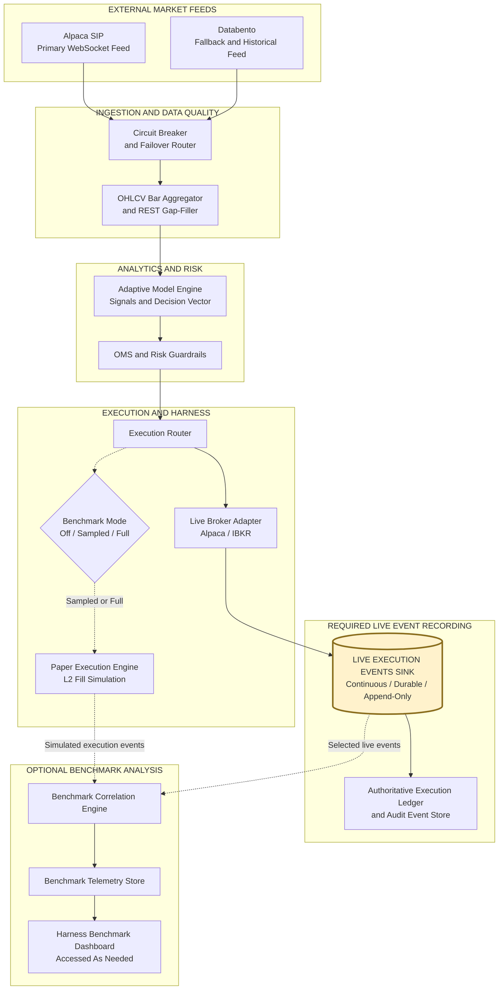

# QuanTRAM System Specification

This document specifies how QuanTRAM integrates external market data feeds into a resilient, risk-aware trading pipeline. It defines Alpaca SIP as the primary real-time source and Databento as the fallback and historical gap-filling source, with circuit-breaker, heartbeat, reconnection, normalization, and OHLCV aggregation behavior between the feeds and downstream consumers.

The specification also describes how normalized market data drives the adaptive model engine, passes through OMS and risk guardrails, and reaches the execution harness. Live orders are mirrored into a paper environment for fill, slippage, latency, and PnL variance benchmarking. Cross-cutting operational concerns, phased implementation milestones, and the end-to-end architecture are included to guide delivery and production operation.

**Derived artifact specification:** [E2E QuanTRAM Artifacts](E2E_QuanTRAM_ARTIFACTS.md)

**Process model:** [QuanTRAM Process Model](QuanTRAM_PROCESS_MODEL_082926.md)

**Increment 1 (ingestion):** [QuanTRAM Ingestion Increment 1](QuanTRAM_INGESTION_INCREMENT_1_083026.md)

**Open design gaps:** [QuanTRAM Decision Integrity and Design Gap Analysis](QuanTRAM_DECISION_INTEGRITY_GAP_ANALYSIS_082826.md)

This document is the parent architecture and functional basis for the E2E QuanTRAM artifact specification. Its integrated architecture, semantic system boundaries, component responsibilities, event-recording decisions, benchmark modes, and telemetry contracts provide the requirements from which the Go artifacts are derived. The child specification refines these requirements into ownership boundaries, Go interfaces, package candidates, gRPC service surfaces, processing semantics, and acceptance criteria; it does not supersede this architecture.

---

## 1. System Overview

The integration is structured into four vertically stacked layers:

1. **Data Ingestion Layer**  
2. **Analytics & Model Layer**  
3. **Risk & OMS Guardrails**  
4. **Execution & Harness Layer**

Data flows top-down from redundant external feeds through normalization and OHLCV bar construction. The resulting continuous series drives model inference, risk-compliant order generation, and simultaneous live and paper execution for ongoing quality comparison.

QuanTRAM v1 is limited to U.S. stocks, exchange-traded funds (ETFs), and published market indices. Stocks and ETFs may be eligible for order routing subject to instrument metadata and risk approval. Indices are calculated reference series used for analytics and regime context; they are not directly tradable and must not produce broker orders.

---

## 2. Data Ingestion Layer

### 2.1 Primary Feed: Alpaca SIP
- **Type:** WebSocket real‑time market data  
- **Cost:** $99/mo  
- **Purpose:** Main low‑latency feed for OHLCV bar construction  
- **Responsibilities:**  
  - Stream trades/quotes  
  - Maintain connection health  
  - Reconnect on failure  
  - Provide high‑frequency tick data

### 2.2 Secondary / Backup Feed: Databento
- **Type:** WebSocket + REST (Pay‑As‑You‑Go)  
- **Purpose:** Redundant feed for failover and data quality checks  
- **Responsibilities:**  
  - Provide alternative real‑time data  
  - Supply historical data for gap filling  
  - Cost‑aware usage (only when needed)

### 2.3 Circuit Breaker & Failover Router
- **Purpose:** Protect downstream systems from bad or missing data  
- **Responsibilities:**  
  - Monitor latency, error rate, and completeness  
  - Trigger circuit breaks when thresholds are violated  
  - Switch routing between Alpaca SIP and Databento  
  - Emit unified normalized tick stream

### 2.4 OHLCV Bar Aggregator & REST Gap‑Filler
- **Purpose:** Convert tick streams into time‑bucketed OHLCV bars  
- **Responsibilities:**  
  - Aggregate ticks into bars (1s, 5s, 1m, etc.)  
  - Maintain rolling windows for indicators  
  - Detect missing or partial bars  
  - Use REST calls to backfill gaps  
  - Output clean continuous OHLCV series

---

## 3. Analytics & Model Layer

### Adaptive Model Engine
- **Purpose:** Generate trading signals and decision vectors  
- **Inputs:**  
  - OHLCV bars  
  - Derived features (volatility, spreads, microstructure metrics)  
- **Outputs:**  
  - Signals (long/short/flat + confidence)  
  - Decision vector (target size, entry/exit conditions)  
- **Responsibilities:**  
  - Feature engineering  
  - Model execution (rule‑based, statistical, ML)  
  - Regime adaptation  
  - Diagnostics (signal quality, hit rate)

---

## 4. Risk & OMS Guardrails

### OMS / Risk Guardrails
- **Purpose:** Enforce portfolio‑level and order‑level constraints  
- **Inputs:**  
  - Decision vector  
  - Current positions, PnL, risk metrics  
- **Constraints:**  
  - Max position & order size  
  - Leverage & drawdown limits  
  - Latency & slippage tolerance  
- **Outputs:**  
  - Sanitized, risk‑compliant order instructions  
  - Optional feedback to model layer

---

## 5. Execution & Harness Layer

### 5.1 Execution Router
- **Purpose:** Route validated orders to live execution and, according to benchmark mode, to paper execution.
- **Responsibilities:**
  - Send every approved live order to the configured broker adapter.
  - Apply `OFF`, `SAMPLED`, or `FULL` paper-mirroring policy.
  - Assign stable correlation identifiers without waiting for benchmark processing.

### 5.2 Live Broker Adapter (Alpaca / IBKR)
- **Purpose:** Execute real trades  
- **Responsibilities:**  
  - Translate internal orders to broker API  
  - Handle authentication and rate limits  
  - Process acknowledgments, rejections, cancellations, and fills
  - Publish every order-lifecycle update to the Live Execution Events sink

### 5.3 Live Execution Events Sink
- **Purpose:** Provide a durable, append-only stream of authoritative broker and order-lifecycle events.
- **Responsibilities:**
  - Capture live execution events continuously, regardless of benchmark mode.
  - Preserve immutable events for independent, idempotent consumers.
  - Retain correlation IDs, broker IDs, sequence numbers, timestamps, quantities, prices, fees, and status details.

### 5.4 Execution Ledger / Audit Event Store
- **Purpose:** Build the authoritative execution record from Live Execution Events.
- **Responsibilities:**
  - Maintain order, fill, position, cash, fee, and PnL records.
  - Support broker reconciliation, deterministic replay, and audit retention.
  - Consume events independently of all benchmark components.

### 5.5 Paper Execution Engine
- **Purpose:** Simulate fills and PnL for orders selected by benchmark policy.
- **Responsibilities:**
  - Model fills using contemporaneous market and L2 order-book data.
  - Publish simulated execution events with the shared `benchmark_id`.
  - Operate asynchronously without delaying live execution.

### 5.6 Benchmark Correlation Engine
- **Purpose:** Compare selected live and simulated execution outcomes.
- **Responsibilities:**
  - Consume Live Execution Events and paper execution events independently.
  - Pair outcomes by `benchmark_id`.
  - Produce derived fill-rate, latency, slippage, and PnL comparison telemetry.

---

## 6. Subsystem Detailed Specifications

### 6.1 Ingestion & Circuit Breaker Component
- **Heartbeat Monitor:** Sends ping/pong every 1000ms. If 3 consecutive heartbeats fail or latency exceeds 1500ms, triggers failover state.
- **Auto-Reconnect Loop:** Attempts exponential backoff reconnects to Alpaca (`wss://stream.data.alpaca.markets/v2/sip`).
- **Gap Filling Procedure:**
  1. Record timestamp of last valid bar received ($T_{last}$).
  2. Upon socket re-establishment, request REST bars for $[T_{last}, T_{now}]$.
  3. Deduplicate and inject missing bars into state vector before resuming model inferences.

### 6.2 Adaptive Model Engine & Risk Guardrails
- **Signal Engine:** Processes normalized OHLCV arrays to generate actionable buy/sell decision vectors.
- **Risk Guardrails:**
  - **Max Order Value:** Hard capped per asset class.
  - **Leverage Limits:** Restricted based on volatility regime.
  - **Slippage Guardrail:** Rejects orders if bid-ask spread exceeds historical threshold.

### 6.3 Paper vs. Live Benchmarking Harness
- **Live Execution:** Approved orders are always routed directly to the live broker adapter when QuanTRAM is operating in live mode.
- **Continuous Event Capture:** All live order-lifecycle events are written to the Live Execution Events sink for ledger, PnL, reconciliation, and audit processing.
- **Benchmark Modes:** Paper mirroring is configurable as `OFF`, `SAMPLED`, or `FULL`.
- **Contemporaneous Mirroring:** Orders selected for benchmarking are sent asynchronously to the paper engine at live submission time so the simulation can use the original L2 state.
- **Non-Blocking Requirement:** Paper execution, benchmark correlation, telemetry storage, and dashboard availability must never delay or reject a live order.
- **Metrics Tracked:**
  - Fill Rate Comparison (Paper vs. Live)
  - Realized Slippage vs. Modeled Slippage
  - Order Latency (Signal creation to Broker Ack)
  - PnL Tracking Variance (identifies live market impact)

---

## 7. Implementation Roadmap

| Phase | Duration | Focus Area | Deliverable |
| :--- | :--- | :--- | :--- |
| **Phase 1** | Week 1-2 | Alpaca Ingestion & REST Gap-Filler | Resilient single-source websocket engine |
| **Phase 2** | Week 3 | Databento Fallback Integration | Automated Circuit Breaker & Failover Router |
| **Phase 3** | Week 4-5 | Benchmarking Harness & OMS | Dual paper/live execution pipeline |
| **Phase 4** | Week 6 | Production Deployment | Live trading with active risk guardrails |

---

## 8. Harness Benchmark Dashboard Specification

The architecture provides enough information to define a v0.1 Harness Benchmark Dashboard. An implementation-ready dashboard additionally requires a formal telemetry contract. The dashboard should consume structured benchmark events or queryable telemetry rather than derive metrics by parsing free-form application logs.

### 8.1 Executive Summary
- Live and paper order counts
- Fill-rate comparison
- Median and p95 broker acknowledgment latency
- Realized versus modeled slippage
- Live versus paper PnL variance
- Active feed and failover status

### 8.2 Execution Comparison
- Live and paper fills paired by benchmark or order ID
- Requested quantity, filled quantity, price, and timestamps
- Partial-fill and rejection rates
- Unmatched or incomplete order pairs

### 8.3 Slippage Analysis
- Arrival-price, modeled, and realized slippage
- Breakdown by symbol, side, order type, volatility regime, and time window
- Spread and L2 order-book state at submission
- Threshold violations

### 8.4 Latency Analysis
- Signal created to risk approval
- Risk approval to broker submission
- Submission to broker acknowledgment
- Acknowledgment to first and final fill
- Median, p95, and p99 latency trends

### 8.5 PnL and Market Impact
- Live and paper realized and unrealized PnL
- Tracking variance:

  $$
  \Delta PnL = PnL_{\text{live}} - PnL_{\text{paper}}
  $$

- Price drift after submission
- Estimated live market impact

### 8.6 Feed and Data Quality
- Alpaca and Databento health
- Heartbeat latency and failures
- Circuit-breaker transitions
- Reconnect attempts
- Missing, backfilled, and deduplicated bars
- Stale-data incidents affecting decisions

### 8.7 Risk and Exceptions
- Orders rejected or resized by each guardrail
- Spread and slippage violations
- Leverage and maximum-order-value breaches
- Broker errors and live/paper divergence alerts

### 8.8 Live Execution Events Contract

Live Execution Events are required operational records, not benchmark-only telemetry. The sink captures order creation, submission, acknowledgment, replacement, cancellation, rejection, expiration, partial-fill, and final-fill events. Each immutable event must include:

- `event_id`, `order_id`, broker order ID, and monotonic sequence number
- `signal_id`, `decision_id`, and optional `benchmark_id`
- Account, strategy, symbol, side, order type, time-in-force, price, and quantity
- Requested, cumulative-filled, remaining, and last-fill quantities
- Fill price, commission, fees, venue, broker status, and rejection reason
- Event, exchange, broker, and local receipt timestamps
- Position and cash effects
- Feed source and market snapshot reference at submission

The Execution Ledger / Audit Event Store and Benchmark Correlation Engine maintain independent consumer checkpoints. Benchmark failures or backlog must not affect ledger processing or live execution.

### 8.9 Required Benchmark Telemetry Contract

Every signal-to-fill lifecycle requires stable correlation identifiers and structured fields:

- `benchmark_id`
- `signal_id`
- `decision_id`
- `order_id`
- `live_order_id`
- `paper_order_id`
- `symbol`, `side`, `quantity`, and `order_type`
- Signal, risk, submission, acknowledgment, and fill timestamps
- Arrival bid, ask, midpoint, and L2 snapshot reference
- Modeled fill price and slippage
- Actual live and paper fills
- Risk decision and rejection reason
- Feed source, data age, and volatility regime
- Position and PnL snapshots

### 8.10 Outstanding Design Decisions

The following decisions must be defined before dashboard implementation:

- Paper matching model
- Benchmark pairing rules
- Timestamp clock and precision
- Slippage reference price
- PnL accounting method
- Telemetry retention period
- Alert thresholds

Once these decisions are resolved, the dashboard can be specified down to schemas, calculations, visualizations, and acceptance criteria.

---

## 9. Cross‑Cutting Concerns

### Logging & Observability
- Structured logs for feed health, model decisions, risk rejections, execution quality  
- Metrics for latency, slippage, error rates, circuit breaker triggers  

### Configuration & Environment
- Feed thresholds  
- Bar intervals  
- Risk limits  
- Routing mode (paper vs live)  
- Environments: dev, staging, production  

---

## 10. QuanTRAM Integrated Market Feed Architecture Diagram

