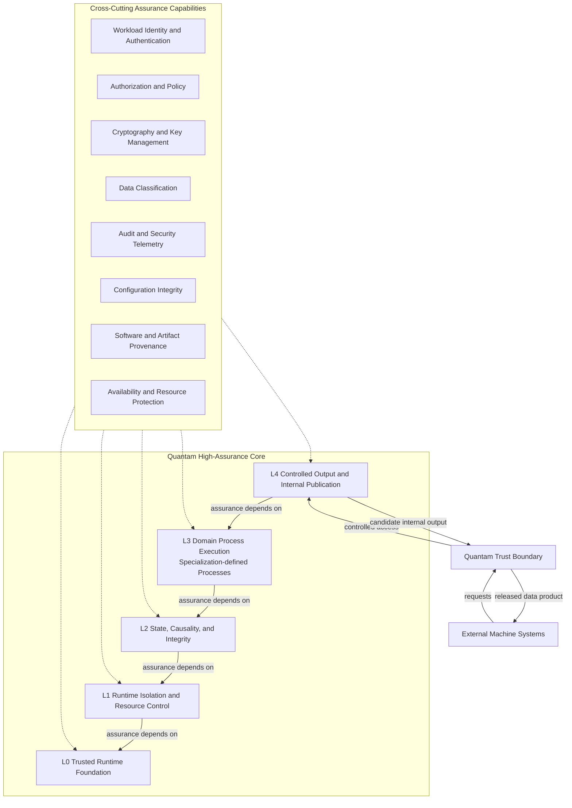

# QUANTAM HIGH-ASSURANCE CORE (HAC) DESIGN SPECIFICATION

## Document Control

| Field | Value |
| :--- | :--- |
| Title | QUANTAM HIGH-ASSURANCE CORE (HAC) DESIGN SPECIFICATION |
| Document filename | `Quantam-HAC_core_design_090626.md` |
| Date | September 6, 2026 |
| Version | V0.2 |
| Status | **PROPOSED FOR HUMAN REVIEW** |
| Implementation Status | **NOT YET AUTHORIZED** |
| System | Quantam, the domain-neutral parent architecture |
| Current specialization | QuanTRAM, financial markets |
| Design class | Implementation-oriented, implementation-neutral security and runtime architecture |
| Governing intent | Define the common protected processing foundation and the contracts inherited by later Trust Boundary, external API, identity, authorization, release, audit, compliance-profile, implementation, and validation designs |

### Purpose

This document defines the proposed Quantam High-Assurance Core (HAC): the domain-neutral trusted processing foundation within which a Quantam specialization accepts Signals or Observations, associates them with Entities, preserves Causal Order, advances authoritative Process State, executes deterministic or adaptive Processes, and produces authoritative Process Outputs. It defines the security, isolation, integrity, availability, audit, lifecycle, and publication properties that implementations and later designs MUST preserve.

This is a design authority, not an implementation authorization. It does not add a QuanTRAM Process, modify the frozen QuanTRAM Process Model V2, define an external protobuf, select an identity vendor, or claim compliance, certification, accreditation, or suitability for classified information.

### Scope

In scope:

- the domain-neutral Quantam abstraction and its relationship to QuanTRAM;
- HAC responsibilities, boundaries, planes, invariants, and failure behavior;
- the conceptual Quantam Trust Boundary and controlled-release contract;
- machine-to-machine security direction using gRPC, TLS 1.3, mutual TLS (mTLS), explicit authorization, entitlements, audit, and resource protection;
- conceptual workload identity, authorization, classification, cryptographic, audit, supply-chain, and resource-protection requirements;
- requirements inherited by future external APIs and deployment/compliance profiles;
- initial threat model, failure matrix, and future validation plan;
- factual reconciliation with current QuanTRAM Process Model V2, protobuf, and publication surfaces.

### Executive Summary

Quantam is a domain-neutral signal/observation processing architecture. A specialization defines what an Entity and Observation mean, which Processes exist, what Process State they own, and what domain science they perform. QuanTRAM, the current financial-market specialization of Quantam, provides the repository's implemented example. Future industrial or government/defense specializations are architectural examples only and are not claimed to exist.

The HAC is the protected execution foundation around domain Processes. It establishes trustworthy workload identity, secure configuration and key use, process isolation, authoritative state and output handling, bounded resources, security telemetry, audit generation, software integrity, and fail-secure lifecycle behavior. It does not dictate domain mathematics and is not itself an external API, identity provider, certificate authority, compliance framework, or domain Process.

The Quantam Trust Boundary is separate from the HAC. It controls resource access and information release between trusted processing and external systems. An internal Process Output does not automatically become an externally supported contract. External systems consume deliberately defined Quantam data products, not Quantam internal process implementation.

The architecture is designed using and informed by National Institute of Standards and Technology (NIST) Zero Trust, cybersecurity, identity/access-control, cryptographic/key-management, secure software development, supply-chain, and control-catalog guidance. This statement is not a claim that Quantam is NIST compliant. Compliance and authorization depend on implementation, deployment, operation, evidence, organizational controls, scope, and independent assessment where required.

### System / Module Overview

```text
Signal / Observation
        |
        v
      Entity
        |
        v
Causal Ordered Processing
        |
        v
   Process State
        |
        v
Deterministic / Adaptive Processes
        |
        v
   Process Outputs
        |
        v
Controlled Publication
        |
        v
 Authorized Consumers
```

This abstraction does not redefine the frozen QuanTRAM Process Model. It generalizes the architectural role demonstrated by the current specialization: Entity, Entity Key, Entity-Key Worker, Process, Process State, State Update, Process Output, Output Publication, Model Publication, Common Host Gates, and causal per-Entity processing.

### Inputs

The HAC accepts inputs only through authorized specialization-defined and deployment-approved ingress contracts. Conceptual input classes are:

| Input class | Examples | HAC requirement |
| :--- | :--- | :--- |
| Signal / Observation | Domain-defined observation associated with an Entity | Provenance, schema validation, Causal Order, quality/eligibility policy |
| Configuration | Runtime bounds, process enablement, release and operational parameters | Authenticated source, integrity, versioning, validation, fail-secure defaults |
| Security policy | Authorization, entitlement, classification, release, audit policy | Separately governed, versioned, least privilege, deny by default |
| Workload identity material | Certificates, trust roots, revocation status, identity assertions | Protected lifecycle and validation; never trusted solely by network location |
| Administrative action | Deployment, policy change, rotation, recovery, privileged control | Strongly authorized, separated from data consumption, and audited |

### Outputs

| Output class | Meaning | External status |
| :--- | :--- | :--- |
| Authoritative Process Output | Specialization-defined result of successful Process execution | Internal unless explicitly adapted and released |
| Process State effects | Successful State Update or explicit failure/non-update | Never exposed merely because it exists internally |
| Internal Output Publication | Delivery to an internal subscriber or contract surface | Not automatically an external supported contract |
| Security telemetry | Health, resource, authentication, authorization, and integrity signals | Restricted operational data |
| Security audit | Durable evidence of security-relevant decisions and privileged activity | Controlled separately from domain outputs |
| External data product | Deliberately selected, versioned, authorized, classified release | Defined only by a later external API design |

### Parameters / Configuration

V0.2 freezes no product, policy language, trust-root topology, classification taxonomy, or deployment topology. Implementations MUST support governed configuration for:

- environment identity and separation;
- trusted workload issuers and trust anchors;
- certificate validation, rotation, expiry, and revocation behavior;
- authorization, entitlement, classification, and release-policy versions;
- connection, stream, message, rate, quota, buffer, deadline, and timeout limits;
- audit destinations, integrity controls, access, and deployment-specific retention;
- cryptographic policy and algorithm lifecycle;
- deployment/compliance profile selection and validation.

Security-relevant configuration MUST be versioned, validated before activation, attributable to an authorized source, and auditable. Invalid security configuration MUST NOT silently degrade to permissive behavior.

### Assumptions

- A specialization defines Entity and Observation semantics; Quantam does not.
- Processes may differ in state, mathematics, failure semantics, and output shape.
- Current QuanTRAM demonstrates one valid specialization and provides evidence, not a universal domain model.
- Authoritative realtime processing can be isolated from external consumption through bounded, sideways/downstream publication.
- Machine workloads are the only external-client class targeted by V1 direction.
- Deployment operators will provide identity, key, audit, storage, and compliance controls appropriate to their environment.

### Exclusions

- implementation code, protobuf changes, services, certificates, keys, infrastructure, or deployment configuration;
- changes to QuanTRAM Process Model V2 or existing QuanTRAM terminology and artifacts;
- final Trust Boundary topology, gRPC service definitions, external protobuf fields, or publication-adapter design;
- human authentication, browser login, passwords, consumer multi-factor authentication (MFA), interactive OpenID Connect (OIDC), user-interface roles, and dashboards;
- certification, accreditation, authorization to operate, compliance attestation, or classified-data suitability;
- domain mathematics, trading logic, payment processing, privacy case management, or classification-authority decisions.

---

## 1. Quantam Domain-Neutral Architecture

### 1.1 Parent and specialization relationship

Quantam is the domain-neutral parent architecture. QuanTRAM remains the existing financial-market specialization and retains its repository name, package names, services, process IDs, documents, and artifacts.

```text
                         QUANTAM
                  High-Assurance Core
                          |
          +---------------+---------------+
          |               |               |
          v               v               v
       QuanTRAM         Future          Future
       Financial       Industrial     Government /
       Markets          Systems         Defense
          |               |               |
     Financial       Industrial      Deployment-
     Processes        Processes       Specific
                                      Processes
```

Industrial and government/defense branches are examples of possible specialization only. This document does not assert that they are implemented, deployed, approved, certified, or suitable for a particular mission.

Quantam MUST NOT assume that an Observation is a stock price, trading volume, security, financial instrument, person, vehicle, sensor, industrial device, military asset, or any other particular object. A specialization owns those meanings and their lawful/operational constraints.

### 1.2 Domain-neutral processing contract

For each specialization, the architecture MUST identify:

1. the Entity and stable Entity Key semantics;
2. accepted Observation forms and provenance;
3. Causal Order rules per Entity;
4. each Process and its owned Process State;
5. Process Opportunity, Process Success, Process Failure, and State Update semantics;
6. authoritative Process Outputs and internal Output Publication;
7. data classification and release eligibility;
8. controlled external data products, where authorized.

The HAC secures these contracts without standardizing every Process into identical state or mathematics.

## 2. Security Basis and Assurance Posture

Quantam HAC is designed using and informed by:

- NIST SP 800-207, *Zero Trust Architecture*;
- NIST Cybersecurity Framework (CSF) 2.0;
- applicable NIST digital identity and access-control guidance;
- NIST SP 800-52 and SP 800-57 concepts for transport security and key management;
- NIST SP 800-218, *Secure Software Development Framework* (SSDF);
- NIST SP 800-161 supply-chain risk-management principles;
- NIST SP 800-53 controls when selected by a deployment profile.

These references guide architecture and requirements. They do not establish compliance. A deployment MAY map HAC requirements to applicable controls, but MUST document scope, inherited controls, implementation evidence, operational procedures, exceptions, residual risk, and assessment status.

## 3. Architectural Layering and Compliance Profiles

```text
                 EXTERNAL WORLD
                       |
        +--------------+--------------+
        |              |              |
     Finance          EU          Government /
     deployment    deployment       Defense
        |              |              |
   PCI DSS etc.      GDPR       CMMC / FedRAMP /
        |              |        NIST 800-53 etc.
        +--------------+--------------+
                       |
             COMPLIANCE PROFILES
                       |
                       v
        +---------------------------+
        |   Quantam Trust Boundary  |
        |                           |
        | Identity / mTLS           |
        | Authorization             |
        | Entitlements              |
        | Data classification       |
        | Release policy            |
        | Audit                     |
        | Resource protection       |
        +-------------+-------------+
                      |
                      v
        +===========================+
        | Quantam                   |
        | HIGH-ASSURANCE CORE       |
        |                           |
        | NIST / Zero-Trust         |
        | security principles       |
        |                           |
        | Domain processes          |
        | Process state             |
        | Process outputs           |
        +===========================+
```

This is an architectural layering diagram. It does not imply that Payment Card Industry Data Security Standard (PCI DSS), the European Union General Data Protection Regulation (GDPR), Cybersecurity Maturity Model Certification (CMMC), Federal Risk and Authorization Management Program (FedRAMP), NIST SP 800-53, or other frameworks are equivalent, interchangeable, or simultaneously applicable.

Canonical principle:

> Quantam HAC provides the domain-neutral high-assurance security foundation. The Quantam Trust Boundary controls access to and information release from that foundation. Deployment-specific compliance profiles apply additional requirements appropriate to the information, jurisdiction, organization, and operational environment.

Compliance profiles are overlays. They MUST NOT silently alter specialization Process mathematics, Causal Order, Process State semantics, or authoritative Process Output.

| Profile example | Applicability rule | Architectural consequence |
| :--- | :--- | :--- |
| PCI DSS | Only where payment-card scope exists; a financial-market deployment is not automatically in scope | Prefer keeping cardholder data outside the analytical processing plane; define segmentation and evidence if scope exists |
| GDPR | Only where relevant personal-data processing occurs | Support purpose limitation, minimization, storage limitation, integrity/confidentiality, accountability, and privacy by design/default |
| Government/defense | Determined by actual information, contract, environment, and mission | May require SP 800-53, CMMC, FedRAMP, FIPS, or other controls; no current authorization or classified-data claim |

## 4. Zero-Trust HAC Principles

1. **No implicit network trust.** A subnet, cluster, internal network, same cloud, or allowlisted IP is not sufficient evidence of trust.
2. **Explicit workload identity.** Cross-boundary machine workloads MUST present a verifiable identity bound to protected credentials.
3. **Authentication is separate from authorization.** A valid identity proves who is calling, not what the caller may access.
4. **Least privilege.** Rights MUST be the minimum resources, operations, Entities, classifications, environments, and durations required.
5. **Explicit resource authorization.** Every protected operation MUST be evaluated against the requested resource and scope.
6. **Renewable trust.** Trust MUST expire or be continuously re-evaluable; permanent credentials and permanent entitlement assumptions are prohibited.
7. **Secure by default.** New resources, fields, operations, and clients are unreleased and unauthorized until explicitly governed.
8. **Fail secure.** Identity, authorization, policy, classification, and security-configuration uncertainty defaults to denial or safe filtering.
9. **Controlled information release.** Internal existence or availability does not authorize external disclosure.
10. **Auditable access.** Security-relevant access and policy decisions MUST produce protected audit evidence.
11. **Bounded resource consumption.** Every external client and stream MUST have enforceable limits and resource accounting.
12. **Plane separation.** Data access MUST NOT imply control-plane or security/administrative-plane authority.
13. **Cryptographic identity.** Machine identity MUST be anchored in validated cryptographic credentials, not address or naming convention alone.
14. **Managed key and certificate lifecycle.** Issuance, storage, validation, rotation, expiry, revocation, and compromise response are required lifecycle states.
15. **Compromised-client containment.** One authorized or compromised client MUST NOT gain ambient access or exhaust resources assigned to others.
16. **Realtime non-interference.** External clients MUST NOT affect authoritative realtime processing, mathematics, Causal Order, State Update, or Process Output.

## 5. HAC Responsibilities and Non-Responsibilities

### 5.1 Responsibilities

| Responsibility | Required HAC property |
| :--- | :--- |
| Trusted Process execution | Execute only authorized artifacts/configuration within defined identity and isolation boundaries |
| Authoritative Process State | Preserve ownership, integrity, Causal Order, transactional semantics, and explicit failure/non-update |
| Process isolation | Contain faults and resource use according to Process and Entity failure domains |
| Deterministic advancement | Preserve deterministic State Update where a Process contract requires it; record version/provenance needed to validate it |
| Adaptive execution | Bound and govern adaptive Processes without assuming identical mathematics or state |
| Authoritative Process Output | Identify outputs produced by successful, governed execution and preserve lineage |
| Controlled internal publication | Bound subscribers and prevent optional consumers from controlling producing Processes |
| Internal workload identity | Authenticate service/workload interactions according to deployment topology |
| Secure configuration | Validate source, integrity, schema, version, environment, and activation authority |
| Protected key/secret use | Prevent plaintext exposure and restrict use to intended workload and purpose |
| Integrity controls | Detect unauthorized changes to code, configuration, policy, state, and artifacts |
| Availability/resource protection | Apply isolation, quotas, bounded queues, deadlines, and overload behavior |
| Security telemetry and audit | Generate separate operational telemetry and security audit evidence |
| Secure lifecycle | Govern build, deployment, startup, rotation, recovery, upgrade, rollback, and retirement |
| Software provenance | Trace source, dependencies, build inputs, artifact identity, approval, and deployment |

### 5.2 Non-responsibilities

The HAC is not and MUST NOT silently become:

- a financial trading model or any other domain-specific Process;
- a payment processor, PCI DSS implementation, or GDPR workflow engine;
- a defense classification authority or authorization authority;
- an identity provider or certificate authority by definition;
- a human authentication system;
- an API gateway implementation;
- a dashboard, external data client, or consumer application;
- a policy language specification;
- a regulator, auditor, certification body, or evidence of compliance.

## Quantam HAC Internal Layer Architecture

The Quantam HAC is a layered protected execution architecture. Its five numbered layers are architectural responsibility layers: they identify which assurance contract owns a concern and which lower-layer guarantees a higher layer relies upon.

The layers are **not** QuanTRAM Process IDs, software packages, Go modules, network tiers, deployment nodes, service names, containers, Kubernetes namespaces, separate machines, or mandatory physical boundaries. A future implementation MAY map multiple logical HAC layers into one runtime component, or distribute one layer across components, provided that the layer contracts, assurance dependencies, separation of authority, and failure semantics remain intact.

### Internal layer model



The diagram expresses assurance layering, not a universal runtime call sequence. Domain Processes execute through L3. The diagram intentionally does not name Price Engine, Volume Engine, or another specialization Process as a generic Quantam component. The Trust Boundary is above and outside the HAC; it is not L5 or any other numbered HAC layer.

### Layer responsibility matrix

| Layer | Name | Primary responsibility | Inputs | Outputs | Trust assumptions | Must guarantee | Must not do | QuanTRAM example, if applicable |
| :--- | :--- | :--- | :--- | :--- | :--- | :--- | :--- | :--- |
| L4 | Controlled Output and Internal Publication | Protect and publish authoritative Process Outputs within the HAC | Authoritative L3 Process Output, lineage, classification and publication metadata | Bounded internal Output Publication; candidate input to the Trust Boundary | L3 output authority; L2 lineage/integrity; L1 delivery bounds | Output identity and lineage, contract validation, bounded delivery, subscriber isolation, explicit publication failure | Turn an internal contract into an external product; let optional consumers control L3; make external release decisions | Internal `DecisionEvent`, `PriceEvent`, and `VolumeEvent` publication |
| L3 | Domain Process Execution | Execute specialization-defined deterministic/adaptive Processes and domain science | Validated Observation and protected L2 Process State/context | Process Success, Process Failure, candidate State Update, authoritative Process Output | L2 causal/state guarantees; L1 containment; L0 trusted execution | Execute the authorized Process/version and make outcomes explicit | Define generic Quantam domain mathematics; bypass L2 state rules; treat failure as success | P-03 Adaptive, P-04 Price, P-04V Volume |
| L2 | State, Causality, and Integrity | Protect authoritative processing semantics across Observations and State Updates | Entity association, Observation lineage, prior Process State, L3 outcome | Authorized State Update or explicit non-update/failure; integrity and continuity evidence | L1 isolation/resource guarantees; L0 integrity/time/identity primitives | Causal Order, state ownership, continuity/discontinuity, transaction semantics, provenance, no silent substitution | Force identical state machinery on every specialization; permit unauthorized mutation | Entity Key and Process State; P-03/P-04 Joint State-Update Transaction; P-04V Independent State Update |
| L1 | Runtime Isolation and Resource Control | Contain workloads/failures and enforce bounded execution | Workload identity/context, execution request, configured resource policy | Isolated execution domain, resource accounting, deadline/overload outcomes | L0 runtime and environment integrity | Workload/process isolation, bounded queues and buffers, budgets, timeouts, failure-domain containment, denial-of-service resistance | Define domain mathematics; allow one workload to exhaust or mutate another | Entity-Key Worker containment, bounded mailboxes, host deadlines |
| L0 | Trusted Runtime Foundation | Establish foundational runtime and platform trust assumptions | Verified artifact/configuration, environment identity, trust material, deployment-profile controls | Trusted execution/runtime primitives consumed by L1-L4 | Deployment root(s) of trust and approved operational control | Runtime/artifact/configuration integrity, secure time and entropy, cryptographic provider and protected credential access, base network integrity | Require a universal vendor, operating system, hardware root, or deployment technology; interpret domain science | Current Go runtime and host platform are implementation evidence only, not proof of full HAC conformance |

### L0 - Trusted Runtime Foundation

L0 establishes the foundational trusted runtime assumptions and platform protections on which every higher HAC guarantee depends. It covers the trusted executable/runtime environment; operating-system and runtime integrity; trusted boot or measured execution where required by a deployment; cryptographic-provider availability; secure time; secure entropy/randomness; protected credential and private-key access; runtime identity primitives; base networking integrity; host/runtime configuration integrity; deployment-artifact integrity; environment identity; and foundational deployment-profile controls.

L0 does not mandate a cloud provider, operating system, container runtime, hardware root of trust, Trusted Platform Module (TPM), hardware security module (HSM), Kubernetes product, or confidential-computing technology. Those are deployment choices evaluated against the applicable threat model and profile. Some deployment/compliance profiles MAY impose stronger L0 requirements, including validated cryptographic modules, measured boot, hardware-backed keys, stricter administrative separation, or stronger platform evidence.

### L1 - Runtime Isolation and Resource Control

L1 is responsible for containment and bounded execution. It establishes process/workload isolation, memory and resource boundaries, bounded queues and buffers, CPU/memory/resource budgets, internal connection and stream accounting where applicable, failure-domain containment, timeout/deadline enforcement, overload behavior, runaway-process containment, denial-of-service resistance, environment boundaries, and separation among independent workloads.

L1 MUST prevent one workload, Process, Entity scope, or consumer from exhausting resources assigned to another beyond explicitly governed shared limits. This containment is foundational to realtime non-interference: external or optional work cannot be isolated from authoritative processing without enforceable bounds. L1 defines no domain mathematics and MUST NOT reinterpret a Process outcome.

### L2 - State, Causality, and Integrity

L2 protects authoritative processing semantics. It governs Entity identity association, Causal Order, Observation lineage, authoritative Process State ownership, State Update integrity, continuity/discontinuity semantics, Process-defined transaction semantics, prevention of unauthorized state mutation, state-version integrity, rollback/recovery rules, state provenance, explicit failure/non-update, and the integrity of Process Opportunity and Process State transitions.

L2 MUST NOT silently substitute a later Observation for a missing required Observation or represent an unperformed State Update as successful. It does not require every specialization to use identical state machinery, transaction scope, persistence, recovery, or continuity rules. In QuanTRAM, the P-03/P-04 Joint State-Update Transaction and the P-04V Independent State Update are examples of different L2 guarantees within one specialization; they are not generic patterns every Quantam specialization must reproduce.

### L3 - Domain Process Execution

L3 is where specialization-defined deterministic Processes, adaptive Processes, domain mathematics, domain interpretation, domain-specific state transitions, Process Success, Process Failure, and Process Output generation occur.

**L3 is domain-neutral as an execution category, but the Processes hosted within it are domain-specific.** Quantam HAC defines the protected execution requirements around these Processes; it does not define their mathematics. A specialization owns Process identity, inputs, algorithms, state relationship, validity rules, outputs, and scientific or operational evidence.

QuanTRAM's P-03 Adaptive Model, P-04 Price, and P-04V Volume are current L3 examples only. P-04 and P-04V are not generic Quantam layers or services, and this revision does not rename or generalize them.

### L4 - Controlled Output and Internal Publication

L4 controls authoritative Process Outputs after L3 produces them and before any external release decision. It identifies authoritative output, preserves lineage, validates internal contracts and publication metadata, performs bounded internal Output Publication, isolates subscribers, makes publication failure visible, and prevents optional consumers from controlling L3 processing.

L4 remains inside the HAC. It prepares and protects authoritative output; it does not independently convert that output into an external data product and does not wholly own external authorization, entitlement, classification-release policy, or contract enforcement. Those release decisions belong to the separate Quantam Trust Boundary.

```text
L3 Domain Process
          |
          v
Authoritative Process Output
          |
          v
L4 Controlled Internal Publication
          |
          v
Quantam Trust Boundary
          |
          v
External Data Product
```

### Cross-cutting assurance capabilities

Not every HAC capability belongs to exactly one numbered layer. The following capabilities span the layer dependency chain and, where shown, also operate at the Trust Boundary. `PRIMARY` means the capability owns a central control at that location; `SUPPORT` means it supplies or enforces part of the control; `CONSUMER` means the location relies on the capability's result; `N/A` means no direct role is assigned by this model.

| Capability | L0 | L1 | L2 | L3 | L4 | Trust Boundary | Purpose |
| :--- | :---: | :---: | :---: | :---: | :---: | :---: | :--- |
| Workload Identity and Authentication | PRIMARY | SUPPORT | CONSUMER | CONSUMER | CONSUMER | PRIMARY | Bind runtime and caller actions to verified workload identities rather than network location |
| Authorization and Policy | SUPPORT | SUPPORT | PRIMARY | CONSUMER | SUPPORT | PRIMARY | Govern execution, control operations, internal access, and external release using distinct scopes |
| Cryptography and Key Management | PRIMARY | SUPPORT | SUPPORT | CONSUMER | SUPPORT | PRIMARY | Protect credentials, transport, configuration, state/storage, outputs, and audit with managed cryptographic lifecycles |
| Data Classification | SUPPORT | SUPPORT | PRIMARY | CONSUMER | PRIMARY | PRIMARY | Associate sensitivity with state/output and constrain storage, handling, publication, and release |
| Audit and Security Telemetry | SUPPORT | SUPPORT | SUPPORT | SUPPORT | PRIMARY | PRIMARY | Record security-relevant actions, assurance degradation, publication, and release across all layers |
| Configuration Integrity | PRIMARY | PRIMARY | SUPPORT | CONSUMER | CONSUMER | PRIMARY | Ensure only validated, authorized, environment-correct configuration and policy take effect |
| Software / Artifact Provenance | PRIMARY | SUPPORT | CONSUMER | PRIMARY | CONSUMER | SUPPORT | Trace and verify executable Process, runtime, generated contract, and deployment artifacts |
| Availability and Resource Protection | SUPPORT | PRIMARY | SUPPORT | CONSUMER | PRIMARY | PRIMARY | Bound consumption, isolate failure, shed optional work, and preserve authoritative processing |

Identity illustrates the cross-cutting role: L0 supplies runtime identity primitives, L1 binds identity to isolation/accounting, L3 consumes execution authority, L4 binds publication to an accountable producer/subscriber, and the Trust Boundary authenticates external workloads. Cryptography protects transport, credentials, configuration, storage, and audit. Classification applies to state, output, publication, storage, and release. Audit observes security-relevant activity and assurance degradation across all layers. Authorization has different scopes for internal execution, control operations, administration, and external release; one scope MUST NOT imply another.

### Assurance dependency rules

The directional model is:

```text
L4 depends on L3 authoritative output
L3 depends on L2 state and causal guarantees
L2 depends on L1 isolation and resource guarantees
L1 depends on L0 trusted runtime guarantees
```

This is an **assurance dependency model**, not necessarily runtime call flow or a required call stack. A Process invocation does not need to literally call L2, then L1, then L0. Higher-layer guarantees rely on lower-layer guarantees; lower layers MUST remain free of domain-specific knowledge; a lower-layer failure may invalidate higher-layer assurance; higher layers MUST NOT bypass lower-layer controls; and cross-cutting assurance capabilities apply across the complete dependency chain.

### Trust Boundary relationship

```text
External Systems
           |
           v
Quantam Trust Boundary
           |
 controlled access
           |
           v
+---------------------------+
| Quantam HAC               |
|                           |
| L4 Controlled Publication |
| L3 Domain Process         |
| L2 State/Causality        |
| L1 Isolation/Resources    |
| L0 Trusted Foundation     |
+---------------------------+
```

The Trust Boundary is not a numbered HAC layer. It controls external workload identity, authentication, authorization, entitlement, classification-aware release, contract enforcement, audit, and external resource protection. Similar capabilities operate internally, but their architectural roles differ: internal controls protect execution and internal handling; the Trust Boundary decides whether and how information or resource access crosses between Quantam and external systems.

### Compliance-profile relationship

A deployment/compliance profile MAY strengthen controls at one or more layers and at the Trust Boundary. FIPS requirements may constrain L0/L1 cryptographic/runtime choices. GDPR may affect classification, logging, retention, minimization, and release across L2-L4 and the Trust Boundary. PCI DSS may impose scope, isolation, logging, key-management, and release controls. Government/defense profiles may constrain runtime foundation, workload identity, audit, supply chain, administration, and deployment evidence.

These examples are neither one-to-one layer mappings nor compliance claims. Applicability and evidence remain deployment-specific, and no profile may silently alter specialization Process mathematics.

### Failure and assurance cascade

| Failure class/location | Assurance consequence | Required disposition |
| :--- | :--- | :--- |
| L0 runtime integrity cannot be trusted | Higher-layer assurance cannot be claimed | Isolate affected runtime; reject activation or processing; recover from verified foundation/artifact |
| L1 isolation fails | Process independence, resource containment, and non-interference may be invalid | Contain affected workloads and prevent unsafe continuation or cross-workload impact |
| L2 causal/state integrity fails | L3 Process Output cannot be treated as authoritative | Prevent/withhold authoritative State Update and output; expose discontinuity or integrity failure |
| L3 Process execution fails | No valid authoritative Process Output exists for that Process Opportunity | Preserve explicit Process Failure/non-update according to the Process contract |
| L4 publication fails | Authoritative L3 execution/state may remain valid | Make publication failure explicit; do not alter or recompute the L3 result |
| Trust Boundary fails | External release assurance is unavailable | Fail external release closed; allow HAC authoritative processing to continue where independently safe |

A **Process Failure** is a specialization-defined inability to complete one L3 Process Opportunity. An **Assurance Failure** means a layer guarantee required to trust higher-layer behavior is absent or invalid. A **Publication Failure** means L4 could not deliver an otherwise authoritative output internally as contracted. An **External Release Failure** means the Trust Boundary could not safely authorize or deliver an external data product. These outcomes MUST remain distinguishable in telemetry, audit, recovery, and operational decisions.

### Realtime non-interference reconciliation

HAC-INV-08 applies across the layer model without changing its wording. L4 publication failure cannot retroactively alter L3 execution. Trust Boundary failure cannot control L3. External-client backpressure MUST terminate, shed, or isolate at or above L4 and MUST NOT enter the authoritative State Update path. L1 supplies bounded queues, budgets, deadlines, and failure containment; L2 protects authoritative state and Causal Order; L3 remains independent of external consumer state. External systems never become participants in authoritative State Update.

### Illustrative QuanTRAM mapping

```text
QuanTRAM example within Quantam HAC

L4  DecisionEvent / PriceEvent / VolumeEvent internal publication
L3  P-03 Adaptive / P-04 Price / P-04V Volume
L2  Entity Key / Causal Order / Process State
        P-03/P-04 Joint State-Update Transaction
        P-04V Independent State Update
L1  Entity-Key Worker containment / bounded queues and mailboxes
        host deadlines / process and resource isolation
L0  Go runtime / host platform / trusted deployment foundation
```

This mapping is illustrative evidence only. It does not assert that every current QuanTRAM implementation already satisfies the complete HAC requirements. QuanTRAM predates this complete Quantam HAC design; future reconciliation and validation are required.

QuanTRAM's Adaptive Model, Price Engine, Volume Engine, `DecisionEvent`, `PriceEvent`, and `VolumeEvent` remain financial-specialization concepts with their existing names. The future Quantam model/process generalization exercise is **DEFERRED** until QuanTRAM has completed end-to-end model processing, decision processing, paper execution, profit-and-loss (P&L)/benchmarking, and a stable deployment baseline including planned Azure deployment. Only then should the architecture determine which QuanTRAM Process concepts are genuinely domain-invariant. L3 being a generic Quantam execution category does not mean the Processes currently executing within QuanTRAM L3 have been generalized.

## 6. Quantam Trust Boundary

The Quantam Trust Boundary is the controlled resource-access and information-release boundary between the trusted Quantam processing environment and external systems. It is not merely a firewall, network segment, ingress route, or proxy.

```text
                QUANTAM HAC
                     |
              Process Outputs
                     |
                     v
        +-------------------------+
        | Quantam Trust Boundary  |
        |                         |
        | Workload identity       |
        | Authentication          |
        | Authorization           |
        | Entitlement             |
        | Data classification     |
        | Release policy          |
        | Audit                   |
        | Resource protection     |
        | Contract enforcement    |
        +------------+------------+
                     |
                     v
             External Interface
                     |
                     v
           Authorized Systems
```

### 6.1 Responsibilities

The boundary MUST authenticate workloads; authorize resource, Entity, operation, classification, and environment scope; enforce entitlement and release policy; validate contract/version; limit resource use; filter or transform approved information; prevent internal representation leakage; and generate audit evidence.

### 6.2 Non-responsibilities

The boundary MUST NOT own domain mathematics, mutate authoritative Process State, repair or reorder Observations, become a source of authoritative Process Output, grant trust based solely on network placement, or require the HAC to wait for external delivery. V0.2 does not select sidecar, gateway, proxy, service-mesh, library, or dedicated-service topology. The Trust Boundary is separate from and above HAC L4; it is not a numbered HAC layer.

## 7. Machine-to-Machine V1 Direction

Human-facing identity is deferred. V1 direction is:

```text
gRPC
  +
TLS 1.3
  +
mutual TLS (mTLS)
  +
explicit authorization
  +
entitlements
  +
audit
  +
resource protection
```

- gRPC is the service communication framework and contract transport.
- TLS protects transport confidentiality and integrity.
- mTLS authenticates both machine endpoints using certificate-bound identity.
- mTLS does not perform resource authorization by itself.
- Possession of a valid certificate does not imply access to every operation, Entity, data product, environment, or classification.
- This specification does not define final services, methods, messages, or protobuf field numbers.

## 8. Workload Identity Model

| Element | Requirement |
| :--- | :--- |
| Stable identity | Identify the logical service/workload independently of transient host, pod, process, or IP address |
| Certificate binding | Bind authenticated identity to a validated certificate chain and proof of private-key possession |
| Trust roots | Scope trust anchors by environment and purpose; protect and govern changes; avoid universal roots where practical |
| Issuance | Authorize issuance against workload identity and environment; record issuer, subject, validity, and intended use |
| Validation | Verify chain, trust anchor, validity time, name/identity binding, key usage, policy constraints, and revocation status as required |
| Expiry | Use bounded credential lifetime; expired credentials MUST be rejected |
| Rotation | Support overlap and safe renewal without granting duplicate or broadened identity |
| Revocation | Define timely status distribution and fail-secure behavior appropriate to deployment risk |
| Compromise | Quarantine identity, revoke/replace credentials, investigate use, preserve evidence, and prevent silent reuse |
| Authorization mapping | Map authenticated workload identity to explicit policy subject; mapping MUST be versioned and auditable |
| Environment separation | Development, test, staging, and production identities/trust roots MUST NOT be interchangeable by default |
| Service vs machine identity | Authorize the service/workload, not merely the machine that happens to host it |

Vendor and product selection remain open. Identity based solely on IP address, DNS name, subnet, cluster membership, or cloud account is insufficient.

## 9. Authorization and Entitlement Model

Conceptual decision:

```text
WHO is requesting?
        +
WHAT resource?
        +
WHICH Entity or resource scope?
        +
WHAT operation?
        +
WHAT data classification?
        +
WHAT environment?
        +
WHAT deployment/compliance policy?
        +
IS the workload currently entitled?
        |
        v
ALLOW / DENY / FILTER / AUDIT
```

The decision MUST be deny-by-default and least-privilege. It MUST distinguish authentication from authorization, data read from administration, resource-level permission from Entity-level entitlement, and current entitlement from historical grants.

| Dimension | Example question |
| :--- | :--- |
| Subject | Which authenticated workload identity is calling? |
| Resource | Which named data product, service, stream, or operation is requested? |
| Entity scope | Which Entity, group, tenant, account, region, or specialization scope? |
| Operation | Read, subscribe, query, administer, rotate, configure, or future execute? |
| Classification | Is the resource classification at or below the subject's ceiling and releasable for purpose? |
| Environment | Is the identity and grant valid in this exact environment? |
| Profile | Which deployment/compliance constraints apply? |
| Entitlement | Is the grant active, unexpired, unrevoked, and contextually valid? |

`FILTER` means release only the authorized subset under a defined contract; it MUST NOT hide an authorization failure in a way that creates misleading semantics. Future execution authority, if ever designed, MUST be isolated from read authority and require separately explicit policy. V0.2 does not select a policy language.

## 10. Data Classification

Classification is a Quantam-level concept because every specialization can contain sensitive Observations, Process State, outputs, identifiers, configuration, audit, or derived information. It is not defined as "financial data."

Illustrative categories such as `PUBLIC`, `INTERNAL`, `CONFIDENTIAL`, and `RESTRICTED` are examples only and are **not canonical V0.2 values**.

Requirements:

- resources and external data products MUST carry governed classification metadata;
- clients/workloads MUST have an explicit classification ceiling and purpose/scope where required;
- release policy MUST consider both resource classification and client ceiling;
- storage, replication, backup, and retention controls MUST follow classification and profile;
- logs and audit MUST avoid copying protected payloads merely to explain a decision;
- derived output MUST NOT be assumed less sensitive than its inputs;
- aggregation, inference, and correlation may increase sensitivity;
- classification inheritance, derivation, downgrading, and declassification require a future governed design.

## 11. Controlled Information Release

```text
Internal Process
       |
       v
Authoritative Process Output
       |
       v
Internal Output Publication
       |
       v
Quantam Trust Boundary
       |
       v
Authorization / Entitlement / Classification / Release Policy
       |
       v
External Data Product
```

> External systems consume Quantam data products, not Quantam internal process implementation.

An external product MUST have explicit ownership, purpose, semantics, schema/version, classification, lineage, authorization scope, availability behavior, compatibility policy, and release approval. External clients MUST NOT require knowledge of Entity-Key Worker topology, internal queues, goroutines, State Update implementation, process colocation, internal transaction mechanics, internal service layout, or internal database representation.

## 12. Realtime Non-Interference

External publication MUST be sideways/downstream from authoritative processing. A slow, disconnected, unavailable, malicious, or overloaded external consumer MUST NOT:

- delay authoritative processing;
- alter domain mathematics or Causal Order;
- block or roll back a State Update;
- change Process Outputs;
- invent Observations;
- silently alter or discard authoritative Process State;
- propagate backpressure into authoritative realtime processing.

The publication path MUST use bounded transfer, isolation, explicit shedding/disconnection, and observable failure. If external publication cannot keep pace, the external path degrades or fails; authoritative HAC processing continues wherever its own safety requirements permit. Durable replay or catch-up, if later required, MUST be designed outside the authoritative realtime control loop.

## 13. Data, Control, and Security Planes

| Plane | Contents | Authority boundary |
| :--- | :--- | :--- |
| Data plane | Observations, Process execution, Process State advancement, Process Outputs, internal and controlled data publication | Cannot administer identities/policy merely because it can process or read data |
| Control plane | Configuration, policies, entitlements, service lifecycle, runtime control | Changes require explicit authorization, validation, versioning, and audit |
| Security / administrative plane | Workload identities, trust roots, certificates, keys, authorization administration, security audit, privileged actions | Strongest separation; data-read grants do not confer access |

Plane interactions MUST be explicit contracts. Control/security failures MUST fail securely without converting external systems into authorities over data-plane mathematics. Administrative access MUST use separate operations and grants from ordinary data consumption.

## 14. Cryptographic Architecture

1. External machine-to-machine transport SHOULD use TLS 1.3 and MUST use mutually authenticated, deployment-approved secure transport.
2. Data at rest MUST use encryption appropriate to classification, threat model, and deployment profile.
3. Trust roots MUST be minimized, protected, environment-scoped, change-controlled, and recoverable.
4. Private keys MUST be non-exportable where practical and accessible only to the intended workload and cryptographic operation.
5. Secrets MUST be obtained through a governed secrets mechanism, never embedded in source, images, generated artifacts, logs, or external data products.
6. Certificates and keys MUST support issuance, activation, rotation, overlap, expiry, revocation, compromise response, and retirement.
7. Cryptographic policy MUST support agility: algorithm identifiers, approved suites, key sizes, providers, and transition windows cannot be permanently embedded in domain science.
8. Downgrade to an unapproved protocol or cipher MUST fail securely.
9. Deployments requiring Federal Information Processing Standards (FIPS) validated cryptography MUST select and verify appropriate modules and operating modes; HAC V0.2 does not claim FIPS validation.

## 15. Security Audit Architecture

Security audit is separate from Process Output, domain telemetry, and diagnostic logging.

| Audit field/class | Requirement |
| :--- | :--- |
| Identity | Authenticated workload identity and credential/certificate reference, not private material |
| Authentication | Result, method/profile, failure category |
| Authorization | Decision (`ALLOW`, `DENY`, `FILTER`), policy version, reason category |
| Request | Resource, operation, Entity/resource scope, contract version |
| Classification | Requested/released classification metadata without unnecessary payload |
| Connection | Stream/session/correlation identity and environment |
| Time | Trusted timestamp semantics and clock-quality status |
| Credential lifecycle | Issuance/activation where in scope, rotation, expiry, revocation, compromise response |
| Administration | Privileged identity, action, target, before/after policy/config versions, result |

Audit records MUST be integrity-protected, access-controlled, attributable, searchable by correlation identifiers, and resistant to unauthorized deletion or alteration. Retention is deployment-specific. Audit degradation MUST be explicit and governed by operation criticality; it MUST NOT silently permit unaudited privileged access. Logs and audit MUST minimize sensitive payload and avoid credentials/secrets. External security information and event management (SIEM) integration is anticipated without selecting a vendor.

## 16. Resource Protection

The Trust Boundary and external publication implementation MUST enforce:

- connection and concurrent-stream limits per identity and service;
- message-size and metadata-size limits before expensive processing;
- request-rate limits, quotas, and burst controls;
- bounded buffers and explicit overflow policy;
- client deadlines, server timeouts, and idle limits;
- malformed-message and protocol-version rejection;
- schema, method, and state-machine validation;
- overload behavior that denies/sheds external work before HAC authority is endangered;
- isolation and fairness between clients/identities;
- resource accounting by identity, resource, operation, and environment;
- protection from retry storms, slow-consumer attacks, and connection churn.

Backpressure is contained at the external boundary. It MUST NOT propagate into authoritative realtime processing.

## 17. Failure Model

The following 20 cases remain canonical V0.2 design cases. "HAC impact" assumes the failure occurs on the external path; independent HAC faults remain subject to Process-specific safety rules.

| ID | Failure | Detection | Default disposition | HAC impact | External response | Audit and recovery principle |
| :--- | :--- | :--- | :--- | :--- | :--- | :--- |
| HAC-F-01 | Unknown workload | No identity mapping | Deny | None | Generic unauthenticated/unauthorized result | Audit subject evidence; provision only through authorized workflow |
| HAC-F-02 | Invalid certificate | Chain/signature/usage validation fails | Deny/terminate | None | TLS/authentication failure | Audit safe fingerprint/reason; replace only after validation |
| HAC-F-03 | Expired certificate | Validity-time check | Deny | None | Authentication failure | Audit; renew through governed issuance |
| HAC-F-04 | Revoked certificate | Revocation policy/status | Deny/terminate active use per policy | None | Authentication failure/disconnect | Audit revocation reference; rotate and investigate |
| HAC-F-05 | Untrusted certificate authority | Trust-anchor mismatch | Deny | None | TLS failure | Audit issuer metadata; correct trust configuration, never auto-trust |
| HAC-F-06 | Authorization unavailable | Decision service/local policy cannot decide | Deny or end affected stream | None | Unavailable/permission failure without sensitive detail | Audit degraded dependency; restore validated policy service/cache |
| HAC-F-07 | Policy unavailable/invalid | Load, signature, schema, version, or integrity check | Deny affected access | None | Unavailable | Audit policy version/error; activate last explicitly approved safe policy only if designed |
| HAC-F-08 | Entitlement missing/expired | Entitlement lookup/evaluation | Deny | None | Permission denied | Audit denial; grant through authorized workflow |
| HAC-F-09 | Classification mismatch | Resource classification exceeds ceiling or release rule | Deny or policy-defined filter | None | Permission denied or documented filtered product | Audit decision without leaking data; correct classification/grant |
| HAC-F-10 | Malformed request | Protocol/schema/semantic validation | Reject early | None | Invalid argument/protocol error | Rate-limited audit; client correction or containment |
| HAC-F-11 | Unsupported contract version | Version negotiation/dispatch | Reject | None | Explicit unsupported-version result | Audit version; upgrade within compatibility window |
| HAC-F-12 | Quota/rate exceeded | Per-identity resource accounting | Throttle/reject/disconnect | None | Resource exhausted/retry guidance where safe | Audit aggregate abuse signal; reset only per policy |
| HAC-F-13 | Client too slow | Buffer/ack/deadline/flow-control limits | Shed/disconnect external stream | None; no backpressure propagation | Deadline/stream termination | Audit aggregate event; reconnect/resume only if later contract permits |
| HAC-F-14 | Client disconnect | Transport state | Release resources | None | Connection ends | Audit according to risk; reconnect re-authenticates/re-authorizes |
| HAC-F-15 | Trust Boundary failure | Health, integrity, watchdog, dependency checks | Stop new external release; isolate | HAC continues where independent | Unavailable | High-priority audit/alert; restore from verified artifact/config |
| HAC-F-16 | Audit subsystem degraded | Write/ack/integrity/health failure | Block privileged/high-risk action; profile-defined handling for ordinary reads | HAC continues unless safety policy requires stop | Unavailable or degraded result | Local protected alarm/evidence; recover and reconcile gaps |
| HAC-F-17 | Certificate rotation in progress | Overlap/renewal state | Accept only validated old/new credentials within policy window | None | Normal or re-authentication | Audit identities/serials; retire old credential at bounded time |
| HAC-F-18 | Security configuration invalid | Startup/runtime validation | Reject activation; fail closed | Existing validated core may continue | Boundary unavailable | Audit attempted version; rollback to explicitly validated configuration |
| HAC-F-19 | Suspected credential compromise | Detection, operator action, threat signal | Quarantine/revoke identity; terminate sessions | None | Deny/disconnect | Preserve evidence, rotate, reassess grants, incident response |
| HAC-F-20 | Replay/downgrade attempt | TLS/session/protocol/idempotency/version checks | Reject and contain | None | Generic security failure | Audit correlation and source; rotate credentials if indicated |

## 18. Software Supply-Chain Security

| Control area | HAC requirement |
| :--- | :--- |
| Source provenance | Trace production source to controlled repository and reviewed revision |
| Repository controls | Protected branches, least-privilege write, reviewed changes, attributable approvals |
| Code review | Independent review proportionate to security impact; security-sensitive changes explicitly identified |
| Dependency control | Inventory, pin/resolve reproducibly where practical, approve sources, remove unused dependencies |
| Vulnerability scanning | Scan source, dependencies, build images/artifacts, and deployment context; govern exceptions |
| Software bill of materials (SBOM) | Generate and associate a machine-readable component inventory with released artifacts |
| Build provenance | Record source revision, build inputs, toolchain, environment, and artifact digest |
| Artifact signing | Sign or otherwise cryptographically attest releasable artifacts and verify before deployment |
| Deployment verification | Admit only approved artifact identity, configuration, environment, and policy set |
| Secrets exclusion | Detect and prevent secrets in source, history, build output, logs, and images |
| CI/CD authorization | Separate build, approval, and deploy authority as risk requires; protect automation identity |
| Release traceability | Map deployed artifact to review, tests, SBOM, provenance, approval, and rollback target |
| Dependency updates | Risk-based cadence, compatibility/security validation, emergency process, no silent drift |
| Generated artifacts | Identify generator/version/source; verify generated output and prohibit unauthorized manual mutation |

These requirements align conceptually with NIST SSDF and supply-chain risk-management guidance. No CI/CD vendor is prescribed.

## 19. Relationship to Current QuanTRAM

### 19.1 Current processing topology

The frozen QuanTRAM Process Model V2 defines:

```text
P-02 Model Publication
        |
        v
Common Host Gates
        |
        v
Entity-Key Worker
   +----+----+----+
   |         |    |
   v         v    v
 P-03      P-04  P-04V
```

P-03 Adaptive, P-04 Price, and P-04V Volume are sibling Processes offered the same model-published eligible Bar after Common Host Gates. They are not a `P-03 -> P-04 -> P-04V` dependency chain. Current collocation and sequential execution in an Entity-Key Worker do not create Process Dependency. P-03/P-04 use a Joint State-Update Transaction; P-04V performs an Independent State Update. HAC MUST preserve those established semantics and MUST NOT become another sibling Process or receive a new Process ID.

The external-client topology is separate from this internal processing topology. An external viewer does not independently observe all siblings merely because the Processes are siblings.

### 19.2 Current outputs and publication facts

Current protobuf and implementation documents define internal `ModelService` streams for `DecisionEvent`, `PriceEvent`, and `VolumeEvent`. The Process Model identifies these as Process Outputs and internal Output Publication, with last-per-symbol catch-up and no durable history for the model streams. StageTransition V1.1 is a separate bounded, in-process, sideways publication mechanism and explicitly excludes protobuf, external clients, Snapshot, and Persistence.

For HAC V0.2, `DecisionEvent`, `PriceEvent`, and `VolumeEvent` are treated as internal authoritative publications/contracts unless and until a later approved external API design selects, adapts, classifies, versions, and releases data products. Their current presence in protobuf does not by itself establish an external supported contract.

### 19.3 Current non-interference precedent

QuanTRAM already requires slow/cancelled RPC subscribers, StageTransition subscribers, diagnostics, persistence, snapshots, benchmark consumers, and dashboards not to control realtime Process behavior. HAC elevates that precedent into a domain-neutral invariant.

## 20. Internal and External Contracts

```text
QuanTRAM Internal Runtime
          |
          +-- DecisionEvent
          +-- PriceEvent
          +-- VolumeEvent
                  |
                  v
        External Publication Adapter
                  |
                  v
         Quantam Trust Boundary
                  |
                  v
       External Data Contracts
                  |
                  v
      Authorized Machine Clients
```

```text
INTERNAL CONTRACT != EXTERNAL SUPPORTED CONTRACT
```

The future external API MUST NOT simply expose every existing `ModelService` method or message. The required External Publication Adapter is a logical responsibility whose topology, buffering, transformation, lineage, filtering, and durability remain a future design gate. It MUST NOT recompute domain science or become authoritative over HAC processing.

## 21. Future API Versioning Requirements

- Every external service/data product MUST have an explicit contract version and owner.
- Protobuf evolution MUST preserve wire compatibility within declared windows.
- Compatible evolution SHOULD be additive; consumers MUST tolerate unknown fields as defined by protobuf semantics.
- Field retirement MUST use deprecation, documented replacement, telemetry, and a compatibility window; retired field numbers/names MUST NOT be reused incompatibly.
- Semantic meaning MUST remain stable within a version even when internal implementation changes.
- Breaking semantic or structural changes require a new supported version and migration plan.
- Policy versions that affect release MUST be captured independently from API schema versions.
- Capability negotiation MAY be defined later if multiple optional client behaviors require it; it MUST NOT permit security downgrade.
- Internal event evolution MUST NOT silently change external semantics; the adapter owns explicit mapping and tests.

## 22. Initial Threat Model

This model contains 18 threat categories and is not exhaustive.

| ID | Threat | Protected asset | Boundary involved | Mitigation principle | Residual risk / deferred control |
| :--- | :--- | :--- | :--- | :--- | :--- |
| HAC-T-01 | Unauthenticated external actor | Services, data products, availability | External/Trust Boundary | mTLS, deny-by-default, early rejection, limits | Volumetric attack mitigation depends on deployment edge |
| HAC-T-02 | Stolen client certificate/key | Client identity and entitled data | Identity/Trust Boundary | Short lifetime, protected keys, revocation, anomaly detection | Detection latency and revocation mechanism deferred |
| HAC-T-03 | Compromised authorized workload | Authorized scope and downstream data | Trust Boundary/resource | Least privilege, Entity/operation scope, quotas, renewable grants | Misuse within legitimate scope remains possible |
| HAC-T-04 | Malicious authorized client | Availability and released data | Publication/resource | Bounded streams, rate/size limits, filtering, audit | Application-layer abuse patterns require later rules |
| HAC-T-05 | Privilege escalation | Control/security planes | Authorization/admin | Plane separation, explicit admin grants, policy integrity | Policy-engine implementation deferred |
| HAC-T-06 | Entitlement bypass | Entity/resource confidentiality | Authorization | Complete mediation, deny default, tested mappings | Final policy representation deferred |
| HAC-T-07 | Replay | Operations and data-release correctness | Transport/API | TLS protections, bounded credentials, idempotency/freshness where needed | Request-level nonce/sequence semantics deferred |
| HAC-T-08 | Downgrade | Transport and contract security | TLS/version | TLS 1.3 direction, approved profiles, reject insecure versions | Deployment compatibility exceptions require review |
| HAC-T-09 | Man-in-the-middle | Confidentiality, integrity, identity | Network/identity | Mutual certificate validation, protected trust roots | Compromised trusted issuer remains residual risk |
| HAC-T-10 | Malformed protobuf/message | Parser/runtime availability | API boundary | Generated parser safety, bounds, semantic validation, fuzzing | Library vulnerabilities remain supply-chain risk |
| HAC-T-11 | Resource exhaustion | HAC/publication availability | Resource boundary | Quotas, bounded buffers, deadlines, isolation | Large distributed attacks require infrastructure controls |
| HAC-T-12 | Slow-consumer attack | Realtime processing availability | Publication boundary | Sideways publication, bounded queues, disconnect/shed | Replay/catch-up semantics deferred |
| HAC-T-13 | Configuration compromise | Policy, trust, runtime behavior | Control plane | Signed/controlled config, review, version, rollback, audit | Administrative endpoint design deferred |
| HAC-T-14 | Secrets exposure | Private keys, credentials | Security plane/build/runtime | Secret manager abstraction, least access, scanning, no logging | Product and hardware protection choices deferred |
| HAC-T-15 | Supply-chain compromise | Executable integrity | Source/build/deploy | Provenance, SBOM, scanning, signing, verification | Build platform and attestation format deferred |
| HAC-T-16 | Insider misuse/audit tampering | Data, policy, evidence | Admin/audit | Separation of duties, immutable/integrity-protected audit, alerting | Organizational controls deployment-specific |
| HAC-T-17 | Cross-environment access | Production data and control | Identity/authorization | Environment-specific roots/identity/grants, explicit policy | Exact trust-root topology deferred |
| HAC-T-18 | Accidental or excessive data release | Confidentiality, privacy, mission data | Classification/release | Explicit products, minimization, classification ceiling, review, tests | Taxonomy and derivation rules deferred |

## 23. Canonical HAC Architectural Invariants

| ID | Canonical invariant |
| :--- | :--- |
| HAC-INV-01 | No network location, subnet, cluster, cloud, or allowlisted IP creates implicit trust. |
| HAC-INV-02 | Every cross-boundary workload requires explicit authenticated cryptographic identity. |
| HAC-INV-03 | Authentication does not imply authorization. |
| HAC-INV-04 | Access is least-privilege and deny-by-default across resource, Entity, operation, classification, environment, and time. |
| HAC-INV-05 | External information release is explicit, classified, policy-controlled, and auditable. |
| HAC-INV-06 | The architecture supports classification-aware access and derived-output handling. |
| HAC-INV-07 | Security-relevant cross-boundary access and privileged actions are auditable. |
| HAC-INV-08 | External consumers cannot control, delay, or alter authoritative HAC processing. |
| HAC-INV-09 | Compliance profiles do not silently alter domain Process mathematics or State Update semantics. |
| HAC-INV-10 | Internal contracts and Process Outputs do not automatically become external supported contracts. |
| HAC-INV-11 | HAC remains domain-neutral; specializations own Entity, Observation, and domain-science semantics. |
| HAC-INV-12 | Identity, policy, classification, and security-configuration failures fail securely. |
| HAC-INV-13 | Data, control, and security/administrative authority remain explicitly separated. |
| HAC-INV-14 | External resource consumption is bounded, attributable, and isolated by client/workload. |
| HAC-INV-15 | Code, configuration, policy, and deployable artifacts have verifiable integrity and provenance. |

## 24. Validation and Acceptance Design

The following 24 validation requirements are future requirements; this document does not claim they have been executed.

| ID | Category | Required validation |
| :--- | :--- | :--- |
| HAC-VAL-01 | Integration/security | Unauthenticated clients are rejected before protected resource access. |
| HAC-VAL-02 | Integration/security | Certificates chaining to untrusted roots are rejected. |
| HAC-VAL-03 | Integration/security | Expired certificates are rejected. |
| HAC-VAL-04 | Integration/security | Revoked credentials are handled according to approved policy, including active-session behavior. |
| HAC-VAL-05 | Integration | Authenticated but unauthorized clients are rejected. |
| HAC-VAL-06 | Unit/integration | Entity and resource entitlements are enforced without cross-scope leakage. |
| HAC-VAL-07 | Unit/integration | Operation permissions distinguish read, subscribe, control, security administration, and future execution. |
| HAC-VAL-08 | Unit/integration | Classification ceilings and release-policy restrictions are enforced. |
| HAC-VAL-09 | Adversarial | Malformed, oversized, truncated, and semantically invalid messages fail safely. |
| HAC-VAL-10 | Load/resource | Connections, streams, rates, messages, buffers, and memory remain within configured bounds. |
| HAC-VAL-11 | Load/failure injection | Slow clients are shed or disconnected without measurable authoritative processing interference. |
| HAC-VAL-12 | Failure injection | Disconnected and reconnecting clients cannot affect Process State, Causal Order, or Process Output. |
| HAC-VAL-13 | Integration | Authentication, authorization, filtering, denial, and privileged decisions create complete audit records. |
| HAC-VAL-14 | Security | Unauthorized internal Process State, topology, configuration, and internal-only fields are not exposed. |
| HAC-VAL-15 | Recovery | Certificate rotation preserves intended identity and access while retiring old credentials on schedule. |
| HAC-VAL-16 | Security/configuration | Source, image, configuration, generated artifacts, logs, and packages contain no improperly embedded secrets. |
| HAC-VAL-17 | Contract | Internal implementation/event changes cannot silently change external data-product semantics. |
| HAC-VAL-18 | Authorization | Data-read authority does not confer control-plane or security/administrative authority. |
| HAC-VAL-19 | Deployment profile | Different compliance profiles do not modify core Process mathematics or authoritative outputs for identical inputs/configuration. |
| HAC-VAL-20 | Adversarial | Stolen, unknown, cross-environment, and quarantined identities are contained to deny-by-default behavior. |
| HAC-VAL-21 | Recovery/audit | Audit degradation follows approved fail-secure policy and produces detectable evidence without payload leakage. |
| HAC-VAL-22 | Supply chain | Deployed artifacts verify against approved provenance/signature, SBOM, source revision, and release record. |
| HAC-VAL-23 | Cryptographic/configuration | Protocol/cipher downgrade and invalid trust/security configuration are rejected. |
| HAC-VAL-24 | Performance/failure injection | External publication saturation, Trust Boundary restart, and policy dependency failure leave authoritative realtime processing unchanged. |

Validation evidence SHOULD combine unit, integration, adversarial/security, load/resource, failure-injection, recovery, configuration, and deployment-profile suites. Acceptance criteria MUST define measurable latency/interference limits, not merely successful responses. Independent security assessment MAY be required by a deployment profile.

## 25. Known Limitations and Unresolved Design Questions

The following are future design gates, not blanks to be filled silently during implementation:

1. exact machine identity infrastructure and workload-registration authority;
2. certificate authority and trust-root topology;
3. certificate revocation/status mechanism and outage behavior;
4. authorization policy representation, decision location, cache semantics, and policy distribution;
5. final data-classification taxonomy and derived-classification rules;
6. external API service decomposition and data-product ownership;
7. subscription and filter semantics;
8. reconnect, resume, and duplicate-delivery semantics;
9. sequence numbering and lineage across adapter and boundary;
10. durable replay and catch-up requirements;
11. external publication buffering, shedding, and optional durable staging;
12. audit persistence, integrity mechanism, access, and profile-specific retention;
13. secrets and private-key management implementation;
14. external API and Trust Boundary deployment topology;
15. whether an API gateway is required in any profile;
16. external machine-client software development kit strategy;
17. deployment/compliance profile format, inheritance, evidence, and conflict handling;
18. clock source, synchronization tolerance, and degraded-time behavior;
19. classification-aware deletion, retention, and legal-hold interactions;
20. publication-adapter mapping from current QuanTRAM internal events to supported external semantics.

## 26. Future Design Dependencies

The recommended next design artifact is:

**Quantam External Machine API and Trust Boundary Design**

It MUST use this HAC specification as its governing security foundation and should define:

- gRPC service architecture and external protobuf contracts;
- workload identity and mTLS details;
- authorization, entitlements, classification enforcement, and external data products;
- subscription, streaming, sequence/lineage, reconnect/resume, and catch-up semantics;
- backpressure isolation, quotas, deadlines, and versioning;
- internal/external contract adaptation and publication-adapter behavior;
- audit event model and certificate/key lifecycle;
- deployment topology, detailed threat model, and executable validation.

This document does not create or pre-authorize that design.

## 27. Repository Evidence and Governance Notes

Artifacts inspected for V0.2:

- `docs/design/QuanTRAM_PROCESS_MODEL_V2_090626.md`;
- `api/proto/quantram/v1/quantram.proto`;
- `docs/design/QuanTRAM_hi-level_design_082826.md`;
- `docs/design/QuanTRAM_P03_IMPLEMENTATION_083126.md`;
- `docs/design/QuanTRAM_P04_IMPLEMENTATION_090226.md`;
- `docs/implementations/QuanTRAM_P04V_VOLUME_ENGINE_IMPLEMENTATION_090526.md`;
- `docs/design/QuanTRAM_STAGE_TRANSITION_PUBLICATION_V1_2026-09-04.md`;
- `docs/design/QuanTRAM_SEMANTIC_CONTRACT_V1_090226.md`.

Observed discrepancies requiring human review, not silent correction:

1. Several current documents still link to `QuanTRAM_PROCESS_MODEL_082926.md` or `QuanTRAM_PROCESS_MODEL_V1_082926.md`, while the current frozen repository artifact is `QuanTRAM_PROCESS_MODEL_V2_090626.md`.
2. The StageTransition V1.1 document describes P-01 through P-04 and predates/restricts P-04V publication; Process Model V2 and the P-04V implementation record now establish P-04V as implemented, with StageTransition publication still deferred.
3. The protobuf header/commentary describes an earlier increment boundary (including a comment that `Evaluate`/`ModelInferenceService` wait for the PriceEngine increment), while current protobuf already includes Price and Volume event streaming and no `Evaluate` method.
4. Current `ModelService` protobuf streams are technically callable gRPC surfaces, but repository design language characterizes them as internal Output Publication. Their exposure status, support commitment, authentication, and release policy are not yet defined; HAC therefore does not classify them as external supported contracts.

No discrepancy above is resolved by this document. The frozen Process Model is not modified.

## 28. Explicit Non-Responsibilities

For avoidance of doubt, this specification does not:

- authorize code, protobuf, configuration, certificate, key, service, or infrastructure changes;
- create an HAC Process ID or place HAC beside P-03/P-04/P-04V;
- redefine Entity, Entity Key, Entity-Key Worker, Process State, State Update, or existing QuanTRAM Process semantics;
- define a final external data product or promise existing internal event fields externally;
- authorize human-facing identity or interactive access;
- determine legal/regulatory applicability for a deployment;
- assert NIST, PCI DSS, GDPR, CMMC, FedRAMP, FIPS, or SP 800-53 compliance;
- authorize government/defense use or classified-data processing;
- choose vendors, products, cloud services, policy languages, or deployment topology;
- permit external publication, persistence, snapshots, diagnostics, or audit consumers to control realtime processing.

## 29. Change Log

| Date | Version | Status | Change |
| :--- | :--- | :--- | :--- |
| September 6, 2026 | V0.2 | PROPOSED FOR HUMAN REVIEW | Added formal Quantam HAC internal-layer architecture L0-L4; defined cross-cutting assurance capabilities, layer dependency semantics, Trust-Boundary relationship, assurance/failure cascade, QuanTRAM mapping, and Mermaid architecture diagram. No implementation authorized and no QuanTRAM Process semantics changed. |
| September 6, 2026 | V0.1 | PROPOSED FOR HUMAN REVIEW | Initial domain-neutral Quantam HAC design. Defines HAC and Trust Boundary responsibilities, Zero Trust direction, machine workload identity, authorization, classification, controlled release, plane separation, cryptography, audit, resource protection, failure model, supply-chain requirements, current QuanTRAM relationship, 15 invariants, 18 threat categories, 20 failure cases, and 24 future validation requirements. No implementation authorized. |

## 30. Final Status Statement

**Status: PROPOSED FOR HUMAN REVIEW. Implementation Status: NOT YET AUTHORIZED.**

This V0.2 specification defines the proposed Quantam High-Assurance Core security and runtime foundation and makes its L0-L4 internal assurance architecture explicit. It does not modify or supersede the frozen QuanTRAM Process Model V2, does not establish an external supported API, and does not authorize implementation. Human review and explicit approval are required before any dependent Trust Boundary, external API, identity, authorization, compliance-profile, implementation, or deployment work begins.